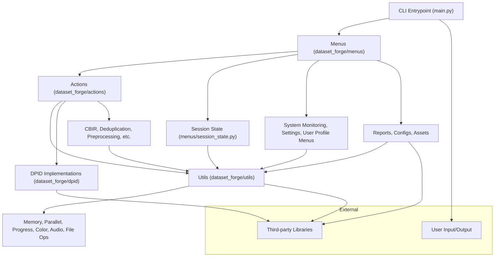

<h3 align="center">
  Dataset Forge
</h3>
<p align="center">
  
    <!--  -->
</p>
<div align="center">
  
    <!--  -->
</div>

<p align="center"><i>The all-in-one, modular image dataset utility for ML, with a focus on HQ/LQ image pairs for SISR and general computer vision. CLI-first, highly extensible, and packed with advanced tools for dataset curation, analysis, transformation, and validation.</i></p>

---

## 🧰 What is Dataset Forge?

**Dataset Forge** is a Python command-line tool for managing image datasets used in machine learning, espescially for SISR. It helps researchers and data scientists:

- Clean and organize image datasets (especially high/low quality pairs for super-resolution)
- Analyze dataset quality and generate reports
- Process, augment, and transform images

It's designed to streamline the work of preparing image datasets for training ML models (with a focus on SISR), with an intuitive interface and robust processing capabilities.

Please see [Features](docs/features.md).

---

## 📖 Documentation Links

- [Full ToC](docs/toc.md)
- [Special Installation Instructions](docs/special_installation.md)
- [Utility Scripts (tools/)](docs/features.md#️-utility-scripts-tools)
- [Features](docs/features.md)
- [Usage Guide](docs/usage.md)
- [Advanced Features & Configuration](docs/advanced.md)
- [Project Architecture](docs/architecture.md)
- [Troubleshooting](docs/troubleshooting.md)
- [Style Guide](docs/style_guide.md)
- [Contributing](docs/contributing.md)
- [FAQ](docs/faq.md)
- [Changelog](docs/changelog.md)
- [License](docs/license.md)
- [Full README](docs/README_full.md)

---

## 🖥️ Supported Platforms & Requirements

- **Python**: 3.12+ (tested on 3.12)
- **OS**: Windows (primary)
- **CUDA**: 12.1+ (for GPU acceleration)
- **cuDNN**: 9.1+ (for GPU acceleration, required for PyTorch CUDA, tested on 9.1)
- **RAM**: 8GB+ (16GB+ recommended for large datasets)
- **Storage**: SSD recommended for faster I/O
- See [Requirements.txt](requirements.txt) and [Special Installation Instructions](docs/special_installation.md) for full details.
- For GPU acceleration, ensure your CUDA and cuDNN versions match your PyTorch install. See [PyTorch Get Started](https://pytorch.org/get-started/locally/) for details.
- If you use a different CUDA/cuDNN version, install the matching PyTorch build.

> **IMPORTANT:** You must install the correct version of torch/torchvision/torchaudio for your CUDA version **before** running `pip install .`. If you skip this, pip will install the CPU-only version of torch by default. See the Quick Start below for the recommended command.

> **IMPORTANT:** On Windows, python-magic (required for 'Enhanced Directory Tree') requires extra DLLs in System32. See [Special Installation Instructions](docs/special_installation.md) for full details.

> **IMPORTANT:** You must install VapourSynth before installing or using [getnative](https://github.com/Infiziert90/getnative). See the [Requirements.txt](requirements.txt) and [Special Installation Instructions](docs/special_installation.md) for full details.

> **IMPORTANT:** You must compile/buiild [resdet](https://github.com/0x09/resdet) first before using resdet. See the [Requirements.txt](requirements.txt) and [Special Installation Instructions](docs/special_installation.md) for full details.

---

## 🚀 Quick Start

1. **Clone the repository:**

   ```bash
   git clone https://github.com/Courage-1984/Dataset-Forge.git
   cd Dataset-Forge
   ```

2. **Set up the environment:**

   ```bash
   py -3.12 -m venv venv312
   venv312\Scripts\activate
   # Install the correct CUDA-enabled torch/torchvision/torchaudio first!
   pip install torch torchvision torchaudio --index-url https://download.pytorch.org/whl/cu121
   pip install .
   ```

   > **Note:** If you use a different CUDA version, see https://pytorch.org/get-started/locally/ for the right install command.

3. **Run the application:**
   ```bash
   dataset-forge
   # or
   py main.py
   # or
   ./run.bat
   ```

---

## 📝 TODO / Planned Features

This section collects all future feature/functionality ideas, goals, and implementation notes for Dataset Forge. Add new ideas here to keep the roadmap in one place.

- [ ] **Debug Mode**: I want to add a _Debug Mode_ to my project, which when used, activates the showing of more verbose output and debug output/print
- [ ] **tl;dr**: Create a '# Features (tl;dr)' section in ./docs/features.md
- [ ] **_Packaging_**: "Compile Dataset-Forge" AND/OR "Create docker file/container"
- [ ] **Automated Documentation**
- [ ] **Augmentation**: Document augmentation operations, and degradations and implement 'Advanced Data Augmentation'
- [x] **Dataset Health Scoring**: Add a "Dataset Health Scoring" workflow and menu option
- [ ] **Batch Scripts**: Save and replay complex multi-step operations/workflows
- [ ] **Phhofm's sisr**: Investigate Phhofm's [sisr](https://github.com/Phhofm/sisr) for stuff i can add to DF
- [x] **the-database's img-ab**: Fork and improve.
- [ ] **Links .json's**: Further customize, add metadata, description, etc/
- [ ] **Advanced Filtering / AI-Powered Features**:

```
Semantic Filtering: Filter by image content/semantics
Style-Based Filtering: Filter by artistic style
Quality-Based Filtering: Advanced quality assessment filters
Custom Filter Plugins: User-defined filtering logic
Auto-Labeling: Automatic image labeling and classification
Style Transfer: Apply artistic styles to datasets
Content-Aware Cropping: Intelligent image cropping

```

- [ ] **Advanced Data Augmentation**:

```
What: Expand the augmentation capabilities to include more complex, model-aware techniques.

Why: Your current augmentations are great for general image processing. Adding advanced techniques can significantly improve model generalization during training.

Suggestions:
- Compositional Augmentations: Integrate a library like Albumentations to create complex augmentation pipelines.
- Mixing Augmentations: Implement Mixup (linearly interpolating images and their labels) and CutMix (pasting a patch from one image onto another).
- GAN-based Augmentations: For advanced users, integrate with a pre-trained StyleGAN to generate synthetic data variations.

```

- [ ] **Onboarding**: Add 'onboarding' doc/flow
- [ ] **Build**: Release a stable build at some point

---

## 💜 Credits

- Thanks [Kim2091](https://github.com/Kim2091)❤️ for [helpful-scripts](https://github.com/Kim2091/helpful-scripts)
- Thanks [umzi2](https://github.com/umzi2)❤️ for [WTP Dataset Destroyer](https://github.com/umzi2/wtp_dataset_destroyer) & [PepeDP](https://github.com/umzi2/PepeDP)
- Thanks [the-database](https://github.com/the-database)❤️ for [traiNNer-redux](https://github.com/the-database/traiNNer-redux)
- Thanks [Phhofm](https://github.com/Phhofm)❤️ for [sisr](https://github.com/Phhofm/sisr)

---

## 🪪 License

This project is licensed under the Creative Commons CC-BY-SA-4.0. See [LICENSE](LICENSE) for details.

---

<!-- Badges -->
<p align="center">
  <a href="https://github.com/Courage-1984/Dataset-Forge/blob/main/LICENSE"></a>
  <a href="https://img.shields.io/badge/python-3.12%2B-blue.svg"></a>
  <a href="https://img.shields.io/github/issues/Courage-1984/Dataset-Forge"></a>
  <a href="https://img.shields.io/github/stars/Courage-1984/Dataset-Forge"></a>
  <a href="https://img.shields.io/github/last-commit/Courage-1984/Dataset-Forge"></a>
    <a href="https://github.com/Courage-1984/Dataset-Forge/actions"></a>
</p>

---

## 🖥️ CLI Workflow Headings

All interactive workflows print clear, Mocha-styled headings before input/output prompts and before progress bars. This improves user experience and navigation. See the Style Guide for details.

---

## Project Architecture (outdated/WIP flowchart)

A high-level overview of Dataset Forge's modular architecture:



---

#### _VERBOSE_:

```

```
