<h1 align="center">Dataset Forge</h1>

<!-- --- -->

<!-- <h3 align="center">
  Dataset Forge
</h3> -->

<p align="center">
  
  <!--  -->
  <!--  -->
  <!--  -->
    <!--  -->
</p>

<div align="center">
  
  <!--  -->
    <!--  -->
</div>

<p align="center"><i>The all-in-one, modular image dataset utility for ML, with a focus on HQ/LQ image pairs for SISR and general computer vision. CLI-first, highly extensible, and packed with advanced tools for dataset curation, analysis, transformation, and validation.</i></p>

---

## 🚀 What is Dataset Forge?

**Dataset Forge** is a Python CLI tool for managing, analyzing, and transforming image datasets—especially high/low quality pairs for super-resolution and machine learning.  
It streamlines dataset curation, analysis, transformation, and validation with an intuitive, extensible interface.

---

## ✨ Key Features

- Clean and organize image datasets (HQ/LQ pairs for super-resolution)
- Analyze dataset quality and generate reports
- Process, augment, and transform images
- Modular, CLI-first, and highly extensible
- Robust parallel and GPU-accelerated processing
- **🌐 Global Command System**: Context-aware help and instant quit from any menu
- **📚 Comprehensive Help**: Menu-specific documentation and navigation assistance
- [See all features](docs/features.md)

---

## 📦 Quickstart

```bash
git clone https://github.com/Courage-1984/Dataset-Forge.git
cd Dataset-Forge
```

- See [Getting Started](docs/getting_started.md) for full Instructions.
  and then see [Special Installation Instructions](docs/special_installation.md) for further instructions.

---

## 📖 Documentation

- [Getting Started](docs/getting_started.md)
- [Features](docs/features.md)
- [Usage Guide](docs/usage.md)
- [Troubleshooting](docs/troubleshooting.md)
- [Contributing](docs/contributing.md)
- [Development Standards](.cursorrules) - Menu system patterns and coding standards
- [MCP Integration Guide](docs/mcp_integration_guide.md) - Enhanced development with AI assistance
- [Full Documentation Index](docs/index.md)

## 🚀 Beta Releases

- [Quick Beta Release Guide](docs/QUICK_BETA_RELEASE.md) - Fast reference for creating beta releases
- [Complete Beta Release Guide](docs/BETA_RELEASE_GUIDE.md) - Comprehensive beta release documentation

---

## 🖥️ Requirements

- **Python**: 3.12+ (see [requirements.txt](requirements.txt))
- **OS**: Windows (primary)
- **CUDA/cuDNN**: For GPU acceleration (see [Special Installation](docs/special_installation.md))

---

## 💜 Credits

- Thanks [Kim2091](https://github.com/Kim2091) ❤️ for [helpful-scripts](https://github.com/Kim2091/helpful-scripts)
- Thanks [umzi2](https://github.com/umzi2) ❤️ for [WTP Dataset Destroyer](https://github.com/umzi2/wtp_dataset_destroyer) & [PepeDP](https://github.com/umzi2/PepeDP)
- Thanks [the-database](https://github.com/the-database) ❤️ for [traiNNer-redux](https://github.com/the-database/traiNNer-redux)
- Thanks [Phhofm](https://github.com/Phhofm) ❤️ for [sisr](https://github.com/Phhofm/sisr)

---

## 🪪 License

This project is licensed under the Creative Commons CC-BY-SA-4.0. See [LICENSE](LICENSE) for details.

---

<!-- Badges -->
<p align="center">
  <a href="https://github.com/Courage-1984/Dataset-Forge/blob/main/LICENSE"></a>
  <a href="https://img.shields.io/badge/python-3.12%2B-blue.svg"></a>
  <a href="https://img.shields.io/github/issues/Courage-1984/Dataset-Forge"></a>
  <a href="https://img.shields.io/github/stars/Courage-1984/Dataset-Forge"></a>
  <a href="https://img.shields.io/github/last-commit/Courage-1984/Dataset-Forge"></a>
    <a href="https://github.com/Courage-1984/Dataset-Forge/actions"></a>
</p>

---

## Project Architecture

A high-level overview of Dataset Forge's modular architecture:

```mermaid
flowchart TD
    A["CLI Entrypoint (main.py)"] --> B["Main Menu (dataset_forge/menus/main_menu.py)"]
    B --> C["Menu System (dataset_forge/menus/)"]
    C --> D["Actions Layer (dataset_forge/actions/)"]
    D --> E["Core Utilities (dataset_forge/utils/)"]
    D --> F["DPID Implementations (dataset_forge/dpid/)"]

    subgraph "Menu Categories"
        G1["📂 Dataset Management"]
        G2["🔍 Analysis & Validation"]
        G3["✨ Image Processing & Augmentation"]
        G4["🚀 Training & Inference"]
        G5["🛠️ Utilities"]
        G6["⚙️ System & Settings"]
        G7["🔗 Links"]
        G8["🩺 System Monitoring & Health"]
        G9["🗂️ Enhanced Metadata Management"]
        G10["🚀 Performance Optimization"]
    end

    subgraph "Core Utilities"
        H1["Memory Management (memory_utils.py)"]
        H2["Parallel Processing (parallel_utils.py)"]
        H3["Lazy Imports (lazy_imports.py)"]
        H4["Progress Tracking (progress_utils.py)"]
        H5["Audio Feedback (audio_utils.py)"]
        H6["Color Scheme (color.py)"]
        H7["File Operations (file_utils.py)"]
        H8["GPU Acceleration (gpu_acceleration.py)"]
        H9["Caching (cache_utils.py)"]
        H10["Monitoring (monitoring.py)"]
    end

    subgraph "Action Categories"
        I1["Dataset Operations (dataset_actions.py)"]
        I2["Image Processing (transform_actions.py)"]
        I3["Analysis & Validation (analysis_actions.py)"]
        I4["Deduplication (imagededup_actions.py)"]
        I5["Quality Assessment (quality_scoring_actions.py)"]
        I6["Metadata Management (metadata_actions.py)"]
        I7["System Operations (settings_actions.py)"]
        I8["Performance Tools (performance_optimization_menu.py)"]
    end

    subgraph "DPID Implementations"
        J1["BasicSR (basicsr_dpid.py)"]
        J2["OpenMMLab (openmmlab_dpid.py)"]
        J3["PHHOFM (phhofm_dpid.py)"]
        J4["Umzi (umzi_dpid.py)"]
    end

    subgraph "External Dependencies"
        K["User Input/Output"]
        L["Third-party Libraries (PyTorch, OpenCV, PIL, etc.)"]
        M["GPU/CUDA Resources"]
        N["File System & Storage"]
    end

    C --> G1
    C --> G2
    C --> G3
    C --> G4
    C --> G5
    C --> G6
    C --> G7
    C --> G8
    C --> G9
    C --> G10

    D --> I1
    D --> I2
    D --> I3
    D --> I4
    D --> I5
    D --> I6
    D --> I7
    D --> I8

    E --> H1
    E --> H2
    E --> H3
    E --> H4
    E --> H5
    E --> H6
    E --> H7
    E --> H8
    E --> H9
    E --> H10

    F --> J1
    F --> J2
    F --> J3
    F --> J4

    A --> K
    E --> L
    F --> L
    H1 --> M
    H2 --> M
    H8 --> M
    H7 --> N
    I1 --> N
    I2 --> N
    I3 --> N
    I4 --> N
    I5 --> N
    I6 --> N
```



---

> For the full roadmap and advanced usage, see the [Documentation Home](docs/index.md).
