```mermaid
graph LR
A[Input Dataset] --> B[Basic Validation]
B --> C[Quality Metrics]
C --> D[Consistency Checks]
D --> E[Compliance Scan]
E --> F{Health Score}
F -->|>90| G[✅ Production Ready]
F -->|70-90| H[⚠️ Needs Improvement]
F -->|<70| I[❌ Unusable]
```

[← Main README](../README.md) | [Features](features.md) | [Usage](usage.md) | [Advanced](advanced.md) | [Architecture](architecture.md) | [Troubleshooting](troubleshooting.md) | [Style Guide](style_guide.md) | [Contributing](contributing.md) | [Changelog](changelog.md) | [ToC](toc.md)


# Dataset Forge Full Documentation

---

# Table of Contents

- [Dataset Forge Documentation](README.md)
  - [📚 Table of Contents](README.md#-table-of-contents)
  - [About This Documentation](README.md#about-this-documentation)
- [📚 Dataset Forge Documentation Home](index.md)
  - [📖 Table of Contents](index.md#-table-of-contents)
  - [👤 Who is this documentation for?](index.md#-who-is-this-documentation-for)
  - [🗺️ Next Steps](index.md#-next-steps)
- [Getting Started](getting_started.md)
  - [Prerequisites](getting_started.md#prerequisites)
  - [Installation](getting_started.md#installation)
  - [First Run](getting_started.md#first-run)
- [or](getting_started.md#or)
- [or](getting_started.md#or)
  - [Special Installation Notes](getting_started.md#special-installation-notes)
  - [Need Help?](getting_started.md#need-help)
  - [See Also](getting_started.md#see-also)
- [Special Installation Instructions](special_installation.md)
  - [1. PyTorch with CUDA (GPU Acceleration)](special_installation.md#1-pytorch-with-cuda-gpu-acceleration)
  - [2. VapourSynth & getnative](special_installation.md#2-vapoursynth--getnative)
  - [3. python-magic (for `Enhanced Directory Tree`)](special_installation.md#3-python-magic-for-enhanced-directory-tree)
  - [4. Using resdet for Native Resolution Detection](special_installation.md#4-using-resdet-for-native-resolution-detection)
    - [Method 1: Windows (WSL - Recommended for CLI Integration)](special_installation.md#method-1-windows-wsl---recommended-for-cli-integration)
    - [Method 2: Windows (MSYS2 MINGW64 Shell)](special_installation.md#method-2-windows-msys2-mingw64-shell)
    - [Method 3: Windows (Windows pre-build binary)](special_installation.md#method-3-windows-windows-pre-build-binary)
    - [Usage in Dataset Forge](special_installation.md#usage-in-dataset-forge)
  - [5. Advanced Metadata Operations with ExifTool](special_installation.md#5-advanced-metadata-operations-with-exiftool)
    - [Method 1: Windows](special_installation.md#method-1-windows)
    - [Method 2: Windows (Chocolatey)](special_installation.md#method-2-windows-chocolatey)
  - [6. Metadata Strip + Lossless png compression with Oxipng](special_installation.md#6-metadata-strip--lossless-png-compression-with-oxipng)
    - [Method 1: Windows](special_installation.md#method-1-windows)
  - [7. Steganography Integration for zsteg and Steghide](special_installation.md#7-steganography-integration-for-zsteg-and-steghide)
    - [zsteg installation (Windows)](special_installation.md#zsteg-installation-windows)
    - [steghide installation (Windows)](special_installation.md#steghide-installation-windows)
- [Features (tl;dr)](features.md)
- [Feature Overview](features.md#feature-overview)
  - [⚙️ Core & Configuration](features.md#-core--configuration)
  - [📂 Dataset Management](features.md#-dataset-management)
  - [🔍 Analysis & Validation](features.md#-analysis--validation)
  - [✨ Image Processing & Augmentation](features.md#-image-processing--augmentation)
  - [🚀 Performance & Optimization](features.md#-performance--optimization)
  - [🛠️ Utilities](features.md#-utilities)
  - [🧪 Testing & Developer Tools](features.md#-testing--developer-tools)
- [Features (tl;dr)](features.md#features-tldr)
- [Features (main menus)](features.md#features-main-menus)
  - [⚙️ Core & Configuration](features.md#-core--configuration)
  - [📂 Dataset Management](features.md#-dataset-management)
    - [🧩 Umzi's Dataset_Preprocessing (PepeDP-powered, July 2025)](features.md#-umzis-datasetpreprocessing-pepedp-powered-july-2025)
  - [🔍 Analysis & Validation](features.md#-analysis--validation)
  - [✨ Image Processing & Augmentation](features.md#-image-processing--augmentation)
  - [🚀 Training & Inference](features.md#-training--inference)
  - [🛠️ Utilities](features.md#-utilities)
  - [⚙️ System & Settings](features.md#-system--settings)
  - [🔗 Links](features.md#-links)
  - [🩺 System Monitoring & Health](features.md#-system-monitoring--health)
  - [🚀 Performance Optimization (NEW July 2025)](features.md#-performance-optimization-new-july-2025)
    - [**Performance Optimization Menu**](features.md#performance-optimization-menu)
    - [**Integration Benefits**](features.md#integration-benefits)
  - [⚡ Enhanced Caching System (UPDATED July 2025)](features.md#-enhanced-caching-system-updated-july-2025)
    - [**Core Caching Strategies**](features.md#core-caching-strategies)
    - [**Advanced Features**](features.md#advanced-features)
    - [**Cache Management Menu**](features.md#cache-management-menu)
    - [**Automatic Integration**](features.md#automatic-integration)
    - [**Benefits**](features.md#benefits)
    - [**Usage Examples**](features.md#usage-examples)
- [Simple in-memory caching with TTL](features.md#simple-in-memory-caching-with-ttl)
- [Model caching for expensive operations](features.md#model-caching-for-expensive-operations)
- [Smart auto-selection](features.md#smart-auto-selection)
- [Features (expanded/misc)](features.md#features-expandedmisc)
  - [🧪 Comprehensive Test Suite (Updated July 2025)](features.md#-comprehensive-test-suite-updated-july-2025)
  - [Testing & Validation](features.md#testing--validation)
  - [🧑‍💻 Developer Tools: Static Analysis & Code Quality](features.md#-developer-tools-static-analysis--code-quality)
  - [🛠️ Utility Scripts (tools/)](features.md#-utility-scripts-tools)
- [🩺 Dataset Health Scoring (NEW July 2025)](features.md#-dataset-health-scoring-new-july-2025)
- [🔊 Project Sounds & Audio Feedback](features.md#-project-sounds--audio-feedback)
  - [🖥️ User Experience and CLI Features](features.md#-user-experience-and-cli-features)
- [Usage Guide](usage.md)
  - [Quick Reference](usage.md#quick-reference)
  - [Global Commands & Menu Navigation](usage.md#global-commands--menu-navigation)
- [...help screen appears...](usage.md#help-screen-appears)
- [Menu is redrawn](usage.md#menu-is-redrawn)
  - [Main Workflows](usage.md#main-workflows)
    - [📂 Dataset Management](usage.md#-dataset-management)
    - [🔍 Analysis & Validation](usage.md#-analysis--validation)
    - [✨ Augmentation & Processing](usage.md#-augmentation--processing)
    - [🩺 Monitoring & Utilities](usage.md#-monitoring--utilities)
    - [🧪 Testing & Developer Tools](usage.md#-testing--developer-tools)
  - [Example: Running a Workflow](usage.md#example-running-a-workflow)
- [or](usage.md#or)
  - [Tips & Best Practices](usage.md#tips--best-practices)
  - [See Also](usage.md#see-also)
- [Advanced Features & Configuration](advanced.md)
  - [Advanced Configuration](advanced.md#advanced-configuration)
  - [Performance & Optimization](advanced.md#performance--optimization)
  - [Developer Patterns & Extending](advanced.md#developer-patterns--extending)
  - [Advanced Testing Patterns](advanced.md#advanced-testing-patterns)
  - [Technical Deep Dives](advanced.md#technical-deep-dives)
  - [Planned/Future Advanced Features](advanced.md#plannedfuture-advanced-features)
  - [See Also](advanced.md#see-also)
- [Project Architecture](architecture.md)
  - [Directory Structure (High-Level)](architecture.md#directory-structure-high-level)
  - [Core Architecture Diagram](architecture.md#core-architecture-diagram)
  - [Key Modules](architecture.md#key-modules)
  - [Specialized Diagrams](architecture.md#specialized-diagrams)
  - [See Also](architecture.md#see-also)
- [Troubleshooting](troubleshooting.md)
  - [Installation & Environment Issues](troubleshooting.md#installation--environment-issues)
  - [Common CLI & Workflow Issues](troubleshooting.md#common-cli--workflow-issues)
  - [Test Suite & Developer Tools](troubleshooting.md#test-suite--developer-tools)
  - [Metadata & Caching Issues](troubleshooting.md#metadata--caching-issues)
  - [DPID & External Tools](troubleshooting.md#dpid--external-tools)
  - [FAQ](troubleshooting.md#faq)
  - [See Also](troubleshooting.md#see-also)
- [Dataset Forge Style Guide](style_guide.md)
  - [Critical UI/UX Rule: Catppuccin Mocha Color Scheme](style_guide.md#critical-uiux-rule-catppuccin-mocha-color-scheme)
    - [Enforcement Checklist](style_guide.md#enforcement-checklist)
  - [General Principles](style_guide.md#general-principles)
  - [Project Architecture & Modularity](style_guide.md#project-architecture--modularity)
  - [Coding Standards](style_guide.md#coding-standards)
  - [Memory, Parallelism, Progress, and Color/UI](style_guide.md#memory-parallelism-progress-and-colorui)
  - [Menu & Workflow Patterns](style_guide.md#menu--workflow-patterns)
  - [Error Handling & Logging](style_guide.md#error-handling--logging)
  - [Testing & Validation](style_guide.md#testing--validation)
  - [Caching & Performance](style_guide.md#caching--performance)
  - [Documentation Requirements](style_guide.md#documentation-requirements)
  - [Dependency & Security](style_guide.md#dependency--security)
  - [Final Reminders](style_guide.md#final-reminders)
  - [See Also](style_guide.md#see-also)
- [Contributing](contributing.md)
  - [How to Contribute](contributing.md#how-to-contribute)
  - [Development Guidelines](contributing.md#development-guidelines)
  - [Doc Maintenance](contributing.md#doc-maintenance)
  - [Static Analysis & Code Quality](contributing.md#static-analysis--code-quality)
  - [See Also](contributing.md#see-also)
- [Changelog](changelog.md)
  - [[Unreleased]](changelog.md#unreleased)
    - [🔄 Resave Images Integration (July 2025)](changelog.md#-resave-images-integration-july-2025)
    - [🧩 PepeDP-powered Umzi's Dataset_Preprocessing Integration (July 2025)](changelog.md#-pepedp-powered-umzis-datasetpreprocessing-integration-july-2025)
    - [🚀 Performance Optimization Suite (NEW July 2025)](changelog.md#-performance-optimization-suite-new-july-2025)
      - [**GPU Acceleration**](changelog.md#gpu-acceleration)
      - [**Distributed Processing**](changelog.md#distributed-processing)
      - [**Intelligent Sample Prioritization**](changelog.md#intelligent-sample-prioritization)
      - [**Pipeline Compilation**](changelog.md#pipeline-compilation)
      - [**Performance Optimization Menu**](changelog.md#performance-optimization-menu)
      - [**Comprehensive Testing**](changelog.md#comprehensive-testing)
      - [**Dependencies**](changelog.md#dependencies)
    - [🔧 Technical Improvements](changelog.md#-technical-improvements)
    - [📚 Documentation](changelog.md#-documentation)
    - [🆕 DPID: Umzi's DPID (pepedpid) Integration (July 2025)](changelog.md#-dpid-umzis-dpid-pepedpid-integration-july-2025)
  - [[July 2025]](changelog.md#july-2025)
- [License](license.md)


---


# Readme


# Dataset Forge Documentation

[← Back to Main Project README](../README.md)

Welcome to the **Dataset Forge** documentation hub! Here you'll find detailed guides, feature explanations, advanced usage, troubleshooting, and contribution information for Dataset Forge.

---

## 📚 Table of Contents

- [Features](features.md)
- [Special Installation Instructions](special_installation.md)
- [Usage Guide](usage.md)
- [Advanced Features & Configuration](advanced.md)
- [Project Architecture](architecture.md)
- [Troubleshooting](troubleshooting.md)
- [Contributing](contributing.md)
- [Style Guide](style_guide.md)
- [FAQ](faq.md)
- [Changelog](changelog.md)
- [License](license.md)

---

## About This Documentation

- The main [README.md](../README.md) in the project root is a concise landing page with quick start and overview.
- All detailed documentation is split into separate markdown files in this [`docs/`](https://github.com/Courage-1984/Dataset-Forge/tree/main/docs) folder for clarity and maintainability.
- The [Full README.md](README_full.md) is compiled using `merge_docs.py` from the project root, combining the toc and all seperate documentation.

---

Happy forging! 🚀


---


# Index


# 📚 Dataset Forge Documentation Home

Welcome to the official documentation for **Dataset Forge**!

Dataset Forge is a modular Python CLI tool for managing, analyzing, and transforming image datasets, with a focus on high/low quality pairs for super-resolution and machine learning.

---

## 📖 Table of Contents

- [Getting Started](getting_started.md)  
  _Install, setup, and your first run_
- [Features (tl;dr)](features.md)  
  _Quick overview of what Dataset Forge can do_
- [Usage Guide](usage.md)  
  _How to use the CLI, workflows, and common tasks_
- [Advanced Features & Configuration](advanced.md)  
  _Power user options, custom pipelines, performance_
- [Troubleshooting & FAQ](troubleshooting.md)  
  _Common issues, platform-specific notes, and FAQ_
- [Special Installation Instructions](special_installation.md)  
  _CUDA, cuDNN, VapourSynth, and other dependencies_
- [Project Architecture](architecture.md)  
  _How the codebase is organized and how modules interact_
- [Style Guide](style_guide.md)  
  _Coding, docstring, and test standards for contributors_
- [Contributing](contributing.md)  
  _How to contribute, run tests, and submit PRs_
- [Changelog](changelog.md)  
  _Release history and notable changes_
- [License](license.md)  
  _Project license details_

---

## 👤 Who is this documentation for?

- **New Users:** Start with [Getting Started](getting_started.md) and [Features](features.md).
- **Advanced Users:** See [Advanced Features](advanced.md) and [Architecture](architecture.md).
- **Contributors:** Read the [Contributing Guide](contributing.md) and [Style Guide](style_guide.md).

---

## 🗺️ Next Steps

- Not sure where to begin? Try the [Quickstart](getting_started.md).
- Looking for a specific feature? Check the [Features](features.md) or [Usage Guide](usage.md).
- Having trouble? Visit [Troubleshooting](troubleshooting.md).

---

> For the latest updates and roadmap, see the [Changelog](changelog.md) or the project [README](../README.md).


---


# Getting Started


# Getting Started

> **UI/UX Note:**  
> All CLI output in Dataset Forge uses the Catppuccin Mocha color scheme for a consistent, visually appealing experience. All prompts, menus, and progress bars are styled using the centralized color utilities.

Welcome to Dataset Forge!  
This guide will help you install and launch Dataset Forge for the first time.

---

## Prerequisites

- **Python**: 3.12+ (see [requirements.txt](../requirements.txt))
- **OS**: Windows (primary)
- **CUDA/cuDNN**: For GPU acceleration (see [Special Installation](special_installation.md))
- **RAM**: 8GB+ (16GB+ recommended)
- **Storage**: SSD recommended

---

## Installation

1. **Clone the repository:**

   ```bash
   git clone https://github.com/Courage-1984/Dataset-Forge.git
   cd Dataset-Forge
   ```

2. **Set up the environment:**
   ```bash
   py -3.12 -m venv venv312
   venv312\Scripts\activate
   python -m pip install --upgrade pip setuptools wheel
   # Install the correct CUDA-enabled torch/torchvision/torchaudio first!
   pip install torch torchvision torchaudio --index-url https://download.pytorch.org/whl/cu121
   pip install pepeline pepedpid
   pip install -r requirements.txt
   pip install pepedp
   ```
   > **Note:** For other CUDA versions, see [PyTorch Get Started](https://pytorch.org/get-started/locally/).

---

## First Run

```bash
./run.bat
# or
venv312\Scripts\activate
py main.py
# or
dataset-forge
```

---

## Special Installation Notes

- On Windows, `python-magic` requires extra DLLs.
- You must install VapourSynth before using [getnative](https://github.com/Infiziert90/getnative).
- You must compile/build [resdet](https://github.com/0x09/resdet) before using it.

See [Special Installation Instructions](special_installation.md) for details.

---

## Need Help?

- For common issues, see the [Troubleshooting Guide](troubleshooting.md).
- For advanced configuration, see [Advanced Features](advanced.md).

---

## See Also

- [Features](features.md)
- [Usage Guide](usage.md)
- [Advanced Features](advanced.md)
- [Project Architecture](architecture.md)


---


# Special Installation


# Special Installation Instructions

This guide covers special installation requirements for certain dependencies in Dataset Forge. These steps are **critical** for correct operation, especially on Windows. Please read carefully and follow the order for each component.

---

## 1. PyTorch with CUDA (GPU Acceleration)

**You must install the correct CUDA-enabled version of torch/torchvision/torchaudio _before_ installing other requirements.**

**Quick Steps:**

```bat
venv312\Scripts\activate
pip install torch torchvision torchaudio --index-url https://download.pytorch.org/whl/cu121
```

- Replace `cu121` with your CUDA version if needed. See [PyTorch Get Started](https://pytorch.org/get-started/locally/) for details.
- If you skip this, pip will install the CPU-only version by default.
- Only after this, run `pip install .` or `pip install -r requirements.txt`.

**Troubleshooting:**

- Mismatched CUDA/cuDNN versions will cause import errors or no GPU support.
- See [requirements.txt](../requirements.txt) and [PyTorch docs](https://pytorch.org/get-started/locally/).

---

## 2. VapourSynth & getnative

> (for [getnative](https://github.com/Infiziert90/getnative) functionality/native resolution detection)

**VapourSynth must be installed _before_ [getnative](https://github.com/Infiziert90/getnative).**

**Steps (Windows):**

1. Download and install [VapourSynth](http://www.vapoursynth.com/) (includes imwri plugin).
2. Open a terminal and run:

```bat
python vsrepo.py install descale
python vsrepo.py install ffms2
python vsrepo.py install lsmas
```

3. Activate your virtual environment:

```bat
venv312\Scripts\activate
```

4. Install getnative:

```bat
pip install getnative
```

- See [Getnative Recommended Windows Installation](https://github.com/Infiziert90/getnative?tab=readme-ov-file#recommended-windows-installation) for more details.

**Troubleshooting:**

- Install VapourSynth _before_ getnative or any requirements that depend on it.
- If getnative fails to import, check that VapourSynth is installed and on your PATH.
- Also make sure directory containing `vsrepo.py` and the plugin's folder containing the `.dll`s are also on your PATH.

---

## 3. python-magic (for `Enhanced Directory Tree`)

**Windows users:** You must install both the Python packages and the required DLLs.

**Steps:**

1. Install the packages:

```bat
venv312\Scripts\activate
pip install python-magic python-magic-bin libmagic
```

2. Copy the following files from `assets/libmagicwin64-master.zip` to `C:/Windows/System32/`:

   - `libgnurx-0.dll`
   - `magic.mgc`
   - `magic1.dll`

   (These are prebuilt for 64-bit Windows. See source: [libmagicwin64](https://github.com/pidydx/libmagicwin64) for details.)

3. When using python-magic, specify the magic file path if needed:

```python
import magic
file_magic = magic.Magic(magic_file="C:/Windows/System32/magic.mgc")
```

**Troubleshooting:**

- If you get import errors, ensure the DLLs are in `System32` and you are using the correct magic file path.
- See [python-magic docs](https://github.com/ahupp/python-magic) and [libmagicwin64](https://github.com/pidydx/libmagicwin64).

---

## 4. Using resdet for Native Resolution Detection

> Using [resdet](https://github.com/0x09/resdet) for Native Resolution Detection

### Method 1: Windows (WSL - Recommended for CLI Integration)

1. Clone the repository:
   ```sh
   git clone https://github.com/0x09/resdet.git
   cd resdet
   ```
2. Build resdet:
   ```sh
   sudo apt update
   sudo apt install build-essential
   sudo apt install pkg-config
   sudo apt install libfftw3-dev libpng-dev mjpegtools libmagickwand-dev
   cd path/to/resdet
   make clean
   ./configure
   make
   ```
3. Install resdet to your WSL PATH:
   ```sh
   sudo cp resdet /usr/local/bin/
   sudo chmod +x /usr/local/bin/resdet
   # Or, to use make install:
   sudo make install
   ```
4. **Note:** The Dataset Forge CLI will automatically use WSL to run resdet on Windows. Ensure resdet is available in your WSL environment's PATH.

### Method 2: Windows (MSYS2 MINGW64 Shell)

1. Clone the repository:
   ```sh
   git clone https://github.com/0x09/resdet.git
   ```
2. Open **MSYS2 MINGW64 Shell**.
3. Install dependencies:
   ```sh
   pacman -S base-devel mingw-w64-x86_64-toolchain mingw-w64-x86_64-libpng mingw-w64-x86_64-libjpeg-turbo mingw-w64-x86_64-fftw mingw-w64-x86_64-pkg-config autoconf automake libtool
   ```
4. Set PKG_CONFIG_PATH:
   ```sh
   export PKG_CONFIG_PATH=/mingw64/lib/pkgconfig
   ```
5. Build resdet:
   ```sh
   cd path/to/resdet
   make clean
   ./configure --prefix=/mingw64
   make
   ```
6. Add `resdet.exe` to a folder in your PATH, or add its folder to your PATH.

### Method 3: Windows (Windows pre-build binary)

1. Extract the following files from `assets/resdet_windows.zip`:

   - `resdet.exe`

   (This is a prebuilt for 64-bit Windows that I compiled.)

2. Add `resdet.exe` to a folder in your PATH, or add its folder to your PATH.

### Usage in Dataset Forge

- The CLI will detect your platform and use the appropriate resdet binary.
- On Windows, if WSL is available and resdet is installed in WSL, it will be used automatically.
- If resdet is not found, you will receive a clear error message with installation instructions.

---

## 5. Advanced Metadata Operations with ExifTool

> (for [exiftool](https://exiftool.org/) integration)

### Method 1: Windows

1. Download ExifTool.exe:

   https://exiftool.org/

2. Download the Windows Executable (e.g., `exiftool-12.70.zip`).

3. Extract it and rename `exiftool(-k).exe` to `exiftool.exe` for command-line use.

4. Add `exiftool.exe` to a folder in your PATH, or add its folder to your PATH.

> **IMPORTANT:** Note that if you move the .exe to another folder, you must also move the "exiftool_files" folder to the same location.

### Method 2: Windows (Chocolatey)

1. Download ExifTool.exe:
   ```sh
   choco install exiftool -y
   ```

2. This will install `exiftool.exe` to:
   ```sh
   C:\ProgramData\chocolatey\lib\exiftool\tools\
   ```

3. Add `exiftool.exe` to a folder in your PATH, or add its folder to your PATH.

---

## 6. Metadata Strip + Lossless png compression with Oxipng

> (for [Oxipng](https://github.com/oxipng/oxipng) integration)
> essential for 'Sanitise Image Workflow'

### Method 1: Windows

1. Download oxipng.exe:

   https://github.com/oxipng/oxipng/releases

2. Download the appropriate archive (e.g., `oxipng-9.1.5-x86_64-pc-windows-msvc.zip`).

3. Extract the contents.

4. Add `oxipng.exe` to a folder in your PATH, or add its folder to your PATH.

---

## 7. Steganography Integration for zsteg and Steghide

> (for [zsteg](https://github.com/zed-0xff/zsteg) & [Steghide](https://steghide.sourceforge.net/) integration)
> optional for 'Sanitise Image Workflow'

### zsteg installation (Windows)

1. Install Ruby (via RubyInstaller for Windows)

* Go to: [https://rubyinstaller.org/](https://rubyinstaller.org/)
* Download the **latest Ruby+Devkit** version (e.g. `Ruby 3.3.0 with Devkit`).
* Run the installer.
* On the final screen, check **"Add Ruby executables to your PATH"**.
* Also allow it to **install MSYS2 and development tools** when prompted.

2. Restart PowerShell/Terminal/Console/CLI

3. Install `zsteg`
   ```sh
   gem install zsteg
   ```

### steghide installation (Windows)

1. Download Steghide

   [Steghide Windows package](http://prdownloads.sourceforge.net/steghide/steghide-0.5.1-win32.zip?download)

2. Extract the contents (`steghide` folder).

3. Add `steghide` folder path to your PATH.

---

For more details, see the [main README Quick Start](../README.md#-quick-start) and [troubleshooting guide](troubleshooting.md).


---


# Features


# Features (tl;dr)

> **UI/UX Note:**  
> All CLI output in Dataset Forge uses the Catppuccin Mocha color scheme for a consistent, visually appealing experience. All prompts, menus, and progress bars are styled using the centralized color utilities.

- Modular CLI for image dataset management, curation, and analysis
- Powerful HQ/LQ pair workflows for SISR and super-resolution
- Advanced validation, deduplication, and quality scoring
- Rich augmentation, transformation, and batch processing
- GPU acceleration and distributed processing support
- Integration with popular external tools (WTP, traiNNer-redux, getnative, resdet, etc.)
- Robust reporting, health scoring, and system monitoring
- Comprehensive test suite and static analysis tools
- [See Usage Guide](usage.md) for examples and workflows

---

# Feature Overview

## ⚙️ Core & Configuration

- External tool integration (WTP Dataset Destroyer, traiNNer-redux, getnative, resdet, etc.)
- Model management: list, select, download, and run upscaling with trained models
- Multi-format config support (JSON, YAML, HCL)
- User profiles, favorites, presets, and quick access paths

## 📂 Dataset Management

- Multiscale dataset generation, video frame extraction, image tiling
- Combine, split, shuffle, and randomize datasets
- HQ/LQ pair management: manual/fuzzy pairing, scale correction, alignment
- Visual and hash-based deduplication, CBIR (semantic duplicate detection)
- Batch renaming, orientation sorting, size filtering

## 🔍 Analysis & Validation

- Progressive validation suite for datasets and HQ/LQ pairs
- Automated quality scoring (NIQE, HyperIQA, IC9600, etc.)
- Corruption, misalignment, and outlier detection
- HTML/Markdown reporting with plots and sample images

## ✨ Image Processing & Augmentation

- Downsampling, cropping, flipping, rotating, shuffling, resaving
- Brightness, contrast, hue, saturation, HDR/SDR, grayscale
- Degradations: blur, noise, pixelate, dithering, sharpen, banding, etc.
- Advanced augmentation pipelines and recipe management
- Metadata scrubbing, ICC profile conversion, sketch/line art extraction

## 🚀 Performance & Optimization

- GPU-accelerated preprocessing and batch operations
- Distributed processing (Dask, Ray), multi-GPU support
- JIT compilation for performance-critical code
- Real-time analytics and auto-optimization

## 🛠️ Utilities

- Image/gif comparison creation, compression, and sanitization
- Enhanced directory tree visualization
- Batch metadata extraction, editing, filtering, and anonymization
- System monitoring: live resource usage, error summaries, health checks

## 🧪 Testing & Developer Tools

- Comprehensive pytest suite for all features
- Static analysis tools for code quality and maintainability
- Utility scripts for environment setup, testing, and documentation merging

---

<details>
<summary><strong>Full Feature List (click to expand)</strong></summary>

# Features (tl;dr)

- Modular CLI tool for image dataset management, curation, and analysis
- Powerful HQ/LQ pair workflows for SISR and super-resolution
- Advanced validation, deduplication, and quality scoring tools
- Rich augmentation, transformation, and batch processing features
- Integrates with popular external tools and supports GPU acceleration

# Features (main menus)

## ⚙️ Core & Configuration

- **🔧 External tool integration**: [WTP Dataset Destroyer](https://github.com/umzi2/wtp_dataset_destroyer), [traiNNer-redux](https://github.com/the-database/traiNNer-redux), [getnative](https://github.com/Infiziert90/getnative), [resdet](https://github.com/0x09/resdet), [Oxipng](https://github.com/oxipng/oxipng), [Steghide](https://steghide.sourceforge.net/), [zsteg](https://github.com/zed-0xff/zsteg), [umzi's Dataset_Preprocessing](https://github.com/umzi2/Dataset_Preprocessing), []()
- **📦 Model management**: List, select, download and run upscaling with trained models (also [OpenModelDB](https://openmodeldb.info/) integration)
- **✅ Validation tools**: Validate HQ/LQ pairs and validation datasets from config
- **👤 User profiles**: Save favorites, presets, links and quick access paths
- **⚙️ Multi-format config support**: JSON, YAML, HCL

## 📂 Dataset Management

- **🎯 Dataset Creation**: Multiscale dataset generation (DPID), video frame extraction, image tiling (using IC9600)
- **🔗 Dataset Operations**: Combine, split, extract random pairs, shuffle datasets, remove/move
- **🔍 HQ/LQ Pair Management**: Create/Correct Manual Pairings, fuzzy matching, scale correction, shuffle, extract random pairs
- **🧹 Clean & Organize**: De-dupe (Visual deduplication, hash-based deduplication, ImageDedup advanced duplicate detection, CBIR (Semantic Duplicate Detection)), batch renaming
- **🔄 Orientation Organization**: Sort by landscape/portrait/square
- **📏 Size Filtering**: Remove small/invalid image pairs
- **🧭 Align Images (Batch Projective Alignment)**: Aligns images from two folders (flat or recursive, matching by filename) using SIFT+FLANN projective transformation. Supports batch processing, robust error handling, and both flat and subfolder workflows. See Usage Guide for details.
- **DPID implementations (BasicSR, OpenMMLab, Phhofm, Umzi)**: Multiple DPID (degradation) methods for downscaling, including Umzi's DPID (pepedpid) for HQ/LQ and single-folder workflows.

### 🧩 Umzi's Dataset_Preprocessing (PepeDP-powered, July 2025)

- **Best Tile Extraction**: Extracts the most informative tiles from images using Laplacian or IC9600 complexity, with robust parallelism and thresholding.
- **Video Frame Extraction (Embedding Deduplication)**: Extracts diverse frames from video using deep embeddings (ConvNext, DINOv2, etc.) and distance thresholding.
- **Duplicate Image Detection and Removal**: Finds and moves duplicate images using embedding similarity (Euclidean/cosine) and configurable thresholds.
- **Threshold-Based Image Filtering (IQA)**: Filters images by quality using advanced IQA models (HyperIQA, ANIIQA, IC9600, etc.), with batch and median thresholding.

All workflows are modular, testable, and use the latest PepeDP API. See [Usage Guide](usage.md#using-umzis-datasetpreprocessing) for details and examples.

## 🔍 Analysis & Validation

- **🔍 Comprehensive Validation**: Progressive dataset validation suite
- **📊 Rich Reporting**: HTML/Markdown reports with plots and sample images
- **⭐ Quality Scoring**: Automated dataset quality assessment (NIQE, etc.)
- **🔧 Issue Detection**: Corruption detection, misalignment detection, outlier detection. alpha channel detection
- **🧪 Property Analysis**: Consistency checks, aspect ratio testing, dimension reporting
- **⭐ BHI Filtering**: Blockiness, HyperIQA, IC9600 quality assessment
- **🔍 Scale Detection**: Find and test HQ/LQ scale relationships
- **🎯 Find Native Resolution**: Find image native resolution using [getnative](https://github.com/Infiziert90/getnative) or [resdet](https://github.com/0x09/resdet)

## ✨ Image Processing & Augmentation

- **🔄 Basic Transformations**: Downsample Images, crop, flip, rotate, shuffle, remove alpha channel, **resave images (with lossless options and quality control)**
- **🎨 Colour, Tone & Levels Adjustments**: Brightness, contrast, hue, saturation, HDR>SDR, grayscale
- **🧪 Degradations**: Blur, noise, pixelate, dithering, sharpen, banding & many more
- **🚀 Augmentation**: List, create, edit or delete _recipes_ or run advanced augmentation pipelines (using recipes)
- **📋 Metadata**: Scrub EXIF Metadata, Convert ICC Profile to sRGB
- **✏️ Find & extract sketches/drawings/line art**: Find & extract sketches/drawings/line art using pre-trained model
- **🗳️ Batch Processing**: Efficient batch operations for large datasets

## 🚀 Training & Inference

- **🛠️ Run wtp_dataset_destroyer**: [WTP Dataset Destroyer](https://github.com/umzi2/wtp_dataset_destroyer) integration, create HQ/LQ pairs with custom degradations
- **🚀 Run traiNNer-redux**: [traiNNer-redux](https://github.com/the-database/traiNNer-redux) integration, train your own SISR models
- **🧠 OpenModelDB Model Browser**: Robust integration with [OpenModelDB](https://openmodeldb.info/)
- **⚙️ Config files**: Add, load, view & edit configs

## 🛠️ Utilities

- **🖼️ Create Comparisons**: Create striking image / gif comparisons
- **📦 Compression**: Compress images or directories
- **🧹 Sanitize Images**: Comprehensive, interactive image file sanitization. Each major step (corruption fix, copy, batch rename, ICC to sRGB, PNG conversion, remove alpha, metadata removal, steganography) is prompted interactively with emoji and Mocha color. Steganography checks prompt for steghide and zsteg individually, and the summary reports both. A visually distinct summary box is always shown at the end, including zsteg results file path if produced. All output uses the Catppuccin Mocha color scheme and emoji-rich prompts. Menu header is reprinted after returning to the workflow menu.
- **🌳 Enhanced Directory Tree**: Directory tree visualization using emojis
- **🧹 Filter non-Images**: Filter all non image type files
- **🗂️ Enhanced Metadata Management**: Batch Extract Metadata: Extract EXIF/IPTC/XMP from all images in a folder to CSV or SQLite using exiftool and pandas/SQLite. View/Edit Metadata: View and edit metadata for a single image (EXIF, IPTC, XMP) using Pillow and exiftool. Filter by Metadata: Query and filter images by metadata fields (e.g., ISO, camera, date) using pandas/SQLite. Batch Anonymize Metadata: Strip all identifying metadata from images using exiftool, with robust error handling and progress.

> **Dependencies:** Requires [exiftool](https://exiftool.org/) (external), pandas, and SQLite (Python stdlib).

## ⚙️ System & Settings

- **📁 Set HQ/LQ Folder**: set HQ/LQ image pair folders to use throughout Dataset Forge
- **👤 User Profile Management**: Create and manage custom profiles for Dataset Forge
- **🧠 Memory Management**: View, clear & optimize memory management
- **⚙️ Settings**: View & configure project settings

## 🔗 Links

- **🌐 Community Links**: Browse/List important and usefull links curated by me and the community
- **🔗 Personal Links**: Browse/List & add your own links

## 🩺 System Monitoring & Health

- **📊 View Live Resource Usage**: Real-time CPU, GPU (NVIDIA), RAM, and disk usage for all processes/threads
- **📈 View Performance Analytics**: Decorator-based analytics for all major operations, with live and persistent session summaries
- **🛑 View Error Summary**: Logs errors to file and CLI, with summary granularity and critical error notifications (sound/visual)
- **🩺 Run Health Checks**: Automated checks for RAM, disk, CUDA, Python version, and permissions, with CLI output and recommendations
- **🧵 Manage Background Tasks**: Registry of all subprocesses/threads, with CLI controls for pause/resume/kill and session-only persistence
- **⏱️ View Menu Load Times**: View the menu load times

## 🚀 Performance Optimization (NEW July 2025)

- **⚡ GPU Acceleration**: Comprehensive GPU-accelerated preprocessing operations including brightness/contrast, saturation/hue, sharpness/blur, and batch transformations
- **🌐 Distributed Processing**: Multi-machine and single-machine multi-GPU processing using Dask and Ray with automatic resource detection
- **🎯 Intelligent Sample Prioritization**: Quality-based sample prioritization using advanced image analysis (sharpness, contrast, noise, artifacts, complexity)
- **⚡ Pipeline Compilation**: JIT compilation using Numba, Cython, and PyTorch JIT for performance-critical code paths
- **📊 Performance Analytics**: Comprehensive monitoring and analytics for all optimization features
- **⚙️ Auto-Optimization**: Automatic optimization strategy selection based on system resources and task characteristics

### **Performance Optimization Menu**

Accessible from the main menu as "🚀 Performance Optimization", providing:

- **🎮 GPU Acceleration**: Test, configure, and benchmark GPU operations
- **🌐 Distributed Processing**: Start/stop clusters, configure workers, monitor performance
- **🎯 Sample Prioritization**: Configure quality analysis, test prioritization strategies
- **⚡ Pipeline Compilation**: Test compilation backends, configure optimization settings
- **📊 Performance Analytics**: Monitor system performance, GPU usage, distributed metrics
- **⚙️ Optimization Settings**: Configure global optimization preferences and thresholds

### **Integration Benefits**

- **⚡ 10-100x Speedup**: GPU acceleration for image processing bottlenecks
- **🌐 Scalable Processing**: Distribute work across multiple machines and GPUs
- **🎯 Quality-First**: Process highest-quality samples first for better results
- **⚡ Compiled Performance**: JIT compilation for numerical and image processing operations
- **📊 Real-Time Monitoring**: Live performance metrics and optimization suggestions

## ⚡ Enhanced Caching System (UPDATED July 2025)

Dataset Forge features a comprehensive, production-ready caching system with advanced features, monitoring, and management capabilities:

### **Core Caching Strategies**

- **🔄 In-Memory Caching:** Advanced LRU cache with TTL, compression, and statistics for lightweight, frequently-called, session-only results
- **💾 Disk Caching:** Persistent storage with TTL, compression, manual file management, and integrity checks for expensive, large, or cross-session results
- **🧠 Model Caching:** Specialized cache for expensive model loading operations with automatic cleanup
- **🤖 Smart Caching:** Auto-selects optimal caching strategy based on function characteristics

### **Advanced Features**

- **⏱️ TTL Management:** Automatic expiration of cached data with configurable time-to-live
- **🗜️ Compression:** Automatic data compression for disk cache to reduce storage footprint
- **📊 Statistics & Analytics:** Real-time cache performance, hit rates, memory usage, and disk space monitoring
- **🔧 Cache Management:** Comprehensive utilities for clearing, validation, repair, warmup, and export
- **🛡️ Integrity Checks:** Automatic validation and repair of corrupted cache files
- **🔥 Warmup System:** Pre-load frequently used data into cache for optimal performance

### **Cache Management Menu**

Accessible from System Settings → Cache Management, providing:

- **📈 View Cache Statistics:** Performance metrics, hit rates, and usage analytics
- **🧹 Clear Caches:** Selective or complete cache clearing
- **🔍 Performance Analysis:** Cache efficiency metrics and optimization suggestions
- **📤 Export Data:** Cache statistics and data backup functionality
- **🔧 Maintenance Tools:** Validation, repair, cleanup, and optimization
- **🔥 Warmup Operations:** Pre-load frequently accessed data

### **Automatic Integration**

Caching is transparently applied to key functions:

- **🖼️ Image Operations:** `get_image_size()` with TTL-based caching
- **🧠 Model Loading:** `enum_to_model()` and `get_clip_model()` with model-specific caching
- **📁 File Operations:** `is_image_file()` with in-memory caching
- **🔍 CBIR Features:** Feature extraction and similarity search with disk caching

### **Benefits**

- **⚡ Dramatically Faster Operations:** Frequently accessed data served from cache
- **💾 Memory Efficiency:** LRU eviction and compression reduce memory footprint
- **🔄 Reduced I/O:** Disk cache reduces file system access
- **🧠 Model Loading:** Instant access to cached AI models
- **📊 Transparent Management:** Self-maintaining cache with comprehensive monitoring

### **Usage Examples**

```python
# Simple in-memory caching with TTL
@in_memory_cache(ttl=300, maxsize=1000)
def quick_lookup(key):
    return expensive_calculation(key)

# Model caching for expensive operations
@model_cache(ttl=3600)
def load_expensive_model(name):
    return load_model_from_disk(name)

# Smart auto-selection
@smart_cache(ttl=3600, maxsize=500)
def process_data(data):
    return complex_processing(data)
```

See `docs/advanced.md` for technical details, customization, and best practices.

# Features (expanded/misc)

- **Audio error feedback**: All user-facing errors trigger an error sound (error.mp3) for immediate notification.
- **Persistent Logging**: All analytics and errors are logged to ./logs/ for later review
- **Memory & CUDA Cleanup**: Automatic cleanup on exit/errors for all tracked processes/threads

## 🧪 Comprehensive Test Suite (Updated July 2025)

Dataset Forge now includes a robust, cross-platform test suite covering all major features:

- Enhanced Metadata Management (extract, edit, filter, anonymize)
- Quality Scoring (single and batch, via public API)
- Sanitize Images (remove metadata, convert, remove alpha, steganography checks)
- Visual Deduplication (find, move, copy, remove duplicate groups)
- DPID implementations (BasicSR, OpenMMLab, Phhofm, Umzi)
- CBIR and deduplication workflows
- Report generation
- Audio feedback, memory, parallel, and progress utilities
- Session state, config, and error handling

**Run all tests:**

You can now use the flexible test runner script for convenience:

```sh
python tools/run_tests.py
```

This script provides a menu to select the test mode, or you can pass an option (see below). See [usage.md](usage.md#🦾-running-the-test-suite) for details.

**Test suite highlights:**

- All features have public, non-interactive APIs for programmatic access and testing.
- Tests use monkeypatching and dummy objects to avoid reliance on external binaries or real files.
- Multiprocessing tests use module-level worker functions for compatibility.
- Only one test is marked XFAIL (ignore patterns in directory tree), which is expected and documented.

See [Usage Guide](usage.md#testing) and [Style Guide](style_guide.md#testing-patterns) for details.

## Testing & Validation

- Dataset Forge includes a comprehensive, cross-platform test suite using pytest.
- All core business logic, utilities, and integration flows are covered by unit and integration tests.
- Tests cover DPID, CBIR, deduplication, reporting, audio, memory, parallel, and session state features.
- Tests are robust on Windows and Linux, and use fixtures and monkeypatching for reliability.
- All new features and bugfixes must include appropriate tests.

---

## 🧑‍💻 Developer Tools: Static Analysis & Code Quality

> **Documentation Convention:** When adding new features or modules, update the architecture diagrams (Mermaid) in README.md and docs/architecture.md as needed. Use standard badges in the README and document their meaning in the docs.

- **Static Analysis Tool:** Located at `tools/find_code_issues/find_code_issues.py`.
- **Checks:**
  - Unused (dead) code, functions, classes, and methods
  - Untested code (missing test coverage)
  - Functions/classes defined but never called
  - Test/code mapping (tests without code, code without tests)
  - Missing docstrings in public functions/classes/methods
  - Unused imports/variables, and more
- **How to run:**
  ```sh
  python tools/find_code_issues/find_code_issues.py [options]
  # Run with no options to perform all checks
  ```
- **Output:**
  - Overwrites files in `tools/find_code_issues/` on each run:
    - `find_code_issues.log` (raw output)
    - `find_code_issues_report.txt` (actionable summary)
    - `find_code_issues_view.txt` (detailed results)
- **Requirements:**
  - `

## 🛠️ Utility Scripts (tools/)

Dataset Forge includes several utility scripts in the `tools/` directory to assist with development, documentation, and environment setup. These scripts are user-facing and documented in detail in [usage.md](usage.md#utility-scripts-tools).

- **run_tests.py**: Flexible test runner for the test suite. Lets you choose between basic, recommended, and verbose pytest runs via menu or CLI argument. See [usage.md](usage.md#run_testspy-flexible-test-runner-new-july-2025) for usage and options.
- **find_code_issues.py**: Comprehensive static analysis tool for code quality and maintainability. Checks for dead code, untested code, missing docstrings, test/code mapping, and more. See [usage.md](usage.md#find_code_issuespy-static-analysis-tool) for full usage and options.
- **merge_docs.py**: Merges all documentation files in `docs/` into a single `README_full.md` and generates a hierarchical Table of Contents (`toc.md`). Keeps documentation in sync. See [usage.md](usage.md#merge_docspy-documentation-merging-tool).
- **install.py**: Automated environment setup script. Creates a virtual environment, installs CUDA-enabled torch, and installs all project requirements. See [usage.md](usage.md#installpy-environment-setup-tool).
- **print_zsteg_env.py**: Prints the current PATH and the location of the `zsteg` binary for troubleshooting steganography tool integration. See [usage.md](usage.md#print_zsteg_envpy-zsteg-environment-check).

For detailed usage, CLI options, and troubleshooting, see [usage.md](usage.md#utility-scripts-tools).

# 🩺 Dataset Health Scoring (NEW July 2025)

**Location:** Dataset Management menu → 🩺 Dataset Health Scoring

**Purpose:**

- Assess the overall health and readiness of an image dataset for ML workflows.
- Supports both single-folder datasets and HQ/LQ parent folder structures (for super-resolution and paired tasks).

**Workflow:**

- User selects either a single folder or an HQ/LQ parent folder (auto-detects or prompts for HQ/LQ subfolders).
- Runs a series of modular checks:
  - Basic validation (file existence, supported formats, min count)
  - Unreadable/corrupt files
  - Image format consistency
  - Quality metrics (resolution, blur, etc.)
  - Aspect ratio consistency
  - File size outliers
  - Consistency checks (duplicates, naming, alignment)
  - Compliance scan (metadata, forbidden content)
- Each check is weighted; partial credit is possible.
- Shows a detailed breakdown of results, a final health score (0–100), and a status (✅ Production Ready, ⚠️ Needs Improvement, ❌ Unusable).
- Provides actionable suggestions for improvement if any step fails.

**Extensibility:**

- Checks are modular; new steps can be added easily.
- Scoring weights and logic are configurable in the business logic module.

**Testing:**

- Fully covered by unit and integration tests (see `tests/test_utils/test_dataset_health_scoring.py` and `tests/test_cli/test_dataset_health_scoring_menu.py`).
- Tests simulate both single-folder and HQ/LQ menu flows, including edge cases and input handling.

**Robustness:**

- Uses centralized input, printing, memory, and error handling utilities.
- Follows the robust menu loop and lazy import patterns.
- CLI integration is non-blocking and fully automated for testing.

[Back to Table of Contents](#table-of-contents)

# 🔊 Project Sounds & Audio Feedback

Dataset Forge uses four distinct sounds to provide immediate feedback for key events:

| Sound    | File         | When it Plays                                 | Meaning for User                 |
| -------- | ------------ | --------------------------------------------- | -------------------------------- |
| Startup  | startup.mp3  | When the application starts                   | App is ready to use              |
| Success  | done.wav     | After long or successful operations           | Operation completed successfully |
| Error    | error.mp3    | On any user-facing error or failed operation  | Attention: an error occurred     |
| Shutdown | shutdown.mp3 | When the application exits (normal or Ctrl+C) | App is shutting down             |

- All user-facing errors always trigger the error sound for immediate notification.
- Success and error sounds are also used in progress bars and batch operations.
- Sounds are played using the centralized audio utilities (see [Style Guide](style_guide.md#audio--user-feedback)).
- (If configurable: You can enable/disable sounds in the user preferences/settings menu.)

These sounds help you know instantly when an operation finishes, fails, or the app starts/stops—no need to watch the screen at all times.

## 🖥️ User Experience and CLI Features

- All interactive workflows and menu actions print clear, Mocha-styled headings before input/output prompts and before progress bars or long-running operations. This provides context and improves navigation. See the Style Guide for implementation details.

---


# Usage


# Usage Guide

> **UI/UX Note:**  
> All CLI output in Dataset Forge uses the Catppuccin Mocha color scheme for a consistent, visually appealing experience. All prompts, menus, and progress bars are styled using the centralized color utilities.

## Quick Reference

- Clean, organize, and validate image datasets (HQ/LQ pairs, deduplication, quality scoring)
- Run advanced augmentations, transformations, and batch processing
- Analyze datasets and generate reports
- Integrate with external tools and leverage GPU acceleration
- Modular CLI with styled workflows and audio feedback

---

## Global Commands & Menu Navigation

Dataset Forge supports global commands for a seamless CLI experience:

- **help, h, ?** — Show context-aware help for the current menu, including navigation tips and available options.
- **quit, exit, q** — Instantly exit Dataset Forge from any menu, with full memory and resource cleanup.
- **0** — Go back to the previous menu (as before).
- **Ctrl+C** — Emergency exit with cleanup.

**User Experience:**

- After using `help`, the menu is automatically redrawn for clarity.
- All prompts and help screens use the Catppuccin Mocha color scheme.
- No raw print statements—output is always styled and consistent.
- Tests for CLI output are fully non-interactive.

**Example:**

```
Enter your choice: help
# ...help screen appears...
Press Enter to continue...
# Menu is redrawn
Enter your choice:
```

---

## Main Workflows

### 📂 Dataset Management

- **Create, combine, split, and shuffle datasets** from the Dataset Management menu.
- **Deduplicate, batch rename, and filter images** using Clean & Organize.
- **Align images** (Batch Projective Alignment) for HQ/LQ pairs or multi-source datasets.

### 🔍 Analysis & Validation

- **Validate datasets and HQ/LQ pairs** from the Analysis & Validation menu.
- **Run quality scoring and outlier detection** to assess dataset quality.
- **Generate HTML/Markdown reports** with plots and sample images.

### ✨ Augmentation & Processing

- **Apply augmentations, tiling, and batch processing** from the Augmentation and Image Processing menus.
- **Resave images, convert formats, and apply basic transformations** (crop, flip, rotate, grayscale, etc.).
- **Use advanced pipelines and recipes** for complex augmentation workflows.

### 🩺 Monitoring & Utilities

- **Monitor live resource usage, error tracking, and analytics** from the System Monitoring menu.
- **Manage cache** (view stats, clear, optimize) from System Settings → Cache Management.
- **Use utility scripts** in the `tools/` directory for environment setup, static analysis, and troubleshooting.

### 🧪 Testing & Developer Tools

- **Run all tests** with `python tools/run_tests.py` (see [getting_started.md](getting_started.md) for details).
- **Use static analysis tools** for code quality (`tools/find_code_issues/find_code_issues.py`).
- **All major features provide public, non-interactive APIs** for programmatic use and testing.

---

## Example: Running a Workflow

```bash
dataset-forge
# or
py main.py
```

- Select a menu option (e.g., Dataset Management, Analysis & Validation).
- Follow the prompts for input/output folders, options, and confirmation.
- Progress bars and styled prompts guide you through each step.
- Audio feedback signals completion or errors.

---

## Tips & Best Practices

- Use the [Troubleshooting Guide](troubleshooting.md) if you encounter issues.
- For advanced configuration, see [Advanced Features](advanced.md).
- For a full list of CLI commands and options, see [Features](features.md).

---

## See Also

- [Getting Started](getting_started.md)
- [Features](features.md)
- [Advanced Features](advanced.md)
- [Troubleshooting](troubleshooting.md)
- [Style Guide](style_guide.md)

> For technical details, developer patterns, and advanced configuration, see [advanced.md](advanced.md).

---


# Advanced


> **Note:** Architecture diagrams in this documentation use Mermaid code blocks. No Python package is required; diagrams are rendered by supported Markdown viewers (e.g., GitHub, VSCode with Mermaid extension).
>
> **Badges:** Standard badges (build, license, Python version, etc.) are included in the README. See the README for their meaning.

# Advanced Features & Configuration

> **Who is this for?**  
> This guide is for advanced users, power users, and contributors who want to customize, extend, or deeply understand Dataset Forge. For user-facing features, see [features.md](features.md).

---

## Advanced Configuration

- Use custom config files (JSON, YAML, HCL) for advanced workflows.
- Integrate with external tools (WTP Dataset Destroyer, traiNNer-redux, getnative, resdet, etc.).
- Tune batch sizes, memory, and parallelism for large datasets.
- Advanced model management and upscaling with OpenModelDB.

---

## Performance & Optimization

- GPU acceleration for image processing (PyTorch, TorchVision).
- Distributed processing with Dask and Ray.
- Advanced caching: in-memory, disk, model, and smart auto-selection.
- JIT compilation (Numba, Cython, PyTorch JIT) for performance-critical code.
- Quality-based sample prioritization and adaptive batching.

<details>
<summary><strong>Technical Implementation: Caching System</strong></summary>

- In-memory, disk, and model caches with TTL, compression, and statistics.
- Decorators: `@in_memory_cache`, `@disk_cache`, `@model_cache`, `@smart_cache`.
- Programmatic management: clear, validate, repair, warmup, export cache.
- See code samples in the full file for usage.

</details>

<details>
<summary><strong>Technical Implementation: Performance Suite</strong></summary>

- GPUImageProcessor, distributed_map, multi_gpu_map, prioritize_samples, compile_function, etc.
- See code samples in the full file for usage.

</details>

---

## Developer Patterns & Extending

- **Robust menu loop pattern** for all CLI menus.
- Modular integration of new workflows (e.g., Umzi's Dataset_Preprocessing, resave images).
- All business logic in `dataset_forge/actions/`, menus in `dataset_forge/menus/`.
- Lazy imports for fast CLI responsiveness.
- Centralized utilities for printing, memory, error handling, and progress.

<details>
<summary><strong>Static Analysis & Utility Scripts</strong></summary>

- `tools/find_code_issues/find_code_issues.py`: dead code, coverage, docstrings, test mapping, etc.
- `tools/merge_docs.py`: merges docs and generates ToC.
- `tools/install.py`: automated environment setup.
- All new scripts must be documented and tested.

</details>

---

## Advanced Testing Patterns

- All features provide public, non-interactive APIs for programmatic use and testing.
- Tests use pytest, fixtures, monkeypatching, and dummy objects.
- Multiprocessing tests require module-level worker functions.
- All new features and bugfixes must include robust tests.

---

## Technical Deep Dives

<details>
<summary><strong>DPID Modular Integration</strong></summary>

- Multiple DPID (degradation) methods: BasicSR, OpenMMLab, Phhofm, Umzi.
- Modular, public APIs for both single-folder and HQ/LQ paired workflows.
- All implementations are robustly tested.

</details>

<details>
<summary><strong>Enhanced Metadata Management</strong></summary>

- Uses exiftool for robust, cross-format metadata extraction, editing, and anonymization.
- Batch extract, view/edit, filter, and anonymize metadata.
- Integration with pandas/SQLite for scalable analysis.

</details>

<details>
<summary><strong>Resave Images Integration</strong></summary>

- Modular, maintainable feature with thread-based parallel processing.
- Supports multiple output formats, grayscale, recursive processing, and unique filenames.
- Fully covered by unit and integration tests.

</details>

---

## Planned/Future Advanced Features

- Advanced options for Align Images (SIFT/FLANN parameters, etc.).
- Further modularization and extensibility for new workflows.
- More advanced analytics and monitoring.

---

## See Also

- [Features](features.md)
- [Usage Guide](usage.md)
- [Project Architecture](architecture.md)
- [Troubleshooting](troubleshooting.md)
- [Style Guide](style_guide.md)

---


# Architecture


# Project Architecture

> **Who is this for?**  
> This guide is for contributors, advanced users, and anyone interested in the internal structure and flow of Dataset Forge.

---

## Directory Structure (High-Level)

- **dataset_forge/menus/**: UI layer (CLI menus, user interaction)
- **dataset_forge/actions/**: Business logic (core dataset/image operations)
- **dataset_forge/utils/**: Shared utilities (file ops, memory, parallelism, color, monitoring, etc.)
- **dataset_forge/dpid/**: Degradation Process Implementations (BasicSR, OpenMMLab, Phhofm, Umzi)
- **configs/**: Example and user configuration files
- **reports/**: Report templates for HTML/Markdown output
- **assets/**: Static assets
- **docs/**: Project documentation
- **tests/**: Unit & integration tests
- **tools/**: Developer/user utilities (static analysis, doc merging, env setup, troubleshooting)

---

## Core Architecture Diagram


---

## Key Modules

- **Menus:** All CLI and user interaction logic. Each menu is modular and uses a robust loop pattern.
- **Actions:** All business logic and core dataset/image operations. Each action is testable and exposed via public APIs.
- **Utils:** Shared utilities for memory, parallelism, color, monitoring, file ops, and more.
- **DPID:** Multiple modular degradation implementations for HQ/LQ workflows.
- **Tools:** Developer and user utilities for static analysis, documentation, environment setup, and troubleshooting.
- **Tests:** Comprehensive unit and integration tests for all features and workflows.

---

## Specialized Diagrams

<details>
<summary><strong>Caching System Architecture</strong></summary>


</details>

<details>
<summary><strong>Dataset Health Scoring Workflow</strong></summary>



</details>

---

## See Also

- [Features](features.md)
- [Usage Guide](usage.md)
- [Advanced Features](advanced.md)
- [Troubleshooting](troubleshooting.md)
- [Style Guide](style_guide.md)

---


# Troubleshooting


# Troubleshooting

> **Who is this for?**  
> This guide is for anyone encountering errors, installation problems, or unexpected behavior in Dataset Forge.

---

## Installation & Environment Issues

- **Python version too low:** Upgrade to Python 3.12+.
- **CUDA/torch install fails:** Check your CUDA version and use the correct index URL for torch.
- **pip install fails:** Check your internet connection and permissions. Try running as administrator.
- **python-magic errors on Windows:** Copy required DLLs to `C:/Windows/System32/`. See [Special Installation Instructions](special_installation.md).
- **VapourSynth/getnative:** Install VapourSynth before getnative. See [Special Installation Instructions](special_installation.md).

---

## Common CLI & Workflow Issues

- **Import errors or menu options not working:** Ensure all dependencies are installed. See [Special Installation Instructions](special_installation.md).
- **Menu redraws or submenus not appearing:** Update your menu code to follow the robust menu loop pattern (see [style_guide.md](style_guide.md)).
- **Timing prints missing:** Ensure you are running the latest version and using the correct utilities.
- **Missing workflow headings:** Update the workflow to match the Style Guide.

---

## Test Suite & Developer Tools

- **Test failures:** Check for function signature mismatches, especially with parallel utilities. Ensure all monkeypatches and fixtures match expected types.
- **Static analysis tool fails:** Ensure all dependencies are installed. Check your virtual environment and directory structure.
- **Utility scripts not working:** Check dependencies, permissions, and environment variables.

---

## Metadata & Caching Issues

- **exiftool not found:** Ensure exiftool is installed and in your PATH. Restart your terminal after installation.
- **pandas/SQLite errors:** Ensure pandas is installed and your Python includes standard libraries.
- **Cache misses or high memory usage:** Check TTL and maxsize settings. Use cache statistics to analyze performance. Clear caches if needed.

---

## DPID & External Tools

- **pepedpid ImportError:** Ensure pepedpid is installed in the correct environment.
- **DPID workflow errors:** Check input folders for valid images and use the correct menu option.

---

## FAQ

See below for frequently asked questions. For more, visit the [Discussion Board](https://github.com/Courage-1984/Dataset-Forge/discussions).

<details>
<summary><strong>Frequently Asked Questions (FAQ)</strong></summary>

- **What is Dataset Forge?**  
  Modular Python CLI tool for managing, analyzing, and transforming image datasets, with a focus on HQ/LQ pairs for super-resolution and ML workflows.

- **What platforms are supported?**  
  Windows (primary), Linux/macOS (not yet tested).

- **What Python version is required?**  
  Python 3.12+ is recommended.

- **How do I install Dataset Forge and its dependencies?**  
  See the [Quick Start](../README.md#-quick-start) and [Special Installation Instructions](special_installation.md).

- **Why do I need to install VapourSynth before getnative?**  
  getnative depends on VapourSynth. See [Special Installation Instructions](special_installation.md).

- **How do I fix python-magic errors on Windows?**  
  Copy required DLLs to `C:/Windows/System32/`. See [Special Installation Instructions](special_installation.md).

- **How do I run the test suite?**  
  Activate the virtual environment and run `pytest`. See [usage.md](usage.md).

- **How do I use the monitoring and analytics features?**  
  Access the System Monitoring menu from the CLI. See [features.md](features.md).

- **What should I do if I get CUDA or GPU errors?**  
  Ensure your CUDA/cuDNN versions match your PyTorch install. Lower batch size or use CPU fallback if needed.

- **What if a menu or feature is missing or crashes?**  
  Make sure you are running the latest version. Check the logs in the `./logs/` directory.

- **How do I get help or report a bug?**  
  Open an issue on GitHub or contact the project maintainer.

</details>

---

## See Also

- [Getting Started](getting_started.md)
- [Special Installation Instructions](special_installation.md)
- [Usage Guide](usage.md)
- [Features](features.md)
- [Style Guide](style_guide.md)

If your question is not answered here, check the [usage guide](usage.md), [troubleshooting guide](troubleshooting.md), or open an issue.

---


# Style Guide


# Dataset Forge Style Guide

> **Who is this for?**  
> This guide is for contributors and anyone writing code or documentation for Dataset Forge. For user-facing features, see [features.md](features.md) and [usage.md](usage.md).

---

## Critical UI/UX Rule: Catppuccin Mocha Color Scheme

- All user-facing CLI output **must** use the Catppuccin Mocha color scheme.
- Always use `from dataset_forge.utils.color import Mocha` and the centralized printing utilities.
- No raw print statements in user-facing code.
- All menus, prompts, progress bars, and workflow headings must be Mocha-styled.
- All new code and PRs must be reviewed for color consistency.

### Enforcement Checklist

- [ ] All new/modified CLI output uses Mocha colors via centralized utilities.
- [ ] No raw print statements in user-facing code.
- [ ] All code examples in docs use Mocha color utilities.
- [ ] Reviewer confirms color consistency before merging.

---

## General Principles

- **Python 3.12+**. Use modern Python features.
- **PEP 8** style, 4-space indentation, 88-char line length (Black standard).
- **Google-style docstrings** for all public functions/classes.
- **Type hints** for all function parameters and return values.
- **Absolute imports** for all `dataset_forge` modules.
- **Modular design**: UI (menus/), business logic (actions/), utilities (utils/), DPID (dpid/).
- **Consistent use of Catppuccin Mocha color scheme for all CLI output.**

---

## Project Architecture & Modularity

- Keep UI, logic, and utilities separate.
- Thin UI layers (menus), business logic in actions, helpers in utils.
- Use lazy imports to keep CLI menu responsive and fast.

---

## Coding Standards

- Use type hints everywhere.
- Google-style docstrings for all public functions/classes.
- Import order: standard library, third-party, local, relative (only within same module).
- Always use absolute imports for `dataset_forge` modules.

<details>
<summary><strong>Example: Google-style docstring</strong></summary>

```python
def process_images(image_paths: List[str], output_dir: str) -> List[str]:
    """
    Process a list of images and save results to output directory.
    Args:
        image_paths: List of input image file paths
        output_dir: Directory to save processed images
    Returns:
        List of output image file paths
    Raises:
        FileNotFoundError: If input files don't exist
        PermissionError: If output directory is not writable
    Example:
        >>> paths = process_images(['img1.jpg', 'img2.png'], 'output/')
        >>> print(f"Processed {len(paths)} images")
    """
```

</details>

---

## Memory, Parallelism, Progress, and Color/UI

- Use centralized memory management: `from dataset_forge.utils.memory_utils import clear_memory, clear_cuda_cache`
- Use context managers and decorators for memory and monitoring.
- Use centralized parallel system: `from dataset_forge.utils.parallel_utils import parallel_map, ProcessingType`
- Use `smart_map`, `image_map`, `batch_map` for optimized processing.
- Use `tqdm` and AudioTqdm for progress and audio feedback.
- Use Catppuccin Mocha color scheme and centralized printing utilities for all output.

---

## Menu & Workflow Patterns

- Use hierarchical menu structure and `show_menu()` from `dataset_forge.utils.menu`.
- Include emojis in menu options.
- Use the robust menu loop pattern (see code example below).
- All interactive workflows must print a clear, Mocha-styled heading before input/output prompts and progress bars using the centralized printing utilities and Mocha colors.

<details>
<summary><strong>Robust Menu Loop Example</strong></summary>

```python
from dataset_forge.utils.printing import print_header
from dataset_forge.utils.color import Mocha

while True:
    choice = show_menu("Menu Title", options, ...)
    if choice is None or choice == "0":
        break
    action = options[choice][1]
    if callable(action):
        print_header("Selected Action", color=Mocha.lavender)
        action()
```

</details>

---

## Error Handling & Logging

- Use centralized logging: `from dataset_forge.utils.history_log import log_operation`
- Log all major operations with timestamps.
- Use try-except with meaningful error messages.
- All user-facing errors must trigger the error sound via the centralized print_error utility.

---

## Testing & Validation

- All features must provide public, non-interactive APIs for programmatic access and testing.
- Use pytest, fixtures, monkeypatching, and dummy objects.
- Multiprocessing tests must use module-level worker functions.
- All new features and bugfixes must include robust tests.

---

## Caching & Performance

- Use centralized caching utilities: `from dataset_forge.utils.cache_utils import in_memory_cache, disk_cache, model_cache, smart_cache`
- Choose appropriate cache type and document cache usage in function docstrings.
- Monitor cache statistics and implement cache warmup for critical data.

---

## Documentation Requirements

- Google-style docstrings for all public functions/classes.
- Include parameter types, return values, exceptions, and usage examples.

---

## Dependency & Security

- Add new dependencies to `requirements.txt` and use version constraints.
- Validate all user inputs and sanitize file paths.

---

## Final Reminders

1. **Always activate the virtual environment**: `venv312\Scripts\activate`
2. **Always use centralized utilities from `dataset_forge.utils`**
3. **Always include proper error handling and logging**
4. **Always use the Catppuccin Mocha color scheme**
5. **Always follow the modular architecture patterns**
6. **Always implement parallel processing for performance**
7. **Always manage memory properly, especially for CUDA operations**
8. **Always provide user-friendly feedback and progress tracking**
9. **Always document your code with Google-style docstrings**
10. **Always test your changes thoroughly before committing**
11. **Always update documentation after adding new features or menus**

---

## See Also

- [Contributing](contributing.md)
- [Features](features.md)
- [Usage Guide](usage.md)
- [Advanced Features](advanced.md)
- [Troubleshooting](troubleshooting.md)

---


# Contributing


[ Main README](../README.md) | [Features](features.md) | [Usage](usage.md) | [Advanced](advanced.md) | [Architecture](architecture.md) | [Troubleshooting](troubleshooting.md) | [Style Guide](style_guide.md) | [Changelog](changelog.md) | [ToC](toc.md)

# Contributing

> **Who is this for?**  
> Anyone who wants to contribute code, documentation, or ideas to Dataset Forge.

---

## How to Contribute

1. **Read the [Style Guide](style_guide.md)**  
   All code must follow the project's coding standards, modular architecture, and documentation requirements.
2. **Fork the repository** and create a new branch for your feature or fix.
3. **Write clear, well-documented code**
   - Use Google-style docstrings and type hints for all public functions/classes.
   - Add or update tests in `tests/` for new features or bugfixes.
   - Update or add documentation in the appropriate `docs/` file(s).
4. **Test your changes**
   - Activate the virtual environment: `venv312\Scripts\activate`
   - Run the test suite: `pytest`
   - Ensure all tests pass on your platform (Windows and/or Linux).
5. **Submit a Pull Request (PR)**
   - Describe your changes clearly in the PR description.
   - Reference any related issues or discussions.
   - If your change affects documentation, mention which files were updated.
   - Be responsive to code review feedback.

---

## Development Guidelines

- **Modular Design:**  
  UI in `menus/`, business logic in `actions/`, helpers in `utils/`. Use lazy imports for menu actions.
- **Memory & Performance:**  
  Use centralized memory and parallel processing utilities. Always clean up memory after large operations.
- **Testing:**  
  Add tests for new features and bugfixes. Use pytest fixtures and monkeypatching as needed.
- **Documentation:**  
  Update relevant docs in `docs/` and regenerate `README_full.md` and `toc.md` using `merge_docs.py` after changes.
- **Commit Messages:**  
  Use clear, descriptive commit messages (e.g., `feat: add CBIR duplicate detection`, `fix: handle VapourSynth import error`).
- **Community Standards:**  
  Be respectful and constructive in all communications. Report bugs or suggest features via GitHub Issues.

---

## Doc Maintenance

- After updating any documentation, always regenerate `docs/README_full.md` and `docs/toc.md` using `merge_docs.py`.
- For major changes, update `docs/changelog.md`.
- For new documentation sections, create a new markdown file in `docs/` and add it to the Table of Contents in `README.md` and `docs/toc.md`.

---

## Static Analysis & Code Quality

- Before submitting a PR, you **must** run the static analysis tool (`tools/find_code_issues/find_code_issues.py`) and address all actionable issues (dead code, untested code, missing docstrings, etc.).
- All public functions/classes/methods must have Google-style docstrings.
- The script overwrites its output files in `tools/find_code_issues/` on each run.
- See [usage.md](usage.md) and [features.md](features.md) for details.

---

## See Also

- [Style Guide](style_guide.md)
- [Features](features.md)
- [Usage Guide](usage.md)
- [Advanced Features](advanced.md)
- [Troubleshooting](troubleshooting.md)

For questions, open an issue or contact the project maintainer.


---


# Changelog


[//]: # "Navigation"

[← Back to Main README](../README.md) | [Features](features.md) | [Usage Guide](usage.md)

# Changelog

## [Unreleased]

### 🔄 Resave Images Integration (July 2025)

- **New Feature**: Added resave images functionality to Image Processing & Augmentation → Basic Transformations
- **Format Support**: Convert images to PNG, JPEG, WebP, BMP, TIFF with optional grayscale conversion
- **Parallel Processing**: Thread-based processing with `ThreadPoolExecutor` for optimal performance
- **Memory Efficient**: Limited worker count and automatic memory cleanup to prevent memory issues
- **Recursive Processing**: Support for processing subdirectories
- **Unique Filenames**: Automatic unique filename generation to prevent overwriting
- **Integration**: Fully integrated with Dataset Forge's monitoring, memory management, and progress tracking
- **Testing**: Comprehensive test suite with 15 passing tests covering all functionality
- **Documentation**: Updated features, usage, advanced, and architecture documentation

### 🧩 PepeDP-powered Umzi's Dataset_Preprocessing Integration (July 2025)

- Replaced all legacy Umzi Dataset_Preprocessing logic with thin, testable wrappers around PepeDP.
- All four main workflows (Best Tile Extraction, Video Frame Extraction, Duplicate Detection, IQA Filtering) now use the latest PepeDP API.
- All workflows are robust, modular, and fully covered by non-interactive, public API tests.
- Updated all relevant documentation, style guide, and .mdc rules.

### 🚀 Performance Optimization Suite (NEW July 2025)

#### **GPU Acceleration**

- **New module:** `dataset_forge/utils/gpu_acceleration.py`
- GPU-accelerated image preprocessing operations (brightness/contrast, saturation/hue, sharpness/blur)
- Batch transformation support with PyTorch/TorchVision
- GPU image analysis and SIFT keypoint detection
- Automatic device detection and memory management
- Cached operations with TTL and compression

#### **Distributed Processing**

- **New module:** `dataset_forge/utils/distributed_processing.py`
- Multi-machine and single-machine multi-GPU processing
- Dask and Ray integration with automatic resource detection
- Auto-detection of optimal processing mode and worker count
- Cluster management with dashboard and monitoring
- Batch processing with progress tracking and error handling

#### **Intelligent Sample Prioritization**

- **New module:** `dataset_forge/utils/sample_prioritization.py`
- Quality-based sample prioritization using advanced image analysis
- Sharpness, contrast, noise, artifact, and complexity analysis
- Hybrid scoring with configurable weights
- Adaptive batch creation based on priority scores
- Extensible analysis framework

#### **Pipeline Compilation**

- **New module:** `dataset_forge/utils/pipeline_compilation.py`
- JIT compilation using Numba, Cython, and PyTorch JIT
- Auto-detection of optimal compilation strategy
- Decorator-based compilation with fallback support
- Pre-compiled utility functions for common operations
- Compilation status monitoring and management

#### **Performance Optimization Menu**

- **New menu:** `dataset_forge/menus/performance_optimization_menu.py`
- Centralized UI for all performance optimization features
- GPU acceleration testing and configuration
- Distributed processing cluster management
- Sample prioritization configuration and testing
- Pipeline compilation testing and settings
- Performance analytics and monitoring
- Global optimization settings

#### **Comprehensive Testing**

- **New test suite:** `tests/test_utils/test_performance_optimization.py`
- Complete coverage of all performance optimization modules
- Integration tests for end-to-end workflows
- Performance benchmarks and memory management checks
- Error handling and edge case testing

#### **Dependencies**

- Added Dask[complete], Ray[default] for distributed processing
- Added Numba, Cython for pipeline compilation
- Added Kornia, Albumentations for GPU acceleration
- All dependencies properly grouped and documented in requirements.txt

### 🔧 Technical Improvements

- Enhanced memory management integration across all optimization features
- Centralized monitoring and analytics for performance tracking
- Robust error handling with graceful fallbacks
- Comprehensive logging and debugging support
- Cross-platform compatibility (Windows, Linux)

### 📚 Documentation

- Updated features.md with comprehensive performance optimization documentation
- Added usage examples and integration guides
- Updated architecture diagrams and technical specifications
- Enhanced troubleshooting guides for optimization features

- **Enhanced Caching System (July 2025):**
  - Completely rewrote and enhanced the caching system from basic implementation to production-ready solution
  - Added AdvancedLRUCache class with TTL, compression, statistics, and thread safety
  - Implemented comprehensive disk caching with integrity checks and file management
  - Added specialized model caching for expensive AI model loading operations
  - Created smart cache decorator with auto-detection of optimal caching strategy
  - Built comprehensive cache management menu with statistics, maintenance, and optimization tools
  - Added cache warmup, validation, repair, and export functionality
  - Integrated caching into key functions: get_image_size, enum_to_model, get_clip_model, is_image_file
  - Created robust test suite covering all caching functionality with 107 passing tests
  - Fixed critical issues: UnboundLocalError in smart_cache, disk cache filename validation, None value handling
  - Updated all documentation to reflect enhanced caching capabilities and best practices
- Added comprehensive [Style Guide](style_guide.md) to docs/ for coding standards, architecture, and best practices (July 2025).
- **OpenModelDB Integration:**
  - Added OpenModelDB Model Browser with classic and CLI-interactive modes
  - Search, filter, view, download, and test models from OpenModelDB
  - Robust download logic (SHA256, Google Drive, OneDrive/manual fallback)
  - CLI-interactive mode with live search, arrow keys, and dynamic actions
  - Batch upscaling, Spandrel/ONNX support, tiling, alpha handling, device/precision selection
  - Improved error handling, user feedback, and Catppuccin Mocha UI
- **Advanced Monitoring, Analytics & Error Tracking:**
  - Added monitoring.py utility for live resource usage (CPU, GPU, RAM, disk), performance analytics, error tracking, health checks, and background task registry.
  - Added system_monitoring_menu.py for CLI access to monitoring, analytics, error summaries, health checks, and background task management.
  - Decorator-based integration for analytics and error tracking in all action modules.
  - Persistent logging of analytics and errors to ./logs/.
  - Notifications for critical errors (sound/visual).
  - Memory and CUDA cleanup integrated on exit/errors for all tracked processes/threads.
  - Background task management: pause, resume, kill subprocesses/threads from CLI.
- Added Content-Based Image Retrieval (CBIR) for Duplicates:
  - Semantic duplicate detection using CLIP, ResNet, and VGG embeddings
  - Fast similarity search and grouping with ANN indexing
  - Batch actions: find, remove, move, copy duplicate groups
  - Integrated into Clean & Organize submenu under Dataset Management
- Integrated comprehensive automated test suite (pytest-based)
- Covers CLI, menu timing, error feedback, memory, parallelism, file/image utils
- Handles Unicode, subprocess, and Windows-specific issues
- Manual/script tests for BHI filtering and pepeline
- All tests pass as of this integration
- Refactored all DPID logic to use the new modular structure (`dataset_forge.dpid.*`). Legacy imports from `dataset_forge.utils.dpid_phhofm` removed.
- All menus now use the robust menu loop pattern (get key, look up action, call if callable, handle errors).
- All user-facing workflows are responsible for their own 'Press Enter to return to the menu...' prompt. Menu loops no longer include this prompt.
- All output, prompts, and progress messages now use the centralized printing utilities and Catppuccin Mocha color scheme. No raw print statements remain in user-facing workflows.
- Exception handling and debug prints added to menu actions and workflows for easier debugging and error diagnosis.
- Major test suite improvements: added and improved unit/integration tests for DPID, CBIR, deduplication, reporting, utilities, session state, and more.
- All core business logic and utilities now covered by tests.
- Fixed test import errors, function signatures, and monkeypatches for reliability.
- Integrated Umzi's Dataset_Preprocessing as a modular menu and actions set.
- Added Best Tile Extraction, Video Frame Extraction, Image Deduplication, IQA Filtering, and Embedding Extraction workflows.
- All features are fully interactive, testable, and documented.
- Added robust unit and CLI integration tests for all workflows.
- Updated documentation in features.md, usage.md, advanced.md, architecture.md, changelog.md, and .cursorrules.
- Major refactor of the Sanitize Images workflow (July 2025):
  - All step prompts are now interactive, Mocha-styled, and emoji-rich.
  - Steganography checks prompt for steghide and zsteg individually, and the summary reports both.
  - A visually distinct summary box is always shown at the end, including zsteg results file path if produced.
  - Menu header is reprinted after returning to the workflow menu.
  - All output uses centralized, Mocha-styled printing utilities.
  - No duplicate prompts, debug prints, or raw print statements remain.
  - Documentation and .cursorrules updated accordingly.
- **Enhanced Metadata Management:**
  - Added new menu for batch extract, view/edit, filter, and anonymize image metadata (EXIF, IPTC, XMP) using exiftool, Pillow, pandas, and SQLite.
  - Fully integrated with centralized printing, memory, progress, and logging utilities.
  - Documented in all relevant docs and .cursorrules.
- Added '🧭 Align Images (Batch Projective Alignment)' feature to Dataset Management menu. Allows batch alignment of images from two folders (flat or recursive) using SIFT+FLANN projective transformation. Robust error handling, modular implementation, and public API.
- Added robust, non-interactive test for Align Images using feature-rich dummy images to ensure SIFT keypoint detection and alignment.

### 🆕 DPID: Umzi's DPID (pepedpid) Integration (July 2025)

- **New DPID implementation:** Added Umzi's DPID (pepedpid) as a modular DPID method in `dataset_forge/dpid/umzi_dpid.py`.
- **Menu integration:** Umzi's DPID is now selectable in all DPID menus (single-folder and HQ/LQ workflows).
- **Testing:** Comprehensive, non-interactive tests for Umzi's DPID (single-folder and HQ/LQ) using pytest and monkeypatching.
- **Documentation:** Updated all relevant docs and .cursorrules to reflect the new DPID method, its usage, and its test coverage.

## [July 2025]

- Added '🩺 Dataset Health Scoring' workflow and menu option under Dataset Management.
- Supports both single-folder and HQ/LQ parent folder modes.
- Modular, weighted checks: validation, quality, consistency, compliance, and more.
- Actionable suggestions and detailed scoring breakdown.
- Fully covered by unit and integration tests.
- Robust CLI integration and extensible design.
- Added menu timing/profiling system: every menu and submenu load is timed and printed to the user.
- All menu load times are recorded and viewable in the System Monitoring menu ("⏱️ View Menu Load Times").
- Lazy import pattern enforced for all menus and actions for maximum CLI speed.
- Timing prints use the Catppuccin Mocha color scheme for clarity.
- Documentation updated across README.md and docs/ to reflect these changes.
- Global robust menu loop pattern integration for all menus and submenus
- Improved reliability and navigation throughout the CLI
- Added menu timing & profiling integration for all menus and submenus
- Implemented robust menu loop pattern for reliability
- Integrated Content-Based Image Retrieval (CBIR) for semantic duplicate detection
- Centralized monitoring, analytics, and error tracking system
- Comprehensive test suite covering CLI, memory, parallelism, and error feedback
- requirements.txt is now grouped and commented by category
- Added install order warnings for VapourSynth/getnative and CUDA/torch
- Comprehensive test suite upgrade: all major features now have robust, non-interactive, public APIs and are fully covered by real tests.
- Test suite uses monkeypatching, dummy objects, and multiprocessing-safe patterns.
- Only one test is marked XFAIL (ignore patterns in directory tree), which is expected and documented.
- Documentation updated to reflect new test patterns and requirements.

This file will track major changes and releases in the future.


---


# License


# License

This project is licensed under the Creative Commons CC-BY-SA-4.0. See the [LICENSE](../LICENSE) file for details.

---
