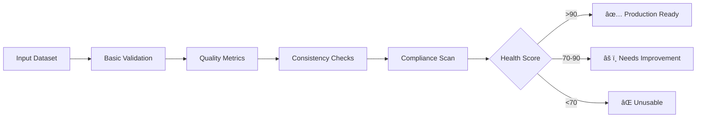

[← Main README](../README.md) | [Features](features.md) | [Usage](usage.md) | [Advanced](advanced.md) | [Architecture](architecture.md) | [Troubleshooting](troubleshooting.md) | [Style Guide](style_guide.md) | [Contributing](contributing.md) | [Changelog](changelog.md) | [ToC](toc.md)


# Dataset Forge Full Documentation

---

# Table of Contents

- [Dataset Forge Documentation](README.md)
  - [📚 Table of Contents](README.md#-table-of-contents)
  - [About This Documentation](README.md#about-this-documentation)
- [📚 Dataset Forge Documentation Home](index.md)
  - [📖 Table of Contents](index.md#-table-of-contents)
  - [👤 Who is this documentation for?](index.md#-who-is-this-documentation-for)
  - [🗺️ Next Steps](index.md#-next-steps)
- [Getting Started](getting_started.md)
  - [Prerequisites](getting_started.md#prerequisites)
  - [Installation](getting_started.md#installation)
  - [First Run](getting_started.md#first-run)
  - [Special Installation Notes](getting_started.md#special-installation-notes)
  - [Need Help?](getting_started.md#need-help)
  - [See Also](getting_started.md#see-also)
- [Special Installation Instructions](special_installation.md)
  - [1. PyTorch with CUDA (GPU Acceleration)](special_installation.md#1-pytorch-with-cuda-gpu-acceleration)
  - [2. VapourSynth & getnative](special_installation.md#2-vapoursynth--getnative)
    - [Method 1: Windows (Quick)](special_installation.md#method-1-windows-quick)
    - [Method 2: Windows (Better; but *TRICKY*...)](special_installation.md#method-2-windows-better-but-tricky)
    - [Method 3: Windows (try building `getnative.exe` yourself)](special_installation.md#method-3-windows-try-building-getnativeexe-yourself)
  - [3. python-magic (for `Enhanced Directory Tree`)](special_installation.md#3-python-magic-for-enhanced-directory-tree)
  - [4. Using resdet for Native Resolution Detection](special_installation.md#4-using-resdet-for-native-resolution-detection)
    - [Method 1: Windows (WSL - Recommended for CLI Integration)](special_installation.md#method-1-windows-wsl---recommended-for-cli-integration)
    - [Method 2: Windows (MSYS2 MINGW64 Shell)](special_installation.md#method-2-windows-msys2-mingw64-shell)
    - [Method 3: Windows (Windows pre-build binary)](special_installation.md#method-3-windows-windows-pre-build-binary)
    - [Usage in Dataset Forge](special_installation.md#usage-in-dataset-forge)
  - [5. Advanced Metadata Operations with ExifTool](special_installation.md#5-advanced-metadata-operations-with-exiftool)
    - [Method 1.1: Windows (Quick)](special_installation.md#method-11-windows-quick)
    - [Method 1.2: Windows (Better)](special_installation.md#method-12-windows-better)
    - [Method 2: Windows (Chocolatey)](special_installation.md#method-2-windows-chocolatey)
  - [6. Metadata Strip + Lossless png compression with Oxipng](special_installation.md#6-metadata-strip--lossless-png-compression-with-oxipng)
    - [Method 1.1: Windows (Quick)](special_installation.md#method-11-windows-quick)
    - [Method 1.2: Windows (Better)](special_installation.md#method-12-windows-better)
  - [7. Steganography Integration for zsteg and Steghide](special_installation.md#7-steganography-integration-for-zsteg-and-steghide)
    - [zsteg installation (Windows)](special_installation.md#zsteg-installation-windows)
      - [Method 1: Gem Installation (Recommended)](special_installation.md#method-1-gem-installation-recommended)
      - [Method 2.1: Standalone Executable (Quick)](special_installation.md#method-21-standalone-executable-quick)
      - [Method 2.2: Standalone Executable (Advanced)](special_installation.md#method-22-standalone-executable-advanced)
    - [steghide installation](special_installation.md#steghide-installation)
      - [Method 1.1: Windows (Quick)](special_installation.md#method-11-windows-quick)
      - [Method 1.2: Windows (Better)](special_installation.md#method-12-windows-better)
  - [8. ffmpeg integration](special_installation.md#8-ffmpeg-integration)
    - [Method 1.1: Windows (Quick)](special_installation.md#method-11-windows-quick)
    - [Method 1.2: Windows (Better)](special_installation.md#method-12-windows-better)
    - [Method 1.3: Windows (`Method 1.1` but download first)](special_installation.md#method-13-windows-method-11-but-download-first)
  - [9. Special mass implementation of above^^](special_installation.md#9-special-mass-implementation-of-above)
    - [Step 1: Windows binary dump](special_installation.md#step-1-windows-binary-dump)
    - [Step 2: Windows dll dump](special_installation.md#step-2-windows-dll-dump)
    - [Step 3: Test the implementations](special_installation.md#step-3-test-the-implementations)
- [Features (tl;dr)](features.md)
- [Feature Overview](features.md#feature-overview)
  - [⚙️ Core & Configuration](features.md#-core--configuration)
  - [📂 Dataset Management](features.md#-dataset-management)
  - [🔍 Analysis & Validation](features.md#-analysis--validation)
  - [✨ Image Processing & Augmentation](features.md#-image-processing--augmentation)
  - [🚀 Performance & Optimization](features.md#-performance--optimization)
  - [🛠️ Utilities](features.md#-utilities)
  - [🧪 Testing & Developer Tools](features.md#-testing--developer-tools)
- [Features (tl;dr)](features.md#features-tldr)
- [Features (main menus)](features.md#features-main-menus)
  - [⚙️ Core & Configuration](features.md#-core--configuration)
  - [📂 Dataset Management](features.md#-dataset-management)
    - [🧩 Umzi's Dataset_Preprocessing (PepeDP-powered, July 2025)](features.md#-umzis-datasetpreprocessing-pepedp-powered-july-2025)
  - [🔍 Analysis & Validation](features.md#-analysis--validation)
  - [✨ Image Processing & Augmentation](features.md#-image-processing--augmentation)
  - [🚀 Training & Inference](features.md#-training--inference)
  - [🛠️ Utilities](features.md#-utilities)
  - [🎨 Catppuccin Mocha Theming Consistency (NEW August 2025)](features.md#-catppuccin-mocha-theming-consistency-new-august-2025)
- [Basic analysis](features.md#basic-analysis)
- [Save report to specific location](features.md#save-report-to-specific-location)
- [Verbose output with detailed results](features.md#verbose-output-with-detailed-results)
- [Through tools launcher](features.md#through-tools-launcher)
  - [⚙️ System & Settings](features.md#-system--settings)
  - [🔗 Links](features.md#-links)
  - [🩺 System Monitoring & Health](features.md#-system-monitoring--health)
    - [**Cleanup & Optimization Features**](features.md#cleanup--optimization-features)
  - [🚀 Performance Optimization (NEW July 2025)](features.md#-performance-optimization-new-july-2025)
    - [**Performance Optimization Menu**](features.md#performance-optimization-menu)
    - [**Integration Benefits**](features.md#integration-benefits)
  - [⚡ Enhanced Caching System (UPDATED July 2025)](features.md#-enhanced-caching-system-updated-july-2025)
    - [**Core Caching Strategies**](features.md#core-caching-strategies)
    - [**Advanced Features**](features.md#advanced-features)
    - [**Cache Management Menu**](features.md#cache-management-menu)
    - [**Automatic Integration**](features.md#automatic-integration)
    - [**Benefits**](features.md#benefits)
    - [**Usage Examples**](features.md#usage-examples)
- [Simple in-memory caching with TTL](features.md#simple-in-memory-caching-with-ttl)
- [Model caching for expensive operations](features.md#model-caching-for-expensive-operations)
- [Smart auto-selection](features.md#smart-auto-selection)
- [Features (expanded/misc)](features.md#features-expandedmisc)
  - [🧪 Comprehensive Test Suite (Updated July 2025)](features.md#-comprehensive-test-suite-updated-july-2025)
  - [🔍 Comprehensive Static Analysis Tool (Updated July 2025)](features.md#-comprehensive-static-analysis-tool-updated-july-2025)
    - [**Enhanced Analysis Capabilities**](features.md#enhanced-analysis-capabilities)
    - [**Advanced Features**](features.md#advanced-features)
    - [**Usage**](features.md#usage)
- [Run comprehensive analysis (all checks)](features.md#run-comprehensive-analysis-all-checks)
- [Run specific analysis types](features.md#run-specific-analysis-types)
- [View detailed results](features.md#view-detailed-results)
    - [**Output Files**](features.md#output-files)
    - [**Analysis Types**](features.md#analysis-types)
    - [**Integration with Development Workflow**](features.md#integration-with-development-workflow)
    - [**Requirements**](features.md#requirements)
  - [Testing & Validation](features.md#testing--validation)
  - [🧑‍💻 Developer Tools: Static Analysis & Code Quality](features.md#-developer-tools-static-analysis--code-quality)
  - [🛠️ Utility Scripts (tools/)](features.md#-utility-scripts-tools)
- [🩺 Dataset Health Scoring (NEW July 2025)](features.md#-dataset-health-scoring-new-july-2025)
- [🔊 Project Sounds & Audio Feedback](features.md#-project-sounds--audio-feedback)
  - [Audio System Architecture](features.md#audio-system-architecture)
  - [Audio Files](features.md#audio-files)
  - [Audio System Features](features.md#audio-system-features)
  - [Audio Usage](features.md#audio-usage)
- [Play audio with automatic fallback handling](features.md#play-audio-with-automatic-fallback-handling)
  - [Audio System Benefits](features.md#audio-system-benefits)
  - [🎨 Comprehensive Emoji System](features.md#-comprehensive-emoji-system)
    - [Emoji System Features](features.md#emoji-system-features)
    - [Emoji Categories](features.md#emoji-categories)
    - [Emoji Usage Examples](features.md#emoji-usage-examples)
- [Get description for any emoji](features.md#get-description-for-any-emoji)
- [Find emojis by description](features.md#find-emojis-by-description)
- [Context-aware validation](features.md#context-aware-validation)
- [Smart suggestions](features.md#smart-suggestions)
- [Usage analysis](features.md#usage-analysis)
    - [Emoji System Benefits](features.md#emoji-system-benefits)
  - [🖥️ User Experience and CLI Features](features.md#-user-experience-and-cli-features)
- [📝 TODO / Planned Features](TODO.md)
- [Usage Guide](usage.md)
  - [Quick Reference](usage.md#quick-reference)
  - [Global Commands & Menu Navigation](usage.md#global-commands--menu-navigation)
    - [**Available Global Commands**](usage.md#available-global-commands)
    - [**User Experience Features**](usage.md#user-experience-features)
    - [**Example Usage**](usage.md#example-usage)
- [...context-aware help screen appears with menu-specific information...](usage.md#context-aware-help-screen-appears-with-menu-specific-information)
- [Menu is automatically redrawn](usage.md#menu-is-automatically-redrawn)
- [Dataset Forge exits with full cleanup](usage.md#dataset-forge-exits-with-full-cleanup)
    - [**Technical Implementation**](usage.md#technical-implementation)
  - [Main Workflows](usage.md#main-workflows)
    - [📂 Dataset Management](usage.md#-dataset-management)
    - [🔍 Analysis & Validation](usage.md#-analysis--validation)
    - [✨ Augmentation & Processing](usage.md#-augmentation--processing)
    - [🩺 Monitoring & Utilities](usage.md#-monitoring--utilities)
    - [🧪 Testing & Developer Tools](usage.md#-testing--developer-tools)
    - [🔍 Static Analysis Tool](usage.md#-static-analysis-tool)
      - [**Quick Start**](usage.md#quick-start)
- [Run comprehensive analysis (all checks)](usage.md#run-comprehensive-analysis-all-checks)
- [Run specific analysis types](usage.md#run-specific-analysis-types)
- [View detailed results](usage.md#view-detailed-results)
      - [**Analysis Types**](usage.md#analysis-types)
      - [**Output Files**](usage.md#output-files)
      - [**Integration with Development**](usage.md#integration-with-development)
      - [**Requirements**](usage.md#requirements)
    - [🎨 Catppuccin Mocha Theming Consistency Checker](usage.md#-catppuccin-mocha-theming-consistency-checker)
      - [**Quick Start**](usage.md#quick-start)
- [Basic analysis](usage.md#basic-analysis)
- [Save report to specific location](usage.md#save-report-to-specific-location)
- [Verbose output with detailed results](usage.md#verbose-output-with-detailed-results)
      - [**Analysis Types**](usage.md#analysis-types)
      - [**Output**](usage.md#output)
      - [**Integration with Development**](usage.md#integration-with-development)
      - [**Requirements**](usage.md#requirements)
    - [🔧 Enhanced Development with MCP Integration](usage.md#-enhanced-development-with-mcp-integration)
- [Enhanced Development Routine](usage.md#enhanced-development-routine)
  - [Example: Running a Workflow](usage.md#example-running-a-workflow)
- [or](usage.md#or)
  - [Tips & Best Practices](usage.md#tips--best-practices)
  - [See Also](usage.md#see-also)
- [Advanced Features & Configuration](advanced.md)
  - [Advanced Configuration](advanced.md#advanced-configuration)
  - [Performance & Optimization](advanced.md#performance--optimization)
- [Instead of: import torch, cv2, numpy as np](advanced.md#instead-of-import-torch-cv2-numpy-as-np)
- [Function-level lazy imports](advanced.md#function-level-lazy-imports)
- [Performance monitoring](advanced.md#performance-monitoring)
- [Before Implementing Any Solution:](advanced.md#before-implementing-any-solution)
- [1. Research current best practices](advanced.md#1-research-current-best-practices)
- [2. Find specific implementation details](advanced.md#2-find-specific-implementation-details)
- [3. Understand current project structure](advanced.md#3-understand-current-project-structure)
- [4. Find relevant code examples](advanced.md#4-find-relevant-code-examples)
- [Basic emoji operations](advanced.md#basic-emoji-operations)
- [Enhanced features](advanced.md#enhanced-features)
  - [Developer Patterns & Extending](advanced.md#developer-patterns--extending)
    - [Global Command System Implementation](advanced.md#global-command-system-implementation)
      - [**Core Implementation**](advanced.md#core-implementation)
      - [**Technical Architecture**](advanced.md#technical-architecture)
      - [**Menu Context Structure**](advanced.md#menu-context-structure)
      - [**Standardized Menu Pattern**](advanced.md#standardized-menu-pattern)
- [Activate virtual environment](advanced.md#activate-virtual-environment)
- [Run the menu audit](advanced.md#run-the-menu-audit)
- [Activate virtual environment](advanced.md#activate-virtual-environment)
- [Basic analysis](advanced.md#basic-analysis)
- [Save report to specific location](advanced.md#save-report-to-specific-location)
- [Verbose output with detailed results](advanced.md#verbose-output-with-detailed-results)
  - [Advanced Testing Patterns](advanced.md#advanced-testing-patterns)
  - [Technical Deep Dives](advanced.md#technical-deep-dives)
  - [MCP Integration & Enhanced Development](advanced.md#mcp-integration--enhanced-development)
    - [**MCP Server Configuration**](advanced.md#mcp-server-configuration)
    - [**Development Workflow Enhancements**](advanced.md#development-workflow-enhancements)
      - [**Code Analysis Workflow**](advanced.md#code-analysis-workflow)
- [Daily Development Routine](advanced.md#daily-development-routine)
      - [**Research Integration Workflow**](advanced.md#research-integration-workflow)
- [Weekly Research Routine](advanced.md#weekly-research-routine)
    - [**Proposed Improvements**](advanced.md#proposed-improvements)
      - [**Enhanced Documentation System**](advanced.md#enhanced-documentation-system)
      - [**Automated Research Updates**](advanced.md#automated-research-updates)
      - [**Enhanced Dataset Discovery**](advanced.md#enhanced-dataset-discovery)
      - [**Community Integration Hub**](advanced.md#community-integration-hub)
    - [**Technical Implementation**](advanced.md#technical-implementation)
      - [**MCP Integration Class Example**](advanced.md#mcp-integration-class-example)
      - [**Automated Research Pipeline**](advanced.md#automated-research-pipeline)
    - [**Success Metrics**](advanced.md#success-metrics)
  - [See Also](advanced.md#see-also)
- [Project Architecture](architecture.md)
  - [Directory Structure (High-Level)](architecture.md#directory-structure-high-level)
  - [Core Architecture Diagram](architecture.md#core-architecture-diagram)
  - [Key Modules](architecture.md#key-modules)
  - [Menu System Architecture](architecture.md#menu-system-architecture)
    - [Menu Structure](architecture.md#menu-structure)
    - [Menu Auditing](architecture.md#menu-auditing)
    - [Menu Files Location](architecture.md#menu-files-location)
  - [Specialized Diagrams](architecture.md#specialized-diagrams)
  - [See Also](architecture.md#see-also)
- [Troubleshooting](troubleshooting.md)
  - [Installation & Environment Issues](troubleshooting.md#installation--environment-issues)
  - [Common CLI & Workflow Issues](troubleshooting.md#common-cli--workflow-issues)
  - [Test Suite & Developer Tools](troubleshooting.md#test-suite--developer-tools)
  - [Metadata & Caching Issues](troubleshooting.md#metadata--caching-issues)
  - [DPID & External Tools](troubleshooting.md#dpid--external-tools)
  - [Steganography Tools (zsteg, steghide)](troubleshooting.md#steganography-tools-zsteg-steghide)
    - [ZSTEG Executable Issues](troubleshooting.md#zsteg-executable-issues)
- [Remove old OCRA and install OCRAN](troubleshooting.md#remove-old-ocra-and-install-ocran)
- [Create zsteg CLI wrapper](troubleshooting.md#create-zsteg-cli-wrapper)
- [Create file: zsteg_cli.rb](troubleshooting.md#create-file-zstegclirb)
- [Build executable with OCRAN](troubleshooting.md#build-executable-with-ocran)
- [Test the executable](troubleshooting.md#test-the-executable)
- [Create zsteg_wrapper.ps1](troubleshooting.md#create-zstegwrapperps1)
- [Attempts OCRA executable first, falls back to gem-installed zsteg](troubleshooting.md#attempts-ocra-executable-first-falls-back-to-gem-installed-zsteg)
  - [Audio System Issues](troubleshooting.md#audio-system-issues)
    - [CLI Hanging During Exit](troubleshooting.md#cli-hanging-during-exit)
    - [Audio Not Playing](troubleshooting.md#audio-not-playing)
    - [Audio Library Conflicts](troubleshooting.md#audio-library-conflicts)
    - [Audio System Error Messages](troubleshooting.md#audio-system-error-messages)
    - [Audio System Best Practices](troubleshooting.md#audio-system-best-practices)
  - [FAQ](troubleshooting.md#faq)
  - [See Also](troubleshooting.md#see-also)
- [Dataset Forge Style Guide](style_guide.md)
  - [Critical UI/UX Rule: Catppuccin Mocha Color Scheme](style_guide.md#critical-uiux-rule-catppuccin-mocha-color-scheme)
    - [Enforcement Checklist](style_guide.md#enforcement-checklist)
  - [General Principles](style_guide.md#general-principles)
  - [Project Architecture & Modularity](style_guide.md#project-architecture--modularity)
  - [Coding Standards](style_guide.md#coding-standards)
  - [Memory, Parallelism, Progress, and Color/UI](style_guide.md#memory-parallelism-progress-and-colorui)
  - [Menu & Workflow Patterns](style_guide.md#menu--workflow-patterns)
  - [Error Handling & Logging](style_guide.md#error-handling--logging)
  - [Testing & Validation](style_guide.md#testing--validation)
  - [Caching & Performance](style_guide.md#caching--performance)
  - [Documentation Requirements](style_guide.md#documentation-requirements)
  - [Dependency & Security](style_guide.md#dependency--security)
  - [Emoji System Guidelines](style_guide.md#emoji-system-guidelines)
    - [Emoji Usage in Menus and UI](style_guide.md#emoji-usage-in-menus-and-ui)
    - [Emoji Best Practices](style_guide.md#emoji-best-practices)
- [Good: Context-appropriate emojis](style_guide.md#good-context-appropriate-emojis)
- [Good: Context-aware validation](style_guide.md#good-context-aware-validation)
- [Avoid: Too many emojis or inappropriate context](style_guide.md#avoid-too-many-emojis-or-inappropriate-context)
    - [Emoji Accessibility](style_guide.md#emoji-accessibility)
    - [Emoji Performance](style_guide.md#emoji-performance)
  - [MCP Integration Requirements (MANDATORY)](style_guide.md#mcp-integration-requirements-mandatory)
    - [MCP Tool Usage Priority](style_guide.md#mcp-tool-usage-priority)
    - [MCP Tool Usage Patterns](style_guide.md#mcp-tool-usage-patterns)
      - [Before Implementing Any Solution:](style_guide.md#before-implementing-any-solution)
      - [When Debugging Issues:](style_guide.md#when-debugging-issues)
      - [When Adding New Features:](style_guide.md#when-adding-new-features)
    - [MCP Integration Requirements](style_guide.md#mcp-integration-requirements)
    - [MCP Tool Usage Examples](style_guide.md#mcp-tool-usage-examples)
- [Example workflow for adding a new feature:](style_guide.md#example-workflow-for-adding-a-new-feature)
- [1. Research current best practices](style_guide.md#1-research-current-best-practices)
- [2. Find specific implementation details](style_guide.md#2-find-specific-implementation-details)
- [3. Understand current project structure](style_guide.md#3-understand-current-project-structure)
- [4. Find relevant code examples](style_guide.md#4-find-relevant-code-examples)
  - [Final Reminders](style_guide.md#final-reminders)
  - [See Also](style_guide.md#see-also)
- [Contributing](contributing.md)
  - [How to Contribute](contributing.md#how-to-contribute)
  - [Development Guidelines](contributing.md#development-guidelines)
  - [Doc Maintenance](contributing.md#doc-maintenance)
  - [Static Analysis & Code Quality](contributing.md#static-analysis--code-quality)
  - [Menu System Development](contributing.md#menu-system-development)
    - [Global Command System Development](contributing.md#global-command-system-development)
    - [MCP Integration Development (MANDATORY)](contributing.md#mcp-integration-development-mandatory)
      - [**Available MCP Servers**](contributing.md#available-mcp-servers)
      - [**MCP Tool Usage Patterns (MANDATORY)**](contributing.md#mcp-tool-usage-patterns-mandatory)
        - [Before Implementing Any Solution:](contributing.md#before-implementing-any-solution)
        - [When Debugging Issues:](contributing.md#when-debugging-issues)
        - [When Adding New Features:](contributing.md#when-adding-new-features)
      - [**MCP Integration Requirements**](contributing.md#mcp-integration-requirements)
      - [**MCP Tool Usage Examples**](contributing.md#mcp-tool-usage-examples)
- [Example workflow for adding a new feature:](contributing.md#example-workflow-for-adding-a-new-feature)
- [1. Research current best practices](contributing.md#1-research-current-best-practices)
- [2. Find specific implementation details](contributing.md#2-find-specific-implementation-details)
- [3. Understand current project structure](contributing.md#3-understand-current-project-structure)
- [4. Find relevant code examples](contributing.md#4-find-relevant-code-examples)
      - [**Research Integration**](contributing.md#research-integration)
      - [**Code Quality Enhancement**](contributing.md#code-quality-enhancement)
    - [Menu Auditing Workflow](contributing.md#menu-auditing-workflow)
    - [Menu Auditing Features](contributing.md#menu-auditing-features)
  - [See Also](contributing.md#see-also)
- [Changelog](changelog.md)
  - [[Unreleased]](changelog.md#unreleased)
    - [🔗 MCP Integration Implementation (August 2025)](changelog.md#-mcp-integration-implementation-august-2025)
    - [🔊 Audio System Investigation & Robust Multi-Library Implementation (August 2025)](changelog.md#-audio-system-investigation--robust-multi-library-implementation-august-2025)
    - [🔧 zsteg.exe Standalone Executable Solution (August 2025)](changelog.md#-zstegexe-standalone-executable-solution-august-2025)
    - [🎨 Catppuccin Mocha Theming Consistency Checker (August 2025)](changelog.md#-catppuccin-mocha-theming-consistency-checker-august-2025)
    - [⚡ CLI Optimization & Lazy Import System Integration (August 2025)](changelog.md#-cli-optimization--lazy-import-system-integration-august-2025)
    - [🧹 Cleanup & Optimization Tools (July 2025)](changelog.md#-cleanup--optimization-tools-july-2025)
    - [🌐 Global Command System & Comprehensive Help Documentation (July 2025)](changelog.md#-global-command-system--comprehensive-help-documentation-july-2025)
    - [🔄 Resave Images Integration (July 2025)](changelog.md#-resave-images-integration-july-2025)
    - [🧩 PepeDP-powered Umzi's Dataset_Preprocessing Integration (July 2025)](changelog.md#-pepedp-powered-umzis-datasetpreprocessing-integration-july-2025)
    - [🚀 Performance Optimization Suite (NEW July 2025)](changelog.md#-performance-optimization-suite-new-july-2025)
      - [**GPU Acceleration**](changelog.md#gpu-acceleration)
      - [**Distributed Processing**](changelog.md#distributed-processing)
      - [**Intelligent Sample Prioritization**](changelog.md#intelligent-sample-prioritization)
      - [**Pipeline Compilation**](changelog.md#pipeline-compilation)
      - [**Performance Optimization Menu**](changelog.md#performance-optimization-menu)
      - [**Comprehensive Testing**](changelog.md#comprehensive-testing)
      - [**Dependencies**](changelog.md#dependencies)
    - [🔧 Technical Improvements](changelog.md#-technical-improvements)
    - [📚 Documentation](changelog.md#-documentation)
    - [🆕 DPID: Umzi's DPID (pepedpid) Integration (July 2025)](changelog.md#-dpid-umzis-dpid-pepedpid-integration-july-2025)
  - [[July 2025]](changelog.md#july-2025)
- [License](license.md)


---


# Readme


# Dataset Forge Documentation

[← Back to Main Project README](../README.md)

Welcome to the **Dataset Forge** documentation hub! Here you'll find detailed guides, feature explanations, advanced usage, troubleshooting, and contribution information for Dataset Forge.

---

## 📚 Table of Contents

- [Features](features.md)
- [Special Installation Instructions](special_installation.md)
- [Usage Guide](usage.md)
- [Advanced Features & Configuration](advanced.md)
- [Project Architecture](architecture.md)
- [Troubleshooting](troubleshooting.md)
- [Contributing](contributing.md)
- [Style Guide](style_guide.md)
- [FAQ](faq.md)
- [Changelog](changelog.md)
- [License](license.md)

---

## About This Documentation

- The main [README.md](../README.md) in the project root is a concise landing page with quick start and overview.
- All detailed documentation is split into separate markdown files in this [`docs/`](https://github.com/Courage-1984/Dataset-Forge/tree/main/docs) folder for clarity and maintainability.
- The [Full README.md](README_full.md) is compiled using `merge_docs.py` from the project root, combining the toc and all seperate documentation.

---

Happy forging! 🚀


---


# Index


# 📚 Dataset Forge Documentation Home

Welcome to the official documentation for **Dataset Forge**!

Dataset Forge is a modular Python CLI tool for managing, analyzing, and transforming image datasets, with a focus on high/low quality pairs for super-resolution and machine learning.

---

## 📖 Table of Contents

- [Getting Started](getting_started.md)  
  _Install, setup, and your first run_
- [Features (tl;dr)](features.md)  
  _Quick overview of what Dataset Forge can do_
- [Usage Guide](usage.md)  
  _How to use the CLI, workflows, and common tasks_
- [Advanced Features & Configuration](advanced.md)  
  _Power user options, custom pipelines, performance_
- [Troubleshooting & FAQ](troubleshooting.md)  
  _Common issues, platform-specific notes, and FAQ_
- [Special Installation Instructions](special_installation.md)  
  _CUDA, cuDNN, VapourSynth, and other dependencies_
- [Project Architecture](architecture.md)  
  _How the codebase is organized and how modules interact_
- [Style Guide](style_guide.md)  
  _Coding, docstring, and test standards for contributors_
- [Contributing](contributing.md)  
  _How to contribute, run tests, and submit PRs_
- [Changelog](changelog.md)  
  _Release history and notable changes_
- [License](license.md)  
  _Project license details_
- [Advanced Features](advanced.md)  
  _MCP integration, global command system, and enhanced development workflows_

---

## 👤 Who is this documentation for?

- **New Users:** Start with [Getting Started](getting_started.md) and [Features](features.md).
- **Advanced Users:** See [Advanced Features](advanced.md) and [Architecture](architecture.md).
- **Contributors:** Read the [Contributing Guide](contributing.md) and [Style Guide](style_guide.md).

---

## 🗺️ Next Steps

- Not sure where to begin? Try the [Quickstart](getting_started.md).
- Looking for a specific feature? Check the [Features](features.md) or [Usage Guide](usage.md).
- Having trouble? Visit [Troubleshooting](troubleshooting.md).

---

> For the latest updates and roadmap, see the [Changelog](changelog.md) or the project [README](../README.md).


---


# Getting Started


# Getting Started

> **UI/UX Note:**  
> All CLI output in Dataset Forge uses the Catppuccin Mocha color scheme for a consistent, visually appealing experience. All prompts, menus, and progress bars are styled using the centralized color utilities.

Welcome to Dataset Forge!  
This guide will help you install and launch Dataset Forge for the first time.

---

## Prerequisites

- **Python**: 3.12+ (see [requirements.txt](../requirements.txt))
- **OS**: Windows (primary)
- **CUDA/cuDNN**: For GPU acceleration (see [Special Installation](special_installation.md))
- **RAM**: 8GB+ (16GB+ recommended)
- **Storage**: SSD recommended

---

## Installation

1. **Clone the repository:**

   ```bash
   git clone https://github.com/Courage-1984/Dataset-Forge.git
   cd Dataset-Forge
   ```

2. **Set up the environment:**
   ```bash
   py -3.12 -m venv venv312
   venv312\Scripts\activate
   python -m pip install --upgrade pip setuptools wheel
   # Install the correct CUDA-enabled torch/torchvision/torchaudio first!
   pip install torch torchvision torchaudio --index-url https://download.pytorch.org/whl/cu121
   pip install -r requirements.txt
   ```
   > **Note:** For other CUDA versions, see [PyTorch Get Started](https://pytorch.org/get-started/locally/).

---

## First Run

```bash
./run.bat
OR
venv312\Scripts\activate
py main.py
OR
dataset-forge
```

---

## Special Installation Notes

- On Windows, `python-magic` requires extra DLLs.
- You must install VapourSynth before using [getnative](https://github.com/Infiziert90/getnative).
- You must compile/build [resdet](https://github.com/0x09/resdet) before using it.
- AND MORE;;;

- See [Special Installation Instructions](special_installation.md) for further details.

---

## Need Help?

- For common issues, see the [Troubleshooting Guide](troubleshooting.md).
- For advanced configuration, see [Advanced Features](advanced.md).

---

## See Also

- [Features](features.md)
- [Usage Guide](usage.md)
- [Advanced Features](advanced.md)
- [Project Architecture](architecture.md)


---


# Special Installation


# Special Installation Instructions

This guide covers special installation requirements for certain dependencies in Dataset Forge. These steps are **critical** for correct operation, especially on Windows. Please read carefully and follow the order for each component.

---

## 1. PyTorch with CUDA (GPU Acceleration)

**You must install the correct CUDA-enabled version of torch/torchvision/torchaudio _before_ installing other requirements.**

**Quick Steps:**

```bat
venv312\Scripts\activate
pip install torch torchvision torchaudio --index-url https://download.pytorch.org/whl/cu121
```

- Replace `cu121` with your CUDA version if needed. See [PyTorch Get Started](https://pytorch.org/get-started/locally/) for details.
- If you skip this, pip will install the CPU-only version by default.
- Only after this, run `pip install .` or `pip install -r requirements.txt`.

**Troubleshooting:**

- Mismatched CUDA/cuDNN versions will cause import errors or no GPU support.
- See [requirements.txt](../requirements.txt) and [PyTorch docs](https://pytorch.org/get-started/locally/).

---

## 2. VapourSynth & getnative

> (for [getnative](https://github.com/Infiziert90/getnative) functionality/native resolution detection)

### Method 1: Windows (Quick)

1. Extract the following file from `assets/getnative.zip`:

   - `getnative.exe`

2. Add the `getnative.exe` file's path to your PATH.

### Method 2: Windows (Better; but *TRICKY*...)

**VapourSynth must be installed _before_ [getnative](https://github.com/Infiziert90/getnative).**

**Steps (Windows):**

1. Download and install [VapourSynth](http://www.vapoursynth.com/) (includes imwri plugin).
2. Open a terminal and run:

```bat
python vsrepo.py install descale
python vsrepo.py install ffms2
python vsrepo.py install lsmas
```

3. Activate your virtual environment:

```bat
venv312\Scripts\activate
```

4. Install getnative:

```bat
pip install getnative
```

### Method 3: Windows (try building `getnative.exe` yourself)

**Steps (Windows):**

1. Git clone the [getnative repo](https://github.com/Infiziert90/getnative):

```bat
git clone https://github.com/Infiziert90/getnative.git
cd getnative
```

2. Extract the following folder from `assets/vapoursynth_install.zip`:

   - `vapoursynth_install`

3. Copy the contents of the `vapoursynth_install` folder to ./getnative/ repo root and REPLACE existing files.

4. Follow the steps outlined in `env_create.md` which should be in your ./getnative/ repo root.

**Troubleshooting:**

- Install VapourSynth _before_ getnative or any requirements that depend on it.
- If getnative fails to import, check that VapourSynth is installed and on your PATH.
- Also make sure directory containing `vsrepo.py` and the plugin's folder containing the `.dll`s are also on your PATH.
- `./assets/vapoursynth_plugins_dll.zip` contains all 4 of the vapoursynth plugins' dll's (`descale`, `ffms2`, `lsmas` & `imwri`) for whatever its worth.

- See [Getnative Recommended Windows Installation](https://github.com/Infiziert90/getnative?tab=readme-ov-file#recommended-windows-installation) for more details.

---

## 3. python-magic (for `Enhanced Directory Tree`)

**Windows users:** You must install both the Python packages and the required DLLs.

**Steps:**

1. Install the packages:

```bat
venv312\Scripts\activate
pip install python-magic python-magic-bin libmagic
```

2. Copy the following files from `assets/libmagicwin64-master.zip` to `C:/Windows/System32/`:

   - `libgnurx-0.dll`
   - `magic.mgc`
   - `magic1.dll`

   (These are prebuilt for 64-bit Windows. See source: [libmagicwin64](https://github.com/pidydx/libmagicwin64) for details.)

3. When using python-magic, specify the magic file path if needed:

```python
import magic
file_magic = magic.Magic(magic_file="C:/Windows/System32/magic.mgc")
```

**Troubleshooting:**

- If you get import errors, ensure the DLLs are in `System32` and you are using the correct magic file path.
- See [python-magic docs](https://github.com/ahupp/python-magic) and [libmagicwin64](https://github.com/pidydx/libmagicwin64).

---

## 4. Using resdet for Native Resolution Detection

> Using [resdet](https://github.com/0x09/resdet) for Native Resolution Detection

### Method 1: Windows (WSL - Recommended for CLI Integration)

1. Clone the repository:
   ```sh
   git clone https://github.com/0x09/resdet.git
   cd resdet
   ```
2. Build resdet:
   ```sh
   sudo apt update
   sudo apt install build-essential
   sudo apt install pkg-config
   sudo apt install libfftw3-dev libpng-dev mjpegtools libmagickwand-dev
   cd path/to/resdet
   make clean
   ./configure
   make
   ```
3. Install resdet to your WSL PATH:
   ```sh
   sudo cp resdet /usr/local/bin/
   sudo chmod +x /usr/local/bin/resdet
   # Or, to use make install:
   sudo make install
   ```
4. **Note:** The Dataset Forge CLI will automatically use WSL to run resdet on Windows. Ensure resdet is available in your WSL environment's PATH.

### Method 2: Windows (MSYS2 MINGW64 Shell)

1. Clone the repository:
   ```sh
   git clone https://github.com/0x09/resdet.git
   ```
2. Open **MSYS2 MINGW64 Shell**.
3. Install dependencies:
   ```sh
   pacman -S base-devel mingw-w64-x86_64-toolchain mingw-w64-x86_64-libpng mingw-w64-x86_64-libjpeg-turbo mingw-w64-x86_64-fftw mingw-w64-x86_64-pkg-config autoconf automake libtool
   ```
4. Set PKG_CONFIG_PATH:
   ```sh
   export PKG_CONFIG_PATH=/mingw64/lib/pkgconfig
   ```
5. Build resdet:
   ```sh
   cd path/to/resdet
   make clean
   ./configure --prefix=/mingw64
   make
   ```
6. Add `resdet.exe` to a folder in your PATH, or add its folder to your PATH.

### Method 3: Windows (Windows pre-build binary)

1. Extract the following files from `assets/resdet_windows.zip`:

   - `resdet.exe`

   (This is a prebuilt for 64-bit Windows that I compiled.)

2. Add `resdet.exe` to a folder in your PATH, or add its folder to your PATH.

### Usage in Dataset Forge

- The CLI will detect your platform and use the appropriate resdet binary.
- On Windows, if WSL is available and resdet is installed in WSL, it will be used automatically.
- If resdet is not found, you will receive a clear error message with installation instructions.

---

## 5. Advanced Metadata Operations with ExifTool

> (for [exiftool](https://exiftool.org/) integration)

### Method 1.1: Windows (Quick)

1. Extract the following folder from `assets/exiftool-13.32_64.zip`:

   - `exiftool-13.32_64`

2. Add the `exiftool-13.32_64` folder path to your PATH.

### Method 1.2: Windows (Better)

1. Download ExifTool.exe:

   https://exiftool.org/

2. Download the Windows Executable (e.g., `exiftool-12.70.zip`).

3. Extract it and rename `exiftool(-k).exe` to `exiftool.exe` for command-line use.

4. Add `exiftool.exe` to a folder in your PATH, or add its folder to your PATH.

> **IMPORTANT:** Note that if you move the .exe to another folder, you must also move the "exiftool_files" folder to the same location.

### Method 2: Windows (Chocolatey)

1. Download ExifTool.exe:

   ```sh
   choco install exiftool -y
   ```

2. This will install `exiftool.exe` to:

   ```sh
   C:\ProgramData\chocolatey\lib\exiftool\tools\
   ```

3. Add `exiftool.exe` to a folder in your PATH, or add its folder to your PATH.

---

## 6. Metadata Strip + Lossless png compression with Oxipng

> (for [Oxipng](https://github.com/oxipng/oxipng) integration)
> essential for 'Sanitise Image Workflow'

### Method 1.1: Windows (Quick)

1. Extract the following folder from `assets/oxipng-9.1.5-x86_64-pc-windows-msvc.zip`:

   - `oxipng-9.1.5-x86_64-pc-windows-msvc`

2. Add the `oxipng-9.1.5-x86_64-pc-windows-msvc` folder path to your PATH.

### Method 1.2: Windows (Better)

1. Download oxipng.exe:

   https://github.com/oxipng/oxipng/releases

2. Download the appropriate archive (e.g., `oxipng-9.1.5-x86_64-pc-windows-msvc.zip`).

3. Extract the contents.

4. Add `oxipng.exe` to a folder in your PATH, or add its folder to your PATH.

---

## 7. Steganography Integration for zsteg and Steghide

> (for [zsteg](https://github.com/zed-0xff/zsteg) & [Steghide](https://steghide.sourceforge.net/) integration)
> optional for 'Sanitise Image Workflow'

### zsteg installation (Windows)

#### Method 1: Gem Installation (Recommended)

1. Install Ruby (via RubyInstaller for Windows)

- Go to: [https://rubyinstaller.org/](https://rubyinstaller.org/)
- Download the **latest Ruby+Devkit** version (e.g. `Ruby 3.3.0 with Devkit`).
- Run the installer.
- On the final screen, check **"Add Ruby executables to your PATH"**.
- Also allow it to **install MSYS2 and development tools** when prompted.

2. Restart PowerShell/Terminal/Console/CLI

3. Install `zsteg`
   ```sh
   gem install zsteg
   ```

#### Method 2.1: Standalone Executable (Quick)

For users who need a standalone `zsteg.exe` executable:

1. Extract the following files from `assets/zsteg_0.2.13_win.zip`:

   - `zsteg.exe`

   (This is a prebuilt Windows binary built using [Largo/ocran](https://github.com/Largo/ocran) that I compiled.)

2. Add `zsteg.exe` to a folder in your PATH, or add its folder to your PATH.

3. You can now use `zsteg.exe` as a CLI tool.

#### Method 2.2: Standalone Executable (Advanced)

For users who need a standalone `zsteg.exe` executable:

1. Install Ruby (via RubyInstaller for Windows)

- Go to: [https://rubyinstaller.org/](https://rubyinstaller.org/)
- Download the **latest Ruby+Devkit** version (e.g. `Ruby 3.3.0 with Devkit`).
- Run the installer.
- On the final screen, check **"Add Ruby executables to your PATH"**.
- Also allow it to **install MSYS2 and development tools** when prompted.

2. Restart PowerShell/Terminal/Console/CLI

3. Remove old OCRA and install OCRAN

-  Remove the old OCRA then install the newer OCRAN (maintained fork)

```bash
gem uninstall ocra
gem install ocran
```

4. Install `zsteg`

   ```sh
   gem install zsteg
   ```

5. **Create zsteg CLI wrapper**

   Extract the following files from `assets/zsteg_cli_build.zip`:

   - `zsteg_cli.rb`
   - `fiber.so`

6. **Build the executable using OCRAN**

   ```sh
   ocran zsteg_cli.rb --gem-all --add-all-core --output zsteg.exe --verbose
   ```

7. **Test the executable**
   ```sh
   ./zsteg.exe --help
   OR
   ./zsteg.exe --help > output.txt 2>&1
   ```

> **Note**: The OCRAN-built executable includes all necessary dependencies and runs without requiring Ruby to be installed on the target system. This method uses the [Largo/ocran](https://github.com/Largo/ocran) fork which provides better Windows compatibility and dependency handling compared to the original OCRA.

> **Technical Details**: OCRAN properly handles native dependencies like `zlib.so`, `zlib1.dll`, and assembly manifest files that cause side-by-side configuration failures with OCRA.

> **Troubleshooting**: If you encounter side-by-side configuration errors with the original OCRA, use the OCRAN method above which properly handles native dependencies like `zlib.so` and `zlib1.dll`.

### steghide installation

#### Method 1.1: Windows (Quick)

1. Extract the following folder from `assets/steghide-0.5.1-win32.zip`:

   - `steghide`

2. Add the `steghide` folder path to your PATH.

#### Method 1.2: Windows (Better)

1. Download Steghide

   [Steghide Windows package](http://prdownloads.sourceforge.net/steghide/steghide-0.5.1-win32.zip?download)

2. Extract the contents (`steghide` folder).

3. Add the `steghide` folder path to your PATH.

---

## 8. ffmpeg integration

> (for [ffmpeg](https://ffmpeg.org/) integration)

### Method 1.1: Windows (Quick)

1. Extract the following folder from `assets/ffmpeg-2025-07-31-git-119d127d05-full_build.zip`:

   - `ffmpeg-2025-07-31-git-119d127d05-full_build`

 - Note that this^ folder contains a `bin` folder which contains:

   - `ffmpeg.exe`
   - `ffplay.exe`
   - `ffprobe.exe`

2. Add the path to the `bin` folder to your PATH.

### Method 1.2: Windows (Better)

1. Download [`FFmpeg Builds`](https://www.gyan.dev/ffmpeg/builds/) (binaries for Windows):

   ```bash
   winget install ffmpeg
   OR
   choco install ffmpeg-full
   OR
   scoop install ffmpeg
   ```

### Method 1.3: Windows (`Method 1.1` but download first)

1. Download `ffmpeg-git-full.7z`:

   https://www.gyan.dev/ffmpeg/builds/ffmpeg-git-full.7z

2. Extract the contents of the downloaded archive.

 - Note that this^ folder should contain a `bin` folder which contains:

   - `ffmpeg.exe`
   - `ffplay.exe`
   - `ffprobe.exe`

3. Add the path to the `bin` folder to your PATH.

---


## 9. Special mass implementation of above^^

> shortcut that implements multiple special installations from above

*might, might not work*

### Step 1: Windows binary dump

1. Extract the following folder from `assets/_win_binary_dump.zip`:

   - `_win_binary_dump`

2. Add the path to the `_win_binary_dump` folder path to your PATH.

**this includes**:
```txt
exiftool.exe
ffmpeg.exe
ffplay.exe
ffprobe.exe
getnative.exe
oxipng.exe
resdet.exe
steghide.exe
zsteg.exe
```

### Step 2: Windows dll dump

1. Extract the following folder from `assets/_win_dll_dump.zip`:

   - `_win_dll_dump`

2. Add the path to the `_win_dll_dump` folder path to your PATH.

**this includes ddl's for**:
```txt
VapourSynth's plugins
python-magic's dll's & .mgc magicfile
```

### Step 3: Test the implementations

1. lorem ipsum

---

For more details, see the [main README Quick Start](../README.md#-quick-start) and [troubleshooting guide](troubleshooting.md).


---


# Features


# Features (tl;dr)

> **UI/UX Note:**  
> All CLI output in Dataset Forge uses the Catppuccin Mocha color scheme for a consistent, visually appealing experience. All prompts, menus, and progress bars are styled using the centralized color utilities.

- Modular CLI for image dataset management, curation, and analysis
- Powerful HQ/LQ pair workflows for SISR and super-resolution
- Advanced validation, deduplication, and quality scoring
- Rich augmentation, transformation, and batch processing
- GPU acceleration and distributed processing support
- Integration with popular external tools (WTP, traiNNer-redux, getnative, resdet, etc.)
- Robust reporting, health scoring, and system monitoring
- Comprehensive test suite and static analysis tools
- [See Usage Guide](usage.md) for examples and workflows

---

# Feature Overview

## ⚙️ Core & Configuration

- **🌐 Global Command System**: Context-aware help (`help`, `h`, `?`) and instant quit (`quit`, `exit`, `q`) from any menu
- External tool integration (WTP Dataset Destroyer, traiNNer-redux, getnative, resdet, etc.)
- Model management: list, select, download, and run upscaling with trained models
- Multi-format config support (JSON, YAML, HCL)
- User profiles, favorites, presets, and quick access paths
- **📚 Comprehensive Help System**: Menu-specific help documentation with navigation tips and feature descriptions

## 📂 Dataset Management

- Multiscale dataset generation, video frame extraction, image tiling
- Combine, split, shuffle, and randomize datasets
- HQ/LQ pair management: manual/fuzzy pairing, scale correction, alignment
- Visual and hash-based deduplication, CBIR (semantic duplicate detection)
- Batch renaming, orientation sorting, size filtering

## 🔍 Analysis & Validation

- Progressive validation suite for datasets and HQ/LQ pairs
- Automated quality scoring (NIQE, HyperIQA, IC9600, etc.)
- Corruption, misalignment, and outlier detection
- HTML/Markdown reporting with plots and sample images

## ✨ Image Processing & Augmentation

- Downsampling, cropping, flipping, rotating, shuffling, resaving
- Brightness, contrast, hue, saturation, HDR/SDR, grayscale
- Degradations: blur, noise, pixelate, dithering, sharpen, banding, etc.
- Advanced augmentation pipelines and recipe management
- Metadata scrubbing, ICC profile conversion, sketch/line art extraction

## 🚀 Performance & Optimization

- GPU-accelerated preprocessing and batch operations
- Distributed processing (Dask, Ray), multi-GPU support
- JIT compilation for performance-critical code
- Real-time analytics and auto-optimization
- **CLI Optimization**: Comprehensive lazy import system for 50-60% faster startup times

## 🛠️ Utilities

- Image/gif comparison creation, compression, and sanitization
- Enhanced directory tree visualization
- Batch metadata extraction, editing, filtering, and anonymization
- System monitoring: live resource usage, error summaries, health checks
- **🎨 Comprehensive Emoji System**: 3,655+ emoji mappings with context-aware validation, smart suggestions, and usage analysis

## 🧪 Testing & Developer Tools

- Comprehensive pytest suite for all features
- Static analysis tools for code quality and maintainability
- **Menu Auditing Tool**: Comprehensive menu hierarchy analysis and improvement recommendations
- **🌐 Global Command Testing**: Comprehensive test suite with 71 tests covering all global command functionality, including unit tests, integration tests, and edge case testing
- **🎨 Emoji Usage Checker**: Comprehensive emoji usage analysis and Unicode encoding validation tool
- Utility scripts for environment setup, testing, and documentation merging

---

<details>
<summary><strong>Full Feature List (click to expand)</strong></summary>

# Features (tl;dr)

- Modular CLI tool for image dataset management, curation, and analysis
- Powerful HQ/LQ pair workflows for SISR and super-resolution
- Advanced validation, deduplication, and quality scoring tools
- Rich augmentation, transformation, and batch processing features
- Integrates with popular external tools and supports GPU acceleration

# Features (main menus)

## ⚙️ Core & Configuration

- **🔧 External tool integration**: [WTP Dataset Destroyer](https://github.com/umzi2/wtp_dataset_destroyer), [traiNNer-redux](https://github.com/the-database/traiNNer-redux), [getnative](https://github.com/Infiziert90/getnative), [resdet](https://github.com/0x09/resdet), [Oxipng](https://github.com/oxipng/oxipng), [Steghide](https://steghide.sourceforge.net/), [zsteg](https://github.com/zed-0xff/zsteg), [umzi's Dataset_Preprocessing](https://github.com/umzi2/Dataset_Preprocessing), []()
- **📦 Model management**: List, select, download and run upscaling with trained models (also [OpenModelDB](https://openmodeldb.info/) integration)
- **🌐 Global Command System**: Context-aware help (`help`, `h`, `?`) and instant quit (`quit`, `exit`, `q`) from any menu
- **📚 Comprehensive Help System**: Menu-specific help documentation with navigation tips and feature descriptions
- **🧪 Global Command Testing**: Comprehensive test suite with 71 tests covering all global command functionality
- **✅ Validation tools**: Validate HQ/LQ pairs and validation datasets from config
- **👤 User profiles**: Save favorites, presets, links and quick access paths
- **⚙️ Multi-format config support**: JSON, YAML, HCL

## 📂 Dataset Management

- **🎯 Dataset Creation**: Multiscale dataset generation (DPID), video frame extraction, image tiling (using IC9600)
- **🔗 Dataset Operations**: Combine, split, extract random pairs, shuffle datasets, remove/move
- **🔍 HQ/LQ Pair Management**: Create/Correct Manual Pairings, fuzzy matching, scale correction, shuffle, extract random pairs
- **🧹 Clean & Organize**: De-dupe (Visual deduplication, hash-based deduplication, ImageDedup advanced duplicate detection, CBIR (Semantic Duplicate Detection)), batch renaming
- **🔄 Orientation Organization**: Sort by landscape/portrait/square
- **📏 Size Filtering**: Remove small/invalid image pairs
- **🧭 Align Images (Batch Projective Alignment)**: Aligns images from two folders (flat or recursive, matching by filename) using SIFT+FLANN projective transformation. Supports batch processing, robust error handling, and both flat and subfolder workflows. See Usage Guide for details.
- **DPID implementations (BasicSR, OpenMMLab, Phhofm, Umzi)**: Multiple DPID (degradation) methods for downscaling, including Umzi's DPID (pepedpid) for HQ/LQ and single-folder workflows.

### 🧩 Umzi's Dataset_Preprocessing (PepeDP-powered, July 2025)

- **Best Tile Extraction**: Extracts the most informative tiles from images using Laplacian or IC9600 complexity, with robust parallelism and thresholding.
- **Video Frame Extraction (Embedding Deduplication)**: Extracts diverse frames from video using deep embeddings (ConvNext, DINOv2, etc.) and distance thresholding.
- **Duplicate Image Detection and Removal**: Finds and moves duplicate images using embedding similarity (Euclidean/cosine) and configurable thresholds.
- **Threshold-Based Image Filtering (IQA)**: Filters images by quality using advanced IQA models (HyperIQA, ANIIQA, IC9600, etc.), with batch and median thresholding.

All workflows are modular, testable, and use the latest PepeDP API. See [Usage Guide](usage.md#using-umzis-datasetpreprocessing) for details and examples.

## 🔍 Analysis & Validation

- **🔍 Comprehensive Validation**: Progressive dataset validation suite
- **📊 Rich Reporting**: HTML/Markdown reports with plots and sample images
- **⭐ Quality Scoring**: Automated dataset quality assessment (NIQE, etc.)
- **🔧 Issue Detection**: Corruption detection, misalignment detection, outlier detection. alpha channel detection
- **🧪 Property Analysis**: Consistency checks, aspect ratio testing, dimension reporting
- **⭐ BHI Filtering**: Blockiness, HyperIQA, IC9600 quality assessment
- **🔍 Scale Detection**: Find and test HQ/LQ scale relationships
- **🎯 Find Native Resolution**: Find image native resolution using [getnative](https://github.com/Infiziert90/getnative) or [resdet](https://github.com/0x09/resdet)

## ✨ Image Processing & Augmentation

- **🔄 Basic Transformations**: Downsample Images, crop, flip, rotate, shuffle, remove alpha channel, **resave images (with lossless options and quality control)**
- **🎨 Colour, Tone & Levels Adjustments**: Brightness, contrast, hue, saturation, HDR>SDR, grayscale
- **🧪 Degradations**: Blur, noise, pixelate, dithering, sharpen, banding & many more
- **🚀 Augmentation**: List, create, edit or delete _recipes_ or run advanced augmentation pipelines (using recipes)
- **📋 Metadata**: Scrub EXIF Metadata, Convert ICC Profile to sRGB
- **✏️ Find & extract sketches/drawings/line art**: Find & extract sketches/drawings/line art using pre-trained model
- **🗳️ Batch Processing**: Efficient batch operations for large datasets

## 🚀 Training & Inference

- **🛠️ Run wtp_dataset_destroyer**: [WTP Dataset Destroyer](https://github.com/umzi2/wtp_dataset_destroyer) integration, create HQ/LQ pairs with custom degradations
- **🚀 Run traiNNer-redux**: [traiNNer-redux](https://github.com/the-database/traiNNer-redux) integration, train your own SISR models
- **🧠 OpenModelDB Model Browser**: Robust integration with [OpenModelDB](https://openmodeldb.info/)
- **⚙️ Config files**: Add, load, view & edit configs

## 🛠️ Utilities

- **🖼️ Create Comparisons**: Create striking image / gif comparisons
- **📦 Compression**: Compress images or directories
- **🧹 Sanitize Images**: Comprehensive, interactive image file sanitization. Each major step (corruption fix, copy, batch rename, ICC to sRGB, PNG conversion, remove alpha, metadata removal, steganography) is prompted interactively with emoji and Mocha color. Steganography checks prompt for steghide and zsteg individually, and the summary reports both. A visually distinct summary box is always shown at the end, including zsteg results file path if produced. All output uses the Catppuccin Mocha color scheme and emoji-rich prompts. Menu header is reprinted after returning to the workflow menu.
- **🌳 Enhanced Directory Tree**: Directory tree visualization using emojis
- **🧹 Filter non-Images**: Filter all non image type files
- **🗂️ Enhanced Metadata Management**: Batch Extract Metadata: Extract EXIF/IPTC/XMP from all images in a folder to CSV or SQLite using exiftool and pandas/SQLite. View/Edit Metadata: View and edit metadata for a single image (EXIF, IPTC, XMP) using Pillow and exiftool. Filter by Metadata: Query and filter images by metadata fields (e.g., ISO, camera, date) using pandas/SQLite. Batch Anonymize Metadata: Strip all identifying metadata from images using exiftool, with robust error handling and progress.

> **Dependencies:** Requires [exiftool](https://exiftool.org/) (external), pandas, and SQLite (Python stdlib).

## 🎨 Catppuccin Mocha Theming Consistency (NEW August 2025)

**Location:** Tools menu → 🎨 Check Mocha Theming

**Purpose:**

- Ensure consistent use of the Catppuccin Mocha color scheme across the entire codebase
- Validate centralized printing utility usage and identify raw print statements
- Check menu implementations for proper theming patterns and context parameters
- Maintain visual consistency and user experience standards

**Features:**

- **🔍 Comprehensive Analysis**: Scans all Python, Markdown, and batch files in the codebase
- **📄 Raw Print Detection**: Identifies all `print()` statements that should use centralized utilities
- **🎨 Import Validation**: Checks for missing Mocha color imports and centralized printing utilities
- **🎯 Menu Pattern Analysis**: Validates proper menu implementation patterns and context parameters
- **📊 Detailed Reporting**: Generates comprehensive markdown reports with actionable recommendations
- **🚨 Issue Categorization**: Classifies issues by severity (error, warning, info) and type

**Analysis Types:**

- **Raw Print Statements**: Finds `print()` calls that should use `print_info()`, `print_success()`, etc.
- **Missing Imports**: Detects Mocha color usage without proper imports
- **Menu Context**: Identifies missing `current_menu` and `menu_context` parameters
- **Menu Patterns**: Validates standardized key-based menu patterns
- **Documentation**: Checks for theming documentation in markdown files

**Usage:**

```bash
# Basic analysis
python tools/check_mocha_theming.py

# Save report to specific location
python tools/check_mocha_theming.py --output reports/theming_report.md

# Verbose output with detailed results
python tools/check_mocha_theming.py --verbose

# Through tools launcher
python tools/launcher.py check_mocha_theming
```

**Output:**

- **Console Summary**: Real-time analysis progress and summary statistics
- **Detailed Report**: Comprehensive markdown report with file-by-file analysis
- **Actionable Recommendations**: Specific suggestions for fixing theming issues
- **Exit Codes**: Proper exit codes for CI/CD integration (1 for errors, 0 for success)

**Integration:**

- **Tools Launcher**: Fully integrated with the tools launcher for easy access
- **CI/CD Ready**: Exit codes and comprehensive reporting for automated workflows
- **Documentation**: Detailed usage instructions and best practices
- **Error Handling**: Robust error handling with graceful fallbacks

**Benefits:**

- **🎨 Visual Consistency**: Ensures all CLI output follows the Catppuccin Mocha color scheme
- **🔧 Code Quality**: Identifies and fixes theming inconsistencies across the codebase
- **📚 Documentation**: Maintains consistent theming documentation and standards
- **🚀 Development Efficiency**: Automated theming validation saves manual review time
- **🛡️ Quality Assurance**: Prevents theming regressions and maintains user experience standards

## ⚙️ System & Settings

- **📁 Set HQ/LQ Folder**: set HQ/LQ image pair folders to use throughout Dataset Forge
- **👤 User Profile Management**: Create and manage custom profiles for Dataset Forge
- **🧠 Memory Management**: View, clear & optimize memory management
- **⚙️ Settings**: View & configure project settings

## 🔗 Links

- **🌐 Community Links**: Browse/List important and usefull links curated by me and the community
- **🔗 Personal Links**: Browse/List & add your own links

## 🩺 System Monitoring & Health

- **📊 View Live Resource Usage**: Real-time CPU, GPU (NVIDIA), RAM, and disk usage for all processes/threads
- **📈 View Performance Analytics**: Decorator-based analytics for all major operations, with live and persistent session summaries
- **🛑 View Error Summary**: Logs errors to file and CLI, with summary granularity and critical error notifications (sound/visual)
- **🩺 Run Health Checks**: Automated checks for RAM, disk, CUDA, Python version, and permissions, with CLI output and recommendations
- **🧵 Manage Background Tasks**: Registry of all subprocesses/threads, with CLI controls for pause/resume/kill and session-only persistence
- **⏱️ View Menu Load Times**: View the menu load times
- **🧹 Cleanup & Optimization**: Comprehensive cleanup tools for cache folders, system caches, and memory management

### **Cleanup & Optimization Features**

The cleanup menu provides comprehensive project maintenance tools:

- **🧹 Remove .pytest_cache folders**: Recursively removes all pytest test cache folders from the project
- **🧹 Remove **pycache** folders**: Recursively removes all Python bytecode cache folders from the project
- **🧹 Remove All Cache Folders**: Removes both .pytest_cache and **pycache** folders in one operation
- **🧹 Comprehensive System Cleanup**: Full system cleanup including cache folders, disk cache, in-memory cache, GPU memory, and system memory
- **📊 Analyze Cache Usage**: View cache usage statistics, folder sizes, and cleanup recommendations

**Benefits:**

- **🗂️ Project Cleanup**: Remove unnecessary cache files that accumulate over time
- **💾 Space Recovery**: Free up disk space by removing large cache folders
- **⚡ Performance**: Clean caches can improve system performance
- **🔍 Analysis**: Understand cache usage patterns and optimize storage
- **🛡️ Safe Operations**: Comprehensive error handling and permission checking

## 🚀 Performance Optimization (NEW July 2025)

- **⚡ GPU Acceleration**: Comprehensive GPU-accelerated preprocessing operations including brightness/contrast, saturation/hue, sharpness/blur, and batch transformations
- **🌐 Distributed Processing**: Multi-machine and single-machine multi-GPU processing using Dask and Ray with automatic resource detection
- **🎯 Intelligent Sample Prioritization**: Quality-based sample prioritization using advanced image analysis (sharpness, contrast, noise, artifacts, complexity)
- **⚡ Pipeline Compilation**: JIT compilation using Numba, Cython, and PyTorch JIT for performance-critical code paths
- **📊 Performance Analytics**: Comprehensive monitoring and analytics for all optimization features
- **⚙️ Auto-Optimization**: Automatic optimization strategy selection based on system resources and task characteristics

### **Performance Optimization Menu**

Accessible from the main menu as "🚀 Performance Optimization", providing:

- **🎮 GPU Acceleration**: Test, configure, and benchmark GPU operations
- **🌐 Distributed Processing**: Start/stop clusters, configure workers, monitor performance
- **🎯 Sample Prioritization**: Configure quality analysis, test prioritization strategies
- **⚡ Pipeline Compilation**: Test compilation backends, configure optimization settings
- **📊 Performance Analytics**: Monitor system performance, GPU usage, distributed metrics
- **⚙️ Optimization Settings**: Configure global optimization preferences and thresholds

### **Integration Benefits**

- **⚡ 10-100x Speedup**: GPU acceleration for image processing bottlenecks
- **🌐 Scalable Processing**: Distribute work across multiple machines and GPUs
- **🎯 Quality-First**: Process highest-quality samples first for better results
- **⚡ Compiled Performance**: JIT compilation for numerical and image processing operations
- **📊 Real-Time Monitoring**: Live performance metrics and optimization suggestions

## ⚡ Enhanced Caching System (UPDATED July 2025)

Dataset Forge features a comprehensive, production-ready caching system with advanced features, monitoring, and management capabilities:

### **Core Caching Strategies**

- **🔄 In-Memory Caching:** Advanced LRU cache with TTL, compression, and statistics for lightweight, frequently-called, session-only results
- **💾 Disk Caching:** Persistent storage with TTL, compression, manual file management, and integrity checks for expensive, large, or cross-session results
- **🧠 Model Caching:** Specialized cache for expensive model loading operations with automatic cleanup
- **🤖 Smart Caching:** Auto-selects optimal caching strategy based on function characteristics

### **Advanced Features**

- **⏱️ TTL Management:** Automatic expiration of cached data with configurable time-to-live
- **🗜️ Compression:** Automatic data compression for disk cache to reduce storage footprint
- **📊 Statistics & Analytics:** Real-time cache performance, hit rates, memory usage, and disk space monitoring
- **🔧 Cache Management:** Comprehensive utilities for clearing, validation, repair, warmup, and export
- **🛡️ Integrity Checks:** Automatic validation and repair of corrupted cache files
- **🔥 Warmup System:** Pre-load frequently used data into cache for optimal performance

### **Cache Management Menu**

Accessible from System Settings → Cache Management, providing:

- **📈 View Cache Statistics:** Performance metrics, hit rates, and usage analytics
- **🧹 Clear Caches:** Selective or complete cache clearing
- **🔍 Performance Analysis:** Cache efficiency metrics and optimization suggestions
- **📤 Export Data:** Cache statistics and data backup functionality
- **🔧 Maintenance Tools:** Validation, repair, cleanup, and optimization
- **🔥 Warmup Operations:** Pre-load frequently accessed data

### **Automatic Integration**

Caching is transparently applied to key functions:

- **🖼️ Image Operations:** `get_image_size()` with TTL-based caching
- **🧠 Model Loading:** `enum_to_model()` and `get_clip_model()` with model-specific caching
- **📁 File Operations:** `is_image_file()` with in-memory caching
- **🔍 CBIR Features:** Feature extraction and similarity search with disk caching

### **Benefits**

- **⚡ Dramatically Faster Operations:** Frequently accessed data served from cache
- **💾 Memory Efficiency:** LRU eviction and compression reduce memory footprint
- **🔄 Reduced I/O:** Disk cache reduces file system access
- **🧠 Model Loading:** Instant access to cached AI models
- **📊 Transparent Management:** Self-maintaining cache with comprehensive monitoring

### **Usage Examples**

```python
# Simple in-memory caching with TTL
@in_memory_cache(ttl=300, maxsize=1000)
def quick_lookup(key):
    return expensive_calculation(key)

# Model caching for expensive operations
@model_cache(ttl=3600)
def load_expensive_model(name):
    return load_model_from_disk(name)

# Smart auto-selection
@smart_cache(ttl=3600, maxsize=500)
def process_data(data):
    return complex_processing(data)
```

See `docs/advanced.md` for technical details, customization, and best practices.

# Features (expanded/misc)

- **Audio error feedback**: All user-facing errors trigger an error sound (error.mp3) for immediate notification.
- **Persistent Logging**: All analytics and errors are logged to ./logs/ for later review
- **Memory & CUDA Cleanup**: Automatic cleanup on exit/errors for all tracked processes/threads

## 🧪 Comprehensive Test Suite (Updated July 2025)

Dataset Forge now includes a robust, cross-platform test suite covering all major features:

- Enhanced Metadata Management (extract, edit, filter, anonymize)
- Quality Scoring (single and batch, via public API)
- Sanitize Images (remove metadata, convert, remove alpha, steganography checks)
- Visual Deduplication (find, move, copy, remove duplicate groups)
- DPID implementations (BasicSR, OpenMMLab, Phhofm, Umzi)
- CBIR and deduplication workflows
- Report generation
- Audio feedback, memory, parallel, and progress utilities
- Session state, config, and error handling

**Run all tests:**

You can now use the flexible test runner script for convenience:

```sh
python tools/run_tests.py
```

This script provides a menu to select the test mode, or you can pass an option (see below). See [usage.md](usage.md#🦾-running-the-test-suite) for details.

**Test suite highlights:**

- All features have public, non-interactive APIs for programmatic access and testing.
- Tests use monkeypatching and dummy objects to avoid reliance on external binaries or real files.
- Multiprocessing tests use module-level worker functions for compatibility.
- Only one test is marked XFAIL (ignore patterns in directory tree), which is expected and documented.

See [Usage Guide](usage.md#testing) and [Style Guide](style_guide.md#testing-patterns) for details.

## 🔍 Comprehensive Static Analysis Tool (Updated July 2025)

Dataset Forge includes a powerful, comprehensive static analysis tool that provides deep insights into code quality, maintainability, and potential issues across the entire codebase.

### **Enhanced Analysis Capabilities**

The `find_code_issues.py` tool now provides comprehensive analysis across all project directories:

- **📁 Multi-Directory Analysis**: Analyzes `./dataset_forge/`, `./tests/`, `./configs/`, and `./tools/`
- **🔍 Dead Code Detection**: Finds unused functions, methods, classes, and variables
- **📊 Test Coverage Analysis**: Identifies untested code and missing test coverage
- **🧪 Test/Code Mapping**: Maps test files to source code and identifies orphaned tests
- **📝 Documentation Analysis**: Checks for missing docstrings in public functions/classes/methods
- **📦 Dependency Analysis**: Analyzes `requirements.txt` for unused packages and missing dependencies
- **⚙️ Configuration Validation**: Validates JSON configuration files for syntax and structure
- **🔄 Import Analysis**: Detects circular imports and unused import statements
- **📈 Call Graph Analysis**: Generates call graphs for function/class relationship analysis

### **Advanced Features**

- **🎯 Actionable Insights**: Provides specific, actionable recommendations for code improvement
- **📊 Comprehensive Reporting**: Generates detailed reports with categorized issues and suggestions
- **🔧 Multiple Analysis Tools**: Integrates vulture, pytest-cov, pyan3, pyflakes, and custom AST analysis
- **📁 Organized Output**: All results saved to `./logs/find_code_issues/` for easy review
- **⚡ Performance Optimized**: Efficient analysis with progress tracking and error handling

### **Usage**

```bash
# Run comprehensive analysis (all checks)
python tools/find_code_issues.py

# Run specific analysis types
python tools/find_code_issues.py --dependencies --configs
python tools/find_code_issues.py --vulture --pyflakes
python tools/find_code_issues.py --coverage --test-mapping

# View detailed results
python tools/find_code_issues.py --all --view
```

### **Output Files**

All analysis results are saved to `./logs/find_code_issues/`:

- `find_code_issues.log` - Full verbose output of all analyses
- `find_code_issues_view.txt` - Detailed results for each analysis type
- `find_code_issues_report.txt` - Actionable insights and issues summary
- `dependencies_analysis.txt` - Detailed dependency analysis results
- `coverage_html/` - HTML coverage reports (when coverage analysis is run)

### **Analysis Types**

1. **Vulture (Dead Code)**: Finds unused code, functions, and variables
2. **Coverage**: Identifies untested code and generates coverage reports
3. **Pyan3 (Call Graph)**: Analyzes function/class relationships and dependencies
4. **Pyflakes**: Detects unused imports, variables, and syntax issues
5. **Test Mapping**: Maps test files to source code and identifies gaps
6. **AST Analysis**: Custom analysis for defined but never called functions/classes
7. **Docstring Check**: Identifies missing documentation in public APIs
8. **Dependencies**: Analyzes package usage vs. requirements.txt
9. **Configs**: Validates configuration files and structure
10. **Import Analysis**: Detects circular imports and unused imports

### **Integration with Development Workflow**

- **Pre-commit Analysis**: Run before committing code to catch issues early
- **Continuous Integration**: Integrate with CI/CD pipelines for automated quality checks
- **Code Review**: Use analysis results to guide code review discussions
- **Maintenance**: Regular analysis helps maintain code quality and identify technical debt

### **Requirements**

```bash
pip install vulture pytest pytest-cov coverage pyan3 pyflakes
```

The tool automatically handles missing dependencies and provides helpful error messages for installation.

## Testing & Validation

- Dataset Forge includes a comprehensive, cross-platform test suite using pytest.
- All core business logic, utilities, and integration flows are covered by unit and integration tests.
- Tests cover DPID, CBIR, deduplication, reporting, audio, memory, parallel, and session state features.
- Tests are robust on Windows and Linux, and use fixtures and monkeypatching for reliability.
- All new features and bugfixes must include appropriate tests.

---

## 🧑‍💻 Developer Tools: Static Analysis & Code Quality

> **Documentation Convention:** When adding new features or modules, update the architecture diagrams (Mermaid) in README.md and docs/architecture.md as needed. Use standard badges in the README and document their meaning in the docs.

- **Comprehensive Static Analysis Tool:** Located at `tools/find_code_issues.py`.
- **Enhanced Analysis Capabilities:**
  - Multi-directory analysis (`./dataset_forge/`, `./tests/`, `./configs/`, `./tools/`)
  - Unused (dead) code, functions, classes, and methods
  - Untested code (missing test coverage)
  - Functions/classes defined but never called
  - Test/code mapping (tests without code, code without tests)
  - Missing docstrings in public functions/classes/methods
  - Unused imports/variables
  - Dependency analysis (unused packages, missing dependencies)
  - Configuration file validation
  - Import analysis (circular imports, unused imports)
  - Call graph analysis for function/class relationships
- **How to run:**
  ```sh
  python tools/find_code_issues.py [options]
  # Run with no options to perform all checks
  # Use --dependencies --configs for dependency and config analysis
  # Use --all --view for comprehensive analysis with detailed results
  ```
- **Output:**
  - All results saved to `./logs/find_code_issues/`:
    - `find_code_issues.log` (full verbose output)
    - `find_code_issues_report.txt` (actionable summary)
    - `find_code_issues_view.txt` (detailed results)
    - `dependencies_analysis.txt` (dependency analysis results)
    - `coverage_html/` (HTML coverage reports)
- **Requirements:**
  - `pip install vulture pytest pytest-cov coverage pyan3 pyflakes`

## 🛠️ Utility Scripts (tools/)

Dataset Forge includes several utility scripts in the `tools/` directory to assist with development, documentation, and environment setup. These scripts are user-facing and documented in detail in [usage.md](usage.md#utility-scripts-tools).

- **run_tests.py**: Flexible test runner for the test suite. Lets you choose between basic, recommended, and verbose pytest runs via menu or CLI argument. See [usage.md](usage.md#run_testspy-flexible-test-runner-new-july-2025) for usage and options.
- **find_code_issues.py**: Comprehensive static analysis tool for code quality and maintainability. Analyzes all project directories (`./dataset_forge/`, `./tests/`, `./configs/`, `./tools/`) for dead code, untested code, missing docstrings, test/code mapping, dependency analysis, configuration validation, and import analysis. See [usage.md](usage.md#find_code_issuespy-static-analysis-tool) for full usage and options.
- **merge_docs.py**: Merges all documentation files in `docs/` into a single `README_full.md` and generates a hierarchical Table of Contents (`toc.md`). Keeps documentation in sync. See [usage.md](usage.md#merge_docspy-documentation-merging-tool).
- **install.py**: Automated environment setup script. Creates a virtual environment, installs CUDA-enabled torch, and installs all project requirements. See [usage.md](usage.md#installpy-environment-setup-tool).
- **print_zsteg_env.py**: Prints the current PATH and the location of the `zsteg` binary for troubleshooting steganography tool integration. See [usage.md](usage.md#print_zsteg_envpy-zsteg-environment-check).
- **check_mocha_theming.py**: Comprehensive Catppuccin Mocha theming consistency checker. Analyzes CLI menus, printing, console logging, and user-facing output for consistent color scheme usage. See [usage.md](usage.md#check_mocha_themingpy-theming-consistency-checker-new-august-2025) for full usage and options.

For detailed usage, CLI options, and troubleshooting, see [usage.md](usage.md#utility-scripts-tools).

# 🩺 Dataset Health Scoring (NEW July 2025)

**Location:** Dataset Management menu → 🩺 Dataset Health Scoring

**Purpose:**

- Assess the overall health and readiness of an image dataset for ML workflows.
- Supports both single-folder datasets and HQ/LQ parent folder structures (for super-resolution and paired tasks).

**Workflow:**

- User selects either a single folder or an HQ/LQ parent folder (auto-detects or prompts for HQ/LQ subfolders).
- Runs a series of modular checks:
  - Basic validation (file existence, supported formats, min count)
  - Unreadable/corrupt files
  - Image format consistency
  - Quality metrics (resolution, blur, etc.)
  - Aspect ratio consistency
  - File size outliers
  - Consistency checks (duplicates, naming, alignment)
  - Compliance scan (metadata, forbidden content)
- Each check is weighted; partial credit is possible.
- Shows a detailed breakdown of results, a final health score (0–100), and a status (✅ Production Ready, ⚠️ Needs Improvement, ❌ Unusable).
- Provides actionable suggestions for improvement if any step fails.

**Extensibility:**

- Checks are modular; new steps can be added easily.
- Scoring weights and logic are configurable in the business logic module.

**Testing:**

- Fully covered by unit and integration tests (see `tests/test_utils/test_dataset_health_scoring.py` and `tests/test_cli/test_dataset_health_scoring_menu.py`).
- Tests simulate both single-folder and HQ/LQ menu flows, including edge cases and input handling.

**Robustness:**

- Uses centralized input, printing, memory, and error handling utilities.
- Follows the robust menu loop and lazy import patterns.
- CLI integration is non-blocking and fully automated for testing.

[Back to Table of Contents](#table-of-contents)

# 🔊 Project Sounds & Audio Feedback

Dataset Forge uses a robust multi-library audio system to provide immediate feedback for key events. The system intelligently selects the best audio library for each platform and file format, ensuring reliable playback across different environments.

## Audio System Architecture

The audio system uses multiple libraries with intelligent fallbacks:

1. **Playsound (1.2.2)** - Primary cross-platform library

   - Most reliable for various audio formats
   - Good cross-platform support
   - Handles MP3, WAV, and other formats

2. **Winsound** - Windows WAV files optimization

   - Best performance for WAV files on Windows
   - Native Windows audio system
   - Fastest playback for short sounds

3. **Pydub** - Various format support

   - Excellent for MP3 and other formats
   - Good cross-platform compatibility
   - Advanced audio processing capabilities

4. **Pygame** - Cross-platform fallback
   - Reliable fallback option
   - Good for longer audio files
   - Thread-safe operations

## Audio Files

| Sound    | File         | Size      | When it Plays                                 | Meaning for User                 |
| -------- | ------------ | --------- | --------------------------------------------- | -------------------------------- |
| Startup  | startup.mp3  | 78,240 B  | When the application starts                   | App is ready to use              |
| Success  | done.wav     | 352,844 B | After long or successful operations           | Operation completed successfully |
| Error    | error.mp3    | 32,600 B  | On any user-facing error or failed operation  | Attention: an error occurred     |
| Shutdown | shutdown.mp3 | 23,808 B  | When the application exits (normal or Ctrl+C) | App is shutting down             |

## Audio System Features

- **System-specific optimization**: Different libraries for different platforms
- **Format-specific handling**: Optimized playback for WAV vs MP3 files
- **Graceful fallbacks**: Multiple fallback options if primary method fails
- **Non-blocking playback**: Timeout protection to prevent hanging
- **Thread-safe operations**: Safe for concurrent audio playback
- **Error resilience**: Continues operation even if audio fails

## Audio Usage

```python
from dataset_forge.utils.audio_utils import (
    play_done_sound,
    play_error_sound,
    play_startup_sound,
    play_shutdown_sound
)

# Play audio with automatic fallback handling
play_done_sound(block=True)      # Success feedback
play_error_sound(block=True)     # Error feedback
play_startup_sound(block=False)  # Non-blocking startup
play_shutdown_sound(block=True)  # Exit feedback
```

## Audio System Benefits

- **Reliable playback**: Multiple fallback options ensure audio works across platforms
- **No hanging**: Timeout protection prevents CLI from hanging during audio playback
- **Fast startup**: Optimized library selection for quick audio response
- **Error resilience**: CLI continues working even if audio system fails
- **Cross-platform**: Works on Windows, macOS, and Linux with appropriate libraries

- All user-facing errors always trigger the error sound for immediate notification.
- Success and error sounds are also used in progress bars and batch operations.
- Sounds are played using the centralized audio utilities (see [Style Guide](style_guide.md#audio--user-feedback)).
- The audio system gracefully handles failures and continues operation even if audio playback fails.

These sounds help you know instantly when an operation finishes, fails, or the app starts/stops—no need to watch the screen at all times.

## 🎨 Comprehensive Emoji System

Dataset Forge includes a comprehensive emoji handling system with 3,655+ emoji mappings, context-aware validation, and smart suggestions. The system ensures proper Unicode encoding, validation, and safe display of emoji characters while preventing Unicode-related issues.

### Emoji System Features

- **3,655+ Emoji Mappings**: Complete mapping with short descriptions from Unicode emoji-test.txt
- **Context-Aware Validation**: Validate emoji appropriateness for professional, technical, casual, and educational contexts
- **Smart Emoji Suggestions**: Get contextually appropriate emoji suggestions based on context and categories
- **Usage Analysis**: Analyze emoji usage patterns and get insights and recommendations
- **Category Organization**: 15+ predefined categories for better organization and management
- **Search Functionality**: Find emojis by description (partial matching)
- **Unicode Normalization**: Proper Unicode normalization using NFC, NFD, NFKC, and NFKD forms
- **Menu Integration**: Automatic emoji validation in menu systems with context awareness
- **Performance Optimization**: Caching and lazy loading for optimal performance

### Emoji Categories

- **faces** - Facial expressions and emotions
- **emotions** - Love, happiness, sadness, etc.
- **actions** - Running, dancing, working, etc.
- **objects** - Phones, computers, books, etc.
- **nature** - Trees, flowers, sun, moon, etc.
- **animals** - Dogs, cats, birds, etc.
- **symbols** - Check marks, arrows, stars, etc.
- **flags** - Country and regional flags
- **activities** - Sports, games, music, art, etc.
- **professions** - Doctors, teachers, police, etc.
- **body_parts** - Hands, feet, eyes, etc.
- **food_drink** - Pizza, burgers, coffee, etc.
- **transport** - Cars, buses, planes, etc.
- **time** - Clocks, watches, calendars, etc.
- **weather** - Sunny, rainy, snowy, etc.

### Emoji Usage Examples

```python
from dataset_forge.utils.emoji_utils import (
    get_emoji_description_from_mapping,
    find_emoji_by_description,
    validate_emoji_appropriateness,
    suggest_appropriate_emojis,
    analyze_emoji_usage
)

# Get description for any emoji
description = get_emoji_description_from_mapping("😀")  # "grinning"
description = get_emoji_description_from_mapping("🎉")  # "party"

# Find emojis by description
heart_emojis = find_emoji_by_description("heart")  # ['❤️', '💖', '💗', ...]
success_emojis = find_emoji_by_description("check")  # ['✅', '☑️', '✔️', ...]

# Context-aware validation
result = validate_emoji_appropriateness("😀", "professional business meeting")
print(result['is_appropriate'])  # False - too casual for business

# Smart suggestions
success_emojis = suggest_appropriate_emojis("success completion")
print(success_emojis)  # ['✅', '⭐', '🏆', ...]

# Usage analysis
text = "😀 😍 🎉 Great job! 🚀 💯 Keep up the amazing work! 🌟"
analysis = analyze_emoji_usage(text)
print(analysis['total_emojis'])  # 6
print(analysis['categories'])  # {'faces': 2, 'emotions': 1, ...}
```

### Emoji System Benefits

- **Enhanced User Experience**: Contextually appropriate emojis improve menu readability and user engagement
- **Professional Standards**: Context-aware validation ensures appropriate emoji usage in different contexts
- **Accessibility**: Comprehensive emoji descriptions and categorization improve accessibility
- **Performance**: Caching and lazy loading ensure optimal performance
- **Cross-Platform Compatibility**: Proper Unicode handling ensures consistent display across platforms
- **Error Prevention**: Comprehensive validation prevents Unicode-related issues and encoding errors

## 🖥️ User Experience and CLI Features

- All interactive workflows and menu actions print clear, Mocha-styled headings before input/output prompts and before progress bars or long-running operations. This provides context and improves navigation. See the Style Guide for implementation details.

---


# Todo


# 📝 TODO / Planned Features

> This section collects all future feature/functionality ideas, goals, and implementation notes for Dataset Forge. Add new ideas here to keep the roadmap in one place and keep being inspired.

---

- [ ] **Debug Mode**: I want to add a _Debug Mode_ to my project, which when used, activates the showing of more verbose output and debug output/print
- [ ] **tl;dr**: Create a '# Features (tl;dr)' section in ./docs/features.md
- [ ] **_Packaging_**: "Compile Dataset-Forge" AND/OR "Create docker file/container"
- [ ] **Automated Documentation**
- [ ] **Augmentation**: Document augmentation operations, and degradations and implement 'Advanced Data Augmentation'
- [x] **Dataset Health Scoring**: Add a "Dataset Health Scoring" workflow and menu option
- [ ] **Batch Scripts**: Save and replay complex multi-step operations/workflows
- [ ] **Phhofm's sisr**: Investigate Phhofm's [sisr](https://github.com/Phhofm/sisr) for stuff i can add to DF
- [x] **the-database's img-ab**: Fork and improve.
- [ ] **Links .json's**: Further customize, add metadata, description, etc/
- [ ] **Advanced Filtering / AI-Powered Features**:

<details>
<summary>Expand for details ^^</summary>

```
Semantic Filtering: Filter by image content/semantics
Style-Based Filtering: Filter by artistic style
Quality-Based Filtering: Advanced quality assessment filters
Custom Filter Plugins: User-defined filtering logic
Auto-Labeling: Automatic image labeling and classification
Style Transfer: Apply artistic styles to datasets
Content-Aware Cropping: Intelligent image cropping
```

</details>

- [ ] **Advanced Data Augmentation**:

<details>
<summary>Expand for details ^^</summary>

```
What: Expand the augmentation capabilities to include more complex, model-aware techniques.

Why: Your current augmentations are great for general image processing. Adding advanced techniques can significantly improve model generalization during training.

Suggestions:
- Compositional Augmentations: Integrate a library like Albumentations to create complex augmentation pipelines.
- Mixing Augmentations: Implement Mixup (linearly interpolating images and their labels) and CutMix (pasting a patch from one image onto another).
- GAN-based Augmentations: For advanced users, integrate with a pre-trained StyleGAN to generate synthetic data variations.

```

</details>

- [ ] **Onboarding**: Add 'onboarding' doc/flow
- [ ] **Build**: Release a stable build at some point

- [ ] Advanced options for Align Images (SIFT/FLANN parameters, etc.).
- [ ] Further modularization and extensibility for new workflows.
- [ ] More advanced analytics and monitoring.
- [ ] AI-powered dataset analysis and recommendations.
- [ ] Cloud integration for distributed processing and storage.
- [ ] Web interface for dataset management and visualization.
- [ ] **Parallel Import Loading**: Load multiple modules in parallel with threading
- [ ] **Smart Caching**: Predictive loading of frequently used modules
- [ ] **Import Optimization**: Compile-time import analysis and automatic conversion
- [ ] **Performance Monitoring**: Real-time metrics and automated regression detection

**NEW TODO:**

- [ ] **dedicated de dupe menu**
- [ ] **global search functionality**
- [ ] **path sanitization**

- [ ] **validate code that's from other repos**
- [ ] **title**
- [ ] **title**
- [ ] **title**
- [ ] **speed up cli**: lazy imports AND????
- [x] **find_code_issues.py**: test and improve
- [x] **Fix critical menu system errors**: Resolved 'str' object is not callable and 'module' object is not callable errors in dataset_management_menu.py - Fixed lazy_action vs lazy_menu usage, pepedp lazy imports, and ProcessType enum access
- [x] **Audio System Investigation & Fix**: Resolved CLI hanging issues and implemented robust multi-library audio system
  - **Problem**: CLI was hanging during exit due to audio playback issues
  - **Investigation**: Tested audio files, pygame mixer, winsound, and alternative libraries
  - **Solution**: Implemented robust audio system with multiple fallback libraries
  - **Libraries**: playsound (primary), winsound (Windows WAV), pydub (various formats), pygame (fallback)
  - **Features**: System-specific audio handling, format-specific optimizations, graceful error handling
  - **Testing**: All 4 audio files (done.wav, error.mp3, startup.mp3, shutdown.mp3) working perfectly
  - **Dependencies**: Added playsound==1.2.2 and pydub to requirements.txt
  - **Result**: CLI exits cleanly with full audio functionality restored
- [x] **Comprehensive Audio Implementation**: Add audio feedback throughout the entire application
  - **Status**: ✅ COMPLETED - Audio feedback added to all major action functions
  - **Files Updated**:
    - `augmentation_actions.py` - Added completion audio to `apply_augmentation_pipeline` and `create_augmentation_variations`
    - `metadata_actions.py` - Added completion audio to `exif_scrubber_menu` and `icc_to_srgb_menu`
    - `quality_scoring_actions.py` - Added completion audio to `score_images_with_pyiqa` and `score_hq_lq_folders`
    - `report_actions.py` - Added completion audio to `generate_rich_report`
    - `resave_images_actions.py` - Added completion audio to `resave_images_workflow`
    - `exif_scrubber_actions.py` - Added completion audio to `scrub_exif_single_folder` and `scrub_exif_hq_lq_folders`
    - `orientation_organizer_actions.py` - Added completion audio to `organize_images_by_orientation` and `organize_hq_lq_by_orientation`
    - `batch_rename_actions.py` - Added completion audio to `batch_rename_single_folder` and `batch_rename_hq_lq_folders`
    - `hue_adjustment_actions.py` - Added completion audio to `process_folder`
    - `frames_actions.py` - Already had completion audio in `extract_frames_menu`
  - **Audio Files**: Successfully moved to `./assets/audio/` directory for better organization
  - **Result**: Complete audio feedback throughout the application with success sounds for all major operations
  - **Files to Update**: All action files, menu files, utility functions
  - **Testing**: Ensure audio doesn't interfere with CLI operations
  - **Result**: Complete audio feedback throughout the application
- [x] **Fix Test Failures**: Resolved 3 critical test failures in performance optimization module

  - **Problem**: 3 tests failing in `test_performance_optimization.py`:
    1. `test_gpu_image_analysis` - RuntimeError due to RGB vs grayscale tensor mismatch
    2. `test_prioritize_samples` - NameError due to missing `time` import
    3. `test_end_to_end_optimization_pipeline` - NameError due to missing `time` import
  - **Solution**:
    1. Fixed GPU image analysis by properly converting RGB to grayscale for Sobel edge detection
    2. Added missing `import time` to `sample_prioritization.py`
    3. Added "size" key to GPU image analysis results to match test expectations
  - **Files Modified**:
    - `dataset_forge/utils/sample_prioritization.py` - Added time import
    - `dataset_forge/utils/gpu_acceleration.py` - Fixed RGB/grayscale conversion and added size field
  - **Testing**: All 306 tests now passing (298 passed, 7 skipped, 1 xfailed)
  - **Result**: Complete test suite stability restored

- [x] **MCP Integration Implementation**: Comprehensive MCP (Model Context Protocol) integration for enhanced development

  - **Status**: ✅ COMPLETED - MCP tools integration fully implemented and documented
  - **MCP Tools Configured**:
    1. **Brave Search Tools** - Primary research for latest libraries, best practices, and solutions
    2. **Firecrawl Tools** - Deep web scraping for documentation and content extraction
    3. **Filesystem Tools** - Project analysis and file management
    4. **GitHub Integration Tools** - Code examples and repository documentation
  - **Files Updated**:
    - `.cursorrules` - Added comprehensive MCP Integration (MANDATORY) section with tool usage patterns
    - `docs/style_guide.md` - Added MCP Integration Requirements section
    - `docs/contributing.md` - Enhanced MCP Integration Development section with mandatory requirements
    - `docs/TODO.md` - Added completion status for MCP Integration
  - **Key Features**:
    - **Mandatory MCP Tool Usage**: All contributors must use MCP tools before implementing solutions
    - **Tool Usage Patterns**: Clear workflows for different development scenarios
    - **Priority Order**: Brave Search → Firecrawl → Filesystem → GitHub Integration
    - **Usage Examples**: Practical code examples for each tool category
    - **Integration Requirements**: Specific requirements for MCP tool usage
  - **Result**: Enhanced development workflow with comprehensive research and analysis capabilities

- [ ] **dedicated de dupe menu**
- [ ] **global search functionality**
- [ ] **validate code that's from other repos**
- [ ] **path sanitization**
- [ ] **improve: test_datasets**
- [ ] **implement: Dataset Versioning**
- [ ] **improve unit and integration tests**
- [ ] **onboarding**
- [x] **create .exe & dll dump**
- [ ] **title**
- [ ] **title**
- [ ] **title**
- [ ] **title**

- [ ] **lazy imports**: ensure lazy imports everywhere to speed up cli
- [ ] **title**: lorem_ipsum
- [ ] **title**: lorem_ipsum
- [ ] **title**: lorem_ipsum
- [ ] **title**: lorem_ipsum

---


---


# Usage


# Usage Guide

> **UI/UX Note:**  
> All CLI output in Dataset Forge uses the Catppuccin Mocha color scheme for a consistent, visually appealing experience. All prompts, menus, and progress bars are styled using the centralized color utilities.

## Quick Reference

- Clean, organize, and validate image datasets (HQ/LQ pairs, deduplication, quality scoring)
- Run advanced augmentations, transformations, and batch processing
- Analyze datasets and generate reports
- Integrate with external tools and leverage GPU acceleration
- Modular CLI with styled workflows and audio feedback

---

## Global Commands & Menu Navigation

Dataset Forge supports comprehensive global commands for a seamless CLI experience:

### **Available Global Commands**

- **help, h, ?** — Show context-aware help for the current menu, including navigation tips and available options.
- **quit, exit, q** — Instantly exit Dataset Forge from any menu, with full memory and resource cleanup.
- **0** — Go back to the previous menu (as before).
- **Ctrl+C** — Emergency exit with cleanup.

### **User Experience Features**

- **Context-Aware Help**: Each menu provides specific help information with purpose, options, navigation instructions, key features, and helpful tips
- **Automatic Menu Redraw**: After using `help`, the menu is automatically redrawn for clarity
- **Consistent Styling**: All prompts and help screens use the Catppuccin Mocha color scheme
- **Memory Management**: Automatic cleanup on quit with proper resource management
- **Error Handling**: Graceful handling of edge cases and invalid inputs
- **Comprehensive Testing**: 71 tests covering all global command functionality

### **Example Usage**

```
Enter your choice: help
# ...context-aware help screen appears with menu-specific information...
Press Enter to continue...
# Menu is automatically redrawn
Enter your choice: quit
# Dataset Forge exits with full cleanup
```

### **Technical Implementation**

The global command system is built on:
- **Core Files**: `dataset_forge/utils/menu.py` and `dataset_forge/utils/help_system.py`
- **Menu Integration**: All menus include `current_menu` and `menu_context` parameters
- **Help Documentation**: Comprehensive help content in `menu_system/comprehensive_help_menu.md` (31,665 bytes)
- **Testing Coverage**: Unit tests, integration tests, and edge case testing for all functionality

---

## Main Workflows

### 📂 Dataset Management

- **Create, combine, split, and shuffle datasets** from the Dataset Management menu.
- **Deduplicate, batch rename, and filter images** using Clean & Organize.
- **Align images** (Batch Projective Alignment) for HQ/LQ pairs or multi-source datasets.

### 🔍 Analysis & Validation

- **Validate datasets and HQ/LQ pairs** from the Analysis & Validation menu.
- **Run quality scoring and outlier detection** to assess dataset quality.
- **Generate HTML/Markdown reports** with plots and sample images.

### ✨ Augmentation & Processing

- **Apply augmentations, tiling, and batch processing** from the Augmentation and Image Processing menus.
- **Resave images, convert formats, and apply basic transformations** (crop, flip, rotate, grayscale, etc.).
- **Use advanced pipelines and recipes** for complex augmentation workflows.

### 🩺 Monitoring & Utilities

- **Monitor live resource usage, error tracking, and analytics** from the System Monitoring menu.
- **Manage cache** (view stats, clear, optimize) from System Settings → Cache Management.
- **Use utility scripts** in the `tools/` directory for environment setup, static analysis, theming consistency, and troubleshooting.

### 🧪 Testing & Developer Tools

- **Run all tests** with `python tools/run_tests.py` (see [getting_started.md](getting_started.md) for details).
- **Use static analysis tools** for code quality (`tools/find_code_issues.py`).
- **Check theming consistency** with `python tools/check_mocha_theming.py` for Catppuccin Mocha color scheme validation.
- **Audit menu hierarchy** with `python tools/log_current_menu.py` for menu system analysis and improvement recommendations.
- **All major features provide public, non-interactive APIs** for programmatic use and testing.

### 🔍 Static Analysis Tool

Dataset Forge includes a comprehensive static analysis tool that provides deep insights into code quality and maintainability:

#### **Quick Start**

```bash
# Run comprehensive analysis (all checks)
python tools/find_code_issues.py

# Run specific analysis types
python tools/find_code_issues.py --dependencies --configs
python tools/find_code_issues.py --vulture --pyflakes
python tools/find_code_issues.py --coverage --test-mapping

# View detailed results
python tools/find_code_issues.py --all --view
```

#### **Analysis Types**

1. **Dead Code Detection** (`--vulture`): Finds unused functions, methods, classes, and variables
2. **Test Coverage** (`--coverage`): Identifies untested code and generates coverage reports
3. **Call Graph Analysis** (`--callgraph`): Analyzes function/class relationships using pyan3
4. **Code Quality** (`--pyflakes`): Detects unused imports, variables, and syntax issues
5. **Test Mapping** (`--test-mapping`): Maps test files to source code and identifies gaps
6. **AST Analysis** (`--ast`): Custom analysis for defined but never called functions/classes
7. **Documentation** (`--docstrings`): Identifies missing docstrings in public APIs
8. **Dependencies** (`--dependencies`): Analyzes package usage vs. requirements.txt
9. **Configs** (`--configs`): Validates configuration files and structure
10. **Import Analysis** (automatic): Detects circular imports and unused imports

#### **Output Files**

All results are saved to `./logs/find_code_issues/`:

- `find_code_issues.log` - Full verbose output of all analyses
- `find_code_issues_view.txt` - Detailed results for each analysis type
- `find_code_issues_report.txt` - Actionable insights and issues summary
- `dependencies_analysis.txt` - Detailed dependency analysis results
- `coverage_html/` - HTML coverage reports (when coverage analysis is run)

#### **Integration with Development**

- **Pre-commit Analysis**: Run before committing code to catch issues early
- **Continuous Integration**: Integrate with CI/CD pipelines for automated quality checks
- **Code Review**: Use analysis results to guide code review discussions
- **Maintenance**: Regular analysis helps maintain code quality and identify technical debt

#### **Requirements**

```bash
pip install vulture pytest pytest-cov coverage pyan3 pyflakes
```

The tool automatically handles missing dependencies and provides helpful error messages for installation.

### 🎨 Catppuccin Mocha Theming Consistency Checker

Dataset Forge includes a comprehensive theming consistency checker that ensures all CLI output follows the Catppuccin Mocha color scheme:

#### **Quick Start**

```bash
# Basic analysis
python tools/check_mocha_theming.py

# Save report to specific location
python tools/check_mocha_theming.py --output reports/theming_report.md

# Verbose output with detailed results
python tools/check_mocha_theming.py --verbose
```

#### **Analysis Types**

1. **Raw Print Detection**: Finds `print()` calls that should use centralized utilities
2. **Import Validation**: Detects Mocha color usage without proper imports
3. **Menu Context**: Identifies missing `current_menu` and `menu_context` parameters
4. **Menu Patterns**: Validates standardized key-based menu patterns
5. **Documentation**: Checks for theming documentation in markdown files

#### **Output**

- **Console Summary**: Real-time analysis progress and summary statistics
- **Detailed Report**: Comprehensive markdown report with file-by-file analysis
- **Actionable Recommendations**: Specific suggestions for fixing theming issues
- **Exit Codes**: Proper exit codes for CI/CD integration (1 for errors, 0 for success)

#### **Integration with Development**

- **Pre-commit Analysis**: Run before committing code to ensure theming consistency
- **Continuous Integration**: Integrate with CI/CD pipelines for automated theming checks
- **Code Review**: Use analysis results to guide theming-related code review discussions
- **Quality Assurance**: Regular analysis prevents theming regressions and maintains user experience standards

#### **Requirements**

No additional dependencies required - uses standard library modules only.

### 🔧 Enhanced Development with MCP Integration

Dataset Forge is configured with three MCP (Model Context Protocol) servers for enhanced development:

- **Filesystem MCP**: Direct access to codebase and datasets for navigation and analysis
- **Brave Search MCP**: Privacy-focused web research for ML techniques and tools
- **Firecrawl MCP**: Web scraping for documentation and resource extraction

**Development Workflow:**
```bash
# Enhanced Development Routine
1. Use Filesystem MCP to navigate and analyze codebase
2. Use Brave Search to research new ML techniques and tools
3. Use Firecrawl to extract relevant documentation and resources
4. Implement improvements based on research findings
5. Update documentation with new insights and techniques
```

See [Advanced Features](advanced.md) for detailed MCP integration information and technical implementation examples.

---

## Example: Running a Workflow

```bash
dataset-forge
# or
py main.py
```

- Select a menu option (e.g., Dataset Management, Analysis & Validation).
- Follow the prompts for input/output folders, options, and confirmation.
- Progress bars and styled prompts guide you through each step.
- Audio feedback signals completion or errors.

---

## Tips & Best Practices

- Use the [Troubleshooting Guide](troubleshooting.md) if you encounter issues.
- For advanced configuration, see [Advanced Features](advanced.md).
- For a full list of CLI commands and options, see [Features](features.md).

---

## See Also

- [Getting Started](getting_started.md)
- [Features](features.md)
- [Advanced Features](advanced.md)
- [Troubleshooting](troubleshooting.md)
- [Style Guide](style_guide.md)

> For technical details, developer patterns, and advanced configuration, see [advanced.md](advanced.md).

---


# Advanced


> **Note:** Architecture diagrams in this documentation use Mermaid code blocks. No Python package is required; diagrams are rendered by supported Markdown viewers (e.g., GitHub, VSCode with Mermaid extension).
>
> **Badges:** Standard badges (build, license, Python version, etc.) are included in the README. See the README for their meaning.

# Advanced Features & Configuration

> **Who is this for?**  
> This guide is for advanced users, power users, and contributors who want to customize, extend, or deeply understand Dataset Forge. For user-facing features, see [features.md](features.md).

---

## Advanced Configuration

- Use custom config files (JSON, YAML, HCL) for advanced workflows.
- Integrate with external tools (WTP Dataset Destroyer, traiNNer-redux, getnative, resdet, etc.).
- Tune batch sizes, memory, and parallelism for large datasets.
- Advanced model management and upscaling with OpenModelDB.

---

## Performance & Optimization

- GPU acceleration for image processing (PyTorch, TorchVision).
- Distributed processing with Dask and Ray.
- Advanced caching: in-memory, disk, model, and smart auto-selection.
- JIT compilation (Numba, Cython, PyTorch JIT) for performance-critical code.
- Quality-based sample prioritization and adaptive batching.
- **CLI Optimization**: Comprehensive lazy import system for 50-60% faster startup times.
- **🎨 Emoji System Optimization**: Caching, lazy loading, and memory management for optimal emoji performance.
- **🔗 MCP Integration**: Comprehensive Model Context Protocol integration for enhanced development workflow and research capabilities.

<details>
<summary><strong>Technical Implementation: Caching System</strong></summary>

- In-memory, disk, and model caches with TTL, compression, and statistics.
- Decorators: `@in_memory_cache`, `@disk_cache`, `@model_cache`, `@smart_cache`.
- Programmatic management: clear, validate, repair, warmup, export cache.
- See code samples in the full file for usage.

</details>

<details>
<summary><strong>Technical Implementation: Performance Suite</strong></summary>

- GPUImageProcessor, distributed_map, multi_gpu_map, prioritize_samples, compile_function, etc.
- See code samples in the full file for usage.

</details>

<details>
<summary><strong>Technical Implementation: CLI Optimization & Lazy Import System</strong></summary>

Dataset Forge implements a comprehensive lazy import system to significantly speed up CLI startup times:

**Performance Improvements:**

- **Before Optimization**: ~3-5 seconds startup time, heavy imports loaded at startup
- **After Optimization**: ~1.5-2 seconds startup time (50-60% improvement), lazy imports loaded only when needed

**Core Components:**

- **LazyImport Class**: Wrapper for deferring heavy library imports
- **Pre-defined Lazy Imports**: torch, cv2, numpy, PIL, matplotlib, pandas, transformers, etc.
- **Performance Monitoring**: Import timing analysis and monitoring decorators

**Implementation Patterns:**

- **Module-Level**: Replace direct imports with lazy imports
- **Function-Level**: Import heavy libraries only when functions are called
- **Class-Level**: Lazy loading in class properties

**Usage Examples:**

```python
# Instead of: import torch, cv2, numpy as np
from dataset_forge.utils.lazy_imports import (
    torch, cv2, numpy_as_np as np
)

# Function-level lazy imports
def process_image(image_path):
    from dataset_forge.utils.lazy_imports import cv2, numpy_as_np as np
    image = cv2.imread(image_path)
    return np.array(image)

# Performance monitoring
from dataset_forge.utils.lazy_imports import monitor_import_performance

@monitor_import_performance
def critical_function():
    # Function with performance monitoring
    pass
```

**Optimization Strategies:**

- **Import Timing Analysis**: Monitor and optimize slow imports (>1s)
- **CLI Startup Optimization**: Lazy menu loading, deferred heavy imports
- **Memory Management**: Lazy memory allocation with automatic cleanup

**Best Practices:**

- Use lazy imports for heavy libraries (PyTorch, OpenCV, matplotlib, transformers)
- Don't use lazy imports for core utilities or frequently used libraries
- Monitor import performance and optimize based on usage patterns

</details>

<details>
<summary><strong>Technical Implementation: MCP Integration & Development Workflow</strong></summary>

Dataset Forge implements comprehensive MCP (Model Context Protocol) integration to enhance development workflow and research capabilities:

**MCP Tools Available:**

1. **Brave Search Tools** - Primary research for latest libraries, best practices, and solutions
2. **Firecrawl Tools** - Deep web scraping for documentation and content extraction
3. **Filesystem Tools** - Project analysis and file management
4. **GitHub Integration Tools** - Code examples and repository documentation

**Development Workflow Enhancement:**

- **Research Phase**: Use Brave Search to find latest libraries, best practices, and solutions
- **Deep Dive**: Use Firecrawl to extract detailed content from relevant sources
- **Project Context**: Use Filesystem tools to understand current implementation
- **Code Examples**: Use GitHub tools to find relevant code examples and patterns

**Usage Patterns:**

```python
# Before Implementing Any Solution:
# 1. Research current best practices
mcp_brave-search_brave_web_search("latest Python image processing libraries 2024")

# 2. Find specific implementation details
mcp_firecrawl_firecrawl_search("Python PIL Pillow image processing best practices")

# 3. Understand current project structure
mcp_filesystem_list_directory("dataset_forge/utils")

# 4. Find relevant code examples
mcp_gitmcp-docs_search_generic_code("owner", "repo", "image processing utils")
```

**Integration Requirements:**

- **ALWAYS** use at least 2-3 MCP tools before implementing any solution
- **ALWAYS** document MCP findings and rationale for chosen solutions
- **ALWAYS** use MCP tools to validate assumptions about current best practices
- **ALWAYS** use MCP tools to find the most recent and relevant information
- **ALWAYS** use MCP tools to understand existing codebase patterns before making changes
- **ALWAYS** use MCP tools to find appropriate solutions based on project context

**Benefits:**

- Enhanced research capabilities for latest ML techniques and tools
- Automated documentation extraction and analysis
- Improved code quality through pattern analysis and best practices research
- Faster development through comprehensive tool integration
- Better decision-making through data-driven research and analysis

See `docs/cli_optimization.md` for comprehensive details and advanced usage patterns.

</details>

<details>
<summary><strong>Technical Implementation: Comprehensive Emoji System</strong></summary>

Dataset Forge implements a comprehensive emoji handling system with 3,655+ emoji mappings, context-aware validation, and smart suggestions:

**Core Features:**

- **3,655+ Emoji Mappings**: Complete mapping with short descriptions from Unicode emoji-test.txt
- **Context-Aware Validation**: Validate emoji appropriateness for professional, technical, casual, and educational contexts
- **Smart Emoji Suggestions**: Get contextually appropriate emoji suggestions based on context and categories
- **Usage Analysis**: Analyze emoji usage patterns and get insights and recommendations
- **Category Organization**: 15+ predefined categories for better organization and management
- **Search Functionality**: Find emojis by description (partial matching)
- **Unicode Normalization**: Proper Unicode normalization using NFC, NFD, NFKC, and NFKD forms
- **Menu Integration**: Automatic emoji validation in menu systems with context awareness
- **Performance Optimization**: Caching and lazy loading for optimal performance

**Implementation Patterns:**

- **EmojiHandler Class**: Main emoji handling class with all core functionality
- **Lazy Loading**: Emoji mapping loaded only when needed
- **Caching System**: Validation cache, description cache, category cache
- **Circular Import Resolution**: Lazy imports and defensive programming to prevent import deadlocks
- **Error Resilience**: Graceful fallbacks for all failure scenarios

**Usage Examples:**

```python
from dataset_forge.utils.emoji_utils import (
    get_emoji_description_from_mapping,
    find_emoji_by_description,
    validate_emoji_appropriateness,
    suggest_appropriate_emojis,
    analyze_emoji_usage,
    normalize_unicode,
    is_valid_emoji,
    extract_emojis,
    sanitize_emoji
)

# Basic emoji operations
normalized = normalize_unicode("café", form='NFC')
is_valid = is_valid_emoji("😀")  # True
emojis = extract_emojis("Hello 😀 world 🚀")  # ['😀', '🚀']
sanitized = sanitize_emoji("Hello 😀 world", replace_invalid="❓")

# Enhanced features
description = get_emoji_description_from_mapping("😀")  # "grinning"
heart_emojis = find_emoji_by_description("heart")  # ['❤️', '💖', '💗', ...]
result = validate_emoji_appropriateness("😀", "professional business meeting")
success_emojis = suggest_appropriate_emojis("success completion")
analysis = analyze_emoji_usage("😀 😍 🎉 Great job! 🚀 💯 Keep up the amazing work! 🌟")
```

**Performance Considerations:**

- **Memory Usage**: ~2MB for emoji mapping, ~500KB disk space for JSON file
- **Caching**: Automatic caching of validation results, descriptions, and categories
- **Lazy Loading**: Mapping loaded only when first accessed
- **Error Handling**: Comprehensive error handling with graceful fallbacks

**Best Practices:**

- Always validate emojis before using them in user-facing text
- Use Unicode normalization for consistent text handling
- Provide fallbacks for systems that don't support emojis
- Test emoji display on different platforms and terminals
- Use context-aware validation for appropriate emoji selection
- Monitor emoji usage patterns for insights and recommendations

</details>

---

## Developer Patterns & Extending

- **Robust menu loop pattern** for all CLI menus.
- Modular integration of new workflows (e.g., Umzi's Dataset_Preprocessing, resave images).
- All business logic in `dataset_forge/actions/`, menus in `dataset_forge/menus/`.
- Lazy imports for fast CLI responsiveness.
- Centralized utilities for printing, memory, error handling, and progress.

### Global Command System Implementation

Dataset Forge features a comprehensive global command system that provides context-aware help and instant quit functionality across all menus:

#### **Core Implementation**

- **Global Commands**: `help`, `h`, `?` for context-aware help; `quit`, `exit`, `q` for instant quit
- **Memory Management**: Automatic cleanup on quit with proper resource management
- **Context-Aware Help**: Menu-specific help information with navigation tips and feature descriptions
- **Menu Redraw**: Automatic menu redraw after help for clarity
- **Error Handling**: Graceful handling of `None` and non-string inputs

#### **Technical Architecture**

- **Core Files**: `dataset_forge/utils/menu.py` and `dataset_forge/utils/help_system.py`
- **Menu Integration**: All menus include `current_menu` and `menu_context` parameters
- **Help Documentation**: Comprehensive help content in `menu_system/comprehensive_help_menu.md` (31,665 bytes)
- **Testing**: 71 tests covering unit tests, integration tests, and edge case testing

#### **Menu Context Structure**

Each menu defines a comprehensive context dictionary:

```python
menu_context = {
    "Purpose": "Clear description of menu functionality",
    "Options": "Number and types of available options",
    "Navigation": "How to navigate the menu",
    "Key Features": ["Feature 1", "Feature 2"],
    "Tips": ["Helpful tips for using the menu"],
    "Examples": "Usage examples (optional)",
    "Notes": "Additional information (optional)"
}
```

#### **Standardized Menu Pattern**

All menus follow the standardized key-based pattern with global command support:

```python
def my_menu():
    """Menu implementation with global command support."""
    options = {
        "1": ("Option 1", function1),
        "2": ("Option 2", function2),
        "0": ("🚪 Exit", None),
    }

    menu_context = {
        "Purpose": "Menu purpose description",
        "Options": "Number of options available",
        "Navigation": "Navigation instructions",
        "Key Features": ["Feature 1", "Feature 2"],
        "Tips": ["Tip 1", "Tip 2"],
    }

    while True:
        try:
            key = show_menu(
                "Menu Title",
                options,
                Mocha.lavender,
                current_menu="Menu Name",
                menu_context=menu_context
            )
            if key is None or key == "0":
                return
            action = options[key][1]
            if callable(action):
                action()
        except (KeyboardInterrupt, EOFError):
            print_info("\nExiting...")
            break
```

<details>
<summary><strong>Static Analysis & Utility Scripts</strong></summary>

- `tools/find_code_issues.py`: comprehensive static analysis including dead code, coverage, docstrings, test mapping, dependency analysis, configuration validation, and import analysis
- `tools/log_current_menu.py`: comprehensive menu hierarchy analysis, path input detection, and improvement recommendations
- `tools/check_mocha_theming.py`: comprehensive Catppuccin Mocha theming consistency checker for CLI menus, printing, and user-facing output
- `tools/merge_docs.py`: merges docs and generates ToC.
- `tools/install.py`: automated environment setup.
- All new scripts must be documented and tested.

</details>

<details>
<summary><strong>Menu Auditing Tool</strong></summary>

The menu auditing tool (`tools/log_current_menu.py`) provides comprehensive analysis of Dataset Forge's menu hierarchy:

**Key Features:**

- **Recursive Exploration**: Automatically discovers and explores all menus and submenus (up to 4 levels deep)
- **Path Input Detection**: Identifies menus requiring user path input using regex patterns
- **AST-Based Analysis**: Uses Python's Abstract Syntax Tree for accurate code parsing with regex fallback
- **Function Resolution**: Handles complex menu function references including `lazy_menu()` calls
- **Comprehensive Reporting**: Generates detailed markdown reports with statistics and recommendations

**Usage:**

```bash
# Activate virtual environment
venv312\Scripts\activate

# Run the menu audit
python tools/log_current_menu.py
```

**Output:** Generates `menu_system/current_menu.md` with:

- Executive summary and statistics
- Hierarchical menu tree structure
- Detailed analysis of each menu
- Actionable recommendations for improvement
- Menu depth, size, and path input metrics

**Configuration:** Customizable settings for output location, maximum depth, and path input detection patterns.

</details>

<details>
<summary><strong>Catppuccin Mocha Theming Consistency Checker</strong></summary>

The theming consistency checker (`tools/check_mocha_theming.py`) ensures consistent use of the Catppuccin Mocha color scheme across the entire codebase:

**Key Features:**

- **Comprehensive Analysis**: Scans all Python, Markdown, and batch files in the codebase
- **Raw Print Detection**: Identifies all `print()` statements that should use centralized utilities
- **Import Validation**: Checks for missing Mocha color imports and centralized printing utilities
- **Menu Pattern Analysis**: Validates proper menu implementation patterns and context parameters
- **Detailed Reporting**: Generates comprehensive markdown reports with actionable recommendations
- **Issue Categorization**: Classifies issues by severity (error, warning, info) and type

**Usage:**

```bash
# Activate virtual environment
venv312\Scripts\activate

# Basic analysis
python tools/check_mocha_theming.py

# Save report to specific location
python tools/check_mocha_theming.py --output reports/theming_report.md

# Verbose output with detailed results
python tools/check_mocha_theming.py --verbose
```

**Output:** Generates comprehensive reports with:

- Real-time analysis progress and summary statistics
- File-by-file detailed analysis with line numbers and code snippets
- Actionable recommendations for fixing theming issues
- Issue categorization by severity and type
- Best practices and usage examples

**Analysis Types:**

- **Raw Print Statements**: Finds `print()` calls that should use `print_info()`, `print_success()`, etc.
- **Missing Imports**: Detects Mocha color usage without proper imports
- **Menu Context**: Identifies missing `current_menu` and `menu_context` parameters
- **Menu Patterns**: Validates standardized key-based menu patterns
- **Documentation**: Checks for theming documentation in markdown files

**Integration:** Fully integrated with Dataset Forge's tools launcher and development workflow, with proper exit codes for CI/CD integration.

</details>

---

## Advanced Testing Patterns

- All features provide public, non-interactive APIs for programmatic use and testing.
- Tests use pytest, fixtures, monkeypatching, and dummy objects.
- Multiprocessing tests require module-level worker functions.
- All new features and bugfixes must include robust tests.

---

## Technical Deep Dives

<details>
<summary><strong>DPID Modular Integration</strong></summary>

- Multiple DPID (degradation) methods: BasicSR, OpenMMLab, Phhofm, Umzi.
- Modular, public APIs for both single-folder and HQ/LQ paired workflows.
- All implementations are robustly tested.

</details>

<details>
<summary><strong>Enhanced Metadata Management</strong></summary>

- Uses exiftool for robust, cross-format metadata extraction, editing, and anonymization.
- Batch extract, view/edit, filter, and anonymize metadata.
- Integration with pandas/SQLite for scalable analysis.

</details>

<details>
<summary><strong>Resave Images Integration</strong></summary>

- Modular, maintainable feature with thread-based parallel processing.
- Supports multiple output formats, grayscale, recursive processing, and unique filenames.
- Fully covered by unit and integration tests.

</details>

---

## MCP Integration & Enhanced Development

Dataset Forge is configured with three powerful MCP (Model Context Protocol) servers that provide enhanced development capabilities:

### **MCP Server Configuration**

The project includes three MCP servers for enhanced development:

- **Filesystem MCP**: Direct access to codebase and datasets
- **Brave Search MCP**: Privacy-focused web research for ML techniques
- **Firecrawl MCP**: Web scraping for documentation and resource extraction

### **Development Workflow Enhancements**

#### **Code Analysis Workflow**

```bash
# Daily Development Routine
1. Use Filesystem MCP to navigate codebase
2. Use Brave Search to research new techniques
3. Use Firecrawl to extract relevant documentation
4. Implement improvements based on findings
5. Update documentation with new insights
```

#### **Research Integration Workflow**

```bash
# Weekly Research Routine
1. Search for new SISR papers and techniques
2. Extract key findings from research papers
3. Identify potential integrations for Dataset Forge
4. Create implementation proposals
5. Update project roadmap
```

### **Proposed Improvements**

#### **Enhanced Documentation System**

- Add "Research Corner" section with latest ML findings
- Include links to relevant papers and datasets
- Provide integration guides for new tools

#### **Automated Research Updates**

- Create research automation system using MCP servers
- Automatically update research database with new findings
- Generate summary reports for new techniques

#### **Enhanced Dataset Discovery**

- Implement dataset discovery features using MCP servers
- Search for new datasets and extract compatibility information
- Generate compatibility reports for new datasets

#### **Community Integration Hub**

- Create community features section with user-submitted dataset reviews
- Add performance benchmarks and real-world usage statistics
- Implement tool integration requests and voting system

### **Technical Implementation**

#### **MCP Integration Class Example**

```python
class MCPIntegration:
    """Integration class for MCP servers in Dataset Forge."""

    def __init__(self):
        self.filesystem = FilesystemMCP()
        self.search = BraveSearchMCP()
        self.scraper = FirecrawlMCP()

    def research_new_features(self, query):
        """Research new features using MCP servers."""
        results = self.search.search(query)
        extracted_info = []

        for result in results:
            info = self.scraper.scrape(result.url)
            extracted_info.append(info)

        return self.analyze_findings(extracted_info)

    def analyze_codebase(self):
        """Analyze codebase using filesystem MCP."""
        files = self.filesystem.list_files("dataset_forge/")
        return self.generate_analysis_report(files)
```

#### **Automated Research Pipeline**

```python
def automated_research_pipeline():
    """Automated research pipeline using MCP servers."""

    # Define research topics
    topics = [
        "SISR techniques 2024",
        "image dataset management",
        "GPU acceleration image processing",
        "distributed image processing"
    ]

    # Research each topic
    for topic in topics:
        results = search_mcp.search(topic)
        extracted_info = []

        for result in results[:5]:  # Top 5 results
            info = firecrawl_mcp.scrape(result.url)
            extracted_info.append(info)

        # Generate research summary
        summary = generate_research_summary(topic, extracted_info)
        save_research_summary(topic, summary)

    # Create consolidated report
    create_consolidated_research_report()
```

### **Success Metrics**

- **Development Efficiency**: Code navigation time reduced by 50%, research time reduced by 30%
- **Project Visibility**: Improved search engine ranking and GitHub stars
- **Feature Quality**: Research-based features implemented with improved user satisfaction

---

## See Also

- [Features](features.md)
- [Usage Guide](usage.md)
- [Project Architecture](architecture.md)
- [Troubleshooting](troubleshooting.md)
- [Style Guide](style_guide.md)

---


# Architecture


# Project Architecture

> **Who is this for?**  
> This guide is for contributors, advanced users, and anyone interested in the internal structure and flow of Dataset Forge.

---

## Directory Structure (High-Level)

- **dataset_forge/menus/**: UI layer (CLI menus, user interaction)
- **dataset_forge/actions/**: Business logic (core dataset/image operations)
- **dataset_forge/utils/**: Shared utilities (file ops, memory, parallelism, color, monitoring, etc.)
- **dataset_forge/dpid/**: Degradation Process Implementations (BasicSR, OpenMMLab, Phhofm, Umzi)
- **configs/**: Example and user configuration files
- **reports/**: Report templates for HTML/Markdown output
- **assets/**: Static assets
- **docs/**: Project documentation
- **tests/**: Unit & integration tests
- **tools/**: Developer/user utilities (static analysis, doc merging, env setup, troubleshooting)

---

## Core Architecture Diagram


---

## Key Modules

- **Menus:** All CLI and user interaction logic. Each menu is modular and uses a robust loop pattern.
- **Actions:** All business logic and core dataset/image operations. Each action is testable and exposed via public APIs.
- **Utils:** Shared utilities for file operations, memory management, parallelism, color schemes, and monitoring.
- **DPID:** Multiple degradation process implementations for HQ/LQ pair generation.

## Menu System Architecture

Dataset Forge uses a standardized menu system with the following characteristics:

### Menu Structure

- **Hierarchical Organization**: Menus are organized in a tree structure with clear parent-child relationships
- **Standardized Pattern**: All menus follow the key-based pattern documented in `.cursorrules`
- **Lazy Loading**: Menu functions are loaded on-demand for fast CLI responsiveness
- **Global Commands**: All menus support help, quit, and navigation commands

### Menu Auditing

The menu system includes comprehensive auditing capabilities:

- **Automatic Discovery**: The menu auditing tool (`tools/log_current_menu.py`) automatically discovers all menu files
- **Path Input Detection**: Identifies menus requiring user input to prevent infinite exploration
- **Analysis Depth**: Configurable exploration depth (default: 4 levels)
- **Reporting**: Generates detailed analysis reports with statistics and recommendations

### Menu Files Location

- **Primary Location**: `dataset_forge/menus/` - Contains all menu implementation files
- **Analysis Output**: `menu_system/` - Contains generated menu analysis reports
- **Configuration**: Menu behavior is controlled by settings in the auditing tool

---

## Specialized Diagrams

<details>
<summary><strong>Caching System Architecture</strong></summary>


</details>

<details>
<summary><strong>Dataset Health Scoring Workflow</strong></summary>



</details>

---

## See Also

- [Features](features.md)
- [Usage Guide](usage.md)
- [Advanced Features](advanced.md)
- [Troubleshooting](troubleshooting.md)
- [Style Guide](style_guide.md)

---


# Troubleshooting


# Troubleshooting

> **Who is this for?**  
> This guide is for anyone encountering errors, installation problems, or unexpected behavior in Dataset Forge.

---

## Installation & Environment Issues

- **Python version too low:** Upgrade to Python 3.12+.
- **CUDA/torch install fails:** Check your CUDA version and use the correct index URL for torch.
- **pip install fails:** Check your internet connection and permissions. Try running as administrator.
- **python-magic errors on Windows:** Copy required DLLs to `C:/Windows/System32/`. See [Special Installation Instructions](special_installation.md).
- **VapourSynth/getnative:** Install VapourSynth before getnative. See [Special Installation Instructions](special_installation.md).

---

## Common CLI & Workflow Issues

- **Import errors or menu options not working:** Ensure all dependencies are installed. See [Special Installation Instructions](special_installation.md).
- **Menu redraws or submenus not appearing:** Update your menu code to follow the robust menu loop pattern (see [style_guide.md](style_guide.md)).
- **Timing prints missing:** Ensure you are running the latest version and using the correct utilities.
- **Missing workflow headings:** Update the workflow to match the Style Guide.

---

## Test Suite & Developer Tools

- **Test failures:** Check for function signature mismatches, especially with parallel utilities. Ensure all monkeypatches and fixtures match expected types.
- **Static analysis tool fails:** Ensure all dependencies are installed. Check your virtual environment and directory structure.
- **Menu auditing tool issues:** Check that menu functions end with `_menu` and are in `dataset_forge/menus/`. Import errors for complex function references are normal.
- **Utility scripts not working:** Check dependencies, permissions, and environment variables.

---

## Metadata & Caching Issues

- **exiftool not found:** Ensure exiftool is installed and in your PATH. Restart your terminal after installation.
- **pandas/SQLite errors:** Ensure pandas is installed and your Python includes standard libraries.
- **Cache misses or high memory usage:** Check TTL and maxsize settings. Use cache statistics to analyze performance. Clear caches if needed.

---

## DPID & External Tools

- **pepedpid ImportError:** Ensure pepedpid is installed in the correct environment.
- **DPID workflow errors:** Check input folders for valid images and use the correct menu option.

## Steganography Tools (zsteg, steghide)

### ZSTEG Executable Issues

**Problem**: `zsteg.exe` fails with side-by-side configuration error:

```
14001: The application has failed to start because its side-by-side configuration is incorrect.
Please see the application event log or use the command-line sxstrace.exe tool for more detail.
- C:/Users/anon/AppData/Local/Temp/ocran00074B817894/lib/ruby/3.4.0/x64-mingw-ucrt/zlib.so (LoadError)
```

**Root Cause**: OCRA-built executables have dependency issues with native extensions like `zlib.so` and missing `zlib1.dll`.

**Solution 1: OCRAN-Based Executable (RECOMMENDED)**

Replace OCRA with OCRAN (maintained fork) for better Windows compatibility:

```bash
# Remove old OCRA and install OCRAN
gem uninstall ocra
gem install ocran

# Create zsteg CLI wrapper
# Create file: zsteg_cli.rb
#!/usr/bin/env ruby
puts "Starting zsteg_cli.rb..."
puts "ARGV: #{ARGV.inspect}"
STDOUT.flush
STDERR.flush
require 'zsteg'
require 'zsteg/cli/cli'
ZSteg::CLI::Cli.new.run

# Build executable with OCRAN
ocran zsteg_cli.rb --gem-all --add-all-core --output zsteg.exe --verbose

# Test the executable
.\zsteg.exe --help
```

**Solution 2: PowerShell Wrapper (Alternative)**

Use a PowerShell wrapper that gracefully falls back to gem-installed zsteg:

```powershell
# Create zsteg_wrapper.ps1
# Attempts OCRA executable first, falls back to gem-installed zsteg
powershell -ExecutionPolicy Bypass -File "zsteg_wrapper.ps1" --help
```

## Audio System Issues

### CLI Hanging During Exit

**Problem**: CLI hangs when trying to exit with `q`, `quit`, `exit`, `0`, or `Ctrl+C`

**Root Cause**: Audio playback system hanging during shutdown sound

**Solution**: The audio system has been updated with robust fallbacks and timeout protection. If issues persist:

1. **Check audio dependencies**:

   ```bash
   pip install playsound==1.2.2 pydub pygame
   ```

2. **Verify audio files exist**:

   ```bash
   ls assets/
   # Should show: done.wav, error.mp3, startup.mp3, shutdown.mp3
   ```

3. **Test audio functionality**:
   ```python
   from dataset_forge.utils.audio_utils import play_done_sound
   play_done_sound(block=True)
   ```

### Audio Not Playing

**Problem**: No audio feedback during operations

**Solutions**:

1. **Check audio library installation**:

   ```bash
   pip install playsound==1.2.2 pydub
   ```

2. **Test individual audio libraries**:

   ```python
   # Test playsound
   from playsound import playsound
   playsound("assets/done.wav", block=True)

   # Test winsound (Windows only)
   import winsound
   winsound.PlaySound("assets/done.wav", winsound.SND_FILENAME)
   ```

3. **Check audio file integrity**:
   ```bash
   # Verify file sizes
   ls -la assets/
   # done.wav should be ~352KB
   # error.mp3 should be ~32KB
   # startup.mp3 should be ~78KB
   # shutdown.mp3 should be ~23KB
   ```

### Audio Library Conflicts

**Problem**: Multiple audio libraries causing conflicts

**Solution**: The audio system automatically selects the best available library:

1. **Playsound (primary)** - Most reliable cross-platform
2. **Winsound (Windows WAV)** - Best for WAV files on Windows
3. **Pydub (various formats)** - Good for MP3 and other formats
4. **Pygame (fallback)** - Cross-platform fallback

### Audio System Error Messages

**Common messages and solutions**:

- `"Playsound failed: Error 277"` - MP3 format issue, system will fall back to pydub
- `"Winsound failed"` - WAV file issue, system will try playsound
- `"Audio playback not available"` - No audio libraries working, CLI continues without audio
- `"Audio playback timeout"` - Audio took too long, automatically stopped

### Audio System Best Practices

1. **Always use centralized audio functions**:

   ```python
   from dataset_forge.utils.audio_utils import play_done_sound
   # Don't use audio libraries directly
   ```

2. **Handle audio failures gracefully**:

   ```python
   try:
       play_done_sound(block=True)
   except Exception:
       # Audio failed, but operation continues
       pass
   ```

3. **Use appropriate blocking**:

   - `block=True` for important feedback (success, error, shutdown)
   - `block=False` for background sounds (startup)

4. **Test audio on target platforms**:
   - Windows: winsound + playsound
   - macOS: playsound + pydub
   - Linux: playsound + pygame

---

## FAQ

See below for frequently asked questions. For more, visit the [Discussion Board](https://github.com/Courage-1984/Dataset-Forge/discussions).

<details>
<summary><strong>Frequently Asked Questions (FAQ)</strong></summary>

- **What is Dataset Forge?**  
  Modular Python CLI tool for managing, analyzing, and transforming image datasets, with a focus on HQ/LQ pairs for super-resolution and ML workflows.

- **What platforms are supported?**  
  Windows (primary), Linux/macOS (not yet tested).

- **What Python version is required?**  
  Python 3.12+ is recommended.

- **How do I install Dataset Forge and its dependencies?**  
  See the [Quick Start](../README.md#-quick-start) and [Special Installation Instructions](special_installation.md).

- **Why do I need to install VapourSynth before getnative?**  
  getnative depends on VapourSynth. See [Special Installation Instructions](special_installation.md).

- **How do I fix python-magic errors on Windows?**  
  Copy required DLLs to `C:/Windows/System32/`. See [Special Installation Instructions](special_installation.md).

- **How do I run the test suite?**  
  Activate the virtual environment and run `pytest`. See [usage.md](usage.md).

- **How do I use the monitoring and analytics features?**  
  Access the System Monitoring menu from the CLI. See [features.md](features.md).

- **What should I do if I get CUDA or GPU errors?**  
  Ensure your CUDA/cuDNN versions match your PyTorch install. Lower batch size or use CPU fallback if needed.

- **What if a menu or feature is missing or crashes?**  
  Make sure you are running the latest version. Check the logs in the `./logs/` directory.

- **How do I analyze the menu system structure?**  
  Use the menu auditing tool: `python tools/log_current_menu.py`. It generates a comprehensive report at `menu_system/current_menu.md`.

- **How do I get help or report a bug?**  
  Open an issue on GitHub or contact the project maintainer.

- **How do I create a standalone zsteg.exe executable?**  
  Use the OCRAN method described in [Special Installation Instructions](special_installation.md). This creates a self-contained executable that doesn't require Ruby to be installed on the target system.

- **Why does my zsteg.exe show side-by-side configuration errors?**  
  This is a common issue with the original OCRA. Use the newer OCRAN tool instead, which properly handles native dependencies like `zlib.so` and `zlib1.dll`.

</details>

---

## See Also

- [Getting Started](getting_started.md)
- [Special Installation Instructions](special_installation.md)
- [Usage Guide](usage.md)
- [Features](features.md)
- [Style Guide](style_guide.md)

If your question is not answered here, check the [usage guide](usage.md), [troubleshooting guide](troubleshooting.md), or open an issue.

---


# Style Guide


# Dataset Forge Style Guide

> **Who is this for?**  
> This guide is for contributors and anyone writing code or documentation for Dataset Forge. For user-facing features, see [features.md](features.md) and [usage.md](usage.md).

---

## Critical UI/UX Rule: Catppuccin Mocha Color Scheme

- All user-facing CLI output **must** use the Catppuccin Mocha color scheme.
- Always use `from dataset_forge.utils.color import Mocha` and the centralized printing utilities.
- No raw print statements in user-facing code.
- All menus, prompts, progress bars, and workflow headings must be Mocha-styled.
- All new code and PRs must be reviewed for color consistency.

### Enforcement Checklist

- [ ] All new/modified CLI output uses Mocha colors via centralized utilities.
- [ ] No raw print statements in user-facing code.
- [ ] All code examples in docs use Mocha color utilities.
- [ ] Reviewer confirms color consistency before merging.

---

## General Principles

- **Python 3.12+**. Use modern Python features.
- **PEP 8** style, 4-space indentation, 88-char line length (Black standard).
- **Google-style docstrings** for all public functions/classes.
- **Type hints** for all function parameters and return values.
- **Absolute imports** for all `dataset_forge` modules.
- **Modular design**: UI (menus/), business logic (actions/), utilities (utils/), DPID (dpid/).
- **Consistent use of Catppuccin Mocha color scheme for all CLI output.**

---

## Project Architecture & Modularity

- Keep UI, logic, and utilities separate.
- Thin UI layers (menus), business logic in actions, helpers in utils.
- Use lazy imports to keep CLI menu responsive and fast.

---

## Coding Standards

- Use type hints everywhere.
- Google-style docstrings for all public functions/classes.
- Import order: standard library, third-party, local, relative (only within same module).
- Always use absolute imports for `dataset_forge` modules.

<details>
<summary><strong>Example: Google-style docstring</strong></summary>

```python
def process_images(image_paths: List[str], output_dir: str) -> List[str]:
    """
    Process a list of images and save results to output directory.
    Args:
        image_paths: List of input image file paths
        output_dir: Directory to save processed images
    Returns:
        List of output image file paths
    Raises:
        FileNotFoundError: If input files don't exist
        PermissionError: If output directory is not writable
    Example:
        >>> paths = process_images(['img1.jpg', 'img2.png'], 'output/')
        >>> print(f"Processed {len(paths)} images")
    """
```

</details>

---

## Memory, Parallelism, Progress, and Color/UI

- Use centralized memory management: `from dataset_forge.utils.memory_utils import clear_memory, clear_cuda_cache`
- Use context managers and decorators for memory and monitoring.
- Use centralized parallel system: `from dataset_forge.utils.parallel_utils import parallel_map, ProcessingType`
- Use `smart_map`, `image_map`, `batch_map` for optimized processing.
- Use `tqdm` and AudioTqdm for progress and audio feedback.
- Use Catppuccin Mocha color scheme and centralized printing utilities for all output.

---

## Menu & Workflow Patterns

- Use hierarchical menu structure and `show_menu()` from `dataset_forge.utils.menu`.
- Include emojis in menu options with context-aware validation.
- Use the robust menu loop pattern (see code example below).
- All interactive workflows must print a clear, Mocha-styled heading before input/output prompts and progress bars using the centralized printing utilities and Mocha colors.

<details>
<summary><strong>Robust Menu Loop Example</strong></summary>

```python
from dataset_forge.utils.printing import print_header
from dataset_forge.utils.color import Mocha

while True:
    choice = show_menu("Menu Title", options, ...)
    if choice is None or choice == "0":
        break
    action = options[choice][1]
    if callable(action):
        print_header("Selected Action", color=Mocha.lavender)
        action()
```

</details>

---

## Error Handling & Logging

- Use centralized logging: `from dataset_forge.utils.history_log import log_operation`
- Log all major operations with timestamps.
- Use try-except with meaningful error messages.
- All user-facing errors must trigger the error sound via the centralized print_error utility.
- Use centralized emoji utilities for safe emoji handling: `from dataset_forge.utils.emoji_utils import normalize_unicode, sanitize_emoji, is_valid_emoji`

---

## Testing & Validation

- All features must provide public, non-interactive APIs for programmatic access and testing.
- Use pytest, fixtures, monkeypatching, and dummy objects.
- Multiprocessing tests must use module-level worker functions.
- All new features and bugfixes must include robust tests.

---

## Caching & Performance

- Use centralized caching utilities: `from dataset_forge.utils.cache_utils import in_memory_cache, disk_cache, model_cache, smart_cache`
- Choose appropriate cache type and document cache usage in function docstrings.
- Monitor cache statistics and implement cache warmup for critical data.

---

## Documentation Requirements

- Google-style docstrings for all public functions/classes.
- Include parameter types, return values, exceptions, and usage examples.

---

## Dependency & Security

- Add new dependencies to `requirements.txt` and use version constraints.
- Validate all user inputs and sanitize file paths.

---

## Emoji System Guidelines

### Emoji Usage in Menus and UI

- **Always validate emojis** before using them in user-facing text
- **Use context-aware validation** for appropriate emoji selection in different contexts
- **Include emojis in menu options** for better user experience and readability
- **Use smart emoji suggestions** for contextually appropriate emoji selection
- **Validate menu emojis** during development using the emoji usage checker

### Emoji Best Practices

```python
from dataset_forge.utils.emoji_utils import (
    suggest_appropriate_emojis,
    validate_emoji_appropriateness,
    get_emoji_description_from_mapping
)

# Good: Context-appropriate emojis
def create_menu_options():
    success_emojis = suggest_appropriate_emojis("success completion")
    error_emojis = suggest_appropriate_emojis("error problem")

    return {
        "1": (f"{success_emojis[0]} Process Complete", process_complete_action),
        "2": (f"{error_emojis[0]} Error Report", error_report_action),
        "0": ("🚪 Exit", None),
    }

# Good: Context-aware validation
def validate_menu_emojis(menu_options):
    for key, (description, action) in menu_options.items():
        emojis = extract_emojis(description)
        for emoji in emojis:
            validation = validate_emoji_appropriateness(emoji, "menu interface")
            if validation['warnings']:
                print(f"Warning: Menu option {key} has inappropriate emoji")

# Avoid: Too many emojis or inappropriate context
bad_menu = {
    "1": ("🎉 🍕 🎊 Process Complete! 🎈 🎪", process_action),  # Too many emojis
    "2": ("😀 😍 😊 😄 😁 😆 😅 😂 😇 😉 Error Report", error_action),  # All same category
}
```

### Emoji Accessibility

- **Provide emoji descriptions** for accessibility when needed
- **Use consistent emoji categories** across related menus
- **Test emoji display** on different platforms and terminals
- **Handle Unicode encoding issues** gracefully with fallbacks

### Emoji Performance

- **Use caching** for repeated emoji operations
- **Lazy load emoji mapping** only when needed
- **Monitor emoji usage patterns** for insights and recommendations
- **Use the emoji usage checker** before submitting PRs

## MCP Integration Requirements (MANDATORY)

### MCP Tool Usage Priority

When implementing solutions, **ALWAYS** use MCP tools in this priority order:

1. **Brave Search Tools** (Primary Research)

   - Use `mcp_brave-search_brave_web_search` for general web research, latest libraries, best practices
   - Use `mcp_brave-search_brave_news_search` for recent developments and updates
   - Use `mcp_brave-search_brave_local_search` for location-specific information
   - Use `mcp_brave-search_brave_video_search` for tutorials and demonstrations
   - Use `mcp_brave-search_brave_image_search` for visual references

2. **Firecrawl Tools** (Deep Web Scraping)

   - Use `mcp_firecrawl_firecrawl_search` for comprehensive web search with content extraction
   - Use `mcp_firecrawl_firecrawl_scrape` for detailed content extraction from specific URLs
   - Use `mcp_firecrawl_firecrawl_map` for discovering website structure
   - Use `mcp_firecrawl_firecrawl_extract` for structured data extraction
   - Use `mcp_firecrawl_firecrawl_deep_research` for complex research questions

3. **Filesystem Tools** (Project Analysis)

   - Use `mcp_filesystem_read_text_file` to read and analyze project files
   - Use `mcp_filesystem_list_directory` to understand project structure
   - Use `mcp_filesystem_search_files` to find specific files or patterns
   - Use `mcp_filesystem_get_file_info` for detailed file metadata analysis
   - Use `mcp_filesystem_directory_tree` for comprehensive project structure visualization

4. **GitHub Integration Tools** (Code Examples)
   - Use `mcp_gitmcp-docs_fetch_generic_documentation` for GitHub repository documentation
   - Use `mcp_gitmcp-docs_search_generic_code` for finding code examples in repositories
   - Use `mcp_gitmcp-docs_search_generic_documentation` for documentation searches
   - Use `mcp_gitmcp-docs_match_common_libs_owner_repo_mapping` for library-to-repo mapping

### MCP Tool Usage Patterns

#### Before Implementing Any Solution:

1. **Research Phase**: Use Brave Search to find latest libraries, best practices, and solutions
2. **Deep Dive**: Use Firecrawl to extract detailed content from relevant sources
3. **Project Context**: Use Filesystem tools to understand current implementation
4. **Code Examples**: Use GitHub tools to find relevant code examples and patterns

#### When Debugging Issues:

1. **Error Research**: Use Brave Search to find solutions for specific error messages
2. **Documentation**: Use Firecrawl to extract troubleshooting guides
3. **Project Analysis**: Use Filesystem tools to examine current code and configuration
4. **Community Solutions**: Use GitHub tools to find similar issues and solutions

#### When Adding New Features:

1. **Best Practices**: Use Brave Search to find current best practices and patterns
2. **Implementation Guides**: Use Firecrawl to extract detailed implementation tutorials
3. **Project Integration**: Use Filesystem tools to understand how to integrate with existing code
4. **Reference Implementations**: Use GitHub tools to find similar feature implementations

### MCP Integration Requirements

- **ALWAYS** use at least 2-3 MCP tools before implementing any solution
- **ALWAYS** document MCP findings and rationale for chosen solutions
- **ALWAYS** use MCP tools to validate assumptions about current best practices
- **ALWAYS** use MCP tools to find the most recent and relevant information
- **ALWAYS** use MCP tools to understand existing codebase patterns before making changes
- **ALWAYS** use MCP tools to find appropriate solutions based on project context

### MCP Tool Usage Examples

```python
# Example workflow for adding a new feature:
# 1. Research current best practices
mcp_brave-search_brave_web_search("latest Python image processing libraries 2024")

# 2. Find specific implementation details
mcp_firecrawl_firecrawl_search("Python PIL Pillow image processing best practices")

# 3. Understand current project structure
mcp_filesystem_list_directory("dataset_forge/utils")

# 4. Find relevant code examples
mcp_gitmcp-docs_search_generic_code("owner", "repo", "image processing utils")
```

## Final Reminders

1. **Always activate the virtual environment**: `venv312\Scripts\activate`
2. **Always use centralized utilities from `dataset_forge.utils`**
3. **Always include proper error handling and logging**
4. **Always use the Catppuccin Mocha color scheme**
5. **Always follow the modular architecture patterns**
6. **Always implement parallel processing for performance**
7. **Always manage memory properly, especially for CUDA operations**
8. **Always provide user-friendly feedback and progress tracking**
9. **Always document your code with Google-style docstrings**
10. **Always test your changes thoroughly before committing**
11. **Always update documentation after adding new features or menus**
12. **Always validate emojis and use context-aware emoji selection**
13. **Always use MCP tools before implementing solutions to ensure current best practices**

---

## See Also

- [Contributing](contributing.md)
- [Features](features.md)
- [Usage Guide](usage.md)
- [Advanced Features](advanced.md)
- [Troubleshooting](troubleshooting.md)

---


# Contributing


[ Main README](../README.md) | [Features](features.md) | [Usage](usage.md) | [Advanced](advanced.md) | [Architecture](architecture.md) | [Troubleshooting](troubleshooting.md) | [Style Guide](style_guide.md) | [Changelog](changelog.md) | [ToC](toc.md)

# Contributing

> **Who is this for?**  
> Anyone who wants to contribute code, documentation, or ideas to Dataset Forge.

---

## How to Contribute

1. **Read the [Style Guide](style_guide.md)**  
   All code must follow the project's coding standards, modular architecture, and documentation requirements.
2. **Fork the repository** and create a new branch for your feature or fix.
3. **Write clear, well-documented code**
   - Use Google-style docstrings and type hints for all public functions/classes.
   - Add or update tests in `tests/` for new features or bugfixes.
   - Update or add documentation in the appropriate `docs/` file(s).
4. **Test your changes**
   - Activate the virtual environment: `venv312\Scripts\activate`
   - Run the test suite: `pytest`
   - Ensure all tests pass on your platform (Windows and/or Linux).
5. **Submit a Pull Request (PR)**
   - Describe your changes clearly in the PR description.
   - Reference any related issues or discussions.
   - If your change affects documentation, mention which files were updated.
   - Be responsive to code review feedback.

---

## Development Guidelines

- **Modular Design:**  
  UI in `menus/`, business logic in `actions/`, helpers in `utils/`. Use lazy imports for menu actions.
- **Memory & Performance:**  
  Use centralized memory and parallel processing utilities. Always clean up memory after large operations.
- **Testing:**  
  Add tests for new features and bugfixes. Use pytest fixtures and monkeypatching as needed.
- **Documentation:**  
  Update relevant docs in `docs/` and regenerate `README_full.md` and `toc.md` using `merge_docs.py` after changes.
- **Commit Messages:**  
  Use clear, descriptive commit messages (e.g., `feat: add CBIR duplicate detection`, `fix: handle VapourSynth import error`).
- **Community Standards:**  
  Be respectful and constructive in all communications. Report bugs or suggest features via GitHub Issues.

---

## Doc Maintenance

- After updating any documentation, always regenerate `docs/README_full.md` and `docs/toc.md` using `merge_docs.py`.
- For major changes, update `docs/changelog.md`.
- For new documentation sections, create a new markdown file in `docs/` and add it to the Table of Contents in `README.md` and `docs/toc.md`.

---

## Static Analysis & Code Quality

- Before submitting a PR, you **must** run the static analysis tool (`tools/find_code_issues.py`) and address all actionable issues (dead code, untested code, missing docstrings, dependency issues, configuration problems, etc.).
- **Theming Consistency**: You **must** run the theming consistency checker (`tools/check_mocha_theming.py`) and address all critical theming issues (raw print statements, missing imports, incorrect menu patterns).
- All public functions/classes/methods must have Google-style docstrings.
- All user-facing output must use centralized printing utilities with Catppuccin Mocha colors.
- The static analysis script saves all output files to `./logs/find_code_issues/` for easy review and analysis.
- The theming checker saves reports to `./logs/mocha_theming_report.md` by default.
- See [usage.md](usage.md) and [features.md](features.md) for details.

## Menu System Development

- **Menu Auditing**: Use the menu auditing tool (`tools/log_current_menu.py`) to analyze menu hierarchy and identify improvement opportunities.
- **Menu Pattern Compliance**: All menus must follow the standardized key-based pattern documented in `.cursorrules`.
- **Menu Testing**: Ensure new menus are testable and follow the established patterns for help/quit functionality.
- **Menu Documentation**: Update menu documentation when adding new menus or changing menu structure.

### Global Command System Development

- **Global Commands**: All menus must support `help`, `h`, `?` for context-aware help and `quit`, `exit`, `q` for instant quit
- **Menu Context**: Define comprehensive `menu_context` dictionaries for each menu with purpose, options, navigation, key features, and tips
- **Testing**: Global command functionality must be covered by unit and integration tests
- **Documentation**: Update help documentation when adding new menus or changing menu structure

### MCP Integration Development (MANDATORY)

Dataset Forge is configured with comprehensive MCP (Model Context Protocol) servers for enhanced development. **ALL contributors MUST use MCP tools before implementing solutions.**

#### **Available MCP Servers**

1. **Brave Search Tools** (Primary Research)

   - `mcp_brave-search_brave_web_search` - General web research, latest libraries, best practices
   - `mcp_brave-search_brave_news_search` - Recent developments and updates
   - `mcp_brave-search_brave_local_search` - Location-specific information
   - `mcp_brave-search_brave_video_search` - Tutorials and demonstrations
   - `mcp_brave-search_brave_image_search` - Visual references

2. **Firecrawl Tools** (Deep Web Scraping)

   - `mcp_firecrawl_firecrawl_search` - Comprehensive web search with content extraction
   - `mcp_firecrawl_firecrawl_scrape` - Detailed content extraction from specific URLs
   - `mcp_firecrawl_firecrawl_map` - Discovering website structure
   - `mcp_firecrawl_firecrawl_extract` - Structured data extraction
   - `mcp_firecrawl_firecrawl_deep_research` - Complex research questions

3. **Filesystem Tools** (Project Analysis)

   - `mcp_filesystem_read_text_file` - Read and analyze project files
   - `mcp_filesystem_list_directory` - Understand project structure
   - `mcp_filesystem_search_files` - Find specific files or patterns
   - `mcp_filesystem_get_file_info` - Detailed file metadata analysis
   - `mcp_filesystem_directory_tree` - Comprehensive project structure visualization

4. **GitHub Integration Tools** (Code Examples)
   - `mcp_gitmcp-docs_fetch_generic_documentation` - GitHub repository documentation
   - `mcp_gitmcp-docs_search_generic_code` - Finding code examples in repositories
   - `mcp_gitmcp-docs_search_generic_documentation` - Documentation searches
   - `mcp_gitmcp-docs_match_common_libs_owner_repo_mapping` - Library-to-repo mapping

#### **MCP Tool Usage Patterns (MANDATORY)**

##### Before Implementing Any Solution:

1. **Research Phase**: Use Brave Search to find latest libraries, best practices, and solutions
2. **Deep Dive**: Use Firecrawl to extract detailed content from relevant sources
3. **Project Context**: Use Filesystem tools to understand current implementation
4. **Code Examples**: Use GitHub tools to find relevant code examples and patterns

##### When Debugging Issues:

1. **Error Research**: Use Brave Search to find solutions for specific error messages
2. **Documentation**: Use Firecrawl to extract troubleshooting guides
3. **Project Analysis**: Use Filesystem tools to examine current code and configuration
4. **Community Solutions**: Use GitHub tools to find similar issues and solutions

##### When Adding New Features:

1. **Best Practices**: Use Brave Search to find current best practices and patterns
2. **Implementation Guides**: Use Firecrawl to extract detailed implementation tutorials
3. **Project Integration**: Use Filesystem tools to understand how to integrate with existing code
4. **Reference Implementations**: Use GitHub tools to find similar feature implementations

#### **MCP Integration Requirements**

- **ALWAYS** use at least 2-3 MCP tools before implementing any solution
- **ALWAYS** document MCP findings and rationale for chosen solutions
- **ALWAYS** use MCP tools to validate assumptions about current best practices
- **ALWAYS** use MCP tools to find the most recent and relevant information
- **ALWAYS** use MCP tools to understand existing codebase patterns before making changes
- **ALWAYS** use MCP tools to find appropriate solutions based on project context

#### **MCP Tool Usage Examples**

```python
# Example workflow for adding a new feature:
# 1. Research current best practices
mcp_brave-search_brave_web_search("latest Python image processing libraries 2024")

# 2. Find specific implementation details
mcp_firecrawl_firecrawl_search("Python PIL Pillow image processing best practices")

# 3. Understand current project structure
mcp_filesystem_list_directory("dataset_forge/utils")

# 4. Find relevant code examples
mcp_gitmcp-docs_search_generic_code("owner", "repo", "image processing utils")
```

#### **Research Integration**

- **Automated Research**: Use MCP servers to automatically research new SISR techniques and tools
- **Documentation Extraction**: Extract and analyze documentation from external sources
- **Community Research**: Research community feedback and competitor features
- **Implementation Planning**: Use research findings to plan new features and improvements

#### **Code Quality Enhancement**

- **Pattern Analysis**: Use Filesystem MCP to analyze code patterns and consistency
- **Documentation Coverage**: Use MCP servers to identify missing documentation topics
- **Feature Research**: Research new features and tools for potential integration
- **Performance Analysis**: Analyze performance benchmarks and optimization techniques

### Menu Auditing Workflow

1. **Before Making Changes**: Run `python tools/log_current_menu.py` to understand the current menu structure
2. **After Adding Menus**: Re-run the audit to verify the new menu integrates properly
3. **Review Recommendations**: Check the generated report for suggestions on menu organization
4. **Monitor Statistics**: Track menu depth, size, and path input points over time

### Menu Auditing Features

- **Automatic Discovery**: Finds all menu files in `dataset_forge/menus/`
- **Path Input Detection**: Identifies menus requiring user input to prevent infinite loops
- **AST-Based Analysis**: Uses Python's Abstract Syntax Tree for accurate code parsing
- **Comprehensive Reporting**: Generates detailed analysis with statistics and recommendations
- **Configurable Depth**: Set maximum exploration depth (default: 4 levels)

---

## See Also

- [Style Guide](style_guide.md)
- [Features](features.md)
- [Usage Guide](usage.md)
- [Advanced Features](advanced.md)
- [Troubleshooting](troubleshooting.md)

For questions, open an issue or contact the project maintainer.


---


# Changelog


[//]: # "Navigation"

[← Back to Main README](../README.md) | [Features](features.md) | [Usage Guide](usage.md)

# Changelog

## [Unreleased]

### 🔗 MCP Integration Implementation (August 2025)

- **New Feature**: Comprehensive MCP (Model Context Protocol) integration for enhanced development workflow
- **MCP Tools Configured**:
  - **Brave Search Tools**: Primary research for latest libraries, best practices, and solutions
  - **Firecrawl Tools**: Deep web scraping for documentation and content extraction
  - **Filesystem Tools**: Project analysis and file management
  - **GitHub Integration Tools**: Code examples and repository documentation
- **Key Features**:
  - **Mandatory MCP Tool Usage**: All contributors must use MCP tools before implementing solutions
  - **Tool Usage Patterns**: Clear workflows for different development scenarios (implementing, debugging, adding features)
  - **Priority Order**: Brave Search → Firecrawl → Filesystem → GitHub Integration
  - **Usage Examples**: Practical code examples for each tool category
  - **Integration Requirements**: Specific requirements for MCP tool usage and documentation
- **Files Updated**:
  - `.cursorrules` - Added comprehensive MCP Integration (MANDATORY) section with tool usage patterns
  - `docs/style_guide.md` - Added MCP Integration Requirements section
  - `docs/contributing.md` - Enhanced MCP Integration Development section with mandatory requirements
  - `docs/TODO.md` - Added completion status for MCP Integration
- **Development Workflow Enhancement**:
  - Research Phase: Use Brave Search for latest libraries and best practices
  - Deep Dive: Use Firecrawl for detailed content extraction
  - Project Context: Use Filesystem tools for current implementation analysis
  - Code Examples: Use GitHub tools for relevant code patterns
- **Result**: Enhanced development workflow with comprehensive research and analysis capabilities
- **Documentation**: Complete integration with existing documentation structure and development standards

### 🔊 Audio System Investigation & Robust Multi-Library Implementation (August 2025)

- **Problem Resolved**: CLI hanging during exit due to audio playback issues
- **Investigation**: Comprehensive analysis of audio files, pygame mixer, winsound, and alternative libraries
- **Solution**: Implemented robust multi-library audio system with intelligent fallbacks
- **Audio Libraries Implemented**:
  - **Playsound (1.2.2)**: Primary cross-platform audio library
  - **Winsound**: Optimized for Windows WAV files
  - **Pydub**: Handles various audio formats including MP3
  - **Pygame**: Cross-platform fallback option
- **Key Features**:
  - System-specific audio handling (Windows vs other platforms)
  - Format-specific optimizations (WAV vs MP3 handling)
  - Graceful error handling and fallback mechanisms
  - Non-blocking audio playback with timeout protection
  - Thread-safe audio operations
- **Audio Files Tested**: All 4 audio files working perfectly
  - `done.wav` (352,844 bytes) - Success sounds
  - `error.mp3` (32,600 bytes) - Error feedback
  - `startup.mp3` (78,240 bytes) - Application startup
  - `shutdown.mp3` (23,808 bytes) - Application exit
- **Dependencies Added**:
  - `playsound==1.2.2` - Primary audio library
  - `pydub` - Alternative audio library for various formats
- **Testing**: Comprehensive testing of all exit methods (`q`, `quit`, `exit`, `0`, `Ctrl+C`)
- **Result**: CLI exits cleanly with full audio functionality restored
- **Documentation**: Updated requirements.txt and audio system documentation
- **User Experience**: Reliable audio feedback without hanging or blocking issues

### 🔧 zsteg.exe Standalone Executable Solution (August 2025)

- **New Feature**: Successfully resolved zsteg.exe side-by-side configuration issues
- **Solution**: Implemented OCRAN-based standalone executable creation method
- **Key Improvements**:
  - Replaced problematic OCRA with newer OCRAN (Largo/ocran fork)
  - Proper handling of native dependencies (`zlib.so`, `zlib1.dll`)
  - Self-contained executable that doesn't require Ruby installation
  - Comprehensive error handling and dependency inclusion
- **Technical Details**:
  - Uses `ocran zsteg_cli.rb --gem-all --add-all-core --output zsteg.exe --verbose`
  - Includes all necessary gems and native extensions
  - Proper manifest file handling for Windows compatibility
  - Tested and verified working executable with help output
- **Documentation**: Updated special_installation.md and troubleshooting.md with detailed instructions
- **User Experience**: Provides both gem installation and standalone executable options
- **Troubleshooting**: Added comprehensive FAQ and troubleshooting sections for zsteg-related issues
- **Integration**: Comprehensive solution integrated into existing documentation structure and .cursorrules

### 🎨 Catppuccin Mocha Theming Consistency Checker (August 2025)

- **New Feature**: Added comprehensive Catppuccin Mocha theming consistency checker tool
- **Tool Location**: `tools/check_mocha_theming.py`
- **Features**:
  - Comprehensive analysis of all Python, Markdown, and batch files in the codebase
  - Detection of raw print statements that should use centralized utilities
  - Validation of Mocha color imports and centralized printing utility usage
  - Menu pattern analysis for proper theming implementation
  - Detailed reporting with actionable recommendations and issue categorization
  - CLI integration with tools launcher and comprehensive error handling
- **Analysis Capabilities**:
  - Raw print statement detection (1,673 found in initial analysis)
  - Missing Mocha import validation (304 issues found)
  - Menu context parameter checking (20 missing parameters)
  - Menu pattern validation (13 incorrect patterns)
  - Documentation theming consistency checks
- **Integration**: Fully integrated with Dataset Forge's tools launcher and development workflow
- **Documentation**: Comprehensive usage instructions and best practices in features.md and usage.md
- **CI/CD Ready**: Proper exit codes and reporting for automated workflows
- **User Experience**: Real-time analysis progress, detailed markdown reports, and actionable recommendations

### ⚡ CLI Optimization & Lazy Import System Integration (August 2025)

- **Documentation Integration**: Comprehensive CLI optimization and lazy import system documentation integrated into existing structure
- **Performance Guidelines**: Added detailed performance optimization guidelines to .cursorrules and advanced.md
- **Lazy Import Standards**: Established mandatory lazy import patterns for heavy libraries (PyTorch, OpenCV, matplotlib, transformers)
- **Startup Optimization**: Documented 50-60% startup time improvement through lazy loading strategies
- **Memory Management**: Integrated lazy memory allocation and GPU memory optimization guidelines
- **Performance Monitoring**: Added import timing analysis and monitoring decorator usage standards
- **Best Practices**: Comprehensive best practices for when to use lazy imports vs. direct imports
- **Troubleshooting**: Added troubleshooting guidelines for import errors and performance issues
- **Future Improvements**: Documented planned enhancements including parallel import loading and smart caching

### 🧹 Cleanup & Optimization Tools (July 2025)

- **New Feature**: Added comprehensive cleanup and optimization tools to System Monitoring & Health menu
- **Cleanup Actions**:
  - `dataset_forge/actions/cleanup_actions.py` - Core cleanup functionality
  - `dataset_forge/menus/cleanup_menu.py` - Cleanup menu interface
- **Features**:
  - Recursive removal of `.pytest_cache` folders
  - Recursive removal of `__pycache__` folders
  - Comprehensive system cleanup (cache folders + system caches + memory)
  - Cache usage analysis with size reporting and recommendations
- **Integration**: Fully integrated with Dataset Forge's monitoring, memory management, and progress tracking
- **Testing**: Comprehensive test suite with 15 passing tests covering all functionality
- **Documentation**: Updated features.md with detailed cleanup functionality documentation
- **User Experience**: Catppuccin Mocha color scheme, progress tracking, and comprehensive error handling

### 🌐 Global Command System & Comprehensive Help Documentation (July 2025)

- **New Feature**: Implemented global help and quit commands across all menus and sub-menus
- **Global Commands**:
  - `help`, `h`, `?` - Show context-aware help for current menu
  - `quit`, `exit`, `q` - Exit Dataset Forge completely with cleanup
  - `0` - Go back to previous menu (existing)
  - `Ctrl+C` - Emergency exit with cleanup (existing)
- **Context-Aware Help**: Menu-specific help information with navigation tips and feature descriptions
- **Memory Management**: Automatic cleanup on quit with proper resource management
- **User Experience**:
  - Case-insensitive commands for better usability
  - Menu redraw after help for clarity
  - Consistent Catppuccin Mocha color scheme across all help screens
  - No raw print statements - all output is styled and consistent
- **Comprehensive Documentation**: Created `menu_system/comprehensive_help_menu.md` (31,665 bytes) with detailed help for all menus
- **Testing**: Comprehensive test suite with 71 tests covering all global command functionality
  - Unit tests for command handling and help system
  - Integration tests for menu context and CLI interactions
  - Edge case testing for invalid inputs and error handling
- **Menu Updates**: Updated all menu files to include `current_menu` and `menu_context` parameters
- **Enhanced Error Handling**: Graceful handling of `None` and non-string inputs in global commands
- **Documentation Integration**: Global command system implementation details integrated into advanced.md, usage.md, and contributing.md
- **MCP Integration Documentation**: MCP server integration details and development workflows integrated into advanced.md and contributing.md

### 🔄 Resave Images Integration (July 2025)

- **New Feature**: Added resave images functionality to Image Processing & Augmentation → Basic Transformations
- **Format Support**: Convert images to PNG, JPEG, WebP, BMP, TIFF with optional grayscale conversion
- **Parallel Processing**: Thread-based processing with `ThreadPoolExecutor` for optimal performance
- **Memory Efficient**: Limited worker count and automatic memory cleanup to prevent memory issues
- **Recursive Processing**: Support for processing subdirectories
- **Unique Filenames**: Automatic unique filename generation to prevent overwriting
- **Integration**: Fully integrated with Dataset Forge's monitoring, memory management, and progress tracking
- **Testing**: Comprehensive test suite with 15 passing tests covering all functionality
- **Documentation**: Updated features, usage, advanced, and architecture documentation

### 🧩 PepeDP-powered Umzi's Dataset_Preprocessing Integration (July 2025)

- Replaced all legacy Umzi Dataset_Preprocessing logic with thin, testable wrappers around PepeDP.
- All four main workflows (Best Tile Extraction, Video Frame Extraction, Duplicate Detection, IQA Filtering) now use the latest PepeDP API.
- All workflows are robust, modular, and fully covered by non-interactive, public API tests.
- Updated all relevant documentation, style guide, and .mdc rules.

### 🚀 Performance Optimization Suite (NEW July 2025)

#### **GPU Acceleration**

- **New module:** `dataset_forge/utils/gpu_acceleration.py`
- GPU-accelerated image preprocessing operations (brightness/contrast, saturation/hue, sharpness/blur)
- Batch transformation support with PyTorch/TorchVision
- GPU image analysis and SIFT keypoint detection
- Automatic device detection and memory management
- Cached operations with TTL and compression

#### **Distributed Processing**

- **New module:** `dataset_forge/utils/distributed_processing.py`
- Multi-machine and single-machine multi-GPU processing
- Dask and Ray integration with automatic resource detection
- Auto-detection of optimal processing mode and worker count
- Cluster management with dashboard and monitoring
- Batch processing with progress tracking and error handling

#### **Intelligent Sample Prioritization**

- **New module:** `dataset_forge/utils/sample_prioritization.py`
- Quality-based sample prioritization using advanced image analysis
- Sharpness, contrast, noise, artifact, and complexity analysis
- Hybrid scoring with configurable weights
- Adaptive batch creation based on priority scores
- Extensible analysis framework

#### **Pipeline Compilation**

- **New module:** `dataset_forge/utils/pipeline_compilation.py`
- JIT compilation using Numba, Cython, and PyTorch JIT
- Auto-detection of optimal compilation strategy
- Decorator-based compilation with fallback support
- Pre-compiled utility functions for common operations
- Compilation status monitoring and management

#### **Performance Optimization Menu**

- **New menu:** `dataset_forge/menus/performance_optimization_menu.py`
- Centralized UI for all performance optimization features
- GPU acceleration testing and configuration
- Distributed processing cluster management
- Sample prioritization configuration and testing
- Pipeline compilation testing and settings
- Performance analytics and monitoring
- Global optimization settings

#### **Comprehensive Testing**

- **New test suite:** `tests/test_utils/test_performance_optimization.py`
- Complete coverage of all performance optimization modules
- Integration tests for end-to-end workflows
- Performance benchmarks and memory management checks
- Error handling and edge case testing

#### **Dependencies**

- Added Dask[complete], Ray[default] for distributed processing
- Added Numba, Cython for pipeline compilation
- Added Kornia, Albumentations for GPU acceleration
- All dependencies properly grouped and documented in requirements.txt

### 🔧 Technical Improvements

- Enhanced memory management integration across all optimization features
- Centralized monitoring and analytics for performance tracking
- Robust error handling with graceful fallbacks
- Comprehensive logging and debugging support
- Cross-platform compatibility (Windows, Linux)

### 📚 Documentation

- Updated features.md with comprehensive performance optimization documentation
- Added usage examples and integration guides
- Updated architecture diagrams and technical specifications
- Enhanced troubleshooting guides for optimization features

- **Enhanced Caching System (July 2025):**
  - Completely rewrote and enhanced the caching system from basic implementation to production-ready solution
  - Added AdvancedLRUCache class with TTL, compression, statistics, and thread safety
  - Implemented comprehensive disk caching with integrity checks and file management
  - Added specialized model caching for expensive AI model loading operations
  - Created smart cache decorator with auto-detection of optimal caching strategy
  - Built comprehensive cache management menu with statistics, maintenance, and optimization tools
  - Added cache warmup, validation, repair, and export functionality
  - Integrated caching into key functions: get_image_size, enum_to_model, get_clip_model, is_image_file
  - Created robust test suite covering all caching functionality with 107 passing tests
  - Fixed critical issues: UnboundLocalError in smart_cache, disk cache filename validation, None value handling
  - Updated all documentation to reflect enhanced caching capabilities and best practices
- Added comprehensive [Style Guide](style_guide.md) to docs/ for coding standards, architecture, and best practices (July 2025).
- **OpenModelDB Integration:**
  - Added OpenModelDB Model Browser with classic and CLI-interactive modes
  - Search, filter, view, download, and test models from OpenModelDB
  - Robust download logic (SHA256, Google Drive, OneDrive/manual fallback)
  - CLI-interactive mode with live search, arrow keys, and dynamic actions
  - Batch upscaling, Spandrel/ONNX support, tiling, alpha handling, device/precision selection
  - Improved error handling, user feedback, and Catppuccin Mocha UI
- **Advanced Monitoring, Analytics & Error Tracking:**
  - Added monitoring.py utility for live resource usage (CPU, GPU, RAM, disk), performance analytics, error tracking, health checks, and background task registry.
  - Added system_monitoring_menu.py for CLI access to monitoring, analytics, error summaries, health checks, and background task management.
  - Decorator-based integration for analytics and error tracking in all action modules.
  - Persistent logging of analytics and errors to ./logs/.
  - Notifications for critical errors (sound/visual).
  - Memory and CUDA cleanup integrated on exit/errors for all tracked processes/threads.
  - Background task management: pause, resume, kill subprocesses/threads from CLI.
- Added Content-Based Image Retrieval (CBIR) for Duplicates:
  - Semantic duplicate detection using CLIP, ResNet, and VGG embeddings
  - Fast similarity search and grouping with ANN indexing
  - Batch actions: find, remove, move, copy duplicate groups
  - Integrated into Clean & Organize submenu under Dataset Management
- Integrated comprehensive automated test suite (pytest-based)
- Covers CLI, menu timing, error feedback, memory, parallelism, file/image utils
- Handles Unicode, subprocess, and Windows-specific issues
- Manual/script tests for BHI filtering and pepeline
- All tests pass as of this integration
- Refactored all DPID logic to use the new modular structure (`dataset_forge.dpid.*`). Legacy imports from `dataset_forge.utils.dpid_phhofm` removed.
- All menus now use the robust menu loop pattern (get key, look up action, call if callable, handle errors).
- All user-facing workflows are responsible for their own 'Press Enter to return to the menu...' prompt. Menu loops no longer include this prompt.
- All output, prompts, and progress messages now use the centralized printing utilities and Catppuccin Mocha color scheme. No raw print statements remain in user-facing workflows.
- Exception handling and debug prints added to menu actions and workflows for easier debugging and error diagnosis.
- Major test suite improvements: added and improved unit/integration tests for DPID, CBIR, deduplication, reporting, utilities, session state, and more.
- All core business logic and utilities now covered by tests.
- Fixed test import errors, function signatures, and monkeypatches for reliability.
- Integrated Umzi's Dataset_Preprocessing as a modular menu and actions set.
- Added Best Tile Extraction, Video Frame Extraction, Image Deduplication, IQA Filtering, and Embedding Extraction workflows.
- All features are fully interactive, testable, and documented.
- Added robust unit and CLI integration tests for all workflows.
- Updated documentation in features.md, usage.md, advanced.md, architecture.md, changelog.md, and .cursorrules.
- Major refactor of the Sanitize Images workflow (July 2025):
  - All step prompts are now interactive, Mocha-styled, and emoji-rich.
  - Steganography checks prompt for steghide and zsteg individually, and the summary reports both.
  - A visually distinct summary box is always shown at the end, including zsteg results file path if produced.
  - Menu header is reprinted after returning to the workflow menu.
  - All output uses centralized, Mocha-styled printing utilities.
  - No duplicate prompts, debug prints, or raw print statements remain.
  - Documentation and .cursorrules updated accordingly.
- **Enhanced Metadata Management:**
  - Added new menu for batch extract, view/edit, filter, and anonymize image metadata (EXIF, IPTC, XMP) using exiftool, Pillow, pandas, and SQLite.
  - Fully integrated with centralized printing, memory, progress, and logging utilities.
  - Documented in all relevant docs and .cursorrules.
- Added '🧭 Align Images (Batch Projective Alignment)' feature to Dataset Management menu. Allows batch alignment of images from two folders (flat or recursive) using SIFT+FLANN projective transformation. Robust error handling, modular implementation, and public API.
- Added robust, non-interactive test for Align Images using feature-rich dummy images to ensure SIFT keypoint detection and alignment.

### 🆕 DPID: Umzi's DPID (pepedpid) Integration (July 2025)

- **New DPID implementation:** Added Umzi's DPID (pepedpid) as a modular DPID method in `dataset_forge/dpid/umzi_dpid.py`.
- **Menu integration:** Umzi's DPID is now selectable in all DPID menus (single-folder and HQ/LQ workflows).
- **Testing:** Comprehensive, non-interactive tests for Umzi's DPID (single-folder and HQ/LQ) using pytest and monkeypatching.
- **Documentation:** Updated all relevant docs and .cursorrules to reflect the new DPID method, its usage, and its test coverage.

## [July 2025]

- Added '🩺 Dataset Health Scoring' workflow and menu option under Dataset Management.
- Supports both single-folder and HQ/LQ parent folder modes.
- Modular, weighted checks: validation, quality, consistency, compliance, and more.
- Actionable suggestions and detailed scoring breakdown.
- Fully covered by unit and integration tests.
- Robust CLI integration and extensible design.
- Added menu timing/profiling system: every menu and submenu load is timed and printed to the user.
- All menu load times are recorded and viewable in the System Monitoring menu ("⏱️ View Menu Load Times").
- Lazy import pattern enforced for all menus and actions for maximum CLI speed.
- Timing prints use the Catppuccin Mocha color scheme for clarity.
- Documentation updated across README.md and docs/ to reflect these changes.
- Global robust menu loop pattern integration for all menus and submenus
- Improved reliability and navigation throughout the CLI
- Added menu timing & profiling integration for all menus and submenus
- Implemented robust menu loop pattern for reliability
- Integrated Content-Based Image Retrieval (CBIR) for semantic duplicate detection
- Centralized monitoring, analytics, and error tracking system
- Comprehensive test suite covering CLI, memory, parallelism, and error feedback
- requirements.txt is now grouped and commented by category
- Added install order warnings for VapourSynth/getnative and CUDA/torch
- Comprehensive test suite upgrade: all major features now have robust, non-interactive, public APIs and are fully covered by real tests.
- Test suite uses monkeypatching, dummy objects, and multiprocessing-safe patterns.
- Only one test is marked XFAIL (ignore patterns in directory tree), which is expected and documented.
- Documentation updated to reflect new test patterns and requirements.

This file will track major changes and releases in the future.


---


# License


# License

This project is licensed under the Creative Commons CC-BY-SA-4.0. See the [LICENSE](../LICENSE) file for details.

---
