```mermaid
graph LR
A[Input Dataset] --> B[Basic Validation]
B --> C[Quality Metrics]
C --> D[Consistency Checks]
D --> E[Compliance Scan]
E --> F{Health Score}
F -->|>90| G[✅ Production Ready]
F -->|70-90| H[⚠️ Needs Improvement]
F -->|<70| I[❌ Unusable]
```

[← Main README](../README.md) | [Features](features.md) | [Usage](usage.md) | [Advanced](advanced.md) | [Architecture](architecture.md) | [Troubleshooting](troubleshooting.md) | [Style Guide](style_guide.md) | [Changelog](changelog.md) | [ToC](toc.md)


# Dataset Forge Full Documentation

---

# Table of Contents

- [Special Installation Instructions](special_installation.md)
  - [1. PyTorch with CUDA (GPU Acceleration)](special_installation.md#1-pytorch-with-cuda-gpu-acceleration)
  - [2. VapourSynth & getnative](special_installation.md#2-vapoursynth--getnative)
  - [3. python-magic (for `Enhanced Directory Tree`)](special_installation.md#3-python-magic-for-enhanced-directory-tree)
  - [4. Using resdet for Native Resolution Detection](special_installation.md#4-using-resdet-for-native-resolution-detection)
    - [Method 1: Windows (WSL - Recommended for CLI Integration)](special_installation.md#method-1-windows-wsl---recommended-for-cli-integration)
    - [Method 2: Windows (MSYS2 MINGW64 Shell)](special_installation.md#method-2-windows-msys2-mingw64-shell)
    - [Method 3: Windows (Windows pre-build binary)](special_installation.md#method-3-windows-windows-pre-build-binary)
    - [Usage in Dataset Forge](special_installation.md#usage-in-dataset-forge)
  - [5. Advanced Metadata Operations with ExifTool](special_installation.md#5-advanced-metadata-operations-with-exiftool)
    - [Method 1: Windows](special_installation.md#method-1-windows)
    - [Method 2: Windows (Chocolatey)](special_installation.md#method-2-windows-chocolatey)
  - [6. Metadata Strip + Lossless png compression with Oxipng](special_installation.md#6-metadata-strip--lossless-png-compression-with-oxipng)
    - [Method 1: Windows](special_installation.md#method-1-windows)
  - [7. Steganography Integration for zsteg and Steghide](special_installation.md#7-steganography-integration-for-zsteg-and-steghide)
    - [zsteg installation (Windows)](special_installation.md#zsteg-installation-windows)
    - [steghide installation (Windows)](special_installation.md#steghide-installation-windows)
- [Features (tl;dr)](features.md)
- [Features (main menus)](features.md#features-main-menus)
  - [⚙️ Core & Configuration](features.md#-core--configuration)
  - [📂 Dataset Management](features.md#-dataset-management)
    - [🧩 Umzi's Dataset_Preprocessing (PepeDP-powered, July 2025)](features.md#-umzis-datasetpreprocessing-pepedp-powered-july-2025)
  - [🔍 Analysis & Validation](features.md#-analysis--validation)
  - [✨ Image Processing & Augmentation](features.md#-image-processing--augmentation)
  - [🚀 Training & Inference](features.md#-training--inference)
  - [🛠️ Utilities](features.md#-utilities)
  - [⚙️ System & Settings](features.md#-system--settings)
  - [🔗 Links](features.md#-links)
  - [🩺 System Monitoring & Health](features.md#-system-monitoring--health)
  - [🚀 Performance Optimization (NEW July 2025)](features.md#-performance-optimization-new-july-2025)
    - [**Performance Optimization Menu**](features.md#performance-optimization-menu)
    - [**Integration Benefits**](features.md#integration-benefits)
  - [⚡ Enhanced Caching System (UPDATED July 2025)](features.md#-enhanced-caching-system-updated-july-2025)
    - [**Core Caching Strategies**](features.md#core-caching-strategies)
    - [**Advanced Features**](features.md#advanced-features)
    - [**Cache Management Menu**](features.md#cache-management-menu)
    - [**Automatic Integration**](features.md#automatic-integration)
    - [**Benefits**](features.md#benefits)
    - [**Usage Examples**](features.md#usage-examples)
- [Simple in-memory caching with TTL](features.md#simple-in-memory-caching-with-ttl)
- [Model caching for expensive operations](features.md#model-caching-for-expensive-operations)
- [Smart auto-selection](features.md#smart-auto-selection)
- [Features (expanded/misc)](features.md#features-expandedmisc)
  - [🧪 Comprehensive Test Suite (Updated July 2025)](features.md#-comprehensive-test-suite-updated-july-2025)
  - [Testing & Validation](features.md#testing--validation)
  - [🧑‍💻 Developer Tools: Static Analysis & Code Quality](features.md#-developer-tools-static-analysis--code-quality)
  - [🛠️ Utility Scripts (tools/)](features.md#-utility-scripts-tools)
- [🩺 Dataset Health Scoring (NEW July 2025)](features.md#-dataset-health-scoring-new-july-2025)
- [🔊 Project Sounds & Audio Feedback](features.md#-project-sounds--audio-feedback)
  - [🖥️ User Experience and CLI Features](features.md#-user-experience-and-cli-features)
- [Usage Guide](usage.md)
  - [🚀 Quick Start](usage.md#-quick-start)
  - [🔊 Project Sounds & Audio Feedback](usage.md#-project-sounds--audio-feedback)
  - [👣 Main Workflows](usage.md#-main-workflows)
    - [Dataset Management](usage.md#dataset-management)
    - [Align Images (Batch Projective Alignment)](usage.md#align-images-batch-projective-alignment)
    - [Analysis & Validation](usage.md#analysis--validation)
    - [Image Processing & Augmentation](usage.md#image-processing--augmentation)
    - [Monitoring & Analytics](usage.md#monitoring--analytics)
    - [Cache Management](usage.md#cache-management)
  - [July 2025 Update](usage.md#july-2025-update)
  - [🧪 Running the Test Suite](usage.md#-running-the-test-suite)
    - [Using Public APIs for Testing](usage.md#using-public-apis-for-testing)
  - [🧑‍💻 Static Analysis & Code Quality](usage.md#-static-analysis--code-quality)
  - [Using Umzi's Dataset_Preprocessing (PepeDP-powered)](usage.md#using-umzis-datasetpreprocessing-pepedp-powered)
    - [🧹 Sanitize Images (NEW July 2025)](usage.md#-sanitize-images-new-july-2025)
    - [🗂️ Enhanced Metadata Management (NEW July 2025)](usage.md#-enhanced-metadata-management-new-july-2025)
- [🛠️ Utility Scripts (tools/)](usage.md#-utility-scripts-tools)
  - [run_tests.py: Flexible Test Runner (NEW July 2025)](usage.md#runtestspy-flexible-test-runner-new-july-2025)
  - [find_code_issues.py: Static Analysis Tool](usage.md#findcodeissuespy-static-analysis-tool)
  - [merge_docs.py: Documentation Merging Tool](usage.md#mergedocspy-documentation-merging-tool)
  - [install.py: Environment Setup Tool](usage.md#installpy-environment-setup-tool)
  - [print_zsteg_env.py: zsteg Environment Check](usage.md#printzstegenvpy-zsteg-environment-check)
  - [🩺 Using Dataset Health Scoring](usage.md#-using-dataset-health-scoring)
  - [Example: Workflow Headings in Action](usage.md#example-workflow-headings-in-action)
  - [🔄 Basic Transformations](usage.md#-basic-transformations)
    - [Resave Images](usage.md#resave-images)
    - [Other Basic Transformations](usage.md#other-basic-transformations)
- [Advanced Features & Configuration](advanced.md)
  - [Advanced Configuration](advanced.md#advanced-configuration)
  - [Advanced Monitoring & Analytics](advanced.md#advanced-monitoring--analytics)
  - [Robust Menu Loop Pattern (July 2025)](advanced.md#robust-menu-loop-pattern-july-2025)
  - [Advanced Testing Patterns](advanced.md#advanced-testing-patterns)
  - [🧑‍💻 Advanced Developer Tools: Static Analysis](advanced.md#-advanced-developer-tools-static-analysis)
  - [🛠️ Advanced: Utility Scripts (tools/)](advanced.md#-advanced-utility-scripts-tools)
    - [Extending find_code_issues.py](advanced.md#extending-findcodeissuespy)
    - [Extending merge_docs.py](advanced.md#extending-mergedocspy)
    - [Adding New Utility Scripts](advanced.md#adding-new-utility-scripts)
  - [⚡ Enhanced Caching System: Technical Details (UPDATED July 2025)](advanced.md#-enhanced-caching-system-technical-details-updated-july-2025)
    - [**Core Architecture**](advanced.md#core-architecture)
    - [**In-Memory Caching (AdvancedLRUCache)**](advanced.md#in-memory-caching-advancedlrucache)
    - [**Disk Caching**](advanced.md#disk-caching)
    - [**Model Caching**](advanced.md#model-caching)
    - [**Smart Caching**](advanced.md#smart-caching)
    - [**Cache Management System**](advanced.md#cache-management-system)
- [Clear all caches](advanced.md#clear-all-caches)
- [Get comprehensive statistics](advanced.md#get-comprehensive-statistics)
- [Validate and repair cache integrity](advanced.md#validate-and-repair-cache-integrity)
- [Warmup frequently used data](advanced.md#warmup-frequently-used-data)
- [Export statistics](advanced.md#export-statistics)
    - [**Advanced Features**](advanced.md#advanced-features)
    - [**Integration with Existing Functions**](advanced.md#integration-with-existing-functions)
- [Image operations with TTL-based caching](advanced.md#image-operations-with-ttl-based-caching)
- [Model loading with specialized caching](advanced.md#model-loading-with-specialized-caching)
- [File operations with in-memory caching](advanced.md#file-operations-with-in-memory-caching)
    - [**Best Practices**](advanced.md#best-practices)
    - [**Troubleshooting**](advanced.md#troubleshooting)
  - [Advanced: Modular Integration of Umzi's Dataset_Preprocessing (PepeDP-powered, July 2025)](advanced.md#advanced-modular-integration-of-umzis-datasetpreprocessing-pepedp-powered-july-2025)
  - [Advanced: Resave Images Integration (July 2025)](advanced.md#advanced-resave-images-integration-july-2025)
  - [Advanced: Performance Optimization Suite (NEW July 2025t Forge implements a comprehensive performance optimization suite designed for maximum efficiency in image dataset processing. This suite provides GPU acceleration, distributed processing, intelligent sample prioritization, and pipeline compilation capabilities.](advanced.md#advanced-performance-optimization-suite-new-july-2025t-forge-implements-a-comprehensive-performance-optimization-suite-designed-for-maximum-efficiency-in-image-dataset-processing-this-suite-provides-gpu-acceleration-distributed-processing-intelligent-sample-prioritization-and-pipeline-compilation-capabilities)
    - [**Core Architecture**](advanced.md#core-architecture)
    - [**GPU Acceleration (dataset_forge/utils/gpu_acceleration.py)**](advanced.md#gpu-acceleration-datasetforgeutilsgpuaccelerationpy)
- [GPU-accelerated image transformations](advanced.md#gpu-accelerated-image-transformations)
- [Batch processing](advanced.md#batch-processing)
- [GPU image analysis](advanced.md#gpu-image-analysis)
    - [**Distributed Processing (dataset_forge/utils/distributed_processing.py)**](advanced.md#distributed-processing-datasetforgeutilsdistributedprocessingpy)
- [Start distributed processing](advanced.md#start-distributed-processing)
- [Process items with distributed computing](advanced.md#process-items-with-distributed-computing)
- [Multi-GPU processing](advanced.md#multi-gpu-processing)
    - [**Sample Prioritization (dataset_forge/utils/sample_prioritization.py)**](advanced.md#sample-prioritization-datasetforgeutilssampleprioritizationpy)
- [Prioritize samples by quality](advanced.md#prioritize-samples-by-quality)
- [Analyze image quality](advanced.md#analyze-image-quality)
    - [**Pipeline Compilation (dataset_forge/utils/pipeline_compilation.py)**](advanced.md#pipeline-compilation-datasetforgeutilspipelinecompilationpy)
- [Manual compilation](advanced.md#manual-compilation)
- [Auto-compilation decorator](advanced.md#auto-compilation-decorator)
    - [**Performance Optimization Menu**](advanced.md#performance-optimization-menu)
    - [**Integration Patterns**](advanced.md#integration-patterns)
- [End-to-end optimized pipeline](advanced.md#end-to-end-optimized-pipeline)
- [1. Prioritize samples by quality](advanced.md#1-prioritize-samples-by-quality)
- [2. Process with GPU acceleration](advanced.md#2-process-with-gpu-acceleration)
- [3. Compile the processing function](advanced.md#3-compile-the-processing-function)
- [4. Distribute processing across multiple machines/GPUs](advanced.md#4-distribute-processing-across-multiple-machinesgpus)
    - [**Best Practices**](advanced.md#best-practices)
    - [**Troubleshooting**](advanced.md#troubleshooting)
  - [Interactive Workflow Prompt Handling (July 2025)](advanced.md#interactive-workflow-prompt-handling-july-2025)
  - [🗂️ Enhanced Metadata Management (NEW July 2025)](advanced.md#-enhanced-metadata-management-new-july-2025)
  - [🧪 Advanced Test Design Patterns (July 2025)](advanced.md#-advanced-test-design-patterns-july-2025)
  - [Align Images: Advanced Options (Planned)](advanced.md#align-images-advanced-options-planned)
  - [DPID Modular Integration (July 2025)](advanced.md#dpid-modular-integration-july-2025)
    - [Menu/Workflow Patterns: Workflow Heading Pattern](advanced.md#menuworkflow-patterns-workflow-heading-pattern)
- [Project Architecture](architecture.md)
  - [Directory Structure](architecture.md#directory-structure)
  - [Mermaid Architecture Diagram (Detailed)](architecture.md#mermaid-architecture-diagram-detailed)
  - [Monitoring & Analytics](architecture.md#monitoring--analytics)
  - [Enhanced Caching System](architecture.md#enhanced-caching-system)
  - [Test Suite Integration](architecture.md#test-suite-integration)
    - [Testing & Quality Assurance (Updated July 2025)](architecture.md#testing--quality-assurance-updated-july-2025)
    - [Umzi's Dataset_Preprocessing Integration (PepeDP-powered, July 2025)](architecture.md#umzis-datasetpreprocessing-integration-pepedp-powered-july-2025)
    - [Dataset Health Scoring Workflow](architecture.md#dataset-health-scoring-workflow)
  - [Menu Integration](architecture.md#menu-integration)
  - [UI Layer and Workflow Patterns](architecture.md#ui-layer-and-workflow-patterns)
  - [Performance Optimization Suite](architecture.md#performance-optimization-suite)
- [Troubleshooting](troubleshooting.md)
  - [Dependancy & Library Issues](troubleshooting.md#dependancy--library-issues)
  - [Menu Timing & Profiling Issues](troubleshooting.md#menu-timing--profiling-issues)
  - [Menu Loop Issues](troubleshooting.md#menu-loop-issues)
  - [Other Issues](troubleshooting.md#other-issues)
  - [Test Failures](troubleshooting.md#test-failures)
  - [🧪 Test Suite Troubleshooting (July 2025)](troubleshooting.md#-test-suite-troubleshooting-july-2025)
  - [Static Analysis Tool Issues](troubleshooting.md#static-analysis-tool-issues)
  - [Metadata Management Issues (NEW July 2025)](troubleshooting.md#metadata-management-issues-new-july-2025)
  - [Utility Scripts (tools/) Troubleshooting](troubleshooting.md#utility-scripts-tools-troubleshooting)
    - [find_code_issues.py](troubleshooting.md#findcodeissuespy)
    - [merge_docs.py](troubleshooting.md#mergedocspy)
    - [install.py](troubleshooting.md#installpy)
    - [print_zsteg_env.py](troubleshooting.md#printzstegenvpy)
  - [Enhanced Caching System Issues (NEW July 2025)](troubleshooting.md#enhanced-caching-system-issues-new-july-2025)
  - [DPID & pepedpid Issues (NEW July 2025)](troubleshooting.md#dpid--pepedpid-issues-new-july-2025)
  - [Missing Workflow Headings](troubleshooting.md#missing-workflow-headings)
- [Dataset Forge Style Guide](style_guide.md)
  - [General Principles](style_guide.md#general-principles)
  - [Project Architecture](style_guide.md#project-architecture)
  - [Coding Standards](style_guide.md#coding-standards)
  - [Import Organization](style_guide.md#import-organization)
  - [Memory Management](style_guide.md#memory-management)
  - [Parallel Processing](style_guide.md#parallel-processing)
  - [Progress Tracking & User Feedback](style_guide.md#progress-tracking--user-feedback)
  - [Color Scheme & UI](style_guide.md#color-scheme--ui)
  - [Menu System](style_guide.md#menu-system)
  - [Input Handling](style_guide.md#input-handling)
  - [File Operations](style_guide.md#file-operations)
  - [Image Processing](style_guide.md#image-processing)
  - [Logging & Error Handling](style_guide.md#logging--error-handling)
  - [Session State & Configuration](style_guide.md#session-state--configuration)
  - [DPID (Degradation) Patterns](style_guide.md#dpid-degradation-patterns)
  - [Audio & User Feedback](style_guide.md#audio--user-feedback)
  - [Testing & Validation](style_guide.md#testing--validation)
  - [Performance Optimization](style_guide.md#performance-optimization)
  - [Enhanced Caching System (UPDATED July 2025)](style_guide.md#enhanced-caching-system-updated-july-2025)
  - [Monitoring, Analytics & Error Tracking](style_guide.md#monitoring-analytics--error-tracking)
  - [Error Handling & Recovery](style_guide.md#error-handling--recovery)
  - [Documentation Requirements](style_guide.md#documentation-requirements)
  - [Security Considerations](style_guide.md#security-considerations)
  - [Dependency Management](style_guide.md#dependency-management)
  - [Git Ignore Patterns](style_guide.md#git-ignore-patterns)
  - [Final Reminders](style_guide.md#final-reminders)
  - [DPID Modularity (NEW)](style_guide.md#dpid-modularity-new)
  - [Robust Menu Loop Pattern (UPDATED)](style_guide.md#robust-menu-loop-pattern-updated)
  - [Workflow Prompt Handling (NEW)](style_guide.md#workflow-prompt-handling-new)
  - [Centralized Printing & Style (UPDATED)](style_guide.md#centralized-printing--style-updated)
  - [Exception Handling & Debug Prints (NEW)](style_guide.md#exception-handling--debug-prints-new)
  - [Testing Requirements](style_guide.md#testing-requirements)
  - [Static Analysis & Code Quality (NEW)](style_guide.md#static-analysis--code-quality-new)
  - [Interactive Workflow Prompt Pattern (July 2025)](style_guide.md#interactive-workflow-prompt-pattern-july-2025)
  - [New Menu Integration (NEW)](style_guide.md#new-menu-integration-new)
  - [Testing Patterns & Requirements (Updated July 2025)](style_guide.md#testing-patterns--requirements-updated-july-2025)
  - [Umzi's Dataset_Preprocessing (PepeDP-powered, July 2025)](style_guide.md#umzis-datasetpreprocessing-pepedp-powered-july-2025)
  - [Workflow Heading Pattern for Interactive Workflows](style_guide.md#workflow-heading-pattern-for-interactive-workflows)
    - [How to Implement](style_guide.md#how-to-implement)
    - [Example](style_guide.md#example)
- [Before input/output prompts](style_guide.md#before-inputoutput-prompts)
- [... input prompts ...](style_guide.md#-input-prompts-)
- [Before progress bar](style_guide.md#before-progress-bar)
- [... run progress bar ...](style_guide.md#-run-progress-bar-)
    - [Rationale](style_guide.md#rationale)
    - [Enforcement Checklist](style_guide.md#enforcement-checklist)
- [Contributing](contributing.md)
  - [How to Contribute](contributing.md#how-to-contribute)
  - [Development Guidelines](contributing.md#development-guidelines)
  - [Doc Maintenance](contributing.md#doc-maintenance)
  - [Static Analysis & Code Quality (NEW)](contributing.md#static-analysis--code-quality-new)
- [Frequently Asked Questions (FAQ)](faq.md)
    - [What is Dataset Forge?](faq.md#what-is-dataset-forge)
    - [What platforms are supported?](faq.md#what-platforms-are-supported)
    - [What Python version is required?](faq.md#what-python-version-is-required)
    - [How do I install Dataset Forge and its dependencies?](faq.md#how-do-i-install-dataset-forge-and-its-dependencies)
    - [Why do I need to install VapourSynth before getnative?](faq.md#why-do-i-need-to-install-vapoursynth-before-getnative)
    - [How do I fix python-magic errors on Windows?](faq.md#how-do-i-fix-python-magic-errors-on-windows)
    - [How do I run the test suite?](faq.md#how-do-i-run-the-test-suite)
    - [How do I use the monitoring and analytics features?](faq.md#how-do-i-use-the-monitoring-and-analytics-features)
    - [What should I do if I get CUDA or GPU errors?](faq.md#what-should-i-do-if-i-get-cuda-or-gpu-errors)
    - [What if a menu or feature is missing or crashes?](faq.md#what-if-a-menu-or-feature-is-missing-or-crashes)
    - [How do I get help or report a bug?](faq.md#how-do-i-get-help-or-report-a-bug)
- [Changelog](changelog.md)
  - [[Unreleased]](changelog.md#unreleased)
    - [🔄 Resave Images Integration (July 2025)](changelog.md#-resave-images-integration-july-2025)
    - [🧩 PepeDP-powered Umzi's Dataset_Preprocessing Integration (July 2025)](changelog.md#-pepedp-powered-umzis-datasetpreprocessing-integration-july-2025)
    - [🚀 Performance Optimization Suite (NEW July 2025)](changelog.md#-performance-optimization-suite-new-july-2025)
      - [**GPU Acceleration**](changelog.md#gpu-acceleration)
      - [**Distributed Processing**](changelog.md#distributed-processing)
      - [**Intelligent Sample Prioritization**](changelog.md#intelligent-sample-prioritization)
      - [**Pipeline Compilation**](changelog.md#pipeline-compilation)
      - [**Performance Optimization Menu**](changelog.md#performance-optimization-menu)
      - [**Comprehensive Testing**](changelog.md#comprehensive-testing)
      - [**Dependencies**](changelog.md#dependencies)
    - [🔧 Technical Improvements](changelog.md#-technical-improvements)
    - [📚 Documentation](changelog.md#-documentation)
    - [🆕 DPID: Umzi's DPID (pepedpid) Integration (July 2025)](changelog.md#-dpid-umzis-dpid-pepedpid-integration-july-2025)
  - [[July 2025]](changelog.md#july-2025)
- [License](license.md)


---


# Special Installation


# Special Installation Instructions

This guide covers special installation requirements for certain dependencies in Dataset Forge. These steps are **critical** for correct operation, especially on Windows. Please read carefully and follow the order for each component.

---

## 1. PyTorch with CUDA (GPU Acceleration)

**You must install the correct CUDA-enabled version of torch/torchvision/torchaudio _before_ installing other requirements.**

**Quick Steps:**

```bat
venv312\Scripts\activate
pip install torch torchvision torchaudio --index-url https://download.pytorch.org/whl/cu121
```

- Replace `cu121` with your CUDA version if needed. See [PyTorch Get Started](https://pytorch.org/get-started/locally/) for details.
- If you skip this, pip will install the CPU-only version by default.
- Only after this, run `pip install .` or `pip install -r requirements.txt`.

**Troubleshooting:**

- Mismatched CUDA/cuDNN versions will cause import errors or no GPU support.
- See [requirements.txt](../requirements.txt) and [PyTorch docs](https://pytorch.org/get-started/locally/).

---

## 2. VapourSynth & getnative

> (for [getnative](https://github.com/Infiziert90/getnative) functionality/native resolution detection)

**VapourSynth must be installed _before_ [getnative](https://github.com/Infiziert90/getnative).**

**Steps (Windows):**

1. Download and install [VapourSynth](http://www.vapoursynth.com/) (includes imwri plugin).
2. Open a terminal and run:

```bat
python vsrepo.py install descale
python vsrepo.py install ffms2
python vsrepo.py install lsmas
```

3. Activate your virtual environment:

```bat
venv312\Scripts\activate
```

4. Install getnative:

```bat
pip install getnative
```

- See [Getnative Recommended Windows Installation](https://github.com/Infiziert90/getnative?tab=readme-ov-file#recommended-windows-installation) for more details.

**Troubleshooting:**

- Install VapourSynth _before_ getnative or any requirements that depend on it.
- If getnative fails to import, check that VapourSynth is installed and on your PATH.
- Also make sure directory containing `vsrepo.py` and the plugin's folder containing the `.dll`s are also on your PATH.

---

## 3. python-magic (for `Enhanced Directory Tree`)

**Windows users:** You must install both the Python packages and the required DLLs.

**Steps:**

1. Install the packages:

```bat
venv312\Scripts\activate
pip install python-magic python-magic-bin libmagic
```

2. Copy the following files from `assets/libmagicwin64-master.zip` to `C:/Windows/System32/`:

   - `libgnurx-0.dll`
   - `magic.mgc`
   - `magic1.dll`

   (These are prebuilt for 64-bit Windows. See source: [libmagicwin64](https://github.com/pidydx/libmagicwin64) for details.)

3. When using python-magic, specify the magic file path if needed:

```python
import magic
file_magic = magic.Magic(magic_file="C:/Windows/System32/magic.mgc")
```

**Troubleshooting:**

- If you get import errors, ensure the DLLs are in `System32` and you are using the correct magic file path.
- See [python-magic docs](https://github.com/ahupp/python-magic) and [libmagicwin64](https://github.com/pidydx/libmagicwin64).

---

## 4. Using resdet for Native Resolution Detection

> Using [resdet](https://github.com/0x09/resdet) for Native Resolution Detection

### Method 1: Windows (WSL - Recommended for CLI Integration)

1. Clone the repository:
   ```sh
   git clone https://github.com/0x09/resdet.git
   cd resdet
   ```
2. Build resdet:
   ```sh
   sudo apt update
   sudo apt install build-essential
   sudo apt install pkg-config
   sudo apt install libfftw3-dev libpng-dev mjpegtools libmagickwand-dev
   cd path/to/resdet
   make clean
   ./configure
   make
   ```
3. Install resdet to your WSL PATH:
   ```sh
   sudo cp resdet /usr/local/bin/
   sudo chmod +x /usr/local/bin/resdet
   # Or, to use make install:
   sudo make install
   ```
4. **Note:** The Dataset Forge CLI will automatically use WSL to run resdet on Windows. Ensure resdet is available in your WSL environment's PATH.

### Method 2: Windows (MSYS2 MINGW64 Shell)

1. Clone the repository:
   ```sh
   git clone https://github.com/0x09/resdet.git
   ```
2. Open **MSYS2 MINGW64 Shell**.
3. Install dependencies:
   ```sh
   pacman -S base-devel mingw-w64-x86_64-toolchain mingw-w64-x86_64-libpng mingw-w64-x86_64-libjpeg-turbo mingw-w64-x86_64-fftw mingw-w64-x86_64-pkg-config autoconf automake libtool
   ```
4. Set PKG_CONFIG_PATH:
   ```sh
   export PKG_CONFIG_PATH=/mingw64/lib/pkgconfig
   ```
5. Build resdet:
   ```sh
   cd path/to/resdet
   make clean
   ./configure --prefix=/mingw64
   make
   ```
6. Add `resdet.exe` to a folder in your PATH, or add its folder to your PATH.

### Method 3: Windows (Windows pre-build binary)

1. Extract the following files from `assets/resdet_windows.zip`:

   - `resdet.exe`

   (This is a prebuilt for 64-bit Windows that I compiled.)

2. Add `resdet.exe` to a folder in your PATH, or add its folder to your PATH.

### Usage in Dataset Forge

- The CLI will detect your platform and use the appropriate resdet binary.
- On Windows, if WSL is available and resdet is installed in WSL, it will be used automatically.
- If resdet is not found, you will receive a clear error message with installation instructions.

---

## 5. Advanced Metadata Operations with ExifTool

> (for [exiftool](https://exiftool.org/) integration)

### Method 1: Windows

1. Download ExifTool.exe:

   https://exiftool.org/

2. Download the Windows Executable (e.g., `exiftool-12.70.zip`).

3. Extract it and rename `exiftool(-k).exe` to `exiftool.exe` for command-line use.

4. Add `exiftool.exe` to a folder in your PATH, or add its folder to your PATH.

> **IMPORTANT:** Note that if you move the .exe to another folder, you must also move the "exiftool_files" folder to the same location.

### Method 2: Windows (Chocolatey)

1. Download ExifTool.exe:
   ```sh
   choco install exiftool -y
   ```

2. This will install `exiftool.exe` to:
   ```sh
   C:\ProgramData\chocolatey\lib\exiftool\tools\
   ```

3. Add `exiftool.exe` to a folder in your PATH, or add its folder to your PATH.

---

## 6. Metadata Strip + Lossless png compression with Oxipng

> (for [Oxipng](https://github.com/oxipng/oxipng) integration)
> essential for 'Sanitise Image Workflow'

### Method 1: Windows

1. Download oxipng.exe:

   https://github.com/oxipng/oxipng/releases

2. Download the appropriate archive (e.g., `oxipng-9.1.5-x86_64-pc-windows-msvc.zip`).

3. Extract the contents.

4. Add `oxipng.exe` to a folder in your PATH, or add its folder to your PATH.

---

## 7. Steganography Integration for zsteg and Steghide

> (for [zsteg](https://github.com/zed-0xff/zsteg) & [Steghide](https://steghide.sourceforge.net/) integration)
> optional for 'Sanitise Image Workflow'

### zsteg installation (Windows)

1. Install Ruby (via RubyInstaller for Windows)

* Go to: [https://rubyinstaller.org/](https://rubyinstaller.org/)
* Download the **latest Ruby+Devkit** version (e.g. `Ruby 3.3.0 with Devkit`).
* Run the installer.
* On the final screen, check **"Add Ruby executables to your PATH"**.
* Also allow it to **install MSYS2 and development tools** when prompted.

2. Restart PowerShell/Terminal/Console/CLI

3. Install `zsteg`
   ```sh
   gem install zsteg
   ```

### steghide installation (Windows)

1. Download Steghide

   [Steghide Windows package](http://prdownloads.sourceforge.net/steghide/steghide-0.5.1-win32.zip?download)

2. Extract the contents (`steghide` folder).

3. Add `steghide` folder path to your PATH.

---

For more details, see the [main README Quick Start](../README.md#-quick-start) and [troubleshooting guide](troubleshooting.md).

---


# Features


# Features (tl;dr)

# Features (main menus)

## ⚙️ Core & Configuration

- **🔧 External tool integration**: [WTP Dataset Destroyer](https://github.com/umzi2/wtp_dataset_destroyer), [traiNNer-redux](https://github.com/the-database/traiNNer-redux), [getnative](https://github.com/Infiziert90/getnative), [resdet](https://github.com/0x09/resdet), [Oxipng](https://github.com/oxipng/oxipng), [Steghide](https://steghide.sourceforge.net/), [zsteg](https://github.com/zed-0xff/zsteg), [umzi's Dataset_Preprocessing](https://github.com/umzi2/Dataset_Preprocessing), []()
- **📦 Model management**: List, select, download and run upscaling with trained models (also [OpenModelDB](https://openmodeldb.info/) integration)
- **✅ Validation tools**: Validate HQ/LQ pairs and validation datasets from config
- **👤 User profiles**: Save favorites, presets, links and quick access paths
- **⚙️ Multi-format config support**: JSON, YAML, HCL

## 📂 Dataset Management

- **🎯 Dataset Creation**: Multiscale dataset generation (DPID), video frame extraction, image tiling (using IC9600)
- **🔗 Dataset Operations**: Combine, split, extract random pairs, shuffle datasets, remove/move
- **🔍 HQ/LQ Pair Management**: Create/Correct Manual Pairings, fuzzy matching, scale correction, shuffle, extract random pairs
- **🧹 Clean & Organize**: De-dupe (Visual deduplication, hash-based deduplication, ImageDedup advanced duplicate detection, CBIR (Semantic Duplicate Detection)), batch renaming
- **🔄 Orientation Organization**: Sort by landscape/portrait/square
- **📏 Size Filtering**: Remove small/invalid image pairs
- **🧭 Align Images (Batch Projective Alignment)**: Aligns images from two folders (flat or recursive, matching by filename) using SIFT+FLANN projective transformation. Supports batch processing, robust error handling, and both flat and subfolder workflows. See Usage Guide for details.
- **DPID implementations (BasicSR, OpenMMLab, Phhofm, Umzi)**: Multiple DPID (degradation) methods for downscaling, including Umzi's DPID (pepedpid) for HQ/LQ and single-folder workflows.

### 🧩 Umzi's Dataset_Preprocessing (PepeDP-powered, July 2025)

- **Best Tile Extraction**: Extracts the most informative tiles from images using Laplacian or IC9600 complexity, with robust parallelism and thresholding.
- **Video Frame Extraction (Embedding Deduplication)**: Extracts diverse frames from video using deep embeddings (ConvNext, DINOv2, etc.) and distance thresholding.
- **Duplicate Image Detection and Removal**: Finds and moves duplicate images using embedding similarity (Euclidean/cosine) and configurable thresholds.
- **Threshold-Based Image Filtering (IQA)**: Filters images by quality using advanced IQA models (HyperIQA, ANIIQA, IC9600, etc.), with batch and median thresholding.

All workflows are modular, testable, and use the latest PepeDP API. See [Usage Guide](usage.md#using-umzis-datasetpreprocessing) for details and examples.

## 🔍 Analysis & Validation

- **🔍 Comprehensive Validation**: Progressive dataset validation suite
- **📊 Rich Reporting**: HTML/Markdown reports with plots and sample images
- **⭐ Quality Scoring**: Automated dataset quality assessment (NIQE, etc.)
- **🔧 Issue Detection**: Corruption detection, misalignment detection, outlier detection. alpha channel detection
- **🧪 Property Analysis**: Consistency checks, aspect ratio testing, dimension reporting
- **⭐ BHI Filtering**: Blockiness, HyperIQA, IC9600 quality assessment
- **🔍 Scale Detection**: Find and test HQ/LQ scale relationships
- **🎯 Find Native Resolution**: Find image native resolution using [getnative](https://github.com/Infiziert90/getnative) or [resdet](https://github.com/0x09/resdet)

## ✨ Image Processing & Augmentation

- **🔄 Basic Transformations**: Downsample Images, crop, flip, rotate, shuffle, remove alpha channel, **resave images (with lossless options and quality control)**
- **🎨 Colour, Tone & Levels Adjustments**: Brightness, contrast, hue, saturation, HDR>SDR, grayscale
- **🧪 Degradations**: Blur, noise, pixelate, dithering, sharpen, banding & many more
- **🚀 Augmentation**: List, create, edit or delete _recipes_ or run advanced augmentation pipelines (using recipes)
- **📋 Metadata**: Scrub EXIF Metadata, Convert ICC Profile to sRGB
- **✏️ Find & extract sketches/drawings/line art**: Find & extract sketches/drawings/line art using pre-trained model
- **🗳️ Batch Processing**: Efficient batch operations for large datasets

## 🚀 Training & Inference

- **🛠️ Run wtp_dataset_destroyer**: [WTP Dataset Destroyer](https://github.com/umzi2/wtp_dataset_destroyer) integration, create HQ/LQ pairs with custom degradations
- **🚀 Run traiNNer-redux**: [traiNNer-redux](https://github.com/the-database/traiNNer-redux) integration, train your own SISR models
- **🧠 OpenModelDB Model Browser**: Robust integration with [OpenModelDB](https://openmodeldb.info/)
- **⚙️ Config files**: Add, load, view & edit configs

## 🛠️ Utilities

- **🖼️ Create Comparisons**: Create striking image / gif comparisons
- **📦 Compression**: Compress images or directories
- **🧹 Sanitize Images**: Comprehensive, interactive image file sanitization. Each major step (corruption fix, copy, batch rename, ICC to sRGB, PNG conversion, remove alpha, metadata removal, steganography) is prompted interactively with emoji and Mocha color. Steganography checks prompt for steghide and zsteg individually, and the summary reports both. A visually distinct summary box is always shown at the end, including zsteg results file path if produced. All output uses the Catppuccin Mocha color scheme and emoji-rich prompts. Menu header is reprinted after returning to the workflow menu.
- **🌳 Enhanced Directory Tree**: Directory tree visualization using emojis
- **🧹 Filter non-Images**: Filter all non image type files
- **🗂️ Enhanced Metadata Management**: Batch Extract Metadata: Extract EXIF/IPTC/XMP from all images in a folder to CSV or SQLite using exiftool and pandas/SQLite. View/Edit Metadata: View and edit metadata for a single image (EXIF, IPTC, XMP) using Pillow and exiftool. Filter by Metadata: Query and filter images by metadata fields (e.g., ISO, camera, date) using pandas/SQLite. Batch Anonymize Metadata: Strip all identifying metadata from images using exiftool, with robust error handling and progress.

> **Dependencies:** Requires [exiftool](https://exiftool.org/) (external), pandas, and SQLite (Python stdlib).

## ⚙️ System & Settings

- **📁 Set HQ/LQ Folder**: set HQ/LQ image pair folders to use throughout Dataset Forge
- **👤 User Profile Management**: Create and manage custom profiles for Dataset Forge
- **🧠 Memory Management**: View, clear & optimize memory management
- **⚙️ Settings**: View & configure project settings

## 🔗 Links

- **🌐 Community Links**: Browse/List important and usefull links curated by me and the community
- **🔗 Personal Links**: Browse/List & add your own links

## 🩺 System Monitoring & Health

- **📊 View Live Resource Usage**: Real-time CPU, GPU (NVIDIA), RAM, and disk usage for all processes/threads
- **📈 View Performance Analytics**: Decorator-based analytics for all major operations, with live and persistent session summaries
- **🛑 View Error Summary**: Logs errors to file and CLI, with summary granularity and critical error notifications (sound/visual)
- **🩺 Run Health Checks**: Automated checks for RAM, disk, CUDA, Python version, and permissions, with CLI output and recommendations
- **🧵 Manage Background Tasks**: Registry of all subprocesses/threads, with CLI controls for pause/resume/kill and session-only persistence
- **⏱️ View Menu Load Times**: View the menu load times

## 🚀 Performance Optimization (NEW July 2025)

- **⚡ GPU Acceleration**: Comprehensive GPU-accelerated preprocessing operations including brightness/contrast, saturation/hue, sharpness/blur, and batch transformations
- **🌐 Distributed Processing**: Multi-machine and single-machine multi-GPU processing using Dask and Ray with automatic resource detection
- **🎯 Intelligent Sample Prioritization**: Quality-based sample prioritization using advanced image analysis (sharpness, contrast, noise, artifacts, complexity)
- **⚡ Pipeline Compilation**: JIT compilation using Numba, Cython, and PyTorch JIT for performance-critical code paths
- **📊 Performance Analytics**: Comprehensive monitoring and analytics for all optimization features
- **⚙️ Auto-Optimization**: Automatic optimization strategy selection based on system resources and task characteristics

### **Performance Optimization Menu**

Accessible from the main menu as "🚀 Performance Optimization", providing:

- **🎮 GPU Acceleration**: Test, configure, and benchmark GPU operations
- **🌐 Distributed Processing**: Start/stop clusters, configure workers, monitor performance
- **🎯 Sample Prioritization**: Configure quality analysis, test prioritization strategies
- **⚡ Pipeline Compilation**: Test compilation backends, configure optimization settings
- **📊 Performance Analytics**: Monitor system performance, GPU usage, distributed metrics
- **⚙️ Optimization Settings**: Configure global optimization preferences and thresholds

### **Integration Benefits**

- **⚡ 10-100x Speedup**: GPU acceleration for image processing bottlenecks
- **🌐 Scalable Processing**: Distribute work across multiple machines and GPUs
- **🎯 Quality-First**: Process highest-quality samples first for better results
- **⚡ Compiled Performance**: JIT compilation for numerical and image processing operations
- **📊 Real-Time Monitoring**: Live performance metrics and optimization suggestions

## ⚡ Enhanced Caching System (UPDATED July 2025)

Dataset Forge features a comprehensive, production-ready caching system with advanced features, monitoring, and management capabilities:

### **Core Caching Strategies**

- **🔄 In-Memory Caching:** Advanced LRU cache with TTL, compression, and statistics for lightweight, frequently-called, session-only results
- **💾 Disk Caching:** Persistent storage with TTL, compression, manual file management, and integrity checks for expensive, large, or cross-session results
- **🧠 Model Caching:** Specialized cache for expensive model loading operations with automatic cleanup
- **🤖 Smart Caching:** Auto-selects optimal caching strategy based on function characteristics

### **Advanced Features**

- **⏱️ TTL Management:** Automatic expiration of cached data with configurable time-to-live
- **🗜️ Compression:** Automatic data compression for disk cache to reduce storage footprint
- **📊 Statistics & Analytics:** Real-time cache performance, hit rates, memory usage, and disk space monitoring
- **🔧 Cache Management:** Comprehensive utilities for clearing, validation, repair, warmup, and export
- **🛡️ Integrity Checks:** Automatic validation and repair of corrupted cache files
- **🔥 Warmup System:** Pre-load frequently used data into cache for optimal performance

### **Cache Management Menu**

Accessible from System Settings → Cache Management, providing:

- **📈 View Cache Statistics:** Performance metrics, hit rates, and usage analytics
- **🧹 Clear Caches:** Selective or complete cache clearing
- **🔍 Performance Analysis:** Cache efficiency metrics and optimization suggestions
- **📤 Export Data:** Cache statistics and data backup functionality
- **🔧 Maintenance Tools:** Validation, repair, cleanup, and optimization
- **🔥 Warmup Operations:** Pre-load frequently accessed data

### **Automatic Integration**

Caching is transparently applied to key functions:

- **🖼️ Image Operations:** `get_image_size()` with TTL-based caching
- **🧠 Model Loading:** `enum_to_model()` and `get_clip_model()` with model-specific caching
- **📁 File Operations:** `is_image_file()` with in-memory caching
- **🔍 CBIR Features:** Feature extraction and similarity search with disk caching

### **Benefits**

- **⚡ Dramatically Faster Operations:** Frequently accessed data served from cache
- **💾 Memory Efficiency:** LRU eviction and compression reduce memory footprint
- **🔄 Reduced I/O:** Disk cache reduces file system access
- **🧠 Model Loading:** Instant access to cached AI models
- **📊 Transparent Management:** Self-maintaining cache with comprehensive monitoring

### **Usage Examples**

```python
# Simple in-memory caching with TTL
@in_memory_cache(ttl=300, maxsize=1000)
def quick_lookup(key):
    return expensive_calculation(key)

# Model caching for expensive operations
@model_cache(ttl=3600)
def load_expensive_model(name):
    return load_model_from_disk(name)

# Smart auto-selection
@smart_cache(ttl=3600, maxsize=500)
def process_data(data):
    return complex_processing(data)
```

See `docs/advanced.md` for technical details, customization, and best practices.

# Features (expanded/misc)

- **Audio error feedback**: All user-facing errors trigger an error sound (error.mp3) for immediate notification.
- **Persistent Logging**: All analytics and errors are logged to ./logs/ for later review
- **Memory & CUDA Cleanup**: Automatic cleanup on exit/errors for all tracked processes/threads

## 🧪 Comprehensive Test Suite (Updated July 2025)

Dataset Forge now includes a robust, cross-platform test suite covering all major features:

- Enhanced Metadata Management (extract, edit, filter, anonymize)
- Quality Scoring (single and batch, via public API)
- Sanitize Images (remove metadata, convert, remove alpha, steganography checks)
- Visual Deduplication (find, move, copy, remove duplicate groups)
- DPID implementations (BasicSR, OpenMMLab, Phhofm, Umzi)
- CBIR and deduplication workflows
- Report generation
- Audio feedback, memory, parallel, and progress utilities
- Session state, config, and error handling

**Run all tests:**

You can now use the flexible test runner script for convenience:

```sh
python tools/run_tests.py
```

This script provides a menu to select the test mode, or you can pass an option (see below). See [usage.md](usage.md#🦾-running-the-test-suite) for details.

**Test suite highlights:**

- All features have public, non-interactive APIs for programmatic access and testing.
- Tests use monkeypatching and dummy objects to avoid reliance on external binaries or real files.
- Multiprocessing tests use module-level worker functions for compatibility.
- Only one test is marked XFAIL (ignore patterns in directory tree), which is expected and documented.

See [Usage Guide](usage.md#testing) and [Style Guide](style_guide.md#testing-patterns) for details.

## Testing & Validation

- Dataset Forge includes a comprehensive, cross-platform test suite using pytest.
- All core business logic, utilities, and integration flows are covered by unit and integration tests.
- Tests cover DPID, CBIR, deduplication, reporting, audio, memory, parallel, and session state features.
- Tests are robust on Windows and Linux, and use fixtures and monkeypatching for reliability.
- All new features and bugfixes must include appropriate tests.

---

## 🧑‍💻 Developer Tools: Static Analysis & Code Quality

> **Documentation Convention:** When adding new features or modules, update the architecture diagrams (Mermaid) in README.md and docs/architecture.md as needed. Use standard badges in the README and document their meaning in the docs.

- **Static Analysis Tool:** Located at `tools/find_code_issues/find_code_issues.py`.
- **Checks:**
  - Unused (dead) code, functions, classes, and methods
  - Untested code (missing test coverage)
  - Functions/classes defined but never called
  - Test/code mapping (tests without code, code without tests)
  - Missing docstrings in public functions/classes/methods
  - Unused imports/variables, and more
- **How to run:**
  ```sh
  python tools/find_code_issues/find_code_issues.py [options]
  # Run with no options to perform all checks
  ```
- **Output:**
  - Overwrites files in `tools/find_code_issues/` on each run:
    - `find_code_issues.log` (raw output)
    - `find_code_issues_report.txt` (actionable summary)
    - `find_code_issues_view.txt` (detailed results)
- **Requirements:**
  - `

## 🛠️ Utility Scripts (tools/)

Dataset Forge includes several utility scripts in the `tools/` directory to assist with development, documentation, and environment setup. These scripts are user-facing and documented in detail in [usage.md](usage.md#utility-scripts-tools).

- **run_tests.py**: Flexible test runner for the test suite. Lets you choose between basic, recommended, and verbose pytest runs via menu or CLI argument. See [usage.md](usage.md#run_testspy-flexible-test-runner-new-july-2025) for usage and options.
- **find_code_issues.py**: Comprehensive static analysis tool for code quality and maintainability. Checks for dead code, untested code, missing docstrings, test/code mapping, and more. See [usage.md](usage.md#find_code_issuespy-static-analysis-tool) for full usage and options.
- **merge_docs.py**: Merges all documentation files in `docs/` into a single `README_full.md` and generates a hierarchical Table of Contents (`toc.md`). Keeps documentation in sync. See [usage.md](usage.md#merge_docspy-documentation-merging-tool).
- **install.py**: Automated environment setup script. Creates a virtual environment, installs CUDA-enabled torch, and installs all project requirements. See [usage.md](usage.md#installpy-environment-setup-tool).
- **print_zsteg_env.py**: Prints the current PATH and the location of the `zsteg` binary for troubleshooting steganography tool integration. See [usage.md](usage.md#print_zsteg_envpy-zsteg-environment-check).

For detailed usage, CLI options, and troubleshooting, see [usage.md](usage.md#utility-scripts-tools).

# 🩺 Dataset Health Scoring (NEW July 2025)

**Location:** Dataset Management menu → 🩺 Dataset Health Scoring

**Purpose:**

- Assess the overall health and readiness of an image dataset for ML workflows.
- Supports both single-folder datasets and HQ/LQ parent folder structures (for super-resolution and paired tasks).

**Workflow:**

- User selects either a single folder or an HQ/LQ parent folder (auto-detects or prompts for HQ/LQ subfolders).
- Runs a series of modular checks:
  - Basic validation (file existence, supported formats, min count)
  - Unreadable/corrupt files
  - Image format consistency
  - Quality metrics (resolution, blur, etc.)
  - Aspect ratio consistency
  - File size outliers
  - Consistency checks (duplicates, naming, alignment)
  - Compliance scan (metadata, forbidden content)
- Each check is weighted; partial credit is possible.
- Shows a detailed breakdown of results, a final health score (0–100), and a status (✅ Production Ready, ⚠️ Needs Improvement, ❌ Unusable).
- Provides actionable suggestions for improvement if any step fails.

**Extensibility:**

- Checks are modular; new steps can be added easily.
- Scoring weights and logic are configurable in the business logic module.

**Testing:**

- Fully covered by unit and integration tests (see `tests/test_utils/test_dataset_health_scoring.py` and `tests/test_cli/test_dataset_health_scoring_menu.py`).
- Tests simulate both single-folder and HQ/LQ menu flows, including edge cases and input handling.

**Robustness:**

- Uses centralized input, printing, memory, and error handling utilities.
- Follows the robust menu loop and lazy import patterns.
- CLI integration is non-blocking and fully automated for testing.

[Back to Table of Contents](#table-of-contents)

# 🔊 Project Sounds & Audio Feedback

Dataset Forge uses four distinct sounds to provide immediate feedback for key events:

| Sound    | File         | When it Plays                                 | Meaning for User                 |
| -------- | ------------ | --------------------------------------------- | -------------------------------- |
| Startup  | startup.mp3  | When the application starts                   | App is ready to use              |
| Success  | done.wav     | After long or successful operations           | Operation completed successfully |
| Error    | error.mp3    | On any user-facing error or failed operation  | Attention: an error occurred     |
| Shutdown | shutdown.mp3 | When the application exits (normal or Ctrl+C) | App is shutting down             |

- All user-facing errors always trigger the error sound for immediate notification.
- Success and error sounds are also used in progress bars and batch operations.
- Sounds are played using the centralized audio utilities (see [Style Guide](style_guide.md#audio--user-feedback)).
- (If configurable: You can enable/disable sounds in the user preferences/settings menu.)

These sounds help you know instantly when an operation finishes, fails, or the app starts/stops—no need to watch the screen at all times.

## 🖥️ User Experience and CLI Features

- All interactive workflows and menu actions print clear, Mocha-styled headings before input/output prompts and before progress bars or long-running operations. This provides context and improves navigation. See the Style Guide for implementation details.

---


# Usage


# Usage Guide

This guide covers the main user workflows for Dataset Forge. For advanced configuration and developer patterns, see [advanced.md](advanced.md).

---

## 🚀 Quick Start

1. **Clone the repository:**

   ```bash
   git clone https://github.com/Courage-1984/Dataset-Forge.git
   cd Dataset-Forge
   ```

2. **Set up the environment:**

   ```bash
   py -3.12 -m venv venv312
   venv312\Scripts\activate
   # Install the correct CUDA-enabled torch/torchvision/torchaudio first!
   pip install torch torchvision torchaudio --index-url https://download.pytorch.org/whl/cu121
   pip install .
   ```

   > **Note:** If you use a different CUDA version, see https://pytorch.org/get-started/locally/ for the right install command.

3. **Run the application:**
   ```bash
   dataset-forge
   # or
   py main.py
   # or
   ./run.bat
   ```

## 🔊 Project Sounds & Audio Feedback

Dataset Forge provides instant audio feedback for key events:

- **Startup (startup.mp3):** When the app starts (ready to use)
- **Success (done.wav):** After long or successful operations (operation completed)
- **Error (error.mp3):** On any user-facing error (attention required)
- **Shutdown (shutdown.mp3):** When the app exits (normal or Ctrl+C)

See [Features](features.md#🔊-project-sounds--audio-feedback) for a full table and more details.

## 👣 Main Workflows

### Dataset Management

- Create, combine, split, and shuffle datasets using the Dataset Management menu.
- Use Clean & Organize to deduplicate, batch rename, and filter images.

### Align Images (Batch Projective Alignment)

- Select '🧭 Align Images' from the Dataset Management menu.
- Choose two folders (source and reference). Images are matched by filename.
- Choose output folder. Optionally select flat or recursive (subfolder) processing.
- The workflow aligns each matching image pair using SIFT+FLANN projective transformation.
- Output images are saved in the specified output folder, preserving subfolder structure if recursive.
- **Note:** Images must have detectable features (edges, shapes, or text) for alignment to succeed. Solid color images will not align.

### Analysis & Validation

- Run validation and generate reports from the Analysis & Validation menu.
- Use quality scoring and outlier detection to assess dataset quality.

### Image Processing & Augmentation

- Apply augmentations, tiling, and batch processing from the Augmentation and Image Processing menus.

### Monitoring & Analytics

- Access live resource usage, error tracking, and analytics from the System Monitoring menu.
- View menu load times and health checks.

### Cache Management

- Access comprehensive cache management from System Settings → Cache Management.
- View cache statistics, clear caches, perform maintenance, and optimize performance.
- Monitor hit rates, memory usage, and disk space for all cache types.
- Export cache data and perform warmup operations for frequently used data.

---

## July 2025 Update

- Menus now use a robust loop pattern and provide clear error/debug feedback.
- All user-facing workflows end with a styled prompt to return to the menu.
- DPID workflows are modular and support four methods: BasicSR, OpenMMLab, Phhofm, and Umzi (pepedpid). You can select Umzi's DPID in all DPID menus for both single-folder and HQ/LQ paired workflows.
- CLI output and prompts are visually consistent and styled.

For troubleshooting and advanced usage, see [troubleshooting.md](troubleshooting.md) and [advanced.md](advanced.md).

## 🧪 Running the Test Suite

To run all tests, you can now use the flexible test runner script:

```sh
python tools/run_tests.py
```

This script provides a menu to select between different test run modes, or you can pass an option directly:

- **Option 1:** Basic: venv312\Scripts\activate + pytest
- **Option 2:** Recommended: venv312\Scripts\activate + venv312\Scripts\python -m pytest --maxfail=5 --disable-warnings -v tests/
- **Option 3:** Verbose: venv312\Scripts\activate + venv312\Scripts\python -m pytest -s --maxfail=5 --disable-warnings -v tests/ (no output capture)

Example:

```sh
python tools/run_tests.py 2  # Recommended
```

You can still run pytest directly if you prefer:

```sh
venv312\Scripts\activate
venv312\Scripts\python -m pytest --maxfail=5 --disable-warnings -v tests/
```

- All major features are covered by robust, non-interactive tests. This includes all DPID implementations (BasicSR, OpenMMLab, Phhofm, and Umzi), which are fully tested using public APIs and monkeypatching for reliability.
- Tests use monkeypatching and dummy objects for reliability.
- One test is marked XFAIL (ignore patterns in directory tree); this is expected and not a failure.

### Using Public APIs for Testing

All major features (enhanced metadata, quality scoring, sanitize images, visual deduplication, etc.) provide public, non-interactive API functions for programmatic use and testing. See the relevant modules in `dataset_forge/actions/` for details and usage examples.

---

## 🧑‍💻 Static Analysis & Code Quality

Dataset Forge includes a static analysis tool for maintainers and contributors:

- **Location:** `tools/find_code_issues/find_code_issues.py`
- **Checks:**
  - Unused (dead) code, functions, classes, and methods
  - Untested code (missing test coverage)
  - Functions/classes defined but never called
  - Test/code mapping (tests without code, code without tests)
  - Missing docstrings in public functions/classes/methods
  - Unused imports/variables, and more
- **How to run:**
  ```sh
  python tools/find_code_issues/find_code_issues.py [options]
  # Run with no options to perform all checks
  ```
- **Output:**
  - Overwrites files in `tools/find_code_issues/` on each run:
    - `find_code_issues.log` (raw output)
    - `find_code_issues_report.txt` (actionable summary)
    - `find_code_issues_view.txt` (detailed results)
- **Requirements:**
  - `pip install vulture pytest pytest-cov coverage pyan3 pyflakes`

Review the actionable report and detailed results before submitting code or documentation changes.

## Using Umzi's Dataset_Preprocessing (PepeDP-powered)

You can access Umzi's Dataset_Preprocessing from the main menu. The following workflows are available:

- **Best Tile Extraction**: Select input/output folders, tile size, complexity function (Laplacian/IC9600), and options. Extracts the best tiles using PepeDP's BestTile.
- **Video Frame Extraction (Embedding Deduplication)**: Select video, output folder, embedding model, and threshold. Extracts diverse frames using PepeDP's VideoToFrame.
- **Duplicate Image Detection and Removal**: Select input/output folders, embedding model, and threshold. Finds and moves duplicates using PepeDP's create_embedd, filtered_pairs, and move_duplicate_files.
- **Threshold-Based Image Filtering (IQA)**: Select input/output folders, IQA model, batch size, and thresholds. Filters images using PepeDP's ThresholdAlg.

All workflows are fully testable: you can call the action functions with all arguments provided to bypass prompts for automated testing.

### 🧹 Sanitize Images (NEW July 2025)

- The workflow now prompts you interactively for each major step (corruption fix, copy, batch rename, ICC to sRGB, PNG, remove alpha, metadata, steganography), with emoji and Mocha-styled prompts.
- Steganography checks prompt for steghide and zsteg individually, and only the selected tools are run.
- At the end, a visually distinct summary box shows all steps (run/skipped), both steganography sub-choices, and the zsteg results file path if produced.
- The menu header is reprinted after returning to the workflow menu.
- All output is Mocha-styled and visually consistent.

### 🗂️ Enhanced Metadata Management (NEW July 2025)

- **Batch Extract Metadata:**

  1. Open the Enhanced Metadata Management menu from the main menu.
  2. Select 'Batch Extract Metadata'.
  3. Choose a folder, output format (CSV/SQLite), and output path.
  4. Requires exiftool to be installed and in PATH.

- **View/Edit Metadata:**

  1. Select 'View/Edit Metadata' from the menu.
  2. Enter the image file path.
  3. View EXIF (Pillow) and full metadata (exiftool).
  4. Optionally set or remove fields using exiftool.

- **Filter by Metadata:**

  1. Select 'Filter by Metadata'.
  2. Choose metadata source (CSV/SQLite from batch extract).
  3. Enter a pandas query string (e.g., 'ISO > 800 and Model == "Canon"').
  4. View and/or export filtered results.

- **Batch Anonymize Metadata:**
  1. Select 'Batch Anonymize Metadata'.
  2. Choose a folder and confirm operation.
  3. All metadata will be stripped using exiftool.

> **Note:** If exiftool is not found, you will be prompted to install it. See [Troubleshooting](troubleshooting.md) for help.

> **Note:** Architecture diagrams in this documentation use Mermaid code blocks. No Python package is required; diagrams are rendered by supported Markdown viewers (e.g., GitHub, VSCode with Mermaid extension).
>
> **Badges:** Standard badges (build, license, Python version, etc.) are included in the README. See the README for their meaning.

# 🛠️ Utility Scripts (tools/)

This section documents the user-facing utility scripts in the `tools/` directory. These scripts assist with code quality, documentation, environment setup, and troubleshooting.

## run_tests.py: Flexible Test Runner (NEW July 2025)

A flexible script for running the test suite with multiple options and interactive menu.

- **Location:** `tools/run_tests.py`
- **Purpose:** Lets you run the test suite in different modes (basic, recommended, verbose) with or without output capture.
- **How to run:**
  ```sh
  python tools/run_tests.py
  # or, to skip the menu:
  python tools/run_tests.py 2  # Recommended
  python tools/run_tests.py 3  # Verbose (no output capture)
  ```
- **Options:**
  - `1` Basic: venv312\Scripts\activate + pytest
  - `2` Recommended: venv312\Scripts\activate + venv312\Scripts\python -m pytest --maxfail=5 --disable-warnings -v tests/
  - `3` Verbose: venv312\Scripts\activate + venv312\Scripts\python -m pytest -s --maxfail=5 --disable-warnings -v tests/ (no output capture)
- **Menu:** If no option is given, a menu will be shown to select the mode interactively.
- **Troubleshooting:**
  - If you get import errors, check your virtual environment and Python version.
  - If the script reports no files found, check your directory structure.
  - Review the console output for error messages.

## find_code_issues.py: Static Analysis Tool

A comprehensive static analysis tool for maintainers and contributors.

- **Location:** `tools/find_code_issues/find_code_issues.py`
- **Purpose:** Checks for dead code, untested code, missing docstrings, test/code mapping, and more.
- **How to run:**
  ```sh
  python tools/find_code_issues/find_code_issues.py [options]
  # Run with no options to perform all checks
  ```
- **Options:**
  - `--vulture` Run vulture for dead code
  - `--coverage` Run pytest-cov for coverage
  - `--callgraph` Run pyan3 for call graph analysis
  - `--pyflakes` Run pyflakes for unused imports/variables
  - `--test-mapping` Check test/code correspondence
  - `--ast` AST: Find defined but never called functions/classes
  - `--all` Run all analyses (default)
  - `--view` View detailed results for each analysis after run
  - `-h, --help` Show help
- **Output:**
  - Overwrites files in `tools/find_code_issues/` on each run:
    - `find_code_issues.log` (raw output)
    - `find_code_issues_report.txt` (actionable summary)
    - `find_code_issues_view.txt` (detailed results)
- **Requirements:**
  - `pip install vulture pytest pytest-cov coverage pyan3 pyflakes`
- **Troubleshooting:**
  - Ensure all dependencies are installed.
  - If you get import errors, check your virtual environment and Python version.
  - If the script reports no files found, check your directory structure.
  - Review the log file for detailed error messages.

## merge_docs.py: Documentation Merging Tool

- **Location:** `tools/merge_docs.py`
- **Purpose:** Merges all documentation files in `docs/` into a single `README_full.md` and generates a hierarchical Table of Contents (`toc.md`).
- **How to run:**
  ```sh
  python tools/merge_docs.py
  ```
- **Output:**
  - `docs/README_full.md` (merged documentation)
  - `docs/toc.md` (hierarchical Table of Contents)
- **Troubleshooting:**
  - Ensure all documentation files exist and are readable.
  - If you see missing file warnings, check the `DOC_ORDER` list in the script.

## install.py: Environment Setup Tool

- **Location:** `tools/install.py`
- **Purpose:** Automated environment setup. Creates a virtual environment, installs CUDA-enabled torch, and all project requirements.
- **How to run:**
  ```sh
  python tools/install.py
  ```
- **What it does:**
  - Checks Python version (requires 3.12+)
  - Creates `venv312` if not present
  - Installs torch/torchvision/torchaudio with CUDA 12.1 support
  - Installs all project requirements
- **Troubleshooting:**
  - If Python version is too low, upgrade Python.
  - If CUDA-enabled torch fails, check your CUDA version and use the correct index URL.
  - If pip install fails, check your internet connection and permissions.

## print_zsteg_env.py: zsteg Environment Check

- **Location:** `tools/print_zsteg_env.py`
- **Purpose:** Prints the current PATH and the location of the `zsteg` binary for troubleshooting steganography tool integration.
- **How to run:**
  ```sh
  python tools/print_zsteg_env.py
  ```
- **Output:**
  - Prints the current PATH and the path to `zsteg` (if found) to the console.
- **Troubleshooting:**
  - If `zsteg` is not found, ensure it is installed and in your PATH.
  - On Windows, you may need to restart your terminal after adding to PATH.

## 🩺 Using Dataset Health Scoring

1. From the main menu, select 'Dataset Management'.
2. Choose '🩺 Dataset Health Scoring'.
3. Select whether to score a single folder or an HQ/LQ parent folder (for paired datasets).
   - If HQ/LQ, the tool will auto-detect or prompt for HQ and LQ subfolders.
4. The workflow will run a series of checks (validation, quality, consistency, compliance, etc.).
5. At the end, you'll see:
   - A step-by-step breakdown (pass/fail, points per step)
   - The overall health score (0–100)
   - Status (✅ Production Ready, ⚠️ Needs Improvement, ❌ Unusable)
   - Actionable suggestions for improvement if needed

**Tips:**

- Use the suggestions to address any issues before using the dataset for ML training.
- The workflow is fully automated and robust to input errors.
- All steps are covered by automated tests for reliability.

## Example: Workflow Headings in Action

When running a workflow, you will see clear headings before input prompts and before progress bars:

```
🧩 Best Tile Extraction (PepeDP) - Input/Output Selection
Input folder: ...
Output folder: ...
...
Best Tile Extraction Progress
[progress bar]
```

This pattern is used throughout Dataset Forge for all interactive workflows. See the Style Guide for more information.

## 🔄 Basic Transformations

### Resave Images

**Location:** Image Processing & Augmentation → Basic Transformations → 🔄 Resave Images

**Purpose:**

- Convert images to different formats (PNG, JPEG, WebP, BMP, TIFF)
- Optionally convert images to grayscale
- Process images in parallel for efficiency
- Support recursive processing of subdirectories

**Workflow:**

1. **Input Directory**: Select the folder containing images to process
2. **Output Directory**: Choose where to save the resaved images
3. **Output Format**: Select the desired output format (PNG, JPEG, WebP, BMP, TIFF)
4. **Processing Options**:
   - **Grayscale**: Convert images to grayscale (optional)
   - **Recursive**: Process subdirectories (optional)
5. **Confirmation**: Review settings and confirm processing

**Features:**

- **Multiple Output Formats**: Support for PNG, JPEG, WebP, BMP, TIFF
- **Lossless Options**: Choose between lossless and lossy compression for supported formats
- **Quality Control**: Adjustable quality settings for JPEG and WebP formats (1-100)
- **Parallel Processing**: Uses thread-based processing for optimal performance
- **Memory Efficient**: Limited worker count to prevent memory issues
- **Unique Filenames**: Prevents overwriting with automatic unique filename generation
- **Progress Tracking**: Shows real-time progress with descriptive messages
- **Error Handling**: Robust error handling with detailed reporting

**Compression Options:**

- **PNG**: Lossless compression with configurable compression level
- **JPEG**: Always lossy with adjustable quality (1-100)
- **WebP**: Choice between lossless and lossy with quality control
- **BMP**: Always lossless, no compression
- **TIFF**: Choice between lossless (LZW) and lossy (JPEG) compression

**Use Cases:**

- Convert image collections to a consistent format
- Create grayscale versions of color images
- Batch format conversion for dataset preparation
- Optimize images for specific applications or workflows
- Preserve image quality with lossless compression
- Reduce file sizes with lossy compression for web/email

**Technical Details:**

- Uses OpenCV for image reading and writing
- Thread-based parallel processing for I/O efficiency
- Automatic memory cleanup after processing
- Comprehensive logging and error tracking
- Integration with Dataset Forge's monitoring system

### Other Basic Transformations

[Back to Table of Contents](#table-of-contents)

---


# Advanced


> **Note:** Architecture diagrams in this documentation use Mermaid code blocks. No Python package is required; diagrams are rendered by supported Markdown viewers (e.g., GitHub, VSCode with Mermaid extension).
>
> **Badges:** Standard badges (build, license, Python version, etc.) are included in the README. See the README for their meaning.

# Advanced Features & Configuration

This document covers advanced usage, configuration, and developer patterns for Dataset Forge. For user-facing features, see [features.md](features.md).

---

## Advanced Configuration

- **Custom config files**: Use JSON, YAML, or HCL for advanced workflows.
- **Integration with external tools**: [WTP Dataset Destroyer](https://github.com/umzi2/wtp_dataset_destroyer), [traiNNer-redux](https://github.com/the-database/traiNNer-redux), [getnative](https://github.com/Infiziert90/getnative), [resdet](https://github.com/0x09/resdet)
- **Batch processing and memory optimization**: Tune batch sizes and memory settings in the config files for large datasets.
- **OpenModelDB integration**: Advanced model management and upscaling workflows.

## Advanced Monitoring & Analytics

- **Add new analytics hooks**: Decorate new actions with `@monitor_performance` and `@track_errors`.
- **Background task management**: Register new subprocesses/threads for monitoring.
- **Persistent logging**: Ensure all analytics and errors are logged to ./logs/.

---

For user workflows and feature summaries, see [features.md](features.md). For code style and requirements, see [style_guide.md](style_guide.md).

## Robust Menu Loop Pattern (July 2025)

All Dataset Forge menus now use a robust menu loop pattern to ensure reliability and maintainability. This pattern ensures that:

- The user's menu selection (key) is always used to look up the corresponding action in the options dictionary.
- Only callable actions are executed; if the action is not callable, a clear error is printed.
- Debug prints for both the selected key and resolved action are included for easier debugging.

**Pattern Example:**

```python
while True:
    key = show_menu("Menu Title", options, ...)
    print(f"DEBUG: key={key!r}, type={type(key)}")
    if key is None or key == "0":
        break
    action = options.get(key, (None, None))[1]
    print(f"DEBUG: action={action!r}, type={type(action)}")
    if callable(action):
        action()
    else:
        print_error(f"Selected action is not callable: {action!r} (type={type(action)})")
```

**Why this matters:**

- Prevents menu loops from breaking if the user input is not mapped to a callable.
- Ensures all menu actions are robust to user error and code changes.
- Makes debugging easier by providing clear output for both valid and invalid selections.

**Enforcement:**

- As of July 2025, all menus in Dataset Forge have been updated to use this pattern.
- If you add a new menu, you must use this pattern for consistency and reliability.

## Advanced Testing Patterns

- The test suite uses pytest fixtures and monkeypatching to isolate tests and mock external dependencies (audio, file I/O, heavy computation).
- To add tests for new features, create a new test file in tests/test_utils/ or tests/ as appropriate.
- All new features and bugfixes must include appropriate tests.

---

## 🧑‍💻 Advanced Developer Tools: Static Analysis

Dataset Forge includes a comprehensive static analysis tool for code quality and maintainability:

- **Script:** `tools/find_code_issues/find_code_issues.py`
- **Tools used:** vulture, pytest-cov, coverage, pyan3, pyflakes, ast
- **Checks performed:**
  - Unused (dead) code, functions, classes, and methods
  - Untested code (missing test coverage)
  - Functions/classes defined but never called
  - Test/code mapping (tests without code, code without tests)
  - Missing docstrings in public functions/classes/methods
  - Unused imports/variables, and more
- **How to run:**
  ```sh
  python tools/find_code_issues/find_code_issues.py [options]
  # Run with no options to perform all checks
  ```
- **Output:**
  - Overwrites files in `tools/find_code_issues/` on each run:
    - `find_code_issues.log` (raw output)
    - `find_code_issues_report.txt` (actionable summary)
    - `find_code_issues_view.txt` (detailed results)
- **Extending:**
  - The script is modular and can be extended to add new static analysis checks or output formats. See the script for extension points.
- **Requirements:**
  - `pip install vulture pytest pytest-cov coverage pyan3 pyflakes`

Review the actionable report and detailed results before submitting code or documentation changes.

## 🛠️ Advanced: Utility Scripts (tools/)

### Extending find_code_issues.py

- The static analysis tool is modular and can be extended to add new checks or output formats.
- To add a new analysis, define a new function and add it to the main() dispatcher.
- Output files are overwritten on each run; see the script for extension points.
- Review the actionable report and detailed results before submitting code or documentation changes.

### Extending merge_docs.py

- The documentation merging tool uses a configurable DOC_ORDER list to determine which files to merge and in what order.
- To add a new documentation file, update DOC_ORDER and ensure navigation links are consistent.
- The script parses headings to build a hierarchical Table of Contents.

### Adding New Utility Scripts

- All new user-facing scripts in tools/ must be documented in features.md and usage.md, and kept up to date.
- Add troubleshooting entries for new scripts in troubleshooting.md as needed.

## ⚡ Enhanced Caching System: Technical Details (UPDATED July 2025)

Dataset Forge implements a comprehensive, production-ready caching system with advanced features, monitoring, and management capabilities.

### **Core Architecture**

The caching system is built around four main components:

1. **AdvancedLRUCache Class:** Thread-safe, feature-rich in-memory cache with TTL, compression, and statistics
2. **Disk Cache:** Persistent storage using joblib.Memory with enhanced file management
3. **Model Cache:** Specialized cache for expensive model loading operations
4. **Smart Cache:** Auto-detection system that chooses optimal caching strategy

### **In-Memory Caching (AdvancedLRUCache)**

**Features:**

- Thread-safe LRU eviction with configurable max size
- Time-to-live (TTL) support with automatic expiration
- Data compression for memory efficiency
- Comprehensive statistics tracking (hits, misses, memory usage)
- Sentinel-based cache miss detection (handles None values correctly)

**Implementation:**

```python
from dataset_forge.utils.cache_utils import in_memory_cache

@in_memory_cache(maxsize=1000, ttl_seconds=3600, compression=True)
def expensive_calculation(data):
    return complex_processing(data)
```

**Key Features:**

- **Thread Safety:** Uses threading.Lock for concurrent access
- **Memory Monitoring:** Tracks cache size and memory usage
- **Compression:** Optional gzip compression for large objects
- **Statistics:** Hit/miss rates, memory usage, eviction counts

### **Disk Caching**

**Features:**

- Persistent storage across sessions
- TTL-based expiration
- Automatic compression
- File integrity validation
- Manual file management capabilities

**Implementation:**

```python
from dataset_forge.utils.cache_utils import disk_cache

@disk_cache(ttl_seconds=86400, compression=True, cache_dir="custom/path")
def expensive_feature_extraction(image_path):
    return extract_deep_features(image_path)
```

**Key Features:**

- **Persistent Storage:** Survives application restarts
- **File Management:** Automatic cleanup of expired files
- **Compression:** Reduces disk space usage
- **Integrity Checks:** Validates cached files on access

### **Model Caching**

**Features:**

- Specialized for expensive model loading operations
- Automatic CUDA memory management
- Statistics tracking for model operations
- Optimized for large, memory-intensive objects

**Implementation:**

```python
from dataset_forge.utils.cache_utils import model_cache

@model_cache(maxsize=5, ttl_seconds=7200)
def load_ai_model(model_name):
    return load_pretrained_model(model_name)
```

### **Smart Caching**

**Auto-Detection Logic:**

- **Model Cache:** Functions with "model", "load", "embedding" in name
- **Disk Cache:** Functions with "extract", "compute", "process" in name
- **In-Memory Cache:** All other functions

**Implementation:**

```python
from dataset_forge.utils.cache_utils import smart_cache

@smart_cache(ttl_seconds=3600, maxsize=500, compression=True)
def process_image_data(image_path):
    # Automatically selects optimal caching strategy
    return process_image(image_path)
```

### **Cache Management System**

**Comprehensive Management Menu:**

- **Statistics Viewing:** Real-time performance metrics
- **Cache Clearing:** Selective or complete cache clearing
- **Performance Analysis:** Efficiency metrics and optimization suggestions
- **Data Export:** Cache statistics and backup functionality
- **Maintenance Tools:** Validation, repair, cleanup, optimization
- **Warmup Operations:** Pre-load frequently accessed data

**Programmatic Management:**

```python
from dataset_forge.utils.cache_utils import (
    clear_all_caches, get_cache_stats, validate_cache,
    repair_cache, warmup_cache, export_cache_stats
)

# Clear all caches
clear_all_caches()

# Get comprehensive statistics
stats = get_cache_stats()

# Validate and repair cache integrity
validate_cache()
repair_cache()

# Warmup frequently used data
warmup_cache(['frequently_used_function'])

# Export statistics
export_cache_stats('cache_report.json')
```

### **Advanced Features**

**TTL Management:**

- Configurable time-to-live for all cache types
- Automatic cleanup of expired entries
- Different TTL strategies for different data types

**Compression:**

- Automatic gzip compression for disk cache
- Memory-efficient compression for in-memory cache
- Configurable compression levels

**Statistics & Analytics:**

- Real-time hit/miss rates
- Memory usage tracking
- Disk space monitoring
- Performance metrics

**Integrity & Maintenance:**

- Automatic validation of cached files
- Repair of corrupted cache entries
- Cleanup of orphaned cache files
- Optimization of cache performance

### **Integration with Existing Functions**

The enhanced caching system is automatically applied to key functions:

```python
# Image operations with TTL-based caching
@in_memory_cache(ttl_seconds=300, maxsize=1000)
def get_image_size(image_path):
    # Cached for 5 minutes with max 1000 entries
    pass

# Model loading with specialized caching
@model_cache(ttl_seconds=3600, maxsize=10)
def enum_to_model(model_enum):
    # Cached for 1 hour with max 10 models
    pass

# File operations with in-memory caching
@in_memory_cache(maxsize=5000)
def is_image_file(filename):
    # Frequently called, cached in memory
    pass
```

### **Best Practices**

**When to Use Each Cache Type:**

- **In-Memory Cache:** Small, frequently accessed data, session-only results
- **Disk Cache:** Large, expensive computations, cross-session persistence
- **Model Cache:** AI model loading, GPU memory management
- **Smart Cache:** Let the system choose based on function characteristics

**Performance Optimization:**

- Set appropriate TTL values based on data volatility
- Use compression for large objects
- Monitor cache statistics for optimization opportunities
- Implement cache warmup for critical data

**Memory Management:**

- Set reasonable maxsize limits for in-memory caches
- Use TTL to prevent memory leaks
- Monitor memory usage with cache statistics
- Clear caches when memory pressure is high

### **Troubleshooting**

**Common Issues:**

- **Cache Misses:** Check TTL settings and cache size limits
- **Memory Issues:** Monitor cache statistics and adjust maxsize
- **Disk Space:** Use compression and regular cleanup
- **Performance:** Analyze hit rates and optimize cache strategy

**Debug Tools:**

- Cache statistics provide detailed performance metrics
- Validation tools detect and repair cache corruption
- Export functionality for offline analysis

See `docs/features.md` for user-facing information and `README_full.md` for a comprehensive overview.

## Advanced: Modular Integration of Umzi's Dataset_Preprocessing (PepeDP-powered, July 2025)

The original Dataset_Preprocessing_consolidated_script.py has been fully ported into Dataset Forge as a modular, maintainable set of actions and menu files, now powered by PepeDP:

- All business logic is in `dataset_forge/actions/umzi_dataset_preprocessing_actions.py` as thin wrappers around PepeDP classes/functions. All user inputs are overridable via function arguments for robust, non-interactive testing.
- The menu interface is in `dataset_forge/menus/umzi_dataset_preprocessing_menu.py`, using lazy imports and the robust menu loop pattern.
- All four main workflows (Best Tile Extraction, Video Frame Extraction, Duplicate Detection, IQA Filtering) are testable, with comprehensive unit and CLI integration tests. All tests call the action functions with arguments to bypass prompts.
- The codebase uses Google-style docstrings, type hints, and follows the modular architecture described in `docs/architecture.md`.
- This integration demonstrates how to port monolithic scripts into the Dataset Forge ecosystem for maintainability, testability, and robust documentation.

## Advanced: Resave Images Integration (July 2025)

The resave images functionality has been fully integrated into Dataset Forge as a modular, maintainable feature:

- **Business Logic**: `dataset_forge/actions/resave_images_actions.py` contains the core processing functions with public APIs for testing
- **Menu Integration**: Added to Image Processing & Augmentation → Basic Transformations menu using lazy imports
- **Parallel Processing**: Uses thread-based processing with `ThreadPoolExecutor` for optimal performance and memory efficiency
- **Memory Management**: Limited worker count and automatic memory cleanup to prevent memory issues
- **Error Handling**: Robust error handling with comprehensive logging and user feedback
- **Testing**: Fully covered by unit and integration tests using public APIs and monkeypatching

**Technical Implementation:**

- Uses OpenCV for image reading and writing with format-specific compression
- Thread-based parallel processing to avoid heavy import overhead in worker processes
- `functools.partial` for proper function pickling in parallel operations
- Integration with Dataset Forge's monitoring, memory management, and progress tracking systems
- Support for multiple output formats (PNG, JPEG, WebP, BMP, TIFF) with optional grayscale conversion
- Recursive processing support for subdirectory workflows
- Unique filename generation to prevent overwriting

**Integration Patterns:**

- Follows the robust menu loop pattern for reliability
- Uses lazy imports for fast CLI responsiveness
- Integrates with centralized utilities for printing, memory management, and error handling
- Comprehensive test coverage with 15 passing tests covering all functionality

## Advanced: Performance Optimization Suite (NEW July 2025t Forge implements a comprehensive performance optimization suite designed for maximum efficiency in image dataset processing. This suite provides GPU acceleration, distributed processing, intelligent sample prioritization, and pipeline compilation capabilities.

### **Core Architecture**

The performance optimization suite is built around four main components:

1. **GPU Acceleration:** PyTorch-based image processing with automatic device management
2. **Distributed Processing:** Dask and Ray integration for scalable computing
3. **Sample Prioritization:** Quality-based processing order optimization
   4peline Compilation:\*\* JIT compilation for performance-critical code paths

### **GPU Acceleration (dataset_forge/utils/gpu_acceleration.py)**

**Features:**

- GPU-accelerated image preprocessing operations (brightness/contrast, saturation/hue, sharpness/blur)
- Automatic device detection and memory management
- Batch transformation support with PyTorch/TorchVision
- GPU image analysis and SIFT keypoint detection
- Cached operations with TTL and compression

**Implementation:**

```python
from dataset_forge.utils.gpu_acceleration import GPUImageProcessor, gpu_brightness_contrast

# GPU-accelerated image transformations
result = gpu_brightness_contrast(image, brightness=1.2, contrast=1.1)

# Batch processing
processor = GPUImageProcessor()
results = processor.gpu_batch_transform(images, transform_config)

# GPU image analysis
analysis = processor.gpu_image_analysis(image)
```

**Key Features:**

- **Device Management:** Automatic CUDA detection and memory cleanup
- **Batch Processing:** Efficient processing of large image batches
- **Memory Optimization:** Automatic tensor management and cleanup
- **Caching:** TTL-based caching for expensive operations

### **Distributed Processing (dataset_forge/utils/distributed_processing.py)**

**Features:**

- Multi-machine and single-machine multi-GPU processing
- Dask and Ray integration with automatic resource detection
- Auto-detection of optimal processing mode and worker count
- Cluster management with dashboard and monitoring
- Batch processing with progress tracking and error handling

**Implementation:**

```python
from dataset_forge.utils.distributed_processing import distributed_map, start_distributed_processing

# Start distributed processing
start_distributed_processing()

# Process items with distributed computing
results = distributed_map(process_function, items, desc="Processing")

# Multi-GPU processing
from dataset_forge.utils.distributed_processing import multi_gpu_map
results = multi_gpu_map(process_function, items, desc="Multi-GPU Processing")
```

**Key Features:**

- **Auto-Detection:** Automatically detects available resources and optimal configuration
- **Fallback Support:** Graceful fallback to local processing when distributed resources unavailable
- **Error Handling:** Robust error aggregation and reporting
- **Progress Tracking:** Real-time progress monitoring with descriptive messages

### **Sample Prioritization (dataset_forge/utils/sample_prioritization.py)**

**Features:**

- Quality-based sample prioritization using advanced image analysis
- Sharpness, contrast, noise, artifact, and complexity analysis
- Hybrid scoring with configurable weights
- Adaptive batch creation based on priority scores
- Extensible analysis framework

**Implementation:**

```python
from dataset_forge.utils.sample_prioritization import prioritize_samples, PrioritizationStrategy

# Prioritize samples by quality
prioritized = prioritize_samples(image_paths, strategy=PrioritizationStrategy.QUALITY_SCORE)

# Analyze image quality
from dataset_forge.utils.sample_prioritization import QualityAnalyzer
analyzer = QualityAnalyzer()
quality_metrics = analyzer.analyze_quality(image_path)
```

**Key Features:**

- **Quality Analysis:** Comprehensive image quality assessment
- **Complexity Analysis:** Edge density, texture complexity, color variety analysis
- **Configurable Weights:** Adjustable importance of different quality metrics
- **Adaptive Batching:** Intelligent batch creation based on priority scores

### **Pipeline Compilation (dataset_forge/utils/pipeline_compilation.py)**

**Features:**

- JIT compilation using Numba, Cython, and PyTorch JIT
- Auto-detection of optimal compilation strategy
- Decorator-based compilation with fallback support
- Pre-compiled utility functions for common operations
- Compilation status monitoring and management

**Implementation:**

```python
from dataset_forge.utils.pipeline_compilation import compile_function, auto_compile, CompilationType

# Manual compilation
compiled_func = compile_function(original_func)
result = compiled_func(data)

# Auto-compilation decorator
@auto_compile(CompilationType.AUTO)
def process_data(data):
    return complex_processing(data)
```

**Key Features:**

- **Multi-Backend Support:** Numba, Cython, and PyTorch JIT compilation
- **Auto-Detection:** Automatically selects optimal compilation strategy
- **Fallback Support:** Graceful fallback when compilation fails
- **Performance Monitoring:** Compilation time and performance tracking

### **Performance Optimization Menu**

The Performance Optimization menu provides a centralized interface for all optimization features:

- **GPU Acceleration:** Test, configure, and benchmark GPU operations
- **Distributed Processing:** Start/stop clusters, configure workers, monitor performance
- **Sample Prioritization:** Configure quality analysis, test prioritization strategies
- **Pipeline Compilation:** Test compilation backends, configure optimization settings
- **Performance Analytics:** Monitor system performance, GPU usage, distributed metrics
- **Optimization Settings:** Configure global optimization preferences and thresholds

### **Integration Patterns**

**Combining Optimization Strategies:**

```python
# End-to-end optimized pipeline
from dataset_forge.utils.sample_prioritization import prioritize_samples
from dataset_forge.utils.gpu_acceleration import gpu_batch_transform
from dataset_forge.utils.distributed_processing import distributed_map
from dataset_forge.utils.pipeline_compilation import compile_function

# 1. Prioritize samples by quality
prioritized_samples = prioritize_samples(image_paths)

# 2. Process with GPU acceleration
def process_batch(batch):
    return gpu_batch_transform(batch, transform_config)

# 3. Compile the processing function
compiled_process = compile_function(process_batch)

# 4. Distribute processing across multiple machines/GPUs
results = distributed_map(compiled_process, prioritized_samples, desc="Optimized Processing")
```

**Performance Monitoring:**

- Real-time performance metrics and optimization suggestions
- GPU usage monitoring and memory management
- Distributed processing cluster status and health
- Compilation performance tracking and optimization

### **Best Practices**

**GPU Acceleration:**

- Use batch processing for maximum GPU utilization
- Monitor memory usage and implement proper cleanup
- Cache expensive operations with appropriate TTL
- Handle device availability gracefully

**Distributed Processing:**

- Start with local processing and scale up as needed
- Monitor cluster health and resource utilization
- Implement robust error handling and recovery
- Use appropriate batch sizes for your workload

**Sample Prioritization:**

- Configure quality weights based on your specific use case
- Use hybrid scoring for balanced quality and complexity
- Implement adaptive batching for optimal resource utilization
- Monitor prioritization effectiveness and adjust strategies

**Pipeline Compilation:**

- Use auto-compilation for automatic optimization
- Monitor compilation time and performance gains
- Implement fallback mechanisms for compilation failures
- Profile and optimize performance-critical code paths

### **Troubleshooting**

**Common Issues:**

- **GPU Memory Issues:** Monitor memory usage and implement proper cleanup
- **Distributed Processing Failures:** Check cluster health and resource availability
- **Compilation Failures:** Verify dependencies and use fallback mechanisms
- **Performance Degradation:** Monitor metrics and adjust optimization strategies

**Debug Tools:**

- Performance analytics provide detailed optimization metrics
- GPU monitoring tools for memory and utilization tracking
- Distributed processing dashboard for cluster health monitoring
- Compilation status monitoring for optimization effectiveness

See `docs/features.md` for user-facing information and `README_full.md` for a comprehensive overview.

## Interactive Workflow Prompt Handling (July 2025)

- The sanitize images workflow now handles all step prompts interactively within the workflow function, not in the menu.
- Steganography checks prompt for steghide and zsteg individually, and the summary reports both sub-choices.
- The summary box is always shown at the end, listing all steps (run/skipped) and the zsteg results file path if produced.
- The menu header is reprinted after returning to the workflow menu.
- All output uses centralized, Mocha-styled printing utilities and emoji-rich prompts.
- No duplicate prompts or debug prints remain.
- This pattern is now the standard for all interactive workflows in Dataset Forge.

## 🗂️ Enhanced Metadata Management (NEW July 2025)

- **Technical Details:**
  - Uses exiftool for robust, cross-format metadata extraction, editing, and anonymization (supports EXIF, IPTC, XMP, and more).
  - Batch extract uses exiftool's -csv or -j (JSON) output, loaded into pandas for CSV/SQLite export and filtering.
  - View/Edit uses Pillow for simple EXIF and exiftool for advanced/other tags.
  - Filtering leverages pandas' query syntax for flexible, powerful queries.
  - Batch anonymization uses exiftool with -all= and -overwrite_original, with progress and error handling.
- **Rationale:**
  - exiftool is the industry standard for metadata, supporting more tags and formats than any Python library alone.
  - pandas/SQLite provide scalable, scriptable analysis and filtering.
- **Extensibility:**
  - Future support for batch editing, IPTC/XMP-specific workflows, and advanced search/export is planned.
- **Integration:**
  - All actions use centralized printing, memory, progress, and logging utilities.
  - Robust error handling and user feedback throughout.

## 🧪 Advanced Test Design Patterns (July 2025)

- All tests use monkeypatching and dummy objects to isolate logic and avoid external dependencies.
- Multiprocessing tests require worker functions to be at module level for pickling compatibility.
- All new features must include robust, non-interactive tests using the public API.
- Public APIs are required for all major features to ensure testability and programmatic access.

See [Style Guide](style_guide.md#testing-patterns) and [features.md](features.md#comprehensive-test-suite) for more.

## Align Images: Advanced Options (Planned)

- The Align Images workflow is modular and robust, supporting both flat and recursive batch processing.
- Advanced options (e.g., number of SIFT matches, FLANN parameters) are planned for future releases.
- The implementation is fully testable and covered by non-interactive tests using feature-rich dummy images.

## DPID Modular Integration (July 2025)

Dataset Forge supports multiple DPID (degradation) methods for downscaling images, including:

- BasicSR DPID
- OpenMMLab DPID
- Phhofm DPID (pepedpid)
- **Umzi DPID (pepedpid)**

All DPID implementations are modular, live in `dataset_forge/dpid/`, and are exposed via public APIs for both single-folder and HQ/LQ paired workflows. Umzi's DPID is implemented in `umzi_dpid.py` and can be selected in all DPID menus. The API matches the other DPID modules and uses the same error handling, memory management, and I/O conventions.

**Testing:**
All DPID implementations (including Umzi's) are covered by robust, non-interactive tests using pytest and monkeypatching. Tests validate that output files are created for both single-folder and HQ/LQ workflows, and that the API is reliable and isolated from external dependencies.

### Menu/Workflow Patterns: Workflow Heading Pattern

All interactive workflows and menu actions must print a clear, Mocha-styled heading before input/output prompts and before progress bars or long-running operations. This is enforced for all new and refactored workflows. See the Style Guide for rationale, code examples, and enforcement checklist.

---


# Architecture


# Project Architecture

Dataset Forge is built with a modular, extensible architecture for maintainability and performance.

## Directory Structure

- **dataset_forge/menus/**: UI layer (CLI menus, user interaction)
  - **enhanced_metadata_menu.py**: Enhanced Metadata Management menu (batch extract, view/edit, filter, anonymize)
- **dataset_forge/actions/**: Business logic (core dataset/image operations)
  - **align_images_actions.py**: Batch projective alignment of images using SIFT+FLANN (called from Dataset Management menu)
  - **enhanced_metadata_actions.py**: Metadata extraction, editing, filtering, anonymization
  - **resave_images_actions.py**: Image format conversion and resaving with parallel processing
- **dataset_forge/utils/**: Reusable utilities (file ops, memory, parallelism, color, monitoring, etc.)
- **dataset_forge/dpid/**: Multiple DPID (degradation) implementations (BasicSR, OpenMMLab, Phhofm, Umzi)
- **configs/**: Example and user configuration files
- **reports/**: Report templates for HTML/Markdown output
- **assets/**: Any asset files required
- **docs/**: Project documentation
- **tests/**: Unit & integration tests
- **tools/**: Project tools and developer/user utilities (e.g., static analysis, documentation merging, environment setup, troubleshooting)
  - **find_code_issues/find_code_issues.py**: Static analysis and code quality tool for maintainers. Checks for dead code, untested code, missing docstrings, test/code mapping, and more. Outputs actionable reports to the same directory.
  - **merge_docs.py**: Merges all documentation files in docs/ into a single README_full.md and generates a hierarchical Table of Contents (toc.md).
  - **install.py**: Automated environment setup script. Creates a virtual environment, installs CUDA-enabled torch, and installs all project requirements.
  - **print_zsteg_env.py**: Prints the current PATH and the location of the zsteg binary for troubleshooting steganography tool integration.

## Mermaid Architecture Diagram (Detailed)


## Monitoring & Analytics

- Centralized resource monitoring, analytics, error tracking, health checks, and background task registry (see utils/monitoring.py).
- CLI menu for live resource usage, analytics, error summaries, health checks, and background task management (see menus/system_monitoring_menu.py).
- Persistent logging and notifications for all major operations.

## Enhanced Caching System

- **AdvancedLRUCache Class:** Thread-safe in-memory cache with TTL, compression, and statistics (see utils/cache_utils.py).
- **Disk Caching:** Persistent storage with integrity checks and file management using joblib.Memory.
- **Model Caching:** Specialized cache for expensive AI model loading operations with CUDA memory management.
- **Smart Caching:** Auto-detection system that chooses optimal caching strategy based on function characteristics.
- **Cache Management Menu:** Comprehensive management interface accessible from System Settings → Cache Management.
- **Integration:** Automatically applied to key functions including image operations, model loading, and file operations.

**Caching Architecture:**


## Test Suite Integration

- Comprehensive automated test suite using pytest.
- Covers CLI, menu timing, error feedback, memory, parallelism, and file/image utilities.

### Testing & Quality Assurance (Updated July 2025)

- All business logic is modular and exposed via public APIs for testability.
- The test suite covers all major features, using monkeypatching, dummy objects, and multiprocessing-safe patterns.
- Tests are robust, cross-platform, and non-interactive.
- Only one test is marked XFAIL (ignore patterns in directory tree), which is expected and documented.

### Umzi's Dataset_Preprocessing Integration (PepeDP-powered, July 2025)

The Umzi Dataset_Preprocessing workflows are now fully modularized within Dataset Forge and powered by PepeDP:

- Business logic is in `actions/umzi_dataset_preprocessing_actions.py` as thin wrappers around PepeDP classes/functions. All user inputs are overridable via function arguments for robust, non-interactive testing.
- UI/menu is in `menus/umzi_dataset_preprocessing_menu.py`, using lazy imports, robust menu loop, and centralized utilities.
- All four main workflows (Best Tile Extraction, Video Frame Extraction, Duplicate Detection, IQA Filtering) are robustly tested with public, non-interactive APIs.
- See `docs/advanced.md` for a detailed discussion of the porting and modularization process.

- **Enhanced Metadata Management:**
  - Modular menu and actions for batch metadata extraction, editing, filtering, and anonymization.
  - Uses exiftool, pandas, SQLite, Pillow, and centralized utilities.

### Dataset Health Scoring Workflow

- **UI Layer:** `dataset_forge/menus/dataset_health_scoring_menu.py` (prompts user, runs workflow, displays results)
- **Business Logic:** `dataset_forge/actions/dataset_health_scoring_actions.py` (modular checks, scoring, suggestions)
- **Integration:** Added to Dataset Management menu using lazy import and robust menu loop patterns.
- **Extensibility:** New checks can be added by extending the actions module and updating the step list/weights.
- **Testing:** Fully covered by unit and CLI integration tests.

**Mermaid Diagram Addition:**



## Menu Integration

- The Dataset Management menu now includes an '🧭 Align Images' option, which calls the align_images_workflow in actions/align_images_actions.py using the lazy import pattern.

## UI Layer and Workflow Patterns

All menu actions and interactive workflows must print clear, Mocha-styled headings before input/output prompts and before progress bars, as described in the Style Guide. This is a required part of the UI/UX contract for Dataset Forge.

---

For coding standards and best practices, see [style_guide.md](style_guide.md).

## Performance Optimization Suite

- **Performance Optimization Menu:** Centralized UI for GPU acceleration, distributed processing, sample prioritization, and pipeline compilation (see menus/performance_optimization_menu.py).
- **GPU Acceleration:** PyTorch-based image processing with automatic device management (see utils/gpu_acceleration.py).
- **Distributed Processing:** Dask and Ray integration for scalable computing (see utils/distributed_processing.py).
- **Sample Prioritization:** Quality-based processing order optimization (see utils/sample_prioritization.py).
- **Pipeline Compilation:** JIT compilation for performance-critical code paths (see utils/pipeline_compilation.py).
- **Integration:** All features follow modular design, robust menu loop, lazy import, memory management, and parallel processing patterns.
- **Testing:** Comprehensive test suite in tests/test_utils/test_performance_optimization.py covering all optimization features, with robust error handling and edge case testing.

All DPID implementations are modular and testable, including Umzi's DPID (pepedpid), which is fully integrated and covered by robust, non-interactive tests.

---


# Troubleshooting


# Troubleshooting

This guide provides solutions to common issues in Dataset Forge. For advanced usage and developer troubleshooting, see [advanced.md](advanced.md).

---

## Dependancy & Library Issues

**Problem:** Import errors or menu options not working.

- Please see: [Special Installation Instructions](troubleshooting.md)

## Menu Timing & Profiling Issues

**Problem:** Timing prints do not appear after loading a menu or submenu.

- Ensure you are running the latest version of Dataset Forge.
- Check that the menu or submenu uses the `time_and_record_menu_load` utility.
- "Back" and "Exit" options do not trigger timing prints.

## Menu Loop Issues

**Problem:** Errors occur when navigating menus (e.g., `TypeError: 'str' object is not callable`).

- All menu loops should check if the action is callable before calling it.
- Update your menu code to follow the robust menu loop pattern (see [style_guide.md](style_guide.md)).

**Problem:** Menu redraws repeatedly or submenus do not appear.

- Ensure the menu loop uses the robust pattern:
  - Get the user's choice (key) from `show_menu`.
  - Look up the action in the options dictionary.
  - Call the action if callable.

## Other Issues

- For monitoring/analytics issues, check the logs in the ./logs/ directory.
- If tests fail, ensure your environment matches the requirements and all dependencies are installed.

## Test Failures

- If you encounter a failing test, check for function signature mismatches, especially with parallel utilities that pass extra kwargs (e.g., play_audio).
- Ensure all monkeypatches and fixtures match the expected types and return values.

---

## 🧪 Test Suite Troubleshooting (July 2025)

- **Monkeypatch signature mismatch:** Ensure dummy functions/classes accept all arguments used in the real code (e.g., `color=None`, `**kwargs`).
- **Multiprocessing pickling errors:** Worker functions must be defined at module level, not nested inside other functions.
- **XFAIL tests:** Some tests (e.g., ignore patterns in directory tree) are marked XFAIL by design; see docs for details.

See [Style Guide](style_guide.md#testing-patterns) and [features.md](features.md#comprehensive-test-suite).

---

## Static Analysis Tool Issues

**Problem:** The static analysis script (`tools/find_code_issues/find_code_issues.py`) fails to run, or you get unexpected results.

- Ensure all dependencies are installed: `pip install vulture pytest pytest-cov coverage pyan3 pyflakes`
- If you get import errors, check your virtual environment and Python version.
- If the script reports no files found, check your directory structure and that the codebase is present.
- The script overwrites its output files in `tools/find_code_issues/` on each run.
- Review the log file (`find_code_issues.log`) for detailed error messages.

---

## Metadata Management Issues (NEW July 2025)

**Problem:** exiftool not found or not working.

- Ensure exiftool is installed and in your system PATH. Download from https://exiftool.org/.
- On Windows, you may need to rename exiftool(-k).exe to exiftool.exe and add its folder to PATH.
- Restart your terminal after installation.

**Problem:** pandas or SQLite errors when extracting/filtering metadata.

- Ensure pandas is installed: `pip install pandas`
- SQLite is included with Python, but ensure your Python is not missing standard libraries.
- Check your CSV/SQLite file for corruption or incomplete extraction.

**Problem:** Metadata extraction returns empty or incomplete results.

- Some image formats may not contain metadata, or may be corrupted.
- Try running exiftool manually on a sample file to debug.
- Check file permissions and ensure files are not locked by another process.

---

## Utility Scripts (tools/) Troubleshooting

### find_code_issues.py

- **Problem:** Script fails to run, or you get unexpected results.
  - Ensure all dependencies are installed: `pip install vulture pytest pytest-cov coverage pyan3 pyflakes`
  - If you get import errors, check your virtual environment and Python version.
  - If the script reports no files found, check your directory structure and that the codebase is present.
  - The script overwrites its output files in `tools/find_code_issues/` on each run.
  - Review the log file (`find_code_issues.log`) for detailed error messages.

### merge_docs.py

- **Problem:** Documentation files are missing or not merged.
  - Ensure all documentation files exist and are readable.
  - If you see missing file warnings, check the `DOC_ORDER` list in the script.
  - If output files are not updated, check file permissions in the docs/ directory.

### install.py

- **Problem:** Python version is too low.
  - Upgrade to Python 3.12+.
- **Problem:** CUDA-enabled torch fails to install.
  - Check your CUDA version and use the correct index URL for torch.
- **Problem:** pip install fails.
  - Check your internet connection and permissions.
  - Try running the command as administrator or with sudo (Linux/Mac).

### print_zsteg_env.py

- **Problem:** `zsteg` is not found.
  - Ensure `zsteg` is installed and in your PATH.
  - On Windows, you may need to restart your terminal after adding to PATH.
- **Problem:** PATH is not updated.
  - Double-check your environment variable settings and restart your terminal.

---

---

## Enhanced Caching System Issues (NEW July 2025)

**Problem:** Cache misses or unexpected cache behavior.

- Check TTL settings: cached data may have expired
- Verify cache size limits: in-memory cache may have evicted entries
- Use cache statistics to analyze hit rates and performance
- Clear and rebuild cache if corruption is suspected

**Problem:** High memory usage from caching.

- Monitor cache statistics for memory usage
- Reduce maxsize limits for in-memory caches
- Use TTL to prevent memory leaks
- Clear caches when memory pressure is high
- Enable compression for large objects

**Problem:** Disk cache corruption or missing files.

- Use cache validation tools to detect corruption
- Run cache repair to fix corrupted entries
- Check disk space availability
- Verify file permissions in cache directory

**Problem:** Cache management menu not accessible.

- Ensure you're accessing from System Settings → Cache Management
- Check that cache_management_menu.py is properly integrated
- Verify lazy import pattern is working correctly

**Problem:** Model cache issues with CUDA memory.

- Model cache includes automatic CUDA memory management
- Clear model cache if GPU memory issues occur
- Monitor CUDA memory usage during model operations
- Use appropriate TTL for model caching

**Problem:** Smart cache auto-detection not working.

- Check function names for keywords: "model", "load", "embedding" for model cache
- Check function names for keywords: "extract", "compute", "process" for disk cache
- Verify cache_dir parameter is passed correctly for disk cache
- Use explicit cache type if auto-detection fails

**Debug Tools:**

- Use cache statistics to analyze performance
- Export cache data for offline analysis
- Run cache validation and repair tools
- Monitor cache hit rates and memory usage

For further help, see [usage.md](usage.md) or contact the project maintainer.

## DPID & pepedpid Issues (NEW July 2025)

**Problem:** ImportError or menu option for Umzi's DPID (pepedpid) not working.

- Ensure pepedpid is installed: `pip install pepedpid`
- If you get ImportError, check your virtual environment and that pepedpid is installed in the correct environment.
- If you get errors running DPID workflows, ensure you are using the correct menu option and that your input folders contain valid images.
- All DPID implementations (including Umzi's) are modular and covered by robust, non-interactive tests. If tests fail, check for monkeypatching or signature mismatches in your test environment.
- For further help, see [usage.md](usage.md) or contact the project maintainer.

## Missing Workflow Headings

If you don’t see clear workflow headings before prompts and progress bars, the workflow may be outdated or not following project standards. Please update the workflow to match the Style Guide.

---


# Style Guide


# Dataset Forge Style Guide

This guide defines the coding standards, architecture, and best practices for Dataset Forge contributors. For user-facing features and workflows, see [features.md](features.md) and [usage.md](usage.md).

---

## General Principles

- **Python 3.12+**. Use modern Python features.
- **PEP 8** style, 4-space indentation, 88-char line length (Black standard).
- **Google-style docstrings** for all public functions/classes.
- **Type hints** for all function parameters and return values.
- **Absolute imports** for all `dataset_forge` modules.
- **Modular design**: UI (menus/), business logic (actions/), utilities (utils/), DPID (dpid/).

## Project Architecture

- Keep UI, logic, and utilities separate.
- Use thin UI layers (menus), business logic in actions, helpers in utils.
- Use lazy imports to keep CLI menu responsive and fast.

## Coding Standards

- Use type hints everywhere.
- Google-style docstrings for all public functions/classes.
- Example:

```python
def process_images(image_paths: List[str], output_dir: str) -> List[str]:
    """
    Process a list of images and save results to output directory.
    Args:
        image_paths: List of input image file paths
        output_dir: Directory to save processed images
    Returns:
        List of output image file paths
    Raises:
        FileNotFoundError: If input files don't exist
        PermissionError: If output directory is not writable
    Example:
        >>> paths = process_images(['img1.jpg', 'img2.png'], 'output/')
        >>> print(f"Processed {len(paths)} images")
    """
```

## Import Organization

1. Standard library
2. Third-party
3. Local imports (`dataset_forge.*`)
4. Relative imports (only within same module)

- Always use absolute imports for `dataset_forge` modules.
- Always use lazy imports for all menus.

## Memory Management

- Use centralized memory management: `from dataset_forge.utils.memory_utils import clear_memory, clear_cuda_cache`
- Use context managers: `with memory_context("Operation Name"):`
- Use decorators: `@auto_cleanup`, `@monitor_memory_usage`
- Clear memory after large operations.

## Parallel Processing

- Use centralized parallel system: `from dataset_forge.utils.parallel_utils import parallel_map, ProcessingType`
- Use `smart_map`, `image_map`, `batch_map` for optimized processing.

## Progress Tracking & User Feedback

- Use `from dataset_forge.utils.progress_utils import tqdm`
- Use AudioTqdm for audio notifications (startup, success, error & shutdown).
- Always show progress for long operations.

## Color Scheme & UI

- Use Catppuccin Mocha color scheme: `from dataset_forge.utils.color import Mocha`
- Use centralized printing: `print_info`, `print_success`, `print_warning`, `print_error`
- Use `print_header()` and `print_section()` for menu organization.

## Menu System

- Use hierarchical menu structure.
- Use `show_menu()` from `dataset_forge.utils.menu`.
- Include emojis in menu options.
- Handle `KeyboardInterrupt` and `EOFError` gracefully.
- Use the robust menu loop pattern (see code example below):

```python
while True:
    choice = show_menu("Menu Title", options, ...)
    if choice is None or choice == "0":
        break
    action = options[choice][1]
    if callable(action):
        action()
```

## Input Handling

- Use centralized input utilities: `from dataset_forge.utils.input_utils import get_path_with_history, get_folder_path`
- Support path history, favorites, and intelligent defaults.

## File Operations

- Use centralized file utilities: `from dataset_forge.utils.file_utils import is_image_file, get_unique_filename`
- Support all major image formats.
- Handle file operations safely (copy, move, inplace).

## Image Processing

- Use centralized image utilities: `from dataset_forge.utils.image_ops import get_image_size`
- Handle alpha channels properly.
- Use PIL for basic, OpenCV for advanced processing.

## Logging & Error Handling

- Use centralized logging: `from dataset_forge.utils.history_log import log_operation`
- Log all major operations with timestamps.
- Use try-except with meaningful error messages.
- Provide graceful degradation for non-critical errors.
- All user-facing errors must trigger the error sound (error.mp3) via the centralized print_error utility.

## Session State & Configuration

- Use centralized session state: `from dataset_forge.menus.session_state import parallel_config, user_preferences`
- Store user preferences and settings.
- Cache expensive operation results.

## DPID (Degradation) Patterns

- Supported DPID implementations: BasicSR, OpenMMLab, Phhofm, and Umzi (pepedpid). All DPID modules are modular, testable, and covered by robust, non-interactive tests using pytest and monkeypatching.
- Use parallel processing for efficiency.

## Audio & User Feedback

- Use centralized audio utilities: `from dataset_forge.utils.audio_utils import play_done_sound`
- Play completion sounds for long operations.
- Play startup and shutdown sounds appropriately.
- Respect user audio preferences.
- All user-facing errors must trigger the error sound (error.mp3) via the centralized print_error utility.

## Testing & Validation

- Validate input paths and file existence.
- Check image format compatibility.
- Verify HQ/LQ pair alignment.
- Provide detailed error messages.

## Performance Optimization

- Use parallel processing for I/O and CPU.
- Implement batch processing for large datasets.
- Use memory-efficient operations.
- Cache expensive computations.

## Enhanced Caching System (UPDATED July 2025)

- **Use centralized caching utilities:** `from dataset_forge.utils.cache_utils import in_memory_cache, disk_cache, model_cache, smart_cache`
- **Choose appropriate cache type:**
  - `@in_memory_cache`: Lightweight, frequently-called, session-only results with TTL and compression
  - `@disk_cache`: Expensive, large, or cross-session results with integrity checks
  - `@model_cache`: AI model loading operations with CUDA memory management
  - `@smart_cache`: Automatic selection based on function characteristics
- **Always document cache usage** in function docstrings with TTL, compression, and strategy rationale
- **Set appropriate TTL values** based on data volatility and memory constraints
- **Use compression** for large objects to reduce memory/disk footprint
- **Monitor cache statistics** for optimization opportunities
- **Implement cache warmup** for critical, frequently-accessed data
- **Handle cache misses gracefully** with fallback mechanisms
- **Test caching behavior** with unit tests covering cache hits, misses, and expiration

## Monitoring, Analytics & Error Tracking

- Use centralized monitoring utilities: `from dataset_forge.utils.monitoring import monitor_performance, track_errors, register_background_task, health_check`
- Decorate all user-facing and long-running functions in actions/ with `@monitor_performance` and `@track_errors` for analytics and error tracking
- Register all subprocesses/threads with `register_background_task` for background task management
- Use `health_check()` for RAM, disk, CUDA, and permissions validation
- Ensure persistent logging of analytics and errors to ./logs/
- Trigger notifications (sound/visual) for critical errors
- Integrate memory and CUDA cleanup on exit/errors for all tracked processes/threads
- All monitoring and analytics features must be accessible from the System Monitoring menu

## Error Handling & Recovery

- Catch specific exceptions (`FileNotFoundError`, `PermissionError`, etc.).
- Provide recovery options when possible.
- Log errors for debugging.
- Continue processing when individual items fail.

## Documentation Requirements

- Google-style docstrings for all public functions/classes.
- Include parameter types, return values, exceptions.
- Provide usage examples in docstrings.

## Security Considerations

- Validate all user inputs.
- Sanitize file paths to prevent path traversal.
- Use safe file operations.
- Handle sensitive data appropriately.

## Dependency Management

- Add new dependencies to `requirements.txt`.
- Use version constraints for stability.
- Document optional dependencies.
- Test with minimal dependency sets.

## Git Ignore Patterns

- See `.gitignore` for patterns.
- Ignore venvs, caches, logs, configs (except examples), results, and user-specific files.

## Final Reminders

1. **Always activate the virtual environment**: `venv312\Scripts\activate`
2. **Always use centralized utilities from `dataset_forge.utils`**
3. **Always include proper error handling and logging**
4. **Always use the Catppuccin Mocha color scheme**
5. **Always follow the modular architecture patterns**
6. **Always implement parallel processing for performance**
7. **Always manage memory properly, especially for CUDA operations**
8. **Always provide user-friendly feedback and progress tracking**
9. **Always document your code with Google-style docstrings**
10. **Always test your changes thoroughly before committing**
11. **Always update documentation appropriately after having added and tested new functionality or new menu items.**

---

For questions, see [Contributing](contributing.md) or ask the project maintainer.

## DPID Modularity (NEW)

- All DPID logic must use the new modular structure: `from dataset_forge.dpid.phhofm_dpid import ...`, etc.
- Do NOT import DPID logic from `dataset_forge.utils.dpid_phhofm` or legacy locations.

## Robust Menu Loop Pattern (UPDATED)

- All menus and submenus must use the robust menu loop pattern:
  - Get the user's choice (key) from `show_menu`.
  - Look up the action in the options dictionary.
  - Call the action if callable, with debug/error handling.
- Add debug prints and exception handling to menu actions for easier debugging.

## Workflow Prompt Handling (NEW)

- All user-facing workflows (not menu loops) are responsible for their own 'Press Enter to return to the menu...' prompt.
- Menu loops must NOT include this prompt.

## Centralized Printing & Style (UPDATED)

- All output, prompts, and progress must use the centralized printing utilities:
  - `print_header`, `print_section`, `print_info`, `print_success`, `print_error`, `print_prompt`
- All user-facing code must use the Catppuccin Mocha color scheme.
- No raw print statements in user-facing code.

## Exception Handling & Debug Prints (NEW)

- Add exception handling and debug prints to menu actions and workflows to catch and diagnose errors.

## Testing Requirements

- All new features and bugfixes must include appropriate unit and/or integration tests.
- Tests must use Google-style docstrings and be PEP8-compliant.
- Use pytest fixtures and monkeypatching for robust, isolated tests.

---

## Static Analysis & Code Quality (NEW)

- All public functions/classes/methods **must** have Google-style docstrings. This is enforced by the static analysis tool (`tools/find_code_issues/find_code_issues.py`).
- Before submitting a PR, contributors **must** run the static analysis tool and address all actionable issues (dead code, untested code, missing docstrings, etc.).
- The script overwrites its output files in `tools/find_code_issues/` on each run.
- See [docs/usage.md](usage.md) and [docs/features.md](features.md) for details.

## Interactive Workflow Prompt Pattern (July 2025)

- All interactive workflows must prompt for each major step within the workflow, not the menu.
- Steganography checks must prompt for steghide and zsteg individually, and the summary must report both.
- A visually distinct summary box must always be shown at the end, including zsteg results file path if produced.
- Menu header must be reprinted after returning to the workflow menu.
- All output must use centralized, Mocha-styled printing utilities and emoji-rich prompts.
- No duplicate prompts, debug prints, or raw print statements are allowed.
- This is now the standard for all interactive workflows in Dataset Forge.

## New Menu Integration (NEW)

- All new menu items and features (including Enhanced Metadata Management) must be documented in all relevant docs and README_full.md.
- Enhanced Metadata Management menu and features must be maintained, tested, and documented.
- exiftool, pandas, and SQLite are required for full metadata support; document their usage and troubleshooting.
- All user-facing errors must trigger error sound and be logged.
- All new features must include robust error handling, memory management, and user feedback.

## Testing Patterns & Requirements (Updated July 2025)

- All features must provide public, non-interactive APIs for programmatic access and testing.
- Tests should use monkeypatching and dummy objects to isolate logic and avoid external dependencies.
- Multiprocessing tests must use module-level worker functions for pickling compatibility.
- All tests must be robust, isolated, and cross-platform.
- Mark expected failures (XFAIL) and document them in the test and docs.

See [features.md](features.md#comprehensive-test-suite) and [advanced.md](advanced.md#advanced-test-design-patterns).

## Umzi's Dataset_Preprocessing (PepeDP-powered, July 2025)

- All menu actions must be thin wrappers around PepeDP, with all user inputs overridable for tests.
- All workflows must provide public, non-interactive APIs for robust, automated testing.
- All new features must be documented in all relevant docs and README_full.md.

## Workflow Heading Pattern for Interactive Workflows

All interactive workflows and menu actions in Dataset Forge must print a clear, Mocha-styled heading:

- **Before input/output prompts** (e.g., "Input/Output Selection")
- **Before progress bars or long-running operations** (e.g., "Progress")

### How to Implement

- Use `print_header` or `print_section` from `dataset_forge.utils.printing`.
- Use the Catppuccin Mocha color scheme (see `dataset_forge.utils.color.Mocha`).
- The heading should clearly indicate the workflow and the stage (e.g., "🧩 Best Tile Extraction (PepeDP) - Input/Output Selection").

### Example

```python
from dataset_forge.utils.printing import print_header, print_section
from dataset_forge.utils.color import Mocha

# Before input/output prompts
print_header("🧩 Best Tile Extraction (PepeDP) - Input/Output Selection", color=Mocha.pink)
# ... input prompts ...

# Before progress bar
print_section("Best Tile Extraction Progress", color=Mocha.pink)
# ... run progress bar ...
```

### Rationale

- Provides clear context for users at each stage of a workflow.
- Improves navigation and user experience, especially in complex or multi-step workflows.
- Ensures consistency across all CLI features and menus.

### Enforcement Checklist

- [ ] All new workflows print a heading before input/output prompts.
- [ ] All new workflows print a heading before progress bars/long-running operations.
- [ ] All headings use the Catppuccin Mocha color scheme and centralized printing utilities.
- [ ] All menu actions and workflows are reviewed for this pattern before merging.

---


# Contributing


[ Main README](../README.md) | [Features](features.md) | [Usage](usage.md) | [Advanced](advanced.md) | [Architecture](architecture.md) | [Troubleshooting](troubleshooting.md) | [Style Guide](style_guide.md) | [Changelog](changelog.md) | [ToC](toc.md)

# Contributing

Thank you for your interest in contributing to **Dataset Forge**! We welcome contributions from the community to improve features, fix bugs, and enhance documentation.

## How to Contribute

1. **Read the [Style Guide](style_guide.md):**
   - All code must follow the project's coding standards, modular architecture, and documentation requirements.
2. **Fork the repository** and create a new branch for your feature or fix.
3. **Write clear, well-documented code:**
   - Use Google-style docstrings and type hints for all public functions/classes.
   - Add or update tests in `tests/` for new features or bugfixes.
   - Update or add documentation in the appropriate `docs/` file(s).
4. **Test your changes:**
   - Activate the virtual environment: `venv312\Scripts\activate`
   - Run the test suite: `pytest`
   - Ensure all tests pass on your platform (Windows and/or Linux).
5. **Submit a Pull Request (PR):**
   - Describe your changes clearly in the PR description.
   - Reference any related issues or discussions.
   - If your change affects documentation, mention which files were updated.
   - Be responsive to code review feedback.

## Development Guidelines

- **Modular Design:**
  - UI in `menus/`, business logic in `actions/`, helpers in `utils/`.
  - Use lazy imports for menu actions (see [advanced.md](advanced.md)).
- **Memory & Performance:**
  - Use centralized memory and parallel processing utilities.
  - Always clean up memory after large operations.
- **Testing:**
  - Add tests for new features and bugfixes.
  - Use pytest fixtures and monkeypatching as needed.
- **Documentation:**
  - Update relevant docs in `docs/` and regenerate `README_full.md` and `toc.md` using `merge_docs.py` after changes.
  - Keep navigation links at the top of each doc file.
- **Commit Messages:**
  - Use clear, descriptive commit messages (e.g., `feat: add CBIR duplicate detection`, `fix: handle VapourSynth import error`).
- **Community Standards:**
  - Be respectful and constructive in all communications.
  - Report bugs or suggest features via GitHub Issues.

## Doc Maintenance

- After updating any documentation, always regenerate `docs/README_full.md` and `docs/toc.md` using `merge_docs.py`.
- For major changes, update `docs/changelog.md`.
- For new documentation sections, create a new markdown file in `docs/` and add it to the Table of Contents in `README.md` and `docs/toc.md`.

---

## Static Analysis & Code Quality (NEW)

- Before submitting a PR, you **must** run the static analysis tool (`tools/find_code_issues/find_code_issues.py`) and address all actionable issues (dead code, untested code, missing docstrings, etc.).
- All public functions/classes/methods must have Google-style docstrings.
- The script overwrites its output files in `tools/find_code_issues/` on each run.
- See [docs/usage.md](usage.md) and [docs/features.md](features.md) for details.

For questions, open an issue or contact the project maintainer.


---


# Faq


# Frequently Asked Questions (FAQ)

---

### What is Dataset Forge?

Dataset Forge is a modular Python CLI tool for managing, analyzing, and transforming image datasets, with a focus on HQ/LQ pairs for super-resolution and ML workflows.

### What platforms are supported?

- Windows (primary)
- Linux (not yet tested)
- macOS (not yet tested)

### What Python version is required?

Python 3.12+ is recommended. The project supports Python 3.8+ but is tested on 3.12.

### How do I install Dataset Forge and its dependencies?

See the [Quick Start](../README.md#-quick-start) and [Special Installation Instructions](special_installation.md).

### Why do I need to install VapourSynth before getnative?

getnative depends on VapourSynth. If VapourSynth is not installed first, getnative will fail to import or function. See [Special Installation Instructions](special_installation.md).

### How do I fix python-magic errors on Windows?

You must copy the required DLLs from `assets/libmagicwin64-master.zip` to `C:/Windows/System32/`. See [Special Installation Instructions](special_installation.md).

### How do I run the test suite?

Activate the virtual environment and run `pytest`. See [usage.md](usage.md).

### How do I use the monitoring and analytics features?

Access the System Monitoring menu from the CLI to view live resource usage, error tracking, analytics, and health checks. See [features.md](features.md).

### What should I do if I get CUDA or GPU errors?

- Ensure your CUDA and cuDNN versions match your PyTorch install.
- Close other GPU-intensive applications.
- Lower batch size or use CPU fallback if you run out of memory.
- See [troubleshooting.md](troubleshooting.md).

### What if a menu or feature is missing or crashes?

- Make sure you are running the latest version.
- Check the logs in the `./logs/` directory for error details.
- See [troubleshooting.md](troubleshooting.md) for solutions to common issues.

### How do I get help or report a bug?

Open an issue on GitHub or contact the project maintainer.

---

If your question is not answered here, check the [usage guide](usage.md), [troubleshooting guide](troubleshooting.md), or open an issue.

---


# Changelog


[//]: # "Navigation"

[← Back to Main README](../README.md) | [Features](features.md) | [Usage Guide](usage.md)

# Changelog

## [Unreleased]

### 🔄 Resave Images Integration (July 2025)

- **New Feature**: Added resave images functionality to Image Processing & Augmentation → Basic Transformations
- **Format Support**: Convert images to PNG, JPEG, WebP, BMP, TIFF with optional grayscale conversion
- **Parallel Processing**: Thread-based processing with `ThreadPoolExecutor` for optimal performance
- **Memory Efficient**: Limited worker count and automatic memory cleanup to prevent memory issues
- **Recursive Processing**: Support for processing subdirectories
- **Unique Filenames**: Automatic unique filename generation to prevent overwriting
- **Integration**: Fully integrated with Dataset Forge's monitoring, memory management, and progress tracking
- **Testing**: Comprehensive test suite with 15 passing tests covering all functionality
- **Documentation**: Updated features, usage, advanced, and architecture documentation

### 🧩 PepeDP-powered Umzi's Dataset_Preprocessing Integration (July 2025)

- Replaced all legacy Umzi Dataset_Preprocessing logic with thin, testable wrappers around PepeDP.
- All four main workflows (Best Tile Extraction, Video Frame Extraction, Duplicate Detection, IQA Filtering) now use the latest PepeDP API.
- All workflows are robust, modular, and fully covered by non-interactive, public API tests.
- Updated all relevant documentation, style guide, and .mdc rules.

### 🚀 Performance Optimization Suite (NEW July 2025)

#### **GPU Acceleration**

- **New module:** `dataset_forge/utils/gpu_acceleration.py`
- GPU-accelerated image preprocessing operations (brightness/contrast, saturation/hue, sharpness/blur)
- Batch transformation support with PyTorch/TorchVision
- GPU image analysis and SIFT keypoint detection
- Automatic device detection and memory management
- Cached operations with TTL and compression

#### **Distributed Processing**

- **New module:** `dataset_forge/utils/distributed_processing.py`
- Multi-machine and single-machine multi-GPU processing
- Dask and Ray integration with automatic resource detection
- Auto-detection of optimal processing mode and worker count
- Cluster management with dashboard and monitoring
- Batch processing with progress tracking and error handling

#### **Intelligent Sample Prioritization**

- **New module:** `dataset_forge/utils/sample_prioritization.py`
- Quality-based sample prioritization using advanced image analysis
- Sharpness, contrast, noise, artifact, and complexity analysis
- Hybrid scoring with configurable weights
- Adaptive batch creation based on priority scores
- Extensible analysis framework

#### **Pipeline Compilation**

- **New module:** `dataset_forge/utils/pipeline_compilation.py`
- JIT compilation using Numba, Cython, and PyTorch JIT
- Auto-detection of optimal compilation strategy
- Decorator-based compilation with fallback support
- Pre-compiled utility functions for common operations
- Compilation status monitoring and management

#### **Performance Optimization Menu**

- **New menu:** `dataset_forge/menus/performance_optimization_menu.py`
- Centralized UI for all performance optimization features
- GPU acceleration testing and configuration
- Distributed processing cluster management
- Sample prioritization configuration and testing
- Pipeline compilation testing and settings
- Performance analytics and monitoring
- Global optimization settings

#### **Comprehensive Testing**

- **New test suite:** `tests/test_utils/test_performance_optimization.py`
- Complete coverage of all performance optimization modules
- Integration tests for end-to-end workflows
- Performance benchmarks and memory management checks
- Error handling and edge case testing

#### **Dependencies**

- Added Dask[complete], Ray[default] for distributed processing
- Added Numba, Cython for pipeline compilation
- Added Kornia, Albumentations for GPU acceleration
- All dependencies properly grouped and documented in requirements.txt

### 🔧 Technical Improvements

- Enhanced memory management integration across all optimization features
- Centralized monitoring and analytics for performance tracking
- Robust error handling with graceful fallbacks
- Comprehensive logging and debugging support
- Cross-platform compatibility (Windows, Linux)

### 📚 Documentation

- Updated features.md with comprehensive performance optimization documentation
- Added usage examples and integration guides
- Updated architecture diagrams and technical specifications
- Enhanced troubleshooting guides for optimization features

- **Enhanced Caching System (July 2025):**
  - Completely rewrote and enhanced the caching system from basic implementation to production-ready solution
  - Added AdvancedLRUCache class with TTL, compression, statistics, and thread safety
  - Implemented comprehensive disk caching with integrity checks and file management
  - Added specialized model caching for expensive AI model loading operations
  - Created smart cache decorator with auto-detection of optimal caching strategy
  - Built comprehensive cache management menu with statistics, maintenance, and optimization tools
  - Added cache warmup, validation, repair, and export functionality
  - Integrated caching into key functions: get_image_size, enum_to_model, get_clip_model, is_image_file
  - Created robust test suite covering all caching functionality with 107 passing tests
  - Fixed critical issues: UnboundLocalError in smart_cache, disk cache filename validation, None value handling
  - Updated all documentation to reflect enhanced caching capabilities and best practices
- Added comprehensive [Style Guide](style_guide.md) to docs/ for coding standards, architecture, and best practices (July 2025).
- **OpenModelDB Integration:**
  - Added OpenModelDB Model Browser with classic and CLI-interactive modes
  - Search, filter, view, download, and test models from OpenModelDB
  - Robust download logic (SHA256, Google Drive, OneDrive/manual fallback)
  - CLI-interactive mode with live search, arrow keys, and dynamic actions
  - Batch upscaling, Spandrel/ONNX support, tiling, alpha handling, device/precision selection
  - Improved error handling, user feedback, and Catppuccin Mocha UI
- **Advanced Monitoring, Analytics & Error Tracking:**
  - Added monitoring.py utility for live resource usage (CPU, GPU, RAM, disk), performance analytics, error tracking, health checks, and background task registry.
  - Added system_monitoring_menu.py for CLI access to monitoring, analytics, error summaries, health checks, and background task management.
  - Decorator-based integration for analytics and error tracking in all action modules.
  - Persistent logging of analytics and errors to ./logs/.
  - Notifications for critical errors (sound/visual).
  - Memory and CUDA cleanup integrated on exit/errors for all tracked processes/threads.
  - Background task management: pause, resume, kill subprocesses/threads from CLI.
- Added Content-Based Image Retrieval (CBIR) for Duplicates:
  - Semantic duplicate detection using CLIP, ResNet, and VGG embeddings
  - Fast similarity search and grouping with ANN indexing
  - Batch actions: find, remove, move, copy duplicate groups
  - Integrated into Clean & Organize submenu under Dataset Management
- Integrated comprehensive automated test suite (pytest-based)
- Covers CLI, menu timing, error feedback, memory, parallelism, file/image utils
- Handles Unicode, subprocess, and Windows-specific issues
- Manual/script tests for BHI filtering and pepeline
- All tests pass as of this integration
- Refactored all DPID logic to use the new modular structure (`dataset_forge.dpid.*`). Legacy imports from `dataset_forge.utils.dpid_phhofm` removed.
- All menus now use the robust menu loop pattern (get key, look up action, call if callable, handle errors).
- All user-facing workflows are responsible for their own 'Press Enter to return to the menu...' prompt. Menu loops no longer include this prompt.
- All output, prompts, and progress messages now use the centralized printing utilities and Catppuccin Mocha color scheme. No raw print statements remain in user-facing workflows.
- Exception handling and debug prints added to menu actions and workflows for easier debugging and error diagnosis.
- Major test suite improvements: added and improved unit/integration tests for DPID, CBIR, deduplication, reporting, utilities, session state, and more.
- All core business logic and utilities now covered by tests.
- Fixed test import errors, function signatures, and monkeypatches for reliability.
- Integrated Umzi's Dataset_Preprocessing as a modular menu and actions set.
- Added Best Tile Extraction, Video Frame Extraction, Image Deduplication, IQA Filtering, and Embedding Extraction workflows.
- All features are fully interactive, testable, and documented.
- Added robust unit and CLI integration tests for all workflows.
- Updated documentation in features.md, usage.md, advanced.md, architecture.md, changelog.md, and .cursorrules.
- Major refactor of the Sanitize Images workflow (July 2025):
  - All step prompts are now interactive, Mocha-styled, and emoji-rich.
  - Steganography checks prompt for steghide and zsteg individually, and the summary reports both.
  - A visually distinct summary box is always shown at the end, including zsteg results file path if produced.
  - Menu header is reprinted after returning to the workflow menu.
  - All output uses centralized, Mocha-styled printing utilities.
  - No duplicate prompts, debug prints, or raw print statements remain.
  - Documentation and .cursorrules updated accordingly.
- **Enhanced Metadata Management:**
  - Added new menu for batch extract, view/edit, filter, and anonymize image metadata (EXIF, IPTC, XMP) using exiftool, Pillow, pandas, and SQLite.
  - Fully integrated with centralized printing, memory, progress, and logging utilities.
  - Documented in all relevant docs and .cursorrules.
- Added '🧭 Align Images (Batch Projective Alignment)' feature to Dataset Management menu. Allows batch alignment of images from two folders (flat or recursive) using SIFT+FLANN projective transformation. Robust error handling, modular implementation, and public API.
- Added robust, non-interactive test for Align Images using feature-rich dummy images to ensure SIFT keypoint detection and alignment.

### 🆕 DPID: Umzi's DPID (pepedpid) Integration (July 2025)

- **New DPID implementation:** Added Umzi's DPID (pepedpid) as a modular DPID method in `dataset_forge/dpid/umzi_dpid.py`.
- **Menu integration:** Umzi's DPID is now selectable in all DPID menus (single-folder and HQ/LQ workflows).
- **Testing:** Comprehensive, non-interactive tests for Umzi's DPID (single-folder and HQ/LQ) using pytest and monkeypatching.
- **Documentation:** Updated all relevant docs and .cursorrules to reflect the new DPID method, its usage, and its test coverage.

## [July 2025]

- Added '🩺 Dataset Health Scoring' workflow and menu option under Dataset Management.
- Supports both single-folder and HQ/LQ parent folder modes.
- Modular, weighted checks: validation, quality, consistency, compliance, and more.
- Actionable suggestions and detailed scoring breakdown.
- Fully covered by unit and integration tests.
- Robust CLI integration and extensible design.
- Added menu timing/profiling system: every menu and submenu load is timed and printed to the user.
- All menu load times are recorded and viewable in the System Monitoring menu ("⏱️ View Menu Load Times").
- Lazy import pattern enforced for all menus and actions for maximum CLI speed.
- Timing prints use the Catppuccin Mocha color scheme for clarity.
- Documentation updated across README.md and docs/ to reflect these changes.
- Global robust menu loop pattern integration for all menus and submenus
- Improved reliability and navigation throughout the CLI
- Added menu timing & profiling integration for all menus and submenus
- Implemented robust menu loop pattern for reliability
- Integrated Content-Based Image Retrieval (CBIR) for semantic duplicate detection
- Centralized monitoring, analytics, and error tracking system
- Comprehensive test suite covering CLI, memory, parallelism, and error feedback
- requirements.txt is now grouped and commented by category
- Added install order warnings for VapourSynth/getnative and CUDA/torch
- Comprehensive test suite upgrade: all major features now have robust, non-interactive, public APIs and are fully covered by real tests.
- Test suite uses monkeypatching, dummy objects, and multiprocessing-safe patterns.
- Only one test is marked XFAIL (ignore patterns in directory tree), which is expected and documented.
- Documentation updated to reflect new test patterns and requirements.

This file will track major changes and releases in the future.


---


# License


# License

This project is licensed under the Creative Commons CC-BY-SA-4.0. See the [LICENSE](../LICENSE) file for details.

---
