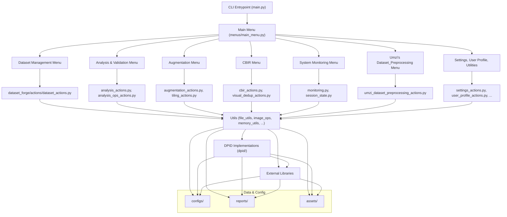

[← Main README](../README.md) | [Features](features.md) | [Usage](usage.md) | [Advanced](advanced.md) | [Architecture](architecture.md) | [Troubleshooting](troubleshooting.md) | [Style Guide](style_guide.md) | [Changelog](changelog.md) | [ToC](toc.md)


# Dataset Forge Full Documentation

---

# Table of Contents

- [Features (tl;dr)](features.md)
- [Features (main menus)](features.md#features-main-menus)
  - [⚙️ Core & Configuration](features.md#-core--configuration)
  - [📂 Dataset Management](features.md#-dataset-management)
  - [🔍 Analysis & Validation](features.md#-analysis--validation)
  - [✨ Image Processing & Augmentation](features.md#-image-processing--augmentation)
  - [🚀 Training & Inference](features.md#-training--inference)
  - [🛠️ Utilities](features.md#-utilities)
  - [⚙️ System & Settings](features.md#-system--settings)
  - [🔗 Links](features.md#-links)
  - [🩺 System Monitoring & Health](features.md#-system-monitoring--health)
  - [⚡ Caching System (NEW July 2025)](features.md#-caching-system-new-july-2025)
- [Features (expanded/misc)](features.md#features-expandedmisc)
  - [Testing & Validation](features.md#testing--validation)
  - [🧑‍💻 Developer Tools: Static Analysis & Code Quality](features.md#-developer-tools-static-analysis--code-quality)
  - [July 2025 Improvements](features.md#july-2025-improvements)
  - [Umzi's Dataset_Preprocessing Integration](features.md#umzis-datasetpreprocessing-integration)
- [Special Installation Instructions](special_installation.md)
  - [1. PyTorch with CUDA (GPU Acceleration)](special_installation.md#1-pytorch-with-cuda-gpu-acceleration)
  - [2. VapourSynth & [getnative](https://github.com/Infiziert90/getnative) (for getnative functionality/native resolution detection)](special_installation.md#2-vapoursynth--getnativehttpsgithubcominfiziert90getnative-for-getnative-functionalitynative-resolution-detection)
  - [3. python-magic (for `Enhanced Directory Tree`)](special_installation.md#3-python-magic-for-enhanced-directory-tree)
  - [Installing and Using [resdet](https://github.com/0x09/resdet) for Native Resolution Detection](special_installation.md#installing-and-using-resdethttpsgithubcom0x09resdet-for-native-resolution-detection)
    - [Method 1: Windows (WSL - Recommended for CLI Integration)](special_installation.md#method-1-windows-wsl---recommended-for-cli-integration)
    - [Method 2: Windows (MSYS2 MINGW64 Shell)](special_installation.md#method-2-windows-msys2-mingw64-shell)
    - [Method 3: Windows (Windows pre-build binary)](special_installation.md#method-3-windows-windows-pre-build-binary)
    - [Usage in Dataset Forge](special_installation.md#usage-in-dataset-forge)
- [Usage Guide](usage.md)
  - [🚀 Quick Start](usage.md#-quick-start)
  - [👣 Main Workflows](usage.md#-main-workflows)
    - [Dataset Management](usage.md#dataset-management)
    - [Analysis & Validation](usage.md#analysis--validation)
    - [Image Processing & Augmentation](usage.md#image-processing--augmentation)
    - [Monitoring & Analytics](usage.md#monitoring--analytics)
  - [July 2025 Update](usage.md#july-2025-update)
  - [Running the Test Suite](usage.md#running-the-test-suite)
  - [🧑‍💻 Static Analysis & Code Quality](usage.md#-static-analysis--code-quality)
  - [Using Umzi's Dataset_Preprocessing](usage.md#using-umzis-datasetpreprocessing)
    - [🧹 Sanitize Images (NEW July 2025)](usage.md#-sanitize-images-new-july-2025)
- [Advanced Features & Configuration](advanced.md)
  - [Advanced Configuration](advanced.md#advanced-configuration)
  - [Advanced Monitoring & Analytics](advanced.md#advanced-monitoring--analytics)
  - [Robust Menu Loop Pattern (July 2025)](advanced.md#robust-menu-loop-pattern-july-2025)
  - [Advanced Testing Patterns](advanced.md#advanced-testing-patterns)
  - [🧑‍💻 Advanced Developer Tools: Static Analysis](advanced.md#-advanced-developer-tools-static-analysis)
  - [⚡ Caching System: Technical Details (NEW July 2025)](advanced.md#-caching-system-technical-details-new-july-2025)
  - [Advanced: Modular Integration of Umzi's Dataset_Preprocessing](advanced.md#advanced-modular-integration-of-umzis-datasetpreprocessing)
  - [Interactive Workflow Prompt Handling (July 2025)](advanced.md#interactive-workflow-prompt-handling-july-2025)
- [Project Architecture](architecture.md)
  - [Directory Structure](architecture.md#directory-structure)
  - [Mermaid Architecture Diagram (Detailed)](architecture.md#mermaid-architecture-diagram-detailed)
  - [Monitoring & Analytics](architecture.md#monitoring--analytics)
  - [Test Suite Integration](architecture.md#test-suite-integration)
    - [Umzi's Dataset_Preprocessing Integration](architecture.md#umzis-datasetpreprocessing-integration)
- [Troubleshooting](troubleshooting.md)
  - [Dependancy & Library Issues](troubleshooting.md#dependancy--library-issues)
  - [Menu Timing & Profiling Issues](troubleshooting.md#menu-timing--profiling-issues)
  - [Menu Loop Issues](troubleshooting.md#menu-loop-issues)
  - [Other Issues](troubleshooting.md#other-issues)
  - [Test Failures](troubleshooting.md#test-failures)
  - [Static Analysis Tool Issues](troubleshooting.md#static-analysis-tool-issues)
- [Dataset Forge Style Guide](style_guide.md)
  - [General Principles](style_guide.md#general-principles)
  - [Project Architecture](style_guide.md#project-architecture)
  - [Coding Standards](style_guide.md#coding-standards)
  - [Import Organization](style_guide.md#import-organization)
  - [Memory Management](style_guide.md#memory-management)
  - [Parallel Processing](style_guide.md#parallel-processing)
  - [Progress Tracking & User Feedback](style_guide.md#progress-tracking--user-feedback)
  - [Color Scheme & UI](style_guide.md#color-scheme--ui)
  - [Menu System](style_guide.md#menu-system)
  - [Input Handling](style_guide.md#input-handling)
  - [File Operations](style_guide.md#file-operations)
  - [Image Processing](style_guide.md#image-processing)
  - [Logging & Error Handling](style_guide.md#logging--error-handling)
  - [Session State & Configuration](style_guide.md#session-state--configuration)
  - [DPID (Degradation) Patterns](style_guide.md#dpid-degradation-patterns)
  - [Audio & User Feedback](style_guide.md#audio--user-feedback)
  - [Testing & Validation](style_guide.md#testing--validation)
  - [Performance Optimization](style_guide.md#performance-optimization)
  - [Monitoring, Analytics & Error Tracking](style_guide.md#monitoring-analytics--error-tracking)
  - [Error Handling & Recovery](style_guide.md#error-handling--recovery)
  - [Documentation Requirements](style_guide.md#documentation-requirements)
  - [Security Considerations](style_guide.md#security-considerations)
  - [Dependency Management](style_guide.md#dependency-management)
  - [Git Ignore Patterns](style_guide.md#git-ignore-patterns)
  - [Final Reminders](style_guide.md#final-reminders)
  - [DPID Modularity (NEW)](style_guide.md#dpid-modularity-new)
  - [Robust Menu Loop Pattern (UPDATED)](style_guide.md#robust-menu-loop-pattern-updated)
  - [Workflow Prompt Handling (NEW)](style_guide.md#workflow-prompt-handling-new)
  - [Centralized Printing & Style (UPDATED)](style_guide.md#centralized-printing--style-updated)
  - [Exception Handling & Debug Prints (NEW)](style_guide.md#exception-handling--debug-prints-new)
  - [Testing Requirements](style_guide.md#testing-requirements)
  - [Static Analysis & Code Quality (NEW)](style_guide.md#static-analysis--code-quality-new)
  - [Interactive Workflow Prompt Pattern (July 2025)](style_guide.md#interactive-workflow-prompt-pattern-july-2025)
- [Changelog](changelog.md)
  - [[Unreleased]](changelog.md#unreleased)
  - [[July 2025]](changelog.md#july-2025)
- [Contributing](contributing.md)
  - [How to Contribute](contributing.md#how-to-contribute)
  - [Development Guidelines](contributing.md#development-guidelines)
  - [Doc Maintenance](contributing.md#doc-maintenance)
  - [Static Analysis & Code Quality (NEW)](contributing.md#static-analysis--code-quality-new)
- [Frequently Asked Questions (FAQ)](faq.md)
    - [What is Dataset Forge?](faq.md#what-is-dataset-forge)
    - [What platforms are supported?](faq.md#what-platforms-are-supported)
    - [What Python version is required?](faq.md#what-python-version-is-required)
    - [How do I install Dataset Forge and its dependencies?](faq.md#how-do-i-install-dataset-forge-and-its-dependencies)
    - [Why do I need to install VapourSynth before getnative?](faq.md#why-do-i-need-to-install-vapoursynth-before-getnative)
    - [How do I fix python-magic errors on Windows?](faq.md#how-do-i-fix-python-magic-errors-on-windows)
    - [How do I run the test suite?](faq.md#how-do-i-run-the-test-suite)
    - [How do I use the monitoring and analytics features?](faq.md#how-do-i-use-the-monitoring-and-analytics-features)
    - [What should I do if I get CUDA or GPU errors?](faq.md#what-should-i-do-if-i-get-cuda-or-gpu-errors)
    - [What if a menu or feature is missing or crashes?](faq.md#what-if-a-menu-or-feature-is-missing-or-crashes)
    - [How do I get help or report a bug?](faq.md#how-do-i-get-help-or-report-a-bug)
- [License](license.md)


---


# Features


# Features (tl;dr)

# Features (main menus)

## ⚙️ Core & Configuration

- **🔧 External tool integration**: [WTP Dataset Destroyer](https://github.com/umzi2/wtp_dataset_destroyer), [traiNNer-redux](https://github.com/the-database/traiNNer-redux), [getnative](https://github.com/Infiziert90/getnative), [resdet](https://github.com/0x09/resdet), [Oxipng](https://github.com/oxipng/oxipng), [Steghide](https://steghide.sourceforge.net/), [zsteg](https://github.com/zed-0xff/zsteg), [umzi's Dataset_Preprocessing](https://github.com/umzi2/Dataset_Preprocessing), []()
- **📦 Model management**: List, select, download and run upscaling with trained models (also [OpenModelDB](https://openmodeldb.info/) integration)
- **✅ Validation tools**: Validate HQ/LQ pairs and validation datasets from config
- **👤 User profiles**: Save favorites, presets, links and quick access paths
- **⚙️ Multi-format config support**: JSON, YAML, HCL

## 📂 Dataset Management

- **🎯 Dataset Creation**: Multiscale dataset generation (DPID), video frame extraction, image tiling (using IC9600)
- **🔗 Dataset Operations**: Combine, split, extract random pairs, shuffle datasets, remove/move
- **🔍 HQ/LQ Pair Management**: Create/Correct Manual Pairings, fuzzy matching, scale correction, shuffle, extract random pairs
- **🧹 Clean & Organize**: De-dupe (Visual deduplication, hash-based deduplication, ImageDedup advanced duplicate detection, CBIR (Semantic Duplicate Detection)), batch renaming
- **🔄 Orientation Organization**: Sort by landscape/portrait/square
- **📏 Size Filtering**: Remove small/invalid image pairs

## 🔍 Analysis & Validation

- **🔍 Comprehensive Validation**: Progressive dataset validation suite
- **📊 Rich Reporting**: HTML/Markdown reports with plots and sample images
- **⭐ Quality Scoring**: Automated dataset quality assessment (NIQE, etc.)
- **🔧 Issue Detection**: Corruption detection, misalignment detection, outlier detection. alpha channel detection
- **🧪 Property Analysis**: Consistency checks, aspect ratio testing, dimension reporting
- **⭐ BHI Filtering**: Blockiness, HyperIQA, IC9600 quality assessment
- **🔍 Scale Detection**: Find and test HQ/LQ scale relationships
- **🎯 Find Native Resolution**: Find image native resolution using [getnative](https://github.com/Infiziert90/getnative) or [resdet](https://github.com/0x09/resdet)

## ✨ Image Processing & Augmentation

- **🔄 Basic Transformations**: Downsample Images, crop, flip, rotate, shuffle, remove alpha channel
- **🎨 Colour, Tone & Levels Adjustments**: Brightness, contrast, hue, saturation, HDR>SDR, grayscale
- **🧪 Degradations**: Blur, noise, pixelate, dithering, sharpen, banding & many more
- **🚀 Augmentation**: List, create, edit or delete _recipes_ or run advanced augmentation pipelines (using recipes)
- **📋 Metadata**: Scrub EXIF Metadata, Convert ICC Profile to sRGB
- **✏️ Find & extract sketches/drawings/line art**: Find & extract sketches/drawings/line art using pre-trained model
- **🗳️ Batch Processing**: Efficient batch operations for large datasets

## 🚀 Training & Inference

- **🛠️ Run wtp_dataset_destroyer**: [WTP Dataset Destroyer](https://github.com/umzi2/wtp_dataset_destroyer) integration, create HQ/LQ pairs with custom degradations
- **🚀 Run traiNNer-redux**: [traiNNer-redux](https://github.com/the-database/traiNNer-redux) integration, train your own SISR models
- **🧠 OpenModelDB Model Browser**: Robust integration with [OpenModelDB](https://openmodeldb.info/)
- **⚙️ Config files**: Add, load, view & edit configs

## 🛠️ Utilities

- **🖼️ Create Comparisons**: Create striking image / gif comparisons
- **📦 Compression**: Compress images or directories
- **🧹 Sanitize Images**: Comprehensive, interactive image file sanitization. Each major step (corruption fix, copy, batch rename, ICC to sRGB, PNG conversion, remove alpha, metadata removal, steganography) is prompted interactively with emoji and Mocha color. Steganography checks prompt for steghide and zsteg individually, and the summary reports both. A visually distinct summary box is always shown at the end, including zsteg results file path if produced. All output uses the Catppuccin Mocha color scheme and emoji-rich prompts. Menu header is reprinted after returning to the workflow menu.
- **🌳 Enhanced Directory Tree**: Directory tree visualization using emojis
- **🧹 Filter non-Images**: Filter all non image type files

## ⚙️ System & Settings

- **📁 Set HQ/LQ Folder**: set HQ/LQ image pair folders to use throughout Dataset Forge
- **👤 User Profile Management**: Create and manage custom profiles for Dataset Forge
- **🧠 Memory Management**: View, clear & optimize memory management
- **⚙️ Settings**: View & configure project settings

## 🔗 Links

- **🌐 Community Links**: Browse/List important and usefull links curated by me and the community
- **🔗 Personal Links**: Browse/List & add your own links

## 🩺 System Monitoring & Health

- **📊 View Live Resource Usage**: Real-time CPU, GPU (NVIDIA), RAM, and disk usage for all processes/threads
- **📈 View Performance Analytics**: Decorator-based analytics for all major operations, with live and persistent session summaries
- **🛑 View Error Summary**: Logs errors to file and CLI, with summary granularity and critical error notifications (sound/visual)
- **🩺 Run Health Checks**: Automated checks for RAM, disk, CUDA, Python version, and permissions, with CLI output and recommendations
- **🧵 Manage Background Tasks**: Registry of all subprocesses/threads, with CLI controls for pause/resume/kill and session-only persistence
- **⏱️ View Menu Load Times**: View the menu load times

## ⚡ Caching System (NEW July 2025)

Dataset Forge now features a robust caching system to accelerate repeated operations:

- **In-Memory Caching:** Frequently-used, lightweight results (e.g., image property analysis, directory scans) are cached in RAM for the current session.
- **Disk Caching:** Expensive, large results (e.g., deep feature embeddings for CBIR) are cached persistently in `store/cache/` for reuse across sessions.
- **Automatic Integration:** Caching is transparently applied to key functions:
  - CBIR feature extraction (CLIP, ResNet, VGG embeddings)
  - Directory image scans
  - Image property analysis
- **Cache Management:**
  - A new menu option in System Monitoring allows you to clear all caches (disk and in-memory) with one click.
  - Disk cache is stored in `store/cache/` (auto-ignored by git).

**Benefits:**

- Dramatically faster repeated analysis, deduplication, and reporting on large datasets.
- Reduces redundant computation and I/O.

See `docs/advanced.md` for technical details and customization.

# Features (expanded/misc)

- **Audio error feedback**: All user-facing errors trigger an error sound (error.mp3) for immediate notification.
- **Persistent Logging**: All analytics and errors are logged to ./logs/ for later review
- **Memory & CUDA Cleanup**: Automatic cleanup on exit/errors for all tracked processes/threads

## Testing & Validation

- Dataset Forge includes a comprehensive, cross-platform test suite using pytest.
- All core business logic, utilities, and integration flows are covered by unit and integration tests.
- Tests cover DPID, CBIR, deduplication, reporting, audio, memory, parallel, and session state features.
- Tests are robust on Windows and Linux, and use fixtures and monkeypatching for reliability.
- All new features and bugfixes must include appropriate tests.

---

## 🧑‍💻 Developer Tools: Static Analysis & Code Quality

> **Documentation Convention:** When adding new features or modules, update the architecture diagrams (Mermaid) in README.md and docs/architecture.md as needed. Use standard badges in the README and document their meaning in the docs.

- **Static Analysis Tool:** Located at `tools/find_code_issues/find_code_issues.py`.
- **Checks:**
  - Unused (dead) code, functions, classes, and methods
  - Untested code (missing test coverage)
  - Functions/classes defined but never called
  - Test/code mapping (tests without code, code without tests)
  - Missing docstrings in public functions/classes/methods
  - Unused imports/variables, and more
- **How to run:**
  ```sh
  python tools/find_code_issues/find_code_issues.py [options]
  # Run with no options to perform all checks
  ```
- **Output:**
  - Overwrites files in `tools/find_code_issues/` on each run:
    - `find_code_issues.log` (raw output)
    - `find_code_issues_report.txt` (actionable summary)
    - `find_code_issues_view.txt` (detailed results)
- **Requirements:**
  - `pip install vulture pytest pytest-cov coverage pyan3 pyflakes`

## July 2025 Improvements

- All menus now use a robust, error-resistant loop pattern for reliability.
- All DPID logic is modular and uses the new `dataset_forge.dpid.*` structure.
- All user-facing workflows provide clear, styled feedback and prompts.
- CLI output is visually consistent and uses the Catppuccin Mocha color scheme throughout.
- Exception handling and debug prints ensure errors are caught and shown to the user.

For advanced implementation details, code patterns, and developer best practices, see [advanced.md](advanced.md) and [style_guide.md](style_guide.md).

## Umzi's Dataset_Preprocessing Integration

Dataset Forge now includes a full integration of Umzi's Dataset_Preprocessing workflows, accessible from the main menu as "🧩 Umzi's Dataset_Preprocessing". This feature mirrors the original consolidated script and provides the following capabilities:

- **Best Tile Extraction**: Extracts the most informative tile(s) from each image in a folder, with support for Laplacian and IC9600 complexity, batch processing, and advanced filtering.
- **Video Frame Extraction**: Extracts frames from videos based on deep embedding distance, supporting multiple models and distance metrics.
- **Image Deduplication**: Computes and saves embeddings for all images in a folder, and finds clusters of duplicate/similar images using configurable thresholds and metrics.
- **IQA Filtering**: Filters or sorts images by Image Quality Assessment (IQA) score using multiple algorithms (HyperIQA, AnIQA, TopIQ, Blockiness, IC9600).
- **Embedding Extraction**: Extracts and prints the embedding for a single image, useful for debugging or manual analysis.

All workflows are fully interactive, use Dataset Forge's centralized input, printing, memory, and progress management, and are covered by robust unit and CLI integration tests. This integration is modular, testable, and follows all project coding and UI standards.

---


# Special Installation


# Special Installation Instructions

This guide covers special installation requirements for certain dependencies in Dataset Forge. These steps are **critical** for correct operation, especially on Windows. Please read carefully and follow the order for each component.

---

## 1. PyTorch with CUDA (GPU Acceleration)

**You must install the correct CUDA-enabled version of torch/torchvision/torchaudio _before_ installing other requirements.**

**Quick Steps:**

```bat
venv312\Scripts\activate
pip install torch torchvision torchaudio --index-url https://download.pytorch.org/whl/cu121
```

- Replace `cu121` with your CUDA version if needed. See [PyTorch Get Started](https://pytorch.org/get-started/locally/) for details.
- If you skip this, pip will install the CPU-only version by default.
- Only after this, run `pip install .` or `pip install -r requirements.txt`.

**Troubleshooting:**

- Mismatched CUDA/cuDNN versions will cause import errors or no GPU support.
- See [requirements.txt](../requirements.txt) and [PyTorch docs](https://pytorch.org/get-started/locally/).

---

## 2. VapourSynth & [getnative](https://github.com/Infiziert90/getnative) (for getnative functionality/native resolution detection)

**VapourSynth must be installed _before_ [getnative](https://github.com/Infiziert90/getnative).**

**Steps (Windows):**

1. Download and install [VapourSynth](http://www.vapoursynth.com/) (includes imwri plugin).
2. Open a terminal and run:

```bat
py vsrepo.py install descale
py vsrepo.py install ffms2
py vsrepo.py install lsmas
```

3. Activate your virtual environment:

```bat
venv312\Scripts\activate
```

4. Install getnative:

```bat
pip install getnative
```

- See [Getnative Recommended Windows Installation](https://github.com/Infiziert90/getnative?tab=readme-ov-file#recommended-windows-installation) for more details.

**Troubleshooting:**

- Install VapourSynth _before_ getnative or any requirements that depend on it.
- If getnative fails to import, check that VapourSynth is installed and on your PATH.
- Also make sure directory containing `vsrepo.py` and the plugin's folder containing the `.dll`s are also on your PATH.

---

## 3. python-magic (for `Enhanced Directory Tree`)

**Windows users:** You must install both the Python packages and the required DLLs.

**Steps:**

1. Install the packages:

```bat
venv312\Scripts\activate
pip install python-magic python-magic-bin libmagic
```

2. Copy the following files from `assets/libmagicwin64-master.zip` to `C:/Windows/System32/`:

   - `libgnurx-0.dll`
   - `magic.mgc`
   - `magic1.dll`

   (These are prebuilt for 64-bit Windows. See source: [libmagicwin64](https://github.com/pidydx/libmagicwin64) for details.)

3. When using python-magic, specify the magic file path if needed:

```python
import magic
file_magic = magic.Magic(magic_file="C:/Windows/System32/magic.mgc")
```

**Troubleshooting:**

- If you get import errors, ensure the DLLs are in `System32` and you are using the correct magic file path.
- See [python-magic docs](https://github.com/ahupp/python-magic) and [libmagicwin64](https://github.com/pidydx/libmagicwin64).

---

## Installing and Using [resdet](https://github.com/0x09/resdet) for Native Resolution Detection

### Method 1: Windows (WSL - Recommended for CLI Integration)

1. Clone the repository:
   ```sh
   git clone https://github.com/0x09/resdet.git
   cd resdet
   ```
2. Build resdet:
   ```sh
   cd path/to/resdet
   make clean
   ./configure
   make
   ```
3. Install resdet to your WSL PATH:
   ```sh
   sudo cp resdet /usr/local/bin/
   sudo chmod +x /usr/local/bin/resdet
   # Or, to use make install:
   sudo make install
   ```
4. **Note:** The Dataset Forge CLI will automatically use WSL to run resdet on Windows. Ensure resdet is available in your WSL environment's PATH.

### Method 2: Windows (MSYS2 MINGW64 Shell)

1. Clone the repository:
   ```sh
   git clone https://github.com/0x09/resdet.git
   ```
2. Open **MSYS2 MINGW64 Shell**.
3. Install dependencies:
   ```sh
   pacman -S base-devel mingw-w64-x86_64-toolchain mingw-w64-x86_64-libpng mingw-w64-x86_64-libjpeg-turbo mingw-w64-x86_64-fftw mingw-w64-x86_64-pkg-config autoconf automake libtool
   ```
4. Set PKG_CONFIG_PATH:
   ```sh
   export PKG_CONFIG_PATH=/mingw64/lib/pkgconfig
   ```
5. Build resdet:
   ```sh
   cd path/to/resdet
   make clean
   ./configure --prefix=/mingw64
   make
   ```
6. Add `resdet.exe` to a folder in your PATH, or add its folder to your PATH.

### Method 3: Windows (Windows pre-build binary)

1. Extract the following files from `assets/resdet_windows.zip`:

   - `resdet.exe`

   (This is a prebuilt for 64-bit Windows that I compiled.)

2. Add `resdet.exe` to a folder in your PATH, or add its folder to your PATH.

### Usage in Dataset Forge

- The CLI will detect your platform and use the appropriate resdet binary.
- On Windows, if WSL is available and resdet is installed in WSL, it will be used automatically.
- If resdet is not found, you will receive a clear error message with installation instructions.

---

For more details, see the [main README Quick Start](../README.md#-quick-start) and [troubleshooting guide](troubleshooting.md).

---


# Usage


# Usage Guide

This guide covers the main user workflows for Dataset Forge. For advanced configuration and developer patterns, see [advanced.md](advanced.md).

---

## 🚀 Quick Start

1. **Clone the repository:**

   ```bash
   git clone https://github.com/Courage-1984/Dataset-Forge.git
   cd Dataset-Forge
   ```

2. **Set up the environment:**

   ```bash
   py -3.12 -m venv venv312
   venv312\Scripts\activate
   # Install the correct CUDA-enabled torch/torchvision/torchaudio first!
   pip install torch torchvision torchaudio --index-url https://download.pytorch.org/whl/cu121
   pip install .
   ```

   > **Note:** If you use a different CUDA version, see https://pytorch.org/get-started/locally/ for the right install command.

3. **Run the application:**
   ```bash
   dataset-forge
   # or
   py main.py
   # or
   ./run.bat
   ```

## 👣 Main Workflows

### Dataset Management

- Create, combine, split, and shuffle datasets using the Dataset Management menu.
- Use Clean & Organize to deduplicate, batch rename, and filter images.

### Analysis & Validation

- Run validation and generate reports from the Analysis & Validation menu.
- Use quality scoring and outlier detection to assess dataset quality.

### Image Processing & Augmentation

- Apply augmentations, tiling, and batch processing from the Augmentation and Image Processing menus.

### Monitoring & Analytics

- Access live resource usage, error tracking, and analytics from the System Monitoring menu.
- View menu load times and health checks.

---

## July 2025 Update

- Menus now use a robust loop pattern and provide clear error/debug feedback.
- All user-facing workflows end with a styled prompt to return to the menu.
- DPID workflows are modular and use the new import structure.
- CLI output and prompts are visually consistent and styled.

For troubleshooting and advanced usage, see [troubleshooting.md](troubleshooting.md) and [advanced.md](advanced.md).

## Running the Test Suite

To run all tests (recommended after any major change):

```
venv312\Scripts\activate
venv312\Scripts\python -m pytest --maxfail=5 --disable-warnings -v tests/
```

The test suite covers all major features and runs quickly. Tests use fixtures and monkeypatching for reliability.

---

## 🧑‍💻 Static Analysis & Code Quality

Dataset Forge includes a static analysis tool for maintainers and contributors:

- **Location:** `tools/find_code_issues/find_code_issues.py`
- **Checks:**
  - Unused (dead) code, functions, classes, and methods
  - Untested code (missing test coverage)
  - Functions/classes defined but never called
  - Test/code mapping (tests without code, code without tests)
  - Missing docstrings in public functions/classes/methods
  - Unused imports/variables, and more
- **How to run:**
  ```sh
  python tools/find_code_issues/find_code_issues.py [options]
  # Run with no options to perform all checks
  ```
- **Output:**
  - Overwrites files in `tools/find_code_issues/` on each run:
    - `find_code_issues.log` (raw output)
    - `find_code_issues_report.txt` (actionable summary)
    - `find_code_issues_view.txt` (detailed results)
- **Requirements:**
  - `pip install vulture pytest pytest-cov coverage pyan3 pyflakes`

Review the actionable report and detailed results before submitting code or documentation changes.

## Using Umzi's Dataset_Preprocessing

You can access Umzi's Dataset_Preprocessing from the main menu (option 9: 🧩 Umzi's Dataset_Preprocessing). This menu provides the following workflows:

- **Best Tile Extraction**: Extracts the most informative tile(s) from images in a folder. Prompts for input/output folders, tile size, complexity function, and other options.
- **Video Frame Extraction**: Extracts frames from a video based on embedding distance. Prompts for video path, output folder, model, and threshold.
- **Image Deduplication**: Create embeddings for all images in a folder, or find duplicate clusters from embeddings. Prompts for folders, model, and thresholds.
- **IQA Filtering**: Filter or sort images by IQA score using various algorithms. Prompts for input folder, algorithm, and thresholds.
- **Embedding Extraction**: Extract and print the embedding for a single image.

All options are fully interactive, use Dataset Forge's input and printing utilities, and are covered by robust unit and CLI tests. See the main menu for access.

### 🧹 Sanitize Images (NEW July 2025)

- The workflow now prompts you interactively for each major step (corruption fix, copy, batch rename, ICC to sRGB, PNG, remove alpha, metadata, steganography), with emoji and Mocha-styled prompts.
- Steganography checks prompt for steghide and zsteg individually, and only the selected tools are run.
- At the end, a visually distinct summary box shows all steps (run/skipped), both steganography sub-choices, and the zsteg results file path if produced.
- The menu header is reprinted after returning to the workflow menu.
- All output is Mocha-styled and visually consistent.

> **Note:** Architecture diagrams in this documentation use Mermaid code blocks. No Python package is required; diagrams are rendered by supported Markdown viewers (e.g., GitHub, VSCode with Mermaid extension).
>
> **Badges:** Standard badges (build, license, Python version, etc.) are included in the README. See the README for their meaning.

---


# Advanced


> **Note:** Architecture diagrams in this documentation use Mermaid code blocks. No Python package is required; diagrams are rendered by supported Markdown viewers (e.g., GitHub, VSCode with Mermaid extension).
>
> **Badges:** Standard badges (build, license, Python version, etc.) are included in the README. See the README for their meaning.

# Advanced Features & Configuration

This document covers advanced usage, configuration, and developer patterns for Dataset Forge. For user-facing features, see [features.md](features.md).

---

## Advanced Configuration

- **Custom config files**: Use JSON, YAML, or HCL for advanced workflows.
- **Integration with external tools**: [WTP Dataset Destroyer](https://github.com/umzi2/wtp_dataset_destroyer), [traiNNer-redux](https://github.com/the-database/traiNNer-redux), [getnative](https://github.com/Infiziert90/getnative), [resdet](https://github.com/0x09/resdet)
- **Batch processing and memory optimization**: Tune batch sizes and memory settings in the config files for large datasets.
- **OpenModelDB integration**: Advanced model management and upscaling workflows.

## Advanced Monitoring & Analytics

- **Add new analytics hooks**: Decorate new actions with `@monitor_performance` and `@track_errors`.
- **Background task management**: Register new subprocesses/threads for monitoring.
- **Persistent logging**: Ensure all analytics and errors are logged to ./logs/.

---

For user workflows and feature summaries, see [features.md](features.md). For code style and requirements, see [style_guide.md](style_guide.md).

## Robust Menu Loop Pattern (July 2025)

All Dataset Forge menus now use a robust menu loop pattern to ensure reliability and maintainability. This pattern ensures that:

- The user's menu selection (key) is always used to look up the corresponding action in the options dictionary.
- Only callable actions are executed; if the action is not callable, a clear error is printed.
- Debug prints for both the selected key and resolved action are included for easier debugging.

**Pattern Example:**

```python
while True:
    key = show_menu("Menu Title", options, ...)
    print(f"DEBUG: key={key!r}, type={type(key)}")
    if key is None or key == "0":
        break
    action = options.get(key, (None, None))[1]
    print(f"DEBUG: action={action!r}, type={type(action)}")
    if callable(action):
        action()
    else:
        print_error(f"Selected action is not callable: {action!r} (type={type(action)})")
```

**Why this matters:**

- Prevents menu loops from breaking if the user input is not mapped to a callable.
- Ensures all menu actions are robust to user error and code changes.
- Makes debugging easier by providing clear output for both valid and invalid selections.

**Enforcement:**

- As of July 2025, all menus in Dataset Forge have been updated to use this pattern.
- If you add a new menu, you must use this pattern for consistency and reliability.

## Advanced Testing Patterns

- The test suite uses pytest fixtures and monkeypatching to isolate tests and mock external dependencies (audio, file I/O, heavy computation).
- To add tests for new features, create a new test file in tests/test_utils/ or tests/ as appropriate.
- All new features and bugfixes must include appropriate tests.

---

## 🧑‍💻 Advanced Developer Tools: Static Analysis

Dataset Forge includes a comprehensive static analysis tool for code quality and maintainability:

- **Script:** `tools/find_code_issues/find_code_issues.py`
- **Tools used:** vulture, pytest-cov, coverage, pyan3, pyflakes, ast
- **Checks performed:**
  - Unused (dead) code, functions, classes, and methods
  - Untested code (missing test coverage)
  - Functions/classes defined but never called
  - Test/code mapping (tests without code, code without tests)
  - Missing docstrings in public functions/classes/methods
  - Unused imports/variables, and more
- **How to run:**
  ```sh
  python tools/find_code_issues/find_code_issues.py [options]
  # Run with no options to perform all checks
  ```
- **Output:**
  - Overwrites files in `tools/find_code_issues/` on each run:
    - `find_code_issues.log` (raw output)
    - `find_code_issues_report.txt` (actionable summary)
    - `find_code_issues_view.txt` (detailed results)
- **Extending:**
  - The script is modular and can be extended to add new static analysis checks or output formats. See the script for extension points.
- **Requirements:**
  - `pip install vulture pytest pytest-cov coverage pyan3 pyflakes`

Review the actionable report and detailed results before submitting code or documentation changes.

## ⚡ Caching System: Technical Details (NEW July 2025)

Dataset Forge uses a hybrid caching system for performance:

- **In-Memory Caching:**

  - Uses `functools.lru_cache` via the `@in_memory_cache` decorator (see `utils/cache_utils.py`).
  - Applied to lightweight, frequently-called functions (e.g., image property analysis, directory scans).
  - Cache is per-session and cleared on process exit or via function-specific calls.

- **Disk Caching:**

  - Uses `joblib.Memory` via the `@disk_cache` decorator (see `utils/cache_utils.py`).
  - Applied to expensive, large-result functions (e.g., CBIR feature extraction).
  - Cache is persistent across sessions and stored in `store/cache/`.
  - Disk cache can be cleared from the System Monitoring menu or by deleting the folder.

- **Cache Management:**

  - Use the System Monitoring menu to clear all caches.
  - Disk cache is auto-ignored by git (see `.gitignore`).

- **How to Use in Your Code:**

  - Import decorators from `dataset_forge.utils.cache_utils`:
    ```python
    from dataset_forge.utils.cache_utils import in_memory_cache, disk_cache
    ```
  - Decorate your function:

    ```python
    @in_memory_cache(maxsize=128)
    def my_func(...):
        ...

    @disk_cache
    def expensive_func(...):
        ...
    ```

  - Use `clear_disk_cache()` and `clear_in_memory_cache(func)` to clear caches programmatically.

- **Best Practices:**
  - Use in-memory cache for small, fast, frequently-repeated operations.
  - Use disk cache for large, expensive, or cross-session results.
  - Always document cache usage in your function docstrings.

See `docs/features.md` for user-facing info and `README_full.md` for a merged overview.

## Advanced: Modular Integration of Umzi's Dataset_Preprocessing

The original Dataset_Preprocessing_consolidated_script.py has been fully ported into Dataset Forge as a modular, maintainable set of actions and menu files:

- All business logic is in `dataset_forge/actions/umzi_dataset_preprocessing_actions.py`, following project conventions for memory management, progress tracking, and error handling.
- The menu interface is in `dataset_forge/menus/umzi_dataset_preprocessing_menu.py`, using lazy imports and the robust menu loop pattern.
- All workflows are testable, with comprehensive unit and CLI integration tests.
- The codebase uses Google-style docstrings, type hints, and follows the modular architecture described in `docs/architecture.md`.
- This integration demonstrates how to port monolithic scripts into the Dataset Forge ecosystem for maintainability and testability.

## Interactive Workflow Prompt Handling (July 2025)

- The sanitize images workflow now handles all step prompts interactively within the workflow function, not in the menu.
- Steganography checks prompt for steghide and zsteg individually, and the summary reports both sub-choices.
- The summary box is always shown at the end, listing all steps (run/skipped) and the zsteg results file path if produced.
- The menu header is reprinted after returning to the workflow menu.
- All output uses centralized, Mocha-styled printing utilities and emoji-rich prompts.
- No duplicate prompts or debug prints remain.
- This pattern is now the standard for all interactive workflows in Dataset Forge.

---


# Architecture


# Project Architecture

Dataset Forge is built with a modular, extensible architecture for maintainability and performance.

## Directory Structure

- **dataset_forge/menus/**: UI layer (CLI menus, user interaction)
- **dataset_forge/actions/**: Business logic (core dataset/image operations)
- **dataset_forge/utils/**: Reusable utilities (file ops, memory, parallelism, color, monitoring, etc.)
- **dataset_forge/dpid/**: Multiple DPID (degradation) implementations
- **configs/**: Example and user configuration files
- **reports/**: Report templates for HTML/Markdown output
- **assets/**: Any asset files required
- **docs/**: Project documentation
- **tests/**: Unit & integration tests
- **tools/**: Project tools and developer utilities (e.g., static analysis, documentation merging)
  - **find_code_issues/find_code_issues.py**: Static analysis and code quality tool for maintainers. Checks for dead code, untested code, missing docstrings, test/code mapping, and more. Outputs actionable reports to the same directory.

## Mermaid Architecture Diagram (Detailed)



## Monitoring & Analytics

- Centralized resource monitoring, analytics, error tracking, health checks, and background task registry (see utils/monitoring.py).
- CLI menu for live resource usage, analytics, error summaries, health checks, and background task management (see menus/system_monitoring_menu.py).
- Persistent logging and notifications for all major operations.

## Test Suite Integration

- Comprehensive automated test suite using pytest.
- Covers CLI, menu timing, error feedback, memory, parallelism, and file/image utilities.

### Umzi's Dataset_Preprocessing Integration

The Umzi Dataset_Preprocessing workflows are now fully modularized within Dataset Forge:

- Business logic is in `actions/umzi_dataset_preprocessing_actions.py`.
- UI/menu is in `menus/umzi_dataset_preprocessing_menu.py`.
- Uses lazy imports, robust menu loop, and centralized utilities.
- See `docs/advanced.md` for a detailed discussion of the porting and modularization process.

---

For coding standards and best practices, see [style_guide.md](style_guide.md).

---


# Troubleshooting


# Troubleshooting

This guide provides solutions to common issues in Dataset Forge. For advanced usage and developer troubleshooting, see [advanced.md](advanced.md).

---

## Dependancy & Library Issues

**Problem:** Import errors or menu options not working.

- Please see: [Special Installation Instructions](troubleshooting.md)

## Menu Timing & Profiling Issues

**Problem:** Timing prints do not appear after loading a menu or submenu.

- Ensure you are running the latest version of Dataset Forge.
- Check that the menu or submenu uses the `time_and_record_menu_load` utility.
- "Back" and "Exit" options do not trigger timing prints.

## Menu Loop Issues

**Problem:** Errors occur when navigating menus (e.g., `TypeError: 'str' object is not callable`).

- All menu loops should check if the action is callable before calling it.
- Update your menu code to follow the robust menu loop pattern (see [style_guide.md](style_guide.md)).

**Problem:** Menu redraws repeatedly or submenus do not appear.

- Ensure the menu loop uses the robust pattern:
  - Get the user's choice (key) from `show_menu`.
  - Look up the action in the options dictionary.
  - Call the action if callable.

## Other Issues

- For monitoring/analytics issues, check the logs in the ./logs/ directory.
- If tests fail, ensure your environment matches the requirements and all dependencies are installed.

## Test Failures

- If you encounter a failing test, check for function signature mismatches, especially with parallel utilities that pass extra kwargs (e.g., play_audio).
- Ensure all monkeypatches and fixtures match the expected types and return values.

---

## Static Analysis Tool Issues

**Problem:** The static analysis script (`tools/find_code_issues/find_code_issues.py`) fails to run, or you get unexpected results.

- Ensure all dependencies are installed: `pip install vulture pytest pytest-cov coverage pyan3 pyflakes`
- If you get import errors, check your virtual environment and Python version.
- If the script reports no files found, check your directory structure and that the codebase is present.
- The script overwrites its output files in `tools/find_code_issues/` on each run.
- Review the log file (`find_code_issues.log`) for detailed error messages.

---

For further help, see [usage.md](usage.md) or contact the project maintainer.

---


# Style Guide


# Dataset Forge Style Guide

This guide defines the coding standards, architecture, and best practices for Dataset Forge contributors. For user-facing features and workflows, see [features.md](features.md) and [usage.md](usage.md).

---

## General Principles

- **Python 3.12+**. Use modern Python features.
- **PEP 8** style, 4-space indentation, 88-char line length (Black standard).
- **Google-style docstrings** for all public functions/classes.
- **Type hints** for all function parameters and return values.
- **Absolute imports** for all `dataset_forge` modules.
- **Modular design**: UI (menus/), business logic (actions/), utilities (utils/), DPID (dpid/).

## Project Architecture

- Keep UI, logic, and utilities separate.
- Use thin UI layers (menus), business logic in actions, helpers in utils.
- Use lazy imports to keep CLI menu responsive and fast.

## Coding Standards

- Use type hints everywhere.
- Google-style docstrings for all public functions/classes.
- Example:

```python
def process_images(image_paths: List[str], output_dir: str) -> List[str]:
    """
    Process a list of images and save results to output directory.
    Args:
        image_paths: List of input image file paths
        output_dir: Directory to save processed images
    Returns:
        List of output image file paths
    Raises:
        FileNotFoundError: If input files don't exist
        PermissionError: If output directory is not writable
    Example:
        >>> paths = process_images(['img1.jpg', 'img2.png'], 'output/')
        >>> print(f"Processed {len(paths)} images")
    """
```

## Import Organization

1. Standard library
2. Third-party
3. Local imports (`dataset_forge.*`)
4. Relative imports (only within same module)

- Always use absolute imports for `dataset_forge` modules.
- Always use lazy imports for all menus.

## Memory Management

- Use centralized memory management: `from dataset_forge.utils.memory_utils import clear_memory, clear_cuda_cache`
- Use context managers: `with memory_context("Operation Name"):`
- Use decorators: `@auto_cleanup`, `@monitor_memory_usage`
- Clear memory after large operations.

## Parallel Processing

- Use centralized parallel system: `from dataset_forge.utils.parallel_utils import parallel_map, ProcessingType`
- Use `smart_map`, `image_map`, `batch_map` for optimized processing.

## Progress Tracking & User Feedback

- Use `from dataset_forge.utils.progress_utils import tqdm`
- Use AudioTqdm for audio notifications (startup, success, error & shutdown).
- Always show progress for long operations.

## Color Scheme & UI

- Use Catppuccin Mocha color scheme: `from dataset_forge.utils.color import Mocha`
- Use centralized printing: `print_info`, `print_success`, `print_warning`, `print_error`
- Use `print_header()` and `print_section()` for menu organization.

## Menu System

- Use hierarchical menu structure.
- Use `show_menu()` from `dataset_forge.utils.menu`.
- Include emojis in menu options.
- Handle `KeyboardInterrupt` and `EOFError` gracefully.
- Use the robust menu loop pattern (see code example below):

```python
while True:
    choice = show_menu("Menu Title", options, ...)
    if choice is None or choice == "0":
        break
    action = options[choice][1]
    if callable(action):
        action()
```

## Input Handling

- Use centralized input utilities: `from dataset_forge.utils.input_utils import get_path_with_history, get_folder_path`
- Support path history, favorites, and intelligent defaults.

## File Operations

- Use centralized file utilities: `from dataset_forge.utils.file_utils import is_image_file, get_unique_filename`
- Support all major image formats.
- Handle file operations safely (copy, move, inplace).

## Image Processing

- Use centralized image utilities: `from dataset_forge.utils.image_ops import get_image_size`
- Handle alpha channels properly.
- Use PIL for basic, OpenCV for advanced processing.

## Logging & Error Handling

- Use centralized logging: `from dataset_forge.utils.history_log import log_operation`
- Log all major operations with timestamps.
- Use try-except with meaningful error messages.
- Provide graceful degradation for non-critical errors.
- All user-facing errors must trigger the error sound (error.mp3) via the centralized print_error utility.

## Session State & Configuration

- Use centralized session state: `from dataset_forge.menus.session_state import parallel_config, user_preferences`
- Store user preferences and settings.
- Cache expensive operation results.

## DPID (Degradation) Patterns

- Use centralized DPID utilities: `from dataset_forge.utils.dpid_phhofm import process_image, downscale_folder`
- Support multiple DPID implementations.
- Use parallel processing for efficiency.

## Audio & User Feedback

- Use centralized audio utilities: `from dataset_forge.utils.audio_utils import play_done_sound`
- Play completion sounds for long operations.
- Play startup and shutdown sounds appropriately.
- Respect user audio preferences.
- All user-facing errors must trigger the error sound (error.mp3) via the centralized print_error utility.

## Testing & Validation

- Validate input paths and file existence.
- Check image format compatibility.
- Verify HQ/LQ pair alignment.
- Provide detailed error messages.

## Performance Optimization

- Use parallel processing for I/O and CPU.
- Implement batch processing for large datasets.
- Use memory-efficient operations.
- Cache expensive computations.

## Monitoring, Analytics & Error Tracking

- Use centralized monitoring utilities: `from dataset_forge.utils.monitoring import monitor_performance, track_errors, register_background_task, health_check`
- Decorate all user-facing and long-running functions in actions/ with `@monitor_performance` and `@track_errors` for analytics and error tracking
- Register all subprocesses/threads with `register_background_task` for background task management
- Use `health_check()` for RAM, disk, CUDA, and permissions validation
- Ensure persistent logging of analytics and errors to ./logs/
- Trigger notifications (sound/visual) for critical errors
- Integrate memory and CUDA cleanup on exit/errors for all tracked processes/threads
- All monitoring and analytics features must be accessible from the System Monitoring menu

## Error Handling & Recovery

- Catch specific exceptions (`FileNotFoundError`, `PermissionError`, etc.).
- Provide recovery options when possible.
- Log errors for debugging.
- Continue processing when individual items fail.

## Documentation Requirements

- Google-style docstrings for all public functions/classes.
- Include parameter types, return values, exceptions.
- Provide usage examples in docstrings.

## Security Considerations

- Validate all user inputs.
- Sanitize file paths to prevent path traversal.
- Use safe file operations.
- Handle sensitive data appropriately.

## Dependency Management

- Add new dependencies to `requirements.txt`.
- Use version constraints for stability.
- Document optional dependencies.
- Test with minimal dependency sets.

## Git Ignore Patterns

- See `.gitignore` for patterns.
- Ignore venvs, caches, logs, configs (except examples), results, and user-specific files.

## Final Reminders

1. **Always activate the virtual environment**: `venv312\Scripts\activate`
2. **Always use centralized utilities from `dataset_forge.utils`**
3. **Always include proper error handling and logging**
4. **Always use the Catppuccin Mocha color scheme**
5. **Always follow the modular architecture patterns**
6. **Always implement parallel processing for performance**
7. **Always manage memory properly, especially for CUDA operations**
8. **Always provide user-friendly feedback and progress tracking**
9. **Always document your code with Google-style docstrings**
10. **Always test your changes thoroughly before committing**
11. **Always update documentation appropriately after having added and tested new functionality or new menu items.**

---

For questions, see [Contributing](contributing.md) or ask the project maintainer.

## DPID Modularity (NEW)

- All DPID logic must use the new modular structure: `from dataset_forge.dpid.phhofm_dpid import ...`, etc.
- Do NOT import DPID logic from `dataset_forge.utils.dpid_phhofm` or legacy locations.

## Robust Menu Loop Pattern (UPDATED)

- All menus and submenus must use the robust menu loop pattern:
  - Get the user's choice (key) from `show_menu`.
  - Look up the action in the options dictionary.
  - Call the action if callable, with debug/error handling.
- Add debug prints and exception handling to menu actions for easier debugging.

## Workflow Prompt Handling (NEW)

- All user-facing workflows (not menu loops) are responsible for their own 'Press Enter to return to the menu...' prompt.
- Menu loops must NOT include this prompt.

## Centralized Printing & Style (UPDATED)

- All output, prompts, and progress must use the centralized printing utilities:
  - `print_header`, `print_section`, `print_info`, `print_success`, `print_error`, `print_prompt`
- All user-facing code must use the Catppuccin Mocha color scheme.
- No raw print statements in user-facing code.

## Exception Handling & Debug Prints (NEW)

- Add exception handling and debug prints to menu actions and workflows to catch and diagnose errors.

## Testing Requirements

- All new features and bugfixes must include appropriate unit and/or integration tests.
- Tests must use Google-style docstrings and be PEP8-compliant.
- Use pytest fixtures and monkeypatching for robust, isolated tests.

---

## Static Analysis & Code Quality (NEW)

- All public functions/classes/methods **must** have Google-style docstrings. This is enforced by the static analysis tool (`tools/find_code_issues/find_code_issues.py`).
- Before submitting a PR, contributors **must** run the static analysis tool and address all actionable issues (dead code, untested code, missing docstrings, etc.).
- The script overwrites its output files in `tools/find_code_issues/` on each run.
- See [docs/usage.md](usage.md) and [docs/features.md](features.md) for details.

## Interactive Workflow Prompt Pattern (July 2025)

- All interactive workflows must prompt for each major step within the workflow, not the menu.
- Steganography checks must prompt for steghide and zsteg individually, and the summary must report both.
- A visually distinct summary box must always be shown at the end, including zsteg results file path if produced.
- Menu header must be reprinted after returning to the workflow menu.
- All output must use centralized, Mocha-styled printing utilities and emoji-rich prompts.
- No duplicate prompts, debug prints, or raw print statements are allowed.
- This is now the standard for all interactive workflows in Dataset Forge.

---


# Changelog


[//]: # "Navigation"

[← Back to Main README](../README.md) | [Features](features.md) | [Usage Guide](usage.md)

# Changelog

## [Unreleased]

- Added comprehensive [Style Guide](style_guide.md) to docs/ for coding standards, architecture, and best practices (July 2025).
- **OpenModelDB Integration:**
  - Added OpenModelDB Model Browser with classic and CLI-interactive modes
  - Search, filter, view, download, and test models from OpenModelDB
  - Robust download logic (SHA256, Google Drive, OneDrive/manual fallback)
  - CLI-interactive mode with live search, arrow keys, and dynamic actions
  - Batch upscaling, Spandrel/ONNX support, tiling, alpha handling, device/precision selection
  - Improved error handling, user feedback, and Catppuccin Mocha UI
- **Advanced Monitoring, Analytics & Error Tracking:**
  - Added monitoring.py utility for live resource usage (CPU, GPU, RAM, disk), performance analytics, error tracking, health checks, and background task registry.
  - Added system_monitoring_menu.py for CLI access to monitoring, analytics, error summaries, health checks, and background task management.
  - Decorator-based integration for analytics and error tracking in all action modules.
  - Persistent logging of analytics and errors to ./logs/.
  - Notifications for critical errors (sound/visual).
  - Memory and CUDA cleanup integrated on exit/errors for all tracked processes/threads.
  - Background task management: pause, resume, kill subprocesses/threads from CLI.
- Added Content-Based Image Retrieval (CBIR) for Duplicates:
  - Semantic duplicate detection using CLIP, ResNet, and VGG embeddings
  - Fast similarity search and grouping with ANN indexing
  - Batch actions: find, remove, move, copy duplicate groups
  - Integrated into Clean & Organize submenu under Dataset Management
- Integrated comprehensive automated test suite (pytest-based)
- Covers CLI, menu timing, error feedback, memory, parallelism, file/image utils
- Handles Unicode, subprocess, and Windows-specific issues
- Manual/script tests for BHI filtering and pepeline
- All tests pass as of this integration
- Refactored all DPID logic to use the new modular structure (`dataset_forge.dpid.*`). Legacy imports from `dataset_forge.utils.dpid_phhofm` removed.
- All menus now use the robust menu loop pattern (get key, look up action, call if callable, handle errors).
- All user-facing workflows are responsible for their own 'Press Enter to return to the menu...' prompt. Menu loops no longer include this prompt.
- All output, prompts, and progress messages now use the centralized printing utilities and Catppuccin Mocha color scheme. No raw print statements remain in user-facing workflows.
- Exception handling and debug prints added to menu actions and workflows for easier debugging and error diagnosis.
- Major test suite improvements: added and improved unit/integration tests for DPID, CBIR, deduplication, reporting, utilities, session state, and more.
- All core business logic and utilities now covered by tests.
- Fixed test import errors, function signatures, and monkeypatches for reliability.
- Integrated Umzi's Dataset_Preprocessing as a modular menu and actions set.
- Added Best Tile Extraction, Video Frame Extraction, Image Deduplication, IQA Filtering, and Embedding Extraction workflows.
- All features are fully interactive, testable, and documented.
- Added robust unit and CLI integration tests for all workflows.
- Updated documentation in features.md, usage.md, advanced.md, architecture.md, changelog.md, and .cursorrules.
- Major refactor of the Sanitize Images workflow (July 2025):
  - All step prompts are now interactive, Mocha-styled, and emoji-rich.
  - Steganography checks prompt for steghide and zsteg individually, and the summary reports both.
  - A visually distinct summary box is always shown at the end, including zsteg results file path if produced.
  - Menu header is reprinted after returning to the workflow menu.
  - All output uses centralized, Mocha-styled printing utilities.
  - No duplicate prompts, debug prints, or raw print statements remain.
  - Documentation and .cursorrules updated accordingly.

## [July 2025]

- Added menu timing/profiling system: every menu and submenu load is timed and printed to the user.
- All menu load times are recorded and viewable in the System Monitoring menu ("⏱️ View Menu Load Times").
- Lazy import pattern enforced for all menus and actions for maximum CLI speed.
- Timing prints use the Catppuccin Mocha color scheme for clarity.
- Documentation updated across README.md and docs/ to reflect these changes.
- Global robust menu loop pattern integration for all menus and submenus
- Improved reliability and navigation throughout the CLI
- Added menu timing & profiling integration for all menus and submenus
- Implemented robust menu loop pattern for reliability
- Integrated Content-Based Image Retrieval (CBIR) for semantic duplicate detection
- Centralized monitoring, analytics, and error tracking system
- Comprehensive test suite covering CLI, memory, parallelism, and error feedback
- requirements.txt is now grouped and commented by category
- Added install order warnings for VapourSynth/getnative and CUDA/torch

This file will track major changes and releases in the future.


---


# Contributing


[ Main README](../README.md) | [Features](features.md) | [Usage](usage.md) | [Advanced](advanced.md) | [Architecture](architecture.md) | [Troubleshooting](troubleshooting.md) | [Style Guide](style_guide.md) | [Changelog](changelog.md) | [ToC](toc.md)

# Contributing

Thank you for your interest in contributing to **Dataset Forge**! We welcome contributions from the community to improve features, fix bugs, and enhance documentation.

## How to Contribute

1. **Read the [Style Guide](style_guide.md):**
   - All code must follow the project's coding standards, modular architecture, and documentation requirements.
2. **Fork the repository** and create a new branch for your feature or fix.
3. **Write clear, well-documented code:**
   - Use Google-style docstrings and type hints for all public functions/classes.
   - Add or update tests in `tests/` for new features or bugfixes.
   - Update or add documentation in the appropriate `docs/` file(s).
4. **Test your changes:**
   - Activate the virtual environment: `venv312\Scripts\activate`
   - Run the test suite: `pytest`
   - Ensure all tests pass on your platform (Windows and/or Linux).
5. **Submit a Pull Request (PR):**
   - Describe your changes clearly in the PR description.
   - Reference any related issues or discussions.
   - If your change affects documentation, mention which files were updated.
   - Be responsive to code review feedback.

## Development Guidelines

- **Modular Design:**
  - UI in `menus/`, business logic in `actions/`, helpers in `utils/`.
  - Use lazy imports for menu actions (see [advanced.md](advanced.md)).
- **Memory & Performance:**
  - Use centralized memory and parallel processing utilities.
  - Always clean up memory after large operations.
- **Testing:**
  - Add tests for new features and bugfixes.
  - Use pytest fixtures and monkeypatching as needed.
- **Documentation:**
  - Update relevant docs in `docs/` and regenerate `README_full.md` and `toc.md` using `merge_docs.py` after changes.
  - Keep navigation links at the top of each doc file.
- **Commit Messages:**
  - Use clear, descriptive commit messages (e.g., `feat: add CBIR duplicate detection`, `fix: handle VapourSynth import error`).
- **Community Standards:**
  - Be respectful and constructive in all communications.
  - Report bugs or suggest features via GitHub Issues.

## Doc Maintenance

- After updating any documentation, always regenerate `docs/README_full.md` and `docs/toc.md` using `merge_docs.py`.
- For major changes, update `docs/changelog.md`.
- For new documentation sections, create a new markdown file in `docs/` and add it to the Table of Contents in `README.md` and `docs/toc.md`.

---

## Static Analysis & Code Quality (NEW)

- Before submitting a PR, you **must** run the static analysis tool (`tools/find_code_issues/find_code_issues.py`) and address all actionable issues (dead code, untested code, missing docstrings, etc.).
- All public functions/classes/methods must have Google-style docstrings.
- The script overwrites its output files in `tools/find_code_issues/` on each run.
- See [docs/usage.md](usage.md) and [docs/features.md](features.md) for details.

For questions, open an issue or contact the project maintainer.


---


# Faq


# Frequently Asked Questions (FAQ)

---

### What is Dataset Forge?

Dataset Forge is a modular Python CLI tool for managing, analyzing, and transforming image datasets, with a focus on HQ/LQ pairs for super-resolution and ML workflows.

### What platforms are supported?

- Windows (primary)
- Linux (not yet tested)
- macOS (not yet tested)

### What Python version is required?

Python 3.12+ is recommended. The project supports Python 3.8+ but is tested on 3.12.

### How do I install Dataset Forge and its dependencies?

See the [Quick Start](../README.md#-quick-start) and [Special Installation Instructions](special_installation.md).

### Why do I need to install VapourSynth before getnative?

getnative depends on VapourSynth. If VapourSynth is not installed first, getnative will fail to import or function. See [Special Installation Instructions](special_installation.md).

### How do I fix python-magic errors on Windows?

You must copy the required DLLs from `assets/libmagicwin64-master.zip` to `C:/Windows/System32/`. See [Special Installation Instructions](special_installation.md).

### How do I run the test suite?

Activate the virtual environment and run `pytest`. See [usage.md](usage.md).

### How do I use the monitoring and analytics features?

Access the System Monitoring menu from the CLI to view live resource usage, error tracking, analytics, and health checks. See [features.md](features.md).

### What should I do if I get CUDA or GPU errors?

- Ensure your CUDA and cuDNN versions match your PyTorch install.
- Close other GPU-intensive applications.
- Lower batch size or use CPU fallback if you run out of memory.
- See [troubleshooting.md](troubleshooting.md).

### What if a menu or feature is missing or crashes?

- Make sure you are running the latest version.
- Check the logs in the `./logs/` directory for error details.
- See [troubleshooting.md](troubleshooting.md) for solutions to common issues.

### How do I get help or report a bug?

Open an issue on GitHub or contact the project maintainer.

---

If your question is not answered here, check the [usage guide](usage.md), [troubleshooting guide](troubleshooting.md), or open an issue.

---


# License


# License

This project is licensed under the Creative Commons CC-BY-SA-4.0. See the [LICENSE](../LICENSE) file for details.

---
