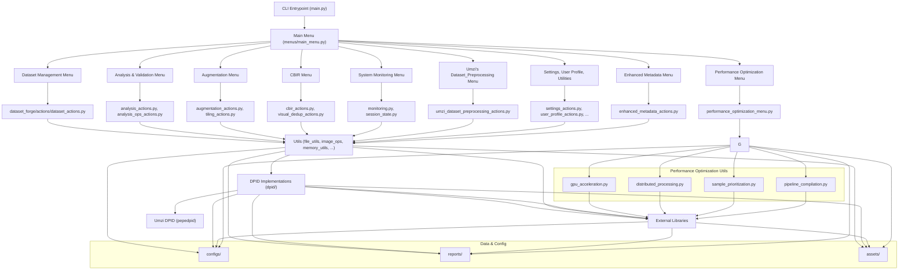
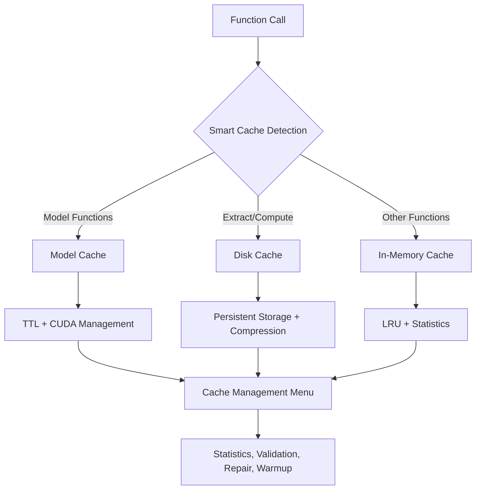
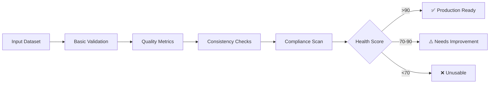

[← Main README](../README.md) | [Features](features.md) | [Usage](usage.md) | [Advanced](advanced.md) | [Architecture](architecture.md) | [Troubleshooting](troubleshooting.md) | [Style Guide](style_guide.md) | [Changelog](changelog.md) | [ToC](toc.md)

# Project Architecture

> **Who is this for?**  
> This guide is for contributors, advanced users, and anyone interested in the internal structure and flow of Dataset Forge.

---

## Directory Structure (High-Level)

- **dataset_forge/menus/**: UI layer (CLI menus, user interaction)
- **dataset_forge/actions/**: Business logic (core dataset/image operations)
- **dataset_forge/utils/**: Shared utilities (file ops, memory, parallelism, color, monitoring, etc.)
- **dataset_forge/dpid/**: Degradation Process Implementations (BasicSR, OpenMMLab, Phhofm, Umzi)
- **configs/**: Example and user configuration files
- **reports/**: Report templates for HTML/Markdown output
- **assets/**: Static assets
- **docs/**: Project documentation
- **tests/**: Unit & integration tests
- **tools/**: Developer/user utilities (static analysis, doc merging, env setup, troubleshooting)

---

## Core Architecture Diagram

---

## Key Modules

- **Menus:** All CLI and user interaction logic. Each menu is modular and uses a robust loop pattern.
- **Actions:** All business logic and core dataset/image operations. Each action is testable and exposed via public APIs.
- **Utils:** Shared utilities for file operations, memory management, parallelism, color schemes, and monitoring.
- **DPID:** Multiple degradation process implementations for HQ/LQ pair generation.

## Menu System Architecture

Dataset Forge uses a standardized menu system with the following characteristics:

### Menu Structure

- **Hierarchical Organization**: Menus are organized in a tree structure with clear parent-child relationships
- **Standardized Pattern**: All menus follow the key-based pattern documented in `.cursorrules`
- **Lazy Loading**: Menu functions are loaded on-demand for fast CLI responsiveness
- **Global Commands**: All menus support help, quit, and navigation commands

### Menu Auditing

The menu system includes comprehensive auditing capabilities:

- **Automatic Discovery**: The menu auditing tool (`tools/log_current_menu.py`) automatically discovers all menu files
- **Path Input Detection**: Identifies menus requiring user input to prevent infinite exploration
- **Analysis Depth**: Configurable exploration depth (default: 4 levels)
- **Reporting**: Generates detailed analysis reports with statistics and recommendations

### Menu Files Location

- **Primary Location**: `dataset_forge/menus/` - Contains all menu implementation files
- **Analysis Output**: `menu_system/` - Contains generated menu analysis reports
- **Configuration**: Menu behavior is controlled by settings in the auditing tool

---

## Specialized Diagrams

<strong>Caching System Architecture</strong>

<strong>Dataset Health Scoring Workflow</strong>

---

## See Also

- [Features](features.md)
- [Usage Guide](usage.md)
- [Advanced Features](advanced.md)
- [Troubleshooting](troubleshooting.md)
- [Style Guide](style_guide.md)
