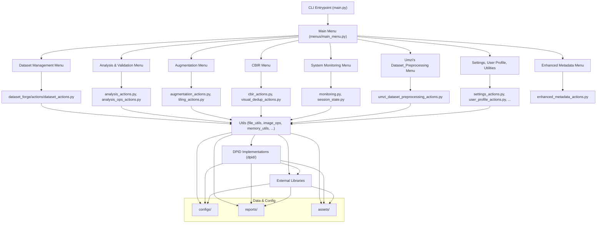

[← Main README](../README.md) | [Features](features.md) | [Usage](usage.md) | [Advanced](advanced.md) | [Architecture](architecture.md) | [Troubleshooting](troubleshooting.md) | [Style Guide](style_guide.md) | [Changelog](changelog.md) | [ToC](toc.md)

# Project Architecture

Dataset Forge is built with a modular, extensible architecture for maintainability and performance.

## Directory Structure

- **dataset_forge/menus/**: UI layer (CLI menus, user interaction)
  - **enhanced_metadata_menu.py**: Enhanced Metadata Management menu (batch extract, view/edit, filter, anonymize)
- **dataset_forge/actions/**: Business logic (core dataset/image operations)
  - **align_images_actions.py**: Batch projective alignment of images using SIFT+FLANN (called from Dataset Management menu)
  - **enhanced_metadata_actions.py**: Metadata extraction, editing, filtering, anonymization
- **dataset_forge/utils/**: Reusable utilities (file ops, memory, parallelism, color, monitoring, etc.)
- **dataset_forge/dpid/**: Multiple DPID (degradation) implementations
- **configs/**: Example and user configuration files
- **reports/**: Report templates for HTML/Markdown output
- **assets/**: Any asset files required
- **docs/**: Project documentation
- **tests/**: Unit & integration tests
- **tools/**: Project tools and developer/user utilities (e.g., static analysis, documentation merging, environment setup, troubleshooting)
  - **find_code_issues/find_code_issues.py**: Static analysis and code quality tool for maintainers. Checks for dead code, untested code, missing docstrings, test/code mapping, and more. Outputs actionable reports to the same directory.
  - **merge_docs.py**: Merges all documentation files in docs/ into a single README_full.md and generates a hierarchical Table of Contents (toc.md).
  - **install.py**: Automated environment setup script. Creates a virtual environment, installs CUDA-enabled torch, and installs all project requirements.
  - **print_zsteg_env.py**: Prints the current PATH and the location of the zsteg binary for troubleshooting steganography tool integration.

## Mermaid Architecture Diagram (Detailed)

## Monitoring & Analytics

- Centralized resource monitoring, analytics, error tracking, health checks, and background task registry (see utils/monitoring.py).
- CLI menu for live resource usage, analytics, error summaries, health checks, and background task management (see menus/system_monitoring_menu.py).
- Persistent logging and notifications for all major operations.

## Test Suite Integration

- Comprehensive automated test suite using pytest.
- Covers CLI, menu timing, error feedback, memory, parallelism, and file/image utilities.

### Testing & Quality Assurance (Updated July 2025)

- All business logic is modular and exposed via public APIs for testability.
- The test suite covers all major features, using monkeypatching, dummy objects, and multiprocessing-safe patterns.
- Tests are robust, cross-platform, and non-interactive.
- Only one test is marked XFAIL (ignore patterns in directory tree), which is expected and documented.

### Umzi's Dataset_Preprocessing Integration

The Umzi Dataset_Preprocessing workflows are now fully modularized within Dataset Forge:

- Business logic is in `actions/umzi_dataset_preprocessing_actions.py`.
- UI/menu is in `menus/umzi_dataset_preprocessing_menu.py`.
- Uses lazy imports, robust menu loop, and centralized utilities.
- See `docs/advanced.md` for a detailed discussion of the porting and modularization process.

- **Enhanced Metadata Management:**
  - Modular menu and actions for batch metadata extraction, editing, filtering, and anonymization.
  - Uses exiftool, pandas, SQLite, Pillow, and centralized utilities.

## Menu Integration

- The Dataset Management menu now includes an '🧭 Align Images' option, which calls the align_images_workflow in actions/align_images_actions.py using the lazy import pattern.

---

For coding standards and best practices, see [style_guide.md](style_guide.md).
