[← Main README](../README.md) | [Features](features.md) | [Usage](usage.md) | [Advanced](advanced.md) | [Architecture](architecture.md) | [Troubleshooting](troubleshooting.md) | [Style Guide](style_guide.md) | [Changelog](changelog.md) | [ToC](toc.md)

# Project Architecture

Dataset Forge is built with a modular, extensible architecture for maintainability and performance.

## Directory Structure

- **dataset_forge/menus/**: UI layer (CLI menus, user interaction)
  - **enhanced_metadata_menu.py**: Enhanced Metadata Management menu (batch extract, view/edit, filter, anonymize)
- **dataset_forge/actions/**: Business logic (core dataset/image operations)
  - **align_images_actions.py**: Batch projective alignment of images using SIFT+FLANN (called from Dataset Management menu)
  - **enhanced_metadata_actions.py**: Metadata extraction, editing, filtering, anonymization
  - **resave_images_actions.py**: Image format conversion and resaving with parallel processing
- **dataset_forge/utils/**: Reusable utilities (file ops, memory, parallelism, color, monitoring, etc.)
- **dataset_forge/dpid/**: Multiple DPID (degradation) implementations (BasicSR, OpenMMLab, Phhofm, Umzi)
- **configs/**: Example and user configuration files
- **reports/**: Report templates for HTML/Markdown output
- **assets/**: Any asset files required
- **docs/**: Project documentation
- **tests/**: Unit & integration tests
- **tools/**: Project tools and developer/user utilities (e.g., static analysis, documentation merging, environment setup, troubleshooting)
  - **find_code_issues/find_code_issues.py**: Static analysis and code quality tool for maintainers. Checks for dead code, untested code, missing docstrings, test/code mapping, and more. Outputs actionable reports to the same directory.
  - **merge_docs.py**: Merges all documentation files in docs/ into a single README_full.md and generates a hierarchical Table of Contents (toc.md).
  - **install.py**: Automated environment setup script. Creates a virtual environment, installs CUDA-enabled torch, and installs all project requirements.
  - **print_zsteg_env.py**: Prints the current PATH and the location of the zsteg binary for troubleshooting steganography tool integration.

## Mermaid Architecture Diagram (Detailed)

## Monitoring & Analytics

- Centralized resource monitoring, analytics, error tracking, health checks, and background task registry (see utils/monitoring.py).
- CLI menu for live resource usage, analytics, error summaries, health checks, and background task management (see menus/system_monitoring_menu.py).
- Persistent logging and notifications for all major operations.

## Enhanced Caching System

- **AdvancedLRUCache Class:** Thread-safe in-memory cache with TTL, compression, and statistics (see utils/cache_utils.py).
- **Disk Caching:** Persistent storage with integrity checks and file management using joblib.Memory.
- **Model Caching:** Specialized cache for expensive AI model loading operations with CUDA memory management.
- **Smart Caching:** Auto-detection system that chooses optimal caching strategy based on function characteristics.
- **Cache Management Menu:** Comprehensive management interface accessible from System Settings → Cache Management.
- **Integration:** Automatically applied to key functions including image operations, model loading, and file operations.

**Caching Architecture:**

## Test Suite Integration

- Comprehensive automated test suite using pytest.
- Covers CLI, menu timing, error feedback, memory, parallelism, and file/image utilities.

### Testing & Quality Assurance (Updated July 2025)

- All business logic is modular and exposed via public APIs for testability.
- The test suite covers all major features, using monkeypatching, dummy objects, and multiprocessing-safe patterns.
- Tests are robust, cross-platform, and non-interactive.
- Only one test is marked XFAIL (ignore patterns in directory tree), which is expected and documented.

### Umzi's Dataset_Preprocessing Integration (PepeDP-powered, July 2025)

The Umzi Dataset_Preprocessing workflows are now fully modularized within Dataset Forge and powered by PepeDP:

- Business logic is in `actions/umzi_dataset_preprocessing_actions.py` as thin wrappers around PepeDP classes/functions. All user inputs are overridable via function arguments for robust, non-interactive testing.
- UI/menu is in `menus/umzi_dataset_preprocessing_menu.py`, using lazy imports, robust menu loop, and centralized utilities.
- All four main workflows (Best Tile Extraction, Video Frame Extraction, Duplicate Detection, IQA Filtering) are robustly tested with public, non-interactive APIs.
- See `docs/advanced.md` for a detailed discussion of the porting and modularization process.

- **Enhanced Metadata Management:**
  - Modular menu and actions for batch metadata extraction, editing, filtering, and anonymization.
  - Uses exiftool, pandas, SQLite, Pillow, and centralized utilities.

### Dataset Health Scoring Workflow

- **UI Layer:** `dataset_forge/menus/dataset_health_scoring_menu.py` (prompts user, runs workflow, displays results)
- **Business Logic:** `dataset_forge/actions/dataset_health_scoring_actions.py` (modular checks, scoring, suggestions)
- **Integration:** Added to Dataset Management menu using lazy import and robust menu loop patterns.
- **Extensibility:** New checks can be added by extending the actions module and updating the step list/weights.
- **Testing:** Fully covered by unit and CLI integration tests.

**Mermaid Diagram Addition:**

```mermaid
graph LR
A[Input Dataset] --> B[Basic Validation]
B --> C[Quality Metrics]
C --> D[Consistency Checks]
D --> E[Compliance Scan]
E --> F{Health Score}
F -->|>90| G[✅ Production Ready]
F -->|70-90| H[⚠️ Needs Improvement]
F -->|<70| I[❌ Unusable]
```

## Menu Integration

- The Dataset Management menu now includes an '🧭 Align Images' option, which calls the align_images_workflow in actions/align_images_actions.py using the lazy import pattern.

## UI Layer and Workflow Patterns

All menu actions and interactive workflows must print clear, Mocha-styled headings before input/output prompts and before progress bars, as described in the Style Guide. This is a required part of the UI/UX contract for Dataset Forge.

---

For coding standards and best practices, see [style_guide.md](style_guide.md).

## Performance Optimization Suite

- **Performance Optimization Menu:** Centralized UI for GPU acceleration, distributed processing, sample prioritization, and pipeline compilation (see menus/performance_optimization_menu.py).
- **GPU Acceleration:** PyTorch-based image processing with automatic device management (see utils/gpu_acceleration.py).
- **Distributed Processing:** Dask and Ray integration for scalable computing (see utils/distributed_processing.py).
- **Sample Prioritization:** Quality-based processing order optimization (see utils/sample_prioritization.py).
- **Pipeline Compilation:** JIT compilation for performance-critical code paths (see utils/pipeline_compilation.py).
- **Integration:** All features follow modular design, robust menu loop, lazy import, memory management, and parallel processing patterns.
- **Testing:** Comprehensive test suite in tests/test_utils/test_performance_optimization.py covering all optimization features, with robust error handling and edge case testing.

All DPID implementations are modular and testable, including Umzi's DPID (pepedpid), which is fully integrated and covered by robust, non-interactive tests.
